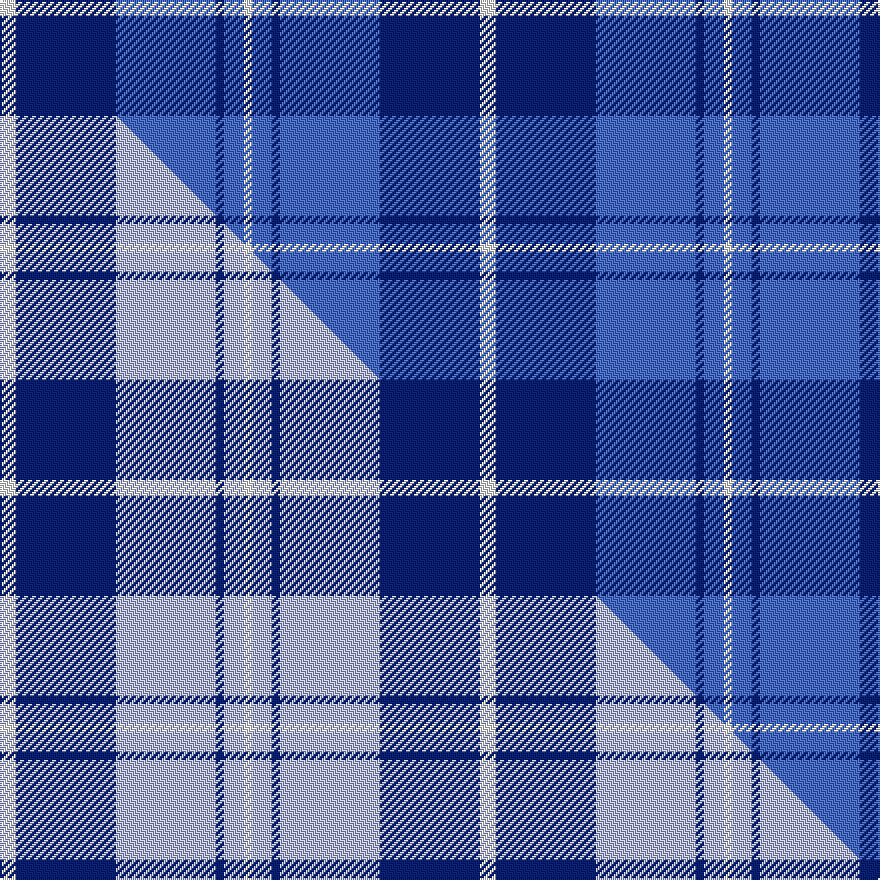

This page is one **sett** — a single exact thread-count. It belongs to the [tartan](/setts/w4db25b25db2b5w2/)
(the same proportion at any scale), whose colour order is pattern [WBBBBW](/stripes/wbbbbw/).

Part of the [Douglas Variation](/tartans/douglas-variation/) tartan — the named design grouping this sett with its other cloths.

Sourced from weddslist.  It is a [6 stripe tartan](/stripes/stripes6/).

Original link http://www.weddslist.com/cgi-bin/tartans/pg.pl?source=sts

## Thread count
W/8 DB50 B50 DB4 B10 W/4

One full sett is **240 threads**.

## Palette
<table><thead><tr><th>Colour</th><th>Shade</th><th>OKLCh</th></tr></thead><tbody><tr><td>B</td><td><code style="background-color:#466CC8;">#466CC8</code> <small style="color:#888">#466CC8</small></td><td><small style="color:#888">oklch(55.1% 0.149 265.0)</small></td></tr><tr><td>DB</td><td><code style="background-color:#082077;">#082077</code> <small style="color:#888">#082077</small></td><td><small style="color:#888">oklch(30.0% 0.149 265.1)</small></td></tr><tr><td>W</td><td><code style="background-color:#F7F7F7;">#F7F7F7</code> <small style="color:#888">#F7F7F7</small></td><td><small style="color:#888">oklch(97.6% 0.000 89.9)</small></td></tr></tbody></table>

# Sample pattern

## Compared to the master

This cloth is one sett of its design; the master sett (the exemplar the design is anchored on) is below for comparison.

Its **ΔTartan distance** from the master is **1.76** — the same measure the nearest-tartans table ranks by (0 is identical; a re-scale of the same cloth is near 0, a recolour or a different proportion further).

<figure class="master-compare" style="margin:0">

this sett
master sett ★

<figcaption style="color:#888;font-size:smaller">One weave of this sett against the <a href="/setts/w4db25lb25db2lb5w2/">master sett ★</a>, split on the diagonal: a shared proportion runs seamlessly across it with only the shades shifting; a different proportion breaks on it.</figcaption>
</figure>

## Nearest tartan variants

The nearest existing variants by ΔTartan distance, with this cloth at the top so the swatches line up against it.

ΔTartan

Threads

Variant

Sett

—

240

<a href="/variants/s6/w4db25b25db2b5w2~x2/">Douglas, Variation</a>

<a href="/ttd/edit/#slug=w4db25lb25db2lb5w2~x2&amp;base=w4db25b25db2b5w2~x2" title="compare in the TTD">0.00</a>

240

<a href="/variants/s6/w4db25lb25db2lb5w2~x2/">Douglas Variation</a>

<a href="/ttd/edit/#slug=db24t13db4t4w2~x2&amp;base=w4db25b25db2b5w2~x2" title="compare in the TTD">0.94</a>

136

<a href="/variants/s5/db24t13db4t4w2~x2/">Gallaecia - Galicia National</a>

<a href="/ttd/edit/#slug=db24lb13db4lb4w2~x2&amp;base=w4db25b25db2b5w2~x2" title="compare in the TTD">0.94</a>

136

<a href="/variants/s5/db24lb13db4lb4w2~x2/">Gallaecia (Unofficial) (District)</a>

<a href="/ttd/edit/#slug=lg3db1b16db16b2lb2~x4&amp;base=w4db25b25db2b5w2~x2" title="compare in the TTD">1.20</a>

300

<a href="/variants/s6/lg3db1b16db16b2lb2~x4/">U.S.S. John Paul Jones #1</a>

<a href="/ttd/edit/#slug=db3w1db12b12db1b3~x4&amp;base=w4db25b25db2b5w2~x2" title="compare in the TTD">1.21</a>

232

<a href="/variants/s6/db3w1db12b12db1b3~x4/">Erskine Blue (Fashion)</a>

<a href="/ttd/edit/#slug=db4lb4db8n8db12lb12y1~x2&amp;base=w4db25b25db2b5w2~x2" title="compare in the TTD">1.80</a>

186

<a href="/variants/s7/db4lb4db8n8db12lb12y1~x2/">von Prondzynski (2016)</a>

<a href="/ttd/edit/#slug=b1db5b5w1~x4&amp;base=w4db25b25db2b5w2~x2" title="compare in the TTD">1.93</a>

88

<a href="/variants/s4/b1db5b5w1~x4/">Manx, Cornaa</a>

<a href="/ttd/edit/#slug=db3lb3db16lb16db16w3~x2&amp;base=w4db25b25db2b5w2~x2" title="compare in the TTD">1.96</a>

216

<a href="/variants/s6/db3lb3db16lb16db16w3~x2/">Murray Taylor</a>

<a href="/ttd/edit/#slug=dg4lb10db10lb1~x4&amp;base=w4db25b25db2b5w2~x2" title="compare in the TTD">2.02</a>

180

<a href="/variants/s4/dg4lb10db10lb1~x4/">Baker City (District)</a>

<a href="/ttd/edit/#slug=db2w2b8db8w1~x2&amp;base=w4db25b25db2b5w2~x2" title="compare in the TTD">2.05</a>

78

<a href="/variants/s5/db2w2b8db8w1~x2/">Laval (Tartan de..)</a>

## Neighbour map

Every grey dot is one of 13620 variants placed by the first two principal components of the ΔTartan feature space (42% of its variance). Red is this tartan; blue dots are its nearest — click one to open its page.

<svg viewBox="0 0 640 380" role="img" style="max-width:100%;height:auto;border:1px solid #e0e0e0;border-radius:4px;display:block" xmlns="http://www.w3.org/2000/svg"><image href="/nn/cloud.v1.png" width="640" height="380"/><a href="/variants/s6/w4db25lb25db2lb5w2~x2/"><circle cx="338.4" cy="235.0" r="4" fill="#3465a4"><title>Douglas Variation</title></circle></a><a href="/variants/s5/db24t13db4t4w2~x2/"><circle cx="435.3" cy="262.5" r="4" fill="#3465a4"><title>Gallaecia - Galicia National</title></circle></a><a href="/variants/s5/db24lb13db4lb4w2~x2/"><circle cx="396.4" cy="249.0" r="4" fill="#3465a4"><title>Gallaecia (Unofficial) (District)</title></circle></a><a href="/variants/s6/lg3db1b16db16b2lb2~x4/"><circle cx="360.4" cy="227.0" r="4" fill="#3465a4"><title>U.S.S. John Paul Jones #1</title></circle></a><a href="/variants/s6/db3w1db12b12db1b3~x4/"><circle cx="431.4" cy="265.1" r="4" fill="#3465a4"><title>Erskine Blue (Fashion)</title></circle></a><a href="/variants/s7/db4lb4db8n8db12lb12y1~x2/"><circle cx="266.5" cy="244.9" r="4" fill="#3465a4"><title>von Prondzynski (2016)</title></circle></a><a href="/variants/s4/b1db5b5w1~x4/"><circle cx="346.8" cy="321.9" r="4" fill="#3465a4"><title>Manx, Cornaa</title></circle></a><a href="/variants/s6/db3lb3db16lb16db16w3~x2/"><circle cx="359.3" cy="288.6" r="4" fill="#3465a4"><title>Murray Taylor</title></circle></a><a href="/variants/s4/dg4lb10db10lb1~x4/"><circle cx="275.5" cy="280.4" r="4" fill="#3465a4"><title>Baker City (District)</title></circle></a><a href="/variants/s5/db2w2b8db8w1~x2/"><circle cx="316.4" cy="280.8" r="4" fill="#3465a4"><title>Laval (Tartan de..)</title></circle></a><circle cx="369.8" cy="243.4" r="5" fill="#c00000"/><text x="320" y="376" text-anchor="middle" font-size="11" fill="#999">ground</text><text x="11" y="190" text-anchor="middle" font-size="11" fill="#999" transform="rotate(-90 11 190)">complexity</text></svg>

ID: /variants/s6/w4db25b25db2b5w2~x2/
