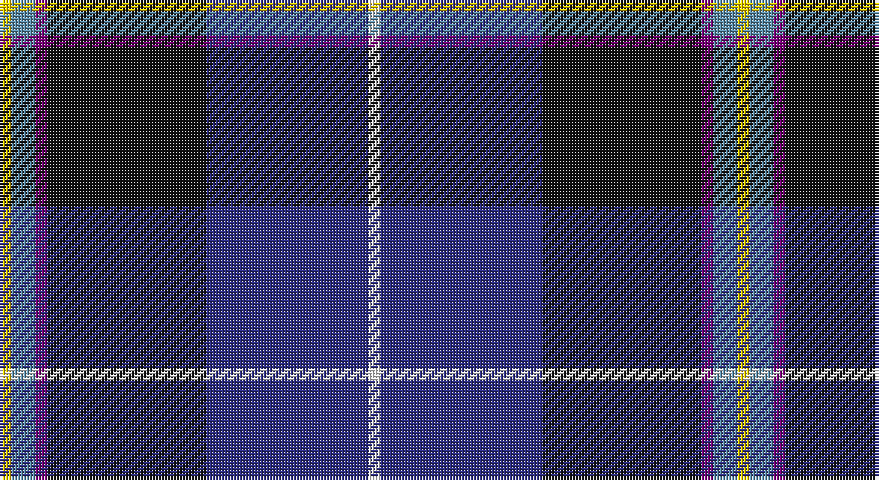

This page is one **sett** — a single exact thread-count. It belongs to the [tartan](/setts/w4db54k53dp4t8ly4/)
(the same proportion at any scale), whose colour order is pattern [WBKBBY](/stripes/wbkbby/).

Part of the [Pipers' Trail, The](/tartans/pipers-trail-the/) tartan — the named design grouping this sett with its other cloths.

Sourced from tartans-authority.  It is a [6 stripe tartan](/stripes/stripes6/).

Original link http://www.tartansauthority.com/tartan-ferret/display/11049/

## Register references

External register numbers recorded for this tartan.

- Scottish Register of Tartans: [11049](https://www.tartanregister.gov.uk/tartanDetails?ref=11049)
- Scottish Tartans Authority (ITI): 11049

## Thread count
Y/4 B8 P4 K53 DB54 W/4

One full sett is **246 threads**.

## Palette

Palette: <strong>Tartan Register</strong>
<table><thead><tr><th>Colour</th><th>Threads</th><th>Shade</th><th>Base</th><th>OKLCh</th></tr></thead><tbody><tr><td>Y/</td><td style="text-align:right;font-variant-numeric:tabular-nums">4</td><td><code style="background-color:#FCCC00;">#FCCC00</code> <small style="color:#888">#FCCC00</small></td><td>Y <code style="background-color:#F2BF00;">#F2BF00</code></td><td><small style="color:#888">oklch(86.2% 0.176 91.5)</small></td></tr><tr><td>B</td><td style="text-align:right;font-variant-numeric:tabular-nums">8</td><td><code style="background-color:#5C8CA8;">#5C8CA8</code> <small style="color:#888">#5C8CA8</small></td><td>B <code style="background-color:#2A418A;">#2A418A</code></td><td><small style="color:#888">oklch(61.7% 0.067 235.0)</small></td></tr><tr><td>P</td><td style="text-align:right;font-variant-numeric:tabular-nums">4</td><td><code style="background-color:#780078;">#780078</code> <small style="color:#888">#780078</small></td><td>B <code style="background-color:#2A418A;">#2A418A</code></td><td><small style="color:#888">oklch(40.2% 0.185 328.4)</small></td></tr><tr><td>K</td><td style="text-align:right;font-variant-numeric:tabular-nums">53</td><td><code style="background-color:#101010;">#101010</code> <small style="color:#888">#101010</small></td><td>K <code style="background-color:#000000;">#000000</code></td><td><small style="color:#888">oklch(17.3% 0.000 89.9)</small></td></tr><tr><td>DB</td><td style="text-align:right;font-variant-numeric:tabular-nums">54</td><td><code style="background-color:#2C2C80;">#2C2C80</code> <small style="color:#888">#2C2C80</small></td><td>B <code style="background-color:#2A418A;">#2A418A</code></td><td><small style="color:#888">oklch(35.0% 0.138 276.6)</small></td></tr><tr><td>W/</td><td style="text-align:right;font-variant-numeric:tabular-nums">4</td><td><code style="background-color:#FCFCFC;">#FCFCFC</code> <small style="color:#888">#FCFCFC</small></td><td>W <code style="background-color:#F7F7F7;">#F7F7F7</code></td><td><small style="color:#888">oklch(99.1% 0.000 89.9)</small></td></tr></tbody></table>

# Sample pattern

## Compared to the master

This cloth is one sett of its design; the master sett (the exemplar the design is anchored on) is below for comparison.

<figure style="margin:0"><figcaption style="color:#888;font-size:smaller">this sett</figcaption></figure>
<figure style="margin:0"><figcaption style="color:#888;font-size:smaller"><a href="/setts/w4dt54k53dp4b8lo4/">master sett →</a></figcaption></figure>

## Nearest tartans

The nearest existing variants by ΔTartan distance, with this tartan at the top so the swatches line up against it.

ΔTartan

Tartan

Sett

—

<a href="/ttd/edit/#slug=w4db54k53dp4t8ly4">Pipers' Trail, The</a> <a class="nn-out" href="/variants/s6/w4db54k53dp4t8ly4/" title="open its dictionary page">↗</a>

0.45

<a href="/ttd/edit/#slug=k33ly4w3db33r2g2~x2&amp;base=w4db54k53dp4t8ly4">Atlantic Police Academy (Corporate)</a> <a class="nn-out" href="/variants/s6/k33ly4w3db33r2g2~x2/" title="open its dictionary page">↗</a>

0.71

<a href="/ttd/edit/#slug=r3w2g5k35db40ly3~x2&amp;base=w4db54k53dp4t8ly4">Italian National</a> <a class="nn-out" href="/variants/s6/r3w2g5k35db40ly3~x2/" title="open its dictionary page">↗</a>

0.71

<a href="/ttd/edit/#slug=k33ly4w3db33r2dg2~x2&amp;base=w4db54k53dp4t8ly4">Atlantic Police Academy</a> <a class="nn-out" href="/variants/s6/k33ly4w3db33r2dg2~x2/" title="open its dictionary page">↗</a>

0.85

<a href="/ttd/edit/#slug=w4dt54k53dp4b8lo4&amp;base=w4db54k53dp4t8ly4">Pipers' Trail, The</a> <a class="nn-out" href="/variants/s6/w4dt54k53dp4b8lo4/" title="open its dictionary page">↗</a>

1.02

<a href="/ttd/edit/#slug=r3db38k13w3o20ly2~x2&amp;base=w4db54k53dp4t8ly4">LLoyd of Astargus Canadian Family Tartan</a> <a class="nn-out" href="/variants/s6/r3db38k13w3o20ly2~x2/" title="open its dictionary page">↗</a>

1.05

<a href="/ttd/edit/#slug=b11db5g4w3r3k16db28b2~x2&amp;base=w4db54k53dp4t8ly4">Scottish Italian</a> <a class="nn-out" href="/variants/s8/b11db5g4w3r3k16db28b2~x2/" title="open its dictionary page">↗</a>

1.06

<a href="/ttd/edit/#slug=lo4k28r2db22b8dy3~x2&amp;base=w4db54k53dp4t8ly4">Loch Long One Design (Corporate)</a> <a class="nn-out" href="/variants/s6/lo4k28r2db22b8dy3~x2/" title="open its dictionary page">↗</a>

1.15

<a href="/ttd/edit/#slug=db35r2k16ly2t25w2t6~x2&amp;base=w4db54k53dp4t8ly4">US Forces (Thurso) Regimental Tartan</a> <a class="nn-out" href="/variants/s7/db35r2k16ly2t25w2t6~x2/" title="open its dictionary page">↗</a>

1.16

<a href="/ttd/edit/#slug=dg10w2dt10lo5db35r6~x2&amp;base=w4db54k53dp4t8ly4">Hatfield &amp; Mize (Personal)</a> <a class="nn-out" href="/variants/s6/dg10w2dt10lo5db35r6~x2/" title="open its dictionary page">↗</a>

1.16

<a href="/variants/s6/t12dp35lr4w3ki11k5~x2/">Ferster, James Carney</a>

## Neighbour map

Every grey dot is one of 14360 variants placed by the first two principal components of the ΔTartan feature space (44% of its variance). Red is this tartan; blue dots are its nearest — click one to open its page.

<svg viewBox="0 0 640 380" role="img" style="max-width:100%;height:auto;border:1px solid #e0e0e0;border-radius:4px;display:block" xmlns="http://www.w3.org/2000/svg"><image href="/nn/cloud.v1.png" width="640" height="380"/><a href="/variants/s6/k33ly4w3db33r2g2~x2/"><circle cx="244.8" cy="149.3" r="4" fill="#3465a4"><title>Atlantic Police Academy (Corporate)</title></circle></a><a href="/variants/s6/r3w2g5k35db40ly3~x2/"><circle cx="260.3" cy="144.0" r="4" fill="#3465a4"><title>Italian National</title></circle></a><a href="/variants/s6/k33ly4w3db33r2dg2~x2/"><circle cx="239.6" cy="152.5" r="4" fill="#3465a4"><title>Atlantic Police Academy</title></circle></a><a href="/variants/s6/w4dt54k53dp4b8lo4/"><circle cx="245.6" cy="170.9" r="4" fill="#3465a4"><title>Pipers' Trail, The</title></circle></a><a href="/variants/s6/r3db38k13w3o20ly2~x2/"><circle cx="236.4" cy="146.3" r="4" fill="#3465a4"><title>LLoyd of Astargus Canadian Family Tartan</title></circle></a><a href="/variants/s8/b11db5g4w3r3k16db28b2~x2/"><circle cx="208.2" cy="156.9" r="4" fill="#3465a4"><title>Scottish Italian</title></circle></a><a href="/variants/s6/lo4k28r2db22b8dy3~x2/"><circle cx="216.3" cy="178.6" r="4" fill="#3465a4"><title>Loch Long One Design (Corporate)</title></circle></a><a href="/variants/s7/db35r2k16ly2t25w2t6~x2/"><circle cx="198.7" cy="147.5" r="4" fill="#3465a4"><title>US Forces (Thurso) Regimental Tartan</title></circle></a><a href="/variants/s6/dg10w2dt10lo5db35r6~x2/"><circle cx="254.0" cy="157.2" r="4" fill="#3465a4"><title>Hatfield &amp; Mize (Personal)</title></circle></a><a href="/variants/s6/t12dp35lr4w3ki11k5~x2/"><circle cx="222.4" cy="168.0" r="4" fill="#3465a4"><title>Ferster, James Carney</title></circle></a><circle cx="232.4" cy="159.6" r="5" fill="#c00000"/></svg>

ID: /variants/s6/w4db54k53dp4t8ly4/
