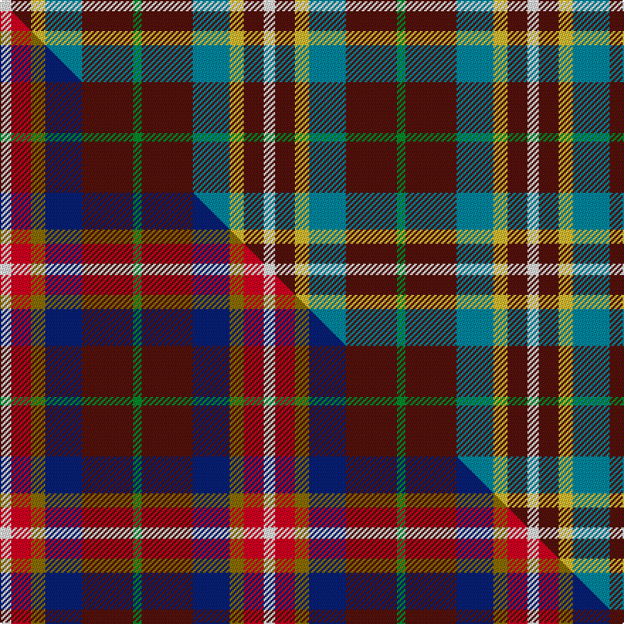

This is one **variant** — a specific cloth: this exact thread count and colourway, with its own
provenance below. It is one weaving of the [sett](/setts/w4dr7ly5t13dr18g3/) (the scale-free proportion — the
same cloth at any scale or shade), whose colour order is pattern [GBBYBW](/stripes/gbbybw/).

Part of the [Ryan/Fehder](/tartans/ryan-fehder/) tartan — the named design grouping this sett with its other cloths.

Sourced from tartans-authority.  It is a [6 stripe tartan](/stripes/stripes6/).

Original link [https://www.tartanregister.gov.uk/tartanDetails.aspx?ref=10483](https://www.tartanregister.gov.uk/tartanDetails.aspx?ref=10483)

Dataset <small>— provenance for this record, inherited from the source manifest</small>

<dl class="dataset-prov">
<dt>source</dt><dd><a href="/sources/tartans-authority/">Scottish Tartans Authority</a></dd>
<dt>data captured from</dt><dd><a href="https://github.com/thetartan/tartan-database/blob/master/data/tartans-authority/data.csv">https://github.com/thetartan/tartan-database/blob/master/data/tartans-authority/data.csv</a></dd>
<dt>data date</dt><dd>24th July 2011 <small>(this record)</small></dd>
<dt>licence</dt><dd><a href="https://creativecommons.org/licenses/by-nc-nd/4.0/">CC BY-NC-ND 4.0</a></dd>
</dl>

Capture chain <small>— the hands this data passed through, oldest first; each capture carries its own licence</small>

<ol class="capture-chain">
<li><a href="https://www.tartansauthority.com/">Scottish Tartans Authority</a> <small>the heritage body's archive — its tartan-ferret record browser is retired (links repaired to the SRT, above)</small></li>
<li><a href="https://github.com/thetartan/tartan-database">thetartan/tartan-database</a> <small>2016-2017</small> · <a href="https://creativecommons.org/licenses/by-nc-nd/4.0/">CC BY-NC-ND 4.0</a> <small>Levko Kravets's frozen compilation — the capture we vendored, and where its CC licence text came from</small></li>
<li>this dictionary <small>captured 2026-06-10 · commit 5bf86c7566</small> <small>each re-capture is a git commit to data/sources</small></li>
</ol>

## Register references

External register numbers recorded for this tartan.

- Scottish Register of Tartans: [10483](https://www.tartanregister.gov.uk/tartanDetails?ref=10483)
- Scottish Tartans Authority (ITI): 10483

## Thread count
W/8 DR14 LY10 T26 DR36 G/6

One full sett is **186 threads**.

## Palette
<table><thead><tr><th>Colour</th><th>Shade</th><th>OKLCh</th></tr></thead><tbody><tr><td>T</td><td><code style="background-color:#00879F;">#00879F</code> <small style="color:#888">#00879F</small></td><td><small style="color:#888">oklch(57.4% 0.102 216.1)</small></td></tr><tr><td>DR</td><td><code style="background-color:#55120C;">#55120C</code> <small style="color:#888">#55120C</small></td><td><small style="color:#888">oklch(30.0% 0.099 29.3)</small></td></tr><tr><td>LY</td><td><code style="background-color:#DCBC32;">#DCBC32</code> <small style="color:#888">#DCBC32</small></td><td><small style="color:#888">oklch(80.0% 0.150 95.2)</small></td></tr><tr><td>G</td><td><code style="background-color:#008B2A;">#008B2A</code> <small style="color:#888">#008B2A</small></td><td><small style="color:#888">oklch(55.4% 0.170 145.9)</small></td></tr><tr><td>W</td><td><code style="background-color:#F7F7F7;">#F7F7F7</code> <small style="color:#888">#F7F7F7</small></td><td><small style="color:#888">oklch(97.6% 0.000 89.9)</small></td></tr></tbody></table>

# Sample pattern

## Compared to the master

This cloth is one sett of its design; the master sett (the exemplar the design is anchored on) is below for comparison.

Its **ΔTartan distance** from the master is **1.16** — the same measure the nearest-tartans table ranks by (0 is identical; a re-scale of the same cloth is near 0, a recolour or a different proportion further).

<figure class="master-compare" style="margin:0">

this sett
master sett ★

<figcaption style="color:#888;font-size:smaller">One weave of this sett against the <a href="/setts/w4r7y5db13dr18g3/">master sett ★</a>, split on the diagonal: a shared proportion runs seamlessly across it with only the shades shifting; a different proportion breaks on it.</figcaption>
</figure>

## Nearest tartan variants

The nearest existing variants by ΔTartan distance, with this cloth at the top so the swatches line up against it.

ΔTartan

Threads

Variant

Sett

—

186

<a href="/variants/s6/w4dr7ly5t13dr18g3~x2/">Ryan/Fehder (Personal)</a>

<a href="/ttd/edit/#slug=dg2dr12db11ly6dy6dr12dg2~x2&amp;base=w4dr7ly5t13dr18g3~x2" title="compare in the TTD">1.01</a>

196

<a href="/variants/s7/dg2dr12db11ly6dy6dr12dg2~x2/">Heather MacRae</a>

<a href="/ttd/edit/#slug=r2g17r8db8y2~x4&amp;base=w4dr7ly5t13dr18g3~x2" title="compare in the TTD">1.11</a>

280

<a href="/variants/s5/r2g17r8db8y2~x4/">British Hills</a>

<a href="/ttd/edit/#slug=dr1w12g6dr8lb3lo1~x4&amp;base=w4dr7ly5t13dr18g3~x2" title="compare in the TTD">1.15</a>

240

<a href="/variants/s6/dr1w12g6dr8lb3lo1~x4/">MacLean Dress (Lumsden)</a>

<a href="/ttd/edit/#slug=r1db3dr1g3dr5lb1~x4&amp;base=w4dr7ly5t13dr18g3~x2" title="compare in the TTD">1.46</a>

104

<a href="/variants/s6/r1db3dr1g3dr5lb1~x4/">Lanark (Fashion #1)</a>

<a href="/ttd/edit/#slug=r1g7r3db7lb1~x2&amp;base=w4dr7ly5t13dr18g3~x2" title="compare in the TTD">1.53</a>

72

<a href="/variants/s5/r1g7r3db7lb1~x2/">Hebridean 4</a>

<a href="/ttd/edit/#slug=g21db34r14w6~x2&amp;base=w4dr7ly5t13dr18g3~x2" title="compare in the TTD">2.09</a>

246

<a href="/variants/s4/g21db34r14w6~x2/">Harbison (2015)</a>

<a href="/ttd/edit/#slug=w3r24db12dg8ly3~x2&amp;base=w4dr7ly5t13dr18g3~x2" title="compare in the TTD">2.09</a>

188

<a href="/variants/s5/w3r24db12dg8ly3~x2/">McGill University (Corporate)</a>

<a href="/ttd/edit/#slug=dy3dg8db12r24w3~x2&amp;base=w4dr7ly5t13dr18g3~x2" title="compare in the TTD">2.09</a>

188

<a href="/variants/s5/dy3dg8db12r24w3~x2/">McGill University</a>

<a href="/ttd/edit/#slug=r3w8db4dg14r4db2~x4&amp;base=w4dr7ly5t13dr18g3~x2" title="compare in the TTD">2.26</a>

260

<a href="/variants/s6/r3w8db4dg14r4db2~x4/">MacKintosh Dress (Scott Adie)</a>

<a href="/ttd/edit/#slug=r3w8db4g14r4db2~x2&amp;base=w4dr7ly5t13dr18g3~x2" title="compare in the TTD">2.27</a>

130

<a href="/variants/s6/r3w8db4g14r4db2~x2/">MacIntosh Dress Clan Tartan</a>

## Neighbour map

Every grey dot is one of 13621 variants placed by the first two principal components of the ΔTartan feature space (42% of its variance). Red is this tartan; blue dots are its nearest — click one to open its page.

<svg viewBox="0 0 640 380" role="img" style="max-width:100%;height:auto;border:1px solid #e0e0e0;border-radius:4px;display:block" xmlns="http://www.w3.org/2000/svg"><image href="/nn/cloud.v1.png" width="640" height="380"/><a href="/variants/s7/dg2dr12db11ly6dy6dr12dg2~x2/"><circle cx="236.7" cy="263.1" r="4" fill="#3465a4"><title>Heather MacRae</title></circle></a><a href="/variants/s5/r2g17r8db8y2~x4/"><circle cx="248.6" cy="240.7" r="4" fill="#3465a4"><title>British Hills</title></circle></a><a href="/variants/s6/dr1w12g6dr8lb3lo1~x4/"><circle cx="183.0" cy="209.9" r="4" fill="#3465a4"><title>MacLean Dress (Lumsden)</title></circle></a><a href="/variants/s6/r1db3dr1g3dr5lb1~x4/"><circle cx="184.3" cy="250.2" r="4" fill="#3465a4"><title>Lanark (Fashion #1)</title></circle></a><a href="/variants/s5/r1g7r3db7lb1~x2/"><circle cx="194.1" cy="248.3" r="4" fill="#3465a4"><title>Hebridean 4</title></circle></a><a href="/variants/s4/g21db34r14w6~x2/"><circle cx="195.3" cy="277.9" r="4" fill="#3465a4"><title>Harbison (2015)</title></circle></a><a href="/variants/s5/w3r24db12dg8ly3~x2/"><circle cx="220.9" cy="211.1" r="4" fill="#3465a4"><title>McGill University (Corporate)</title></circle></a><a href="/variants/s5/dy3dg8db12r24w3~x2/"><circle cx="227.8" cy="212.9" r="4" fill="#3465a4"><title>McGill University</title></circle></a><a href="/variants/s6/r3w8db4dg14r4db2~x4/"><circle cx="157.6" cy="230.2" r="4" fill="#3465a4"><title>MacKintosh Dress (Scott Adie)</title></circle></a><a href="/variants/s6/r3w8db4g14r4db2~x2/"><circle cx="163.4" cy="236.5" r="4" fill="#3465a4"><title>MacIntosh Dress Clan Tartan</title></circle></a><circle cx="225.1" cy="247.5" r="5" fill="#c00000"/><text x="320" y="376" text-anchor="middle" font-size="11" fill="#999">ground</text><text x="11" y="190" text-anchor="middle" font-size="11" fill="#999" transform="rotate(-90 11 190)">complexity</text></svg>

ID: /variants/s6/w4dr7ly5t13dr18g3~x2/
