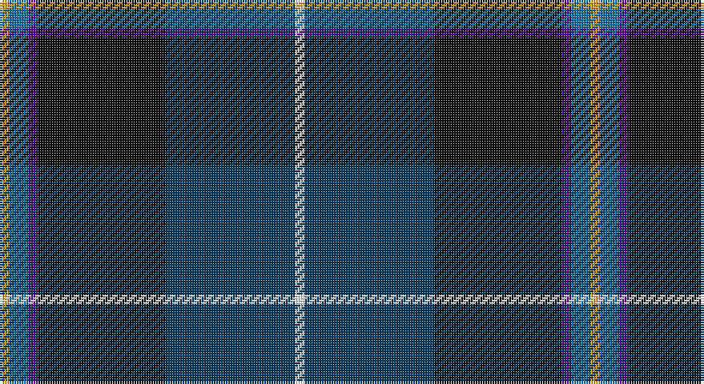

This page is one **sett** — a single exact thread-count. It belongs to the [tartan](/setts/w4dt54k53dp4b8lo4/)
(the same proportion at any scale), whose colour order is pattern [WBKBBY](/stripes/wbkbby/).

Part of the [Pipers' Trail, The](/tartans/pipers-trail-the/) tartan — the named design grouping this sett with its other cloths.

Sourced from register-of-tartans.  It is a [6 stripe tartan](/stripes/stripes6/).

Original link https://www.tartanregister.gov.uk/tartanDetails.aspx?ref=11049

## Register references

External register numbers recorded for this tartan.

- Scottish Register of Tartans: [11049](https://www.tartanregister.gov.uk/tartanDetails.aspx?ref=11049)

## Thread count
Y/4 B8 P4 K53 DB54 W/4

One full sett is **246 threads**.

## Palette

Palette: <strong>Tartan Register</strong>
<table><thead><tr><th>Colour</th><th>Threads</th><th>Shade</th><th>Base</th><th>OKLCh</th></tr></thead><tbody><tr><td>Y/</td><td style="text-align:right;font-variant-numeric:tabular-nums">4</td><td><code style="background-color:#E0A126;">#E0A126</code> <small style="color:#888">#E0A126</small></td><td>Y <code style="background-color:#F2BF00;">#F2BF00</code></td><td><small style="color:#888">oklch(75.1% 0.146 78.3)</small></td></tr><tr><td>B</td><td style="text-align:right;font-variant-numeric:tabular-nums">8</td><td><code style="background-color:#1870A4;">#1870A4</code> <small style="color:#888">#1870A4</small></td><td>B <code style="background-color:#2A418A;">#2A418A</code></td><td><small style="color:#888">oklch(52.2% 0.113 241.2)</small></td></tr><tr><td>P</td><td style="text-align:right;font-variant-numeric:tabular-nums">4</td><td><code style="background-color:#5A008C;">#5A008C</code> <small style="color:#888">#5A008C</small></td><td>B <code style="background-color:#2A418A;">#2A418A</code></td><td><small style="color:#888">oklch(37.0% 0.191 306.3)</small></td></tr><tr><td>K</td><td style="text-align:right;font-variant-numeric:tabular-nums">53</td><td><code style="background-color:#101010;">#101010</code> <small style="color:#888">#101010</small></td><td>K <code style="background-color:#000000;">#000000</code></td><td><small style="color:#888">oklch(17.3% 0.000 89.9)</small></td></tr><tr><td>DB</td><td style="text-align:right;font-variant-numeric:tabular-nums">54</td><td><code style="background-color:#003C64;">#003C64</code> <small style="color:#888">#003C64</small></td><td>B <code style="background-color:#2A418A;">#2A418A</code></td><td><small style="color:#888">oklch(34.5% 0.089 246.0)</small></td></tr><tr><td>W/</td><td style="text-align:right;font-variant-numeric:tabular-nums">4</td><td><code style="background-color:#FFFFFF;">#FFFFFF</code> <small style="color:#888">#FFFFFF</small></td><td>W <code style="background-color:#F7F7F7;">#F7F7F7</code></td><td><small style="color:#888">oklch(100.0% 0.000 89.9)</small></td></tr></tbody></table>

# Sample pattern

## Nearest tartans

The nearest existing variants by ΔTartan distance, with this tartan at the top so the swatches line up against it.

ΔTartan

Tartan

Sett

—

<a href="/ttd/edit/#slug=w4dt54k53dp4b8lo4">Pipers' Trail, The</a> <a class="nn-out" href="/variants/s6/w4dt54k53dp4b8lo4/" title="open its dictionary page">↗</a>

0.85

<a href="/ttd/edit/#slug=w4db54k53dp4t8ly4&amp;base=w4dt54k53dp4b8lo4">Pipers' Trail, The</a> <a class="nn-out" href="/variants/s6/w4db54k53dp4t8ly4/" title="open its dictionary page">↗</a>

0.90

<a href="/ttd/edit/#slug=lo4k28r2db22b8dy3~x2&amp;base=w4dt54k53dp4b8lo4">Loch Long One Design (Corporate)</a> <a class="nn-out" href="/variants/s6/lo4k28r2db22b8dy3~x2/" title="open its dictionary page">↗</a>

0.90

<a href="/ttd/edit/#slug=k33ly4w3db33r2g2~x2&amp;base=w4dt54k53dp4b8lo4">Atlantic Police Academy (Corporate)</a> <a class="nn-out" href="/variants/s6/k33ly4w3db33r2g2~x2/" title="open its dictionary page">↗</a>

0.97

<a href="/ttd/edit/#slug=r3w6r2dg32db36k2db4lo2~x2&amp;base=w4dt54k53dp4b8lo4">Canadian Centennial</a> <a class="nn-out" href="/variants/s8/r3w6r2dg32db36k2db4lo2~x2/" title="open its dictionary page">↗</a>

0.99

<a href="/ttd/edit/#slug=k33ly4w3db33r2dg2~x2&amp;base=w4dt54k53dp4b8lo4">Atlantic Police Academy</a> <a class="nn-out" href="/variants/s6/k33ly4w3db33r2dg2~x2/" title="open its dictionary page">↗</a>

0.99

<a href="/ttd/edit/#slug=r3w2g5k35db40ly3~x2&amp;base=w4dt54k53dp4b8lo4">Italian National</a> <a class="nn-out" href="/variants/s6/r3w2g5k35db40ly3~x2/" title="open its dictionary page">↗</a>

1.11

<a href="/variants/s7/m5yii2k30yi26y2yi2ki4~x2/">Milne-Murtagh (2009)</a>

1.11

<a href="/ttd/edit/#slug=k4lo2k34db10lr4db4dp4db23w3~x2&amp;base=w4dt54k53dp4b8lo4">Heirloom Dark Alba (Fashion)</a> <a class="nn-out" href="/variants/s9/k4lo2k34db10lr4db4dp4db23w3~x2/" title="open its dictionary page">↗</a>

1.16

<a href="/ttd/edit/#slug=k2w1k12g5db11r1~x2&amp;base=w4dt54k53dp4b8lo4">New England (Fashion)</a> <a class="nn-out" href="/variants/s6/k2w1k12g5db11r1~x2/" title="open its dictionary page">↗</a>

1.17

<a href="/ttd/edit/#slug=b11db5g4w3r3k16db28b2~x2&amp;base=w4dt54k53dp4b8lo4">Scottish Italian</a> <a class="nn-out" href="/variants/s8/b11db5g4w3r3k16db28b2~x2/" title="open its dictionary page">↗</a>

## Neighbour map

Every grey dot is one of 14360 variants placed by the first two principal components of the ΔTartan feature space (44% of its variance). Red is this tartan; blue dots are its nearest — click one to open its page.

<svg viewBox="0 0 640 380" role="img" style="max-width:100%;height:auto;border:1px solid #e0e0e0;border-radius:4px;display:block" xmlns="http://www.w3.org/2000/svg"><image href="/nn/cloud.v1.png" width="640" height="380"/><a href="/variants/s6/w4db54k53dp4t8ly4/"><circle cx="232.4" cy="159.6" r="4" fill="#3465a4"><title>Pipers' Trail, The</title></circle></a><a href="/variants/s6/lo4k28r2db22b8dy3~x2/"><circle cx="216.3" cy="178.6" r="4" fill="#3465a4"><title>Loch Long One Design (Corporate)</title></circle></a><a href="/variants/s6/k33ly4w3db33r2g2~x2/"><circle cx="244.8" cy="149.3" r="4" fill="#3465a4"><title>Atlantic Police Academy (Corporate)</title></circle></a><a href="/variants/s8/r3w6r2dg32db36k2db4lo2~x2/"><circle cx="263.3" cy="133.1" r="4" fill="#3465a4"><title>Canadian Centennial</title></circle></a><a href="/variants/s6/k33ly4w3db33r2dg2~x2/"><circle cx="239.6" cy="152.5" r="4" fill="#3465a4"><title>Atlantic Police Academy</title></circle></a><a href="/variants/s6/r3w2g5k35db40ly3~x2/"><circle cx="260.3" cy="144.0" r="4" fill="#3465a4"><title>Italian National</title></circle></a><a href="/variants/s7/m5yii2k30yi26y2yi2ki4~x2/"><circle cx="243.1" cy="148.9" r="4" fill="#3465a4"><title>Milne-Murtagh (2009)</title></circle></a><a href="/variants/s9/k4lo2k34db10lr4db4dp4db23w3~x2/"><circle cx="257.8" cy="146.5" r="4" fill="#3465a4"><title>Heirloom Dark Alba (Fashion)</title></circle></a><a href="/variants/s6/k2w1k12g5db11r1~x2/"><circle cx="238.3" cy="204.6" r="4" fill="#3465a4"><title>New England (Fashion)</title></circle></a><a href="/variants/s8/b11db5g4w3r3k16db28b2~x2/"><circle cx="208.2" cy="156.9" r="4" fill="#3465a4"><title>Scottish Italian</title></circle></a><circle cx="245.6" cy="170.9" r="5" fill="#c00000"/></svg>

ID: /variants/s6/w4dt54k53dp4b8lo4/
