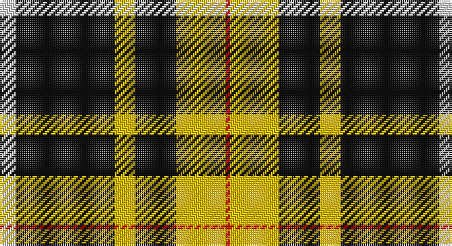

This page is one **sett** — a single exact thread-count. It belongs to the [tartan](/setts/w4k24ly5k10ly12r1/)
(the same proportion at any scale), whose colour order is pattern [RYKYKW](/stripes/rykykw/).

Part of the [Livingston Football Club](/tartans/livingston-football-club/) tartan — the named design grouping this sett with its other cloths.

Sourced from register-of-tartans.  It is a [6 stripe tartan](/stripes/stripes6/).

Original link https://www.tartanregister.gov.uk/tartanDetails.aspx?ref=2133

## Also known as

This cloth is also recorded under:

- Livingston F. C.

2 attestations — the source records this cloth was collapsed from (oldest owns this page)

<ul>
<li>01/01/2001 — Livingston Football Club (2001) (register-of-tartans, <a href="https://www.tartanregister.gov.uk/tartanDetails.aspx?ref=2133">record</a>)</li>
<li>Oct. 2001 — Livingston F. C. (2001) (Sports) (tartans-authority, <a href="http://www.tartansauthority.com/tartan-ferret/display/3986/">record</a>)</li>
</ul>

## Register references

External register numbers recorded for this tartan.

- Scottish Register of Tartans: [2133](https://www.tartanregister.gov.uk/tartanDetails.aspx?ref=2133)
- Scottish Tartans Authority (ITI): 3986
- Scottish Tartans World Register: 2856

## Thread count
LN/8 K48 Y10 K20 Y24 R/2

One full sett is **214 threads**.

## Palette

Palette: <strong>Tartan Register</strong>
<table><thead><tr><th>Colour</th><th>Threads</th><th>Shade</th><th>Base</th><th>OKLCh</th></tr></thead><tbody><tr><td>LN/</td><td style="text-align:right;font-variant-numeric:tabular-nums">8</td><td><code style="background-color:#E0E0E0;">#E0E0E0</code> <small style="color:#888">#E0E0E0</small></td><td>W <code style="background-color:#F7F7F7;">#F7F7F7</code></td><td><small style="color:#888">oklch(90.7% 0.000 89.9)</small></td></tr><tr><td>K</td><td style="text-align:right;font-variant-numeric:tabular-nums">48</td><td><code style="background-color:#101010;">#101010</code> <small style="color:#888">#101010</small></td><td>K <code style="background-color:#000000;">#000000</code></td><td><small style="color:#888">oklch(17.3% 0.000 89.9)</small></td></tr><tr><td>Y</td><td style="text-align:right;font-variant-numeric:tabular-nums">10</td><td><code style="background-color:#E8C000;">#E8C000</code> <small style="color:#888">#E8C000</small></td><td>Y <code style="background-color:#F2BF00;">#F2BF00</code></td><td><small style="color:#888">oklch(81.9% 0.168 93.7)</small></td></tr><tr><td>K</td><td style="text-align:right;font-variant-numeric:tabular-nums">20</td><td><code style="background-color:#101010;">#101010</code> <small style="color:#888">#101010</small></td><td>K <code style="background-color:#000000;">#000000</code></td><td><small style="color:#888">oklch(17.3% 0.000 89.9)</small></td></tr><tr><td>Y</td><td style="text-align:right;font-variant-numeric:tabular-nums">24</td><td><code style="background-color:#E8C000;">#E8C000</code> <small style="color:#888">#E8C000</small></td><td>Y <code style="background-color:#F2BF00;">#F2BF00</code></td><td><small style="color:#888">oklch(81.9% 0.168 93.7)</small></td></tr><tr><td>R/</td><td style="text-align:right;font-variant-numeric:tabular-nums">2</td><td><code style="background-color:#C80000;">#C80000</code> <small style="color:#888">#C80000</small></td><td>R <code style="background-color:#CC0000;">#CC0000</code></td><td><small style="color:#888">oklch(52.3% 0.215 29.2)</small></td></tr></tbody></table>

# Sample pattern

## Compared to the master

This cloth is one sett of its design; the master sett (the exemplar the design is anchored on) is below for comparison.

<figure style="margin:0"><figcaption style="color:#888;font-size:smaller">this sett</figcaption></figure>
<figure style="margin:0"><figcaption style="color:#888;font-size:smaller"><a href="/setts/ly11k4m2k3lyi2k4ly15k32ly2k5w2/">master sett →</a></figcaption></figure>

## Nearest tartans

The nearest existing variants by ΔTartan distance, with this tartan at the top so the swatches line up against it.

ΔTartan

Tartan

Sett

—

<a href="/ttd/edit/#slug=w4k24ly5k10ly12r1~x2">Livingston Football Club (2001)</a> <a class="nn-out" href="/variants/s6/w4k24ly5k10ly12r1~x2/" title="open its dictionary page">↗</a>

1.28

<a href="/ttd/edit/#slug=k14lo3w8lo4k6w9k31g1~x2&amp;base=w4k24ly5k10ly12r1~x2">Entrepreneurial Spark</a> <a class="nn-out" href="/variants/s8/k14lo3w8lo4k6w9k31g1~x2/" title="open its dictionary page">↗</a>

1.52

<a href="/ttd/edit/#slug=lr3r1lr30k20lr3k9ly1~x2&amp;base=w4k24ly5k10ly12r1~x2">MacPherson Dress</a> <a class="nn-out" href="/variants/s7/lr3r1lr30k20lr3k9ly1~x2/" title="open its dictionary page">↗</a>

1.52

<a href="/ttd/edit/#slug=lr3r1lr30k20lr3k9ly1&amp;base=w4k24ly5k10ly12r1~x2">MacPherson Dress</a> <a class="nn-out" href="/variants/s7/lr3r1lr30k20lr3k9ly1/" title="open its dictionary page">↗</a>

1.52

<a href="/variants/s9/k4lo24ki13lo2ki4lo3ki1lo3t2~x2/">Cardiff City Football Club (Corp)</a>

1.52

<a href="/ttd/edit/#slug=dg32r12dg6r6k2w3~x2&amp;base=w4k24ly5k10ly12r1~x2">Princess Margaret Rose</a> <a class="nn-out" href="/variants/s6/dg32r12dg6r6k2w3~x2/" title="open its dictionary page">↗</a>

1.54

<a href="/variants/s8/w5k20w10k1r2~x2/">St. Piran Cornish Flag</a>

1.56

<a href="/ttd/edit/#slug=w5k20w10k1r2~x2&amp;base=w4k24ly5k10ly12r1~x2">Cornish Flag (District)</a> <a class="nn-out" href="/variants/s5/w5k20w10k1r2~x2/" title="open its dictionary page">↗</a>

1.57

<a href="/ttd/edit/#slug=w3k35o24k1ly3~x2&amp;base=w4k24ly5k10ly12r1~x2">George Heriots</a> <a class="nn-out" href="/variants/s5/w3k35o24k1ly3~x2/" title="open its dictionary page">↗</a>

1.59

<a href="/ttd/edit/#slug=lb3r1lb30k20lb3k9ly1&amp;base=w4k24ly5k10ly12r1~x2">MacPherson Dress</a> <a class="nn-out" href="/variants/s7/lb3r1lb30k20lb3k9ly1/" title="open its dictionary page">↗</a>

1.60

<a href="/ttd/edit/#slug=k8ly1k8ly12r1~x4&amp;base=w4k24ly5k10ly12r1~x2">MacLeod of Lewis (Vestiarium Scoticum)</a> <a class="nn-out" href="/variants/s5/k8ly1k8ly12r1~x4/" title="open its dictionary page">↗</a>

## Neighbour map

Every grey dot is one of 14360 variants placed by the first two principal components of the ΔTartan feature space (44% of its variance). Red is this tartan; blue dots are its nearest — click one to open its page.

<svg viewBox="0 0 640 380" role="img" style="max-width:100%;height:auto;border:1px solid #e0e0e0;border-radius:4px;display:block" xmlns="http://www.w3.org/2000/svg"><image href="/nn/cloud.v1.png" width="640" height="380"/><a href="/variants/s8/k14lo3w8lo4k6w9k31g1~x2/"><circle cx="378.8" cy="139.2" r="4" fill="#3465a4"><title>Entrepreneurial Spark</title></circle></a><a href="/variants/s7/lr3r1lr30k20lr3k9ly1~x2/"><circle cx="328.4" cy="132.1" r="4" fill="#3465a4"><title>MacPherson Dress</title></circle></a><a href="/variants/s7/lr3r1lr30k20lr3k9ly1/"><circle cx="328.4" cy="132.1" r="4" fill="#3465a4"><title>MacPherson Dress</title></circle></a><a href="/variants/s9/k4lo24ki13lo2ki4lo3ki1lo3t2~x2/"><circle cx="334.6" cy="131.0" r="4" fill="#3465a4"><title>Cardiff City Football Club (Corp)</title></circle></a><a href="/variants/s6/dg32r12dg6r6k2w3~x2/"><circle cx="372.0" cy="181.4" r="4" fill="#3465a4"><title>Princess Margaret Rose</title></circle></a><a href="/variants/s8/w5k20w10k1r2~x2/"><circle cx="343.7" cy="171.7" r="4" fill="#3465a4"><title>St. Piran Cornish Flag</title></circle></a><a href="/variants/s5/w5k20w10k1r2~x2/"><circle cx="324.2" cy="182.4" r="4" fill="#3465a4"><title>Cornish Flag (District)</title></circle></a><a href="/variants/s5/w3k35o24k1ly3~x2/"><circle cx="342.3" cy="151.2" r="4" fill="#3465a4"><title>George Heriots</title></circle></a><a href="/variants/s7/lb3r1lb30k20lb3k9ly1/"><circle cx="321.6" cy="125.9" r="4" fill="#3465a4"><title>MacPherson Dress</title></circle></a><a href="/variants/s5/k8ly1k8ly12r1~x4/"><circle cx="296.0" cy="220.8" r="4" fill="#3465a4"><title>MacLeod of Lewis (Vestiarium Scoticum)</title></circle></a><circle cx="324.9" cy="166.2" r="5" fill="#c00000"/></svg>

ID: /variants/s6/w4k24ly5k10ly12r1~x2/
