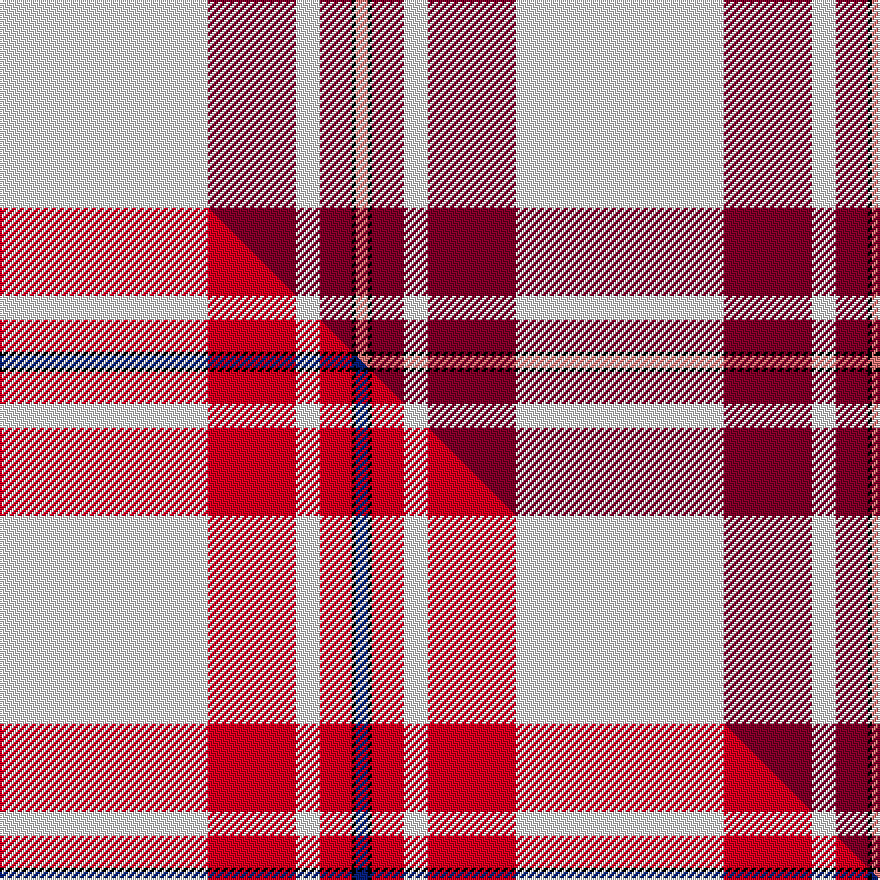

This is one **variant** — a specific cloth: this exact thread count and colourway, with its own
provenance below. It is one weaving of the [sett](/setts/w52r22w6r8k1ri3/) (the scale-free proportion — the
same cloth at any scale or shade), whose colour order is pattern [RKRWRW](/stripes/rkrwrw/).

Part of the [MacGregor](/tartans/m/ma/macgregor-12/) tartan — the named design grouping this sett with its other cloths.

Sourced from register-of-tartans.  It is a [6 stripe tartan](/stripes/stripes6/).

Original link [https://www.tartanregister.gov.uk/tartanDetails.aspx?ref=2452](https://www.tartanregister.gov.uk/tartanDetails.aspx?ref=2452)

## Provenance

Earliest known date: 1975 A dancers tartan based on MacGregor

3 attestations — the source records this cloth was collapsed from (oldest owns this page)

<ul>
<li>01/01/1975 — MacGregor Dress Burgundy (Dance) (register-of-tartans, <a href="https://www.tartanregister.gov.uk/tartanDetails.aspx?ref=2452">record</a>)  <em>Circa.1975 from Dalgliesh. Possibly a Dalgleish Dancers' Fancy. Original threadcount from MacGregor-Hastie collection, 1983, Scottish Tartans Society archive. R6/K2/G16/W12/G42/W104.</em></li>
<li>1975 — MacGregor - 1975 (Dance, Burgundy) (tartans-authority, <a href="https://www.tartanregister.gov.uk/tartanDetails.aspx?ref=1577">record</a>)  <em>C.1975 from Dalgliesh. Possibly a Dalgleish Dancers' Fancy</em></li>
<li>1975 — MacGregor Dress Burgundy Fancy Tartan (house-of-tartan, <a href="http://www.house-of-tartan.scotland.net/house/TartanViewjs.asp?colr=Def&tnam=6533">record</a>) </li>
</ul>

Dataset <small>— provenance for this record, inherited from the source manifest</small>

<dl class="dataset-prov">
<dt>source</dt><dd><a href="/sources/register-of-tartans/">Scottish Register of Tartans</a></dd>
<dt>data captured from</dt><dd><a href="https://github.com/thetartan/tartan-database/blob/master/data/register-of-tartans/data.csv">https://github.com/thetartan/tartan-database/blob/master/data/register-of-tartans/data.csv</a></dd>
<dt>data date</dt><dd>1975 <small>(this record)</small></dd>
<dt>licence</dt><dd><a href="https://www.tartanregister.gov.uk/copyright">Crown copyright</a></dd>
</dl>

Capture chain <small>— the hands this data passed through, oldest first; each capture carries its own licence</small>

<ol class="capture-chain">
<li><a href="https://www.tartanregister.gov.uk/">Scottish Register of Tartans</a> · <a href="https://www.tartanregister.gov.uk/copyright">Crown copyright</a> <small>the living register — still published by National Records of Scotland</small></li>
<li><a href="https://github.com/thetartan/tartan-database">thetartan/tartan-database</a> <small>2016-2017</small> · <a href="https://creativecommons.org/licenses/by-nc-nd/4.0/">CC BY-NC-ND 4.0</a> <small>Levko Kravets's frozen compilation — the capture we vendored, and where its CC licence text came from</small></li>
<li>this dictionary <small>captured 2026-06-10 · commit 5bf86c7566</small> <small>each re-capture is a git commit to data/sources</small></li>
</ol>

## Register references

External register numbers recorded for this tartan.

- Scottish Register of Tartans: [2452](https://www.tartanregister.gov.uk/tartanDetails.aspx?ref=2452)
- Scottish Tartans Authority (ITI): 1577
- Scottish Tartans World Register: 1577

## Thread count
W/104 R44 W12 R16 K2 Ri/6

One full sett is **258 threads**.

## Palette
<table><thead><tr><th>Colour</th><th>Shade</th><th>OKLCh</th></tr></thead><tbody><tr><td>R</td><td><code style="background-color:#800028;">#800028</code> <small style="color:#888">#800028</small></td><td><small style="color:#888">oklch(38.2% 0.152 14.5)</small></td></tr><tr><td>K</td><td><code style="background-color:#000000;">#000000</code> <small style="color:#888">#000000</small></td><td><small style="color:#888">oklch(0.0% 0.000 0.0)</small></td></tr><tr><td>R</td><td><code style="background-color:#E87878;">#E87878</code> <small style="color:#888">#E87878</small></td><td><small style="color:#888">oklch(70.0% 0.139 21.2)</small></td></tr><tr><td>W</td><td><code style="background-color:#F7F7F7;">#F7F7F7</code> <small style="color:#888">#F7F7F7</small></td><td><small style="color:#888">oklch(97.6% 0.000 89.9)</small></td></tr></tbody></table>

# Sample pattern

## Compared to the master

This cloth is one sett of its design; the master sett (the exemplar the design is anchored on) is below for comparison.

Its **ΔTartan distance** from the master is **0.38** — the same measure the nearest-tartans table ranks by (0 is identical; a re-scale of the same cloth is near 0, a recolour or a different proportion further).

<figure class="master-compare" style="margin:0">

this sett
master sett ★

<figcaption style="color:#888;font-size:smaller">One weave of this sett against the <a href="/setts/w52r22w6r8k1db3/">master sett ★</a>, split on the diagonal: a shared proportion runs seamlessly across it with only the shades shifting; a different proportion breaks on it.</figcaption>
</figure>

## Nearest tartan variants

The nearest existing variants by ΔTartan distance, with this cloth at the top so the swatches line up against it.

ΔTartan

Threads

Variant

Sett

—

258

<a href="/variants/s6/w52r22w6r8k1ri3~x2~r1506019-ri2806019/">MacGregor Dress Burgundy (Dance)</a>

<a href="/ttd/edit/#slug=w52r22w6r8k1db3~x2&amp;base=w52r22w6r8k1ri3~x2~r1506019-ri2806019" title="compare in the TTD">0.38</a>

258

<a href="/variants/s6/w52r22w6r8k1db3~x2/">MacGregor Dress Red Fancy Tartan</a>

<a href="/ttd/edit/#slug=k2w28r13w2r13w2~x2&amp;base=w52r22w6r8k1ri3~x2~r1506019-ri2806019" title="compare in the TTD">2.11</a>

232

<a href="/variants/s6/k2w28r13w2r13w2~x2/">Buchanan #5</a>

<a href="/ttd/edit/#slug=r4w2ri2dr34w37k2~x2~r2607041-ri2806019&amp;base=w52r22w6r8k1ri3~x2~r1506019-ri2806019" title="compare in the TTD">2.15</a>

312

<a href="/variants/s6/r4w2ri2dr34w37k2~x2~r2607041-ri2806019/">Papalia, Special Dress</a>

<a href="/ttd/edit/#slug=k2w1n8dr1lb28dr2~x2&amp;base=w52r22w6r8k1ri3~x2~r1506019-ri2806019" title="compare in the TTD">2.23</a>

160

<a href="/variants/s6/k2w1n8dr1lb28dr2~x2/">Norris Hunting</a>

<a href="/ttd/edit/#slug=w54k7r7lo6ly4r1~x2~ly3307090&amp;base=w52r22w6r8k1ri3~x2~r1506019-ri2806019" title="compare in the TTD">2.24</a>

206

<a href="/variants/s6/w54k7r7lo6ly4r1~x2~ly3307090/">Young, Christina</a>

<a href="/ttd/edit/#slug=w30k1r7dg7r8w1r2~x4&amp;base=w52r22w6r8k1ri3~x2~r1506019-ri2806019" title="compare in the TTD">2.25</a>

320

<a href="/variants/s7/w30k1r7dg7r8w1r2~x4/">MMK 1777</a>

<a href="/ttd/edit/#slug=w5r2w34r34k2r2db4~x2&amp;base=w52r22w6r8k1ri3~x2~r1506019-ri2806019" title="compare in the TTD">2.27</a>

314

<a href="/variants/s7/w5r2w34r34k2r2db4~x2/">Cunningham Dress Clan Tartan</a>

<a href="/ttd/edit/#slug=w5r2w34r34k2r2y4~x2&amp;base=w52r22w6r8k1ri3~x2~r1506019-ri2806019" title="compare in the TTD">2.28</a>

314

<a href="/variants/s7/w5r2w34r34k2r2y4~x2/">Cunningham Dress Burgundy (Dance)</a>

<a href="/ttd/edit/#slug=w50k3dg10g11w1k1r20w3r5~x2~dg1806142-g2203152&amp;base=w52r22w6r8k1ri3~x2~r1506019-ri2806019" title="compare in the TTD">2.55</a>

306

<a href="/variants/s9/w50k3dg10g11w1k1r20w3r5~x2~dg1806142-g2203152/">Drummond of Perth Dress (Dance)</a>

<a href="/ttd/edit/#slug=w5k2w30r24w3r8db3~x2&amp;base=w52r22w6r8k1ri3~x2~r1506019-ri2806019" title="compare in the TTD">2.68</a>

284

<a href="/variants/s7/w5k2w30r24w3r8db3~x2/">Arduaine, Red (Dance)</a>

## Neighbour map

Every grey dot is one of 13656 variants placed by the first two principal components of the ΔTartan feature space (42% of its variance). Red is this tartan; blue dots are its nearest — click one to open its page. The map is a flat projection of a many-dimensional space — [how to read it](/posts/neighbourhood-maps/).

<svg viewBox="0 0 640 380" role="img" style="max-width:100%;height:auto;border:1px solid #e0e0e0;border-radius:4px;display:block" xmlns="http://www.w3.org/2000/svg"><image href="/nn/cloud.v1.png" width="640" height="380"/><a href="/variants/s6/w52r22w6r8k1db3~x2/"><circle cx="318.4" cy="81.8" r="4" fill="#3465a4"><title>MacGregor Dress Red Fancy Tartan</title></circle></a><a href="/variants/s6/k2w28r13w2r13w2~x2/"><circle cx="318.8" cy="182.4" r="4" fill="#3465a4"><title>Buchanan #5</title></circle></a><a href="/variants/s6/r4w2ri2dr34w37k2~x2~r2607041-ri2806019/"><circle cx="239.3" cy="122.6" r="4" fill="#3465a4"><title>Papalia, Special Dress</title></circle></a><a href="/variants/s6/k2w1n8dr1lb28dr2~x2/"><circle cx="384.0" cy="110.4" r="4" fill="#3465a4"><title>Norris Hunting</title></circle></a><a href="/variants/s6/w54k7r7lo6ly4r1~x2~ly3307090/"><circle cx="374.6" cy="74.0" r="4" fill="#3465a4"><title>Young, Christina</title></circle></a><a href="/variants/s7/w30k1r7dg7r8w1r2~x4/"><circle cx="297.8" cy="111.1" r="4" fill="#3465a4"><title>MMK 1777</title></circle></a><a href="/variants/s7/w5r2w34r34k2r2db4~x2/"><circle cx="271.4" cy="131.6" r="4" fill="#3465a4"><title>Cunningham Dress Clan Tartan</title></circle></a><a href="/variants/s7/w5r2w34r34k2r2y4~x2/"><circle cx="276.5" cy="133.0" r="4" fill="#3465a4"><title>Cunningham Dress Burgundy (Dance)</title></circle></a><a href="/variants/s9/w50k3dg10g11w1k1r20w3r5~x2~dg1806142-g2203152/"><circle cx="265.3" cy="68.5" r="4" fill="#3465a4"><title>Drummond of Perth Dress (Dance)</title></circle></a><a href="/variants/s7/w5k2w30r24w3r8db3~x2/"><circle cx="282.2" cy="157.3" r="4" fill="#3465a4"><title>Arduaine, Red (Dance)</title></circle></a><circle cx="371.6" cy="99.3" r="5" fill="#c00000"/><text x="320" y="376" text-anchor="middle" font-size="11" fill="#999">ground</text><text x="11" y="190" text-anchor="middle" font-size="11" fill="#999" transform="rotate(-90 11 190)">complexity</text></svg>

ID: /variants/s6/w52r22w6r8k1ri3~x2~r1506019-ri2806019/
