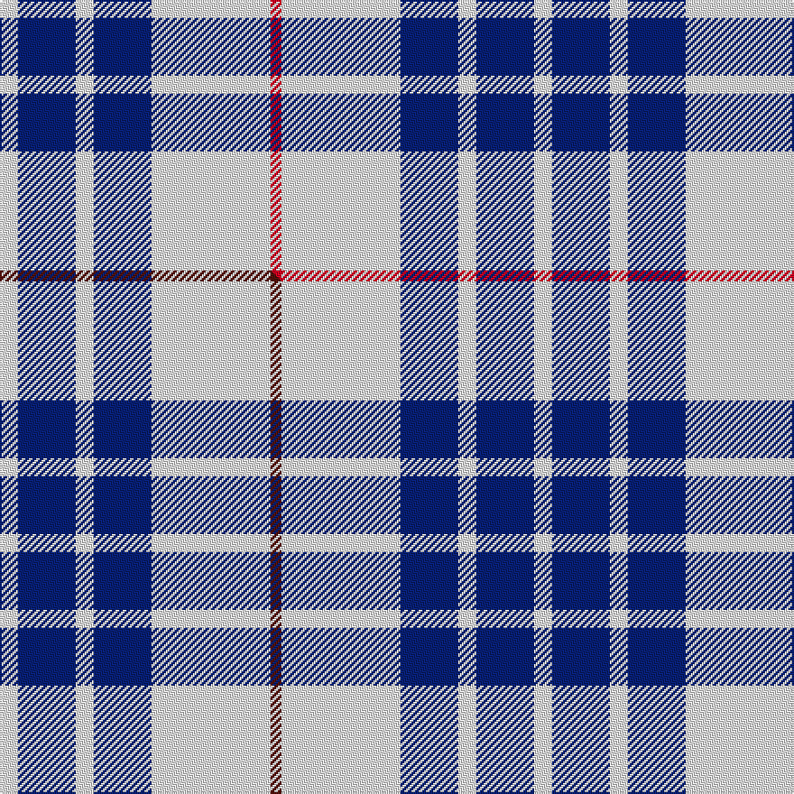

This page is one **sett** — a single exact thread-count. It belongs to the [tartan](/setts/w5db16w5db16w33r3/)
(the same proportion at any scale), whose colour order is pattern [RWBWBW](/stripes/rwbwbw/).

Part of the [Buchanan Dress](/tartans/buchanan-dress-2/) tartan — the named design grouping this sett with its other cloths.

Sourced from tartans-authority.  It is a [6 stripe tartan](/stripes/stripes6/).

Original link [https://www.tartanregister.gov.uk/tartanDetails.aspx?ref=1672](https://www.tartanregister.gov.uk/tartanDetails.aspx?ref=1672)

## Provenance

Earliest known date: pre 2003 One of a number of dress tartans produced by Hugh Macpherson, a kiltmaker in Edinburgh, intended for dancing and other informal occassions. The 'dress' version of clan tartan is usually created by substituting white for one of the 'ground' colours.

3 attestations — the source records this cloth was collapsed from (oldest owns this page)

<ul>
<li>1983 — Buchanan Dress, Blue (Dance) (tartans-authority, <a href="https://www.tartanregister.gov.uk/tartanDetails.aspx?ref=1672">record</a>)  <em>One of a number of dress tartans produced by Hugh Macpherson, a kiltmaker in Edinburgh, intended for dancing and other informal occasions. The 'dress' version of clan tartan is usually created by substituting white for one of the 'ground' colours. Dalgliesh weave. Woven sample.</em></li>
<li>undated — Buchanan, dress Blue (weddslist, <a href="http://www.weddslist.com/cgi-bin/tartans/pg.pl?source=sts">record</a>) </li>
<li>undated — Buchanan Dress Blue Clan Tartan (house-of-tartan, <a href="http://www.house-of-tartan.scotland.net/house/TartanViewjs.asp?colr=Def&tnam=1672">record</a>) </li>
</ul>

Dataset <small>— provenance for this record, inherited from the source manifest</small>

<dl class="dataset-prov">
<dt>source</dt><dd><a href="/sources/tartans-authority/">Scottish Tartans Authority</a></dd>
<dt>data captured from</dt><dd><a href="https://github.com/thetartan/tartan-database/blob/master/data/tartans-authority/data.csv">https://github.com/thetartan/tartan-database/blob/master/data/tartans-authority/data.csv</a></dd>
<dt>data date</dt><dd>1983 <small>(this record)</small></dd>
<dt>licence</dt><dd><a href="https://creativecommons.org/licenses/by-nc-nd/4.0/">CC BY-NC-ND 4.0</a></dd>
</dl>

Capture chain <small>— the hands this data passed through, oldest first; each capture carries its own licence</small>

<ol class="capture-chain">
<li><a href="https://www.tartansauthority.com/">Scottish Tartans Authority</a> <small>the heritage body's archive — its tartan-ferret record browser is retired (links repaired to the SRT, above)</small></li>
<li><a href="https://github.com/thetartan/tartan-database">thetartan/tartan-database</a> <small>2016-2017</small> · <a href="https://creativecommons.org/licenses/by-nc-nd/4.0/">CC BY-NC-ND 4.0</a> <small>Levko Kravets's frozen compilation — the capture we vendored, and where its CC licence text came from</small></li>
<li>this dictionary <small>captured 2026-06-10 · commit 5bf86c7566</small> <small>each re-capture is a git commit to data/sources</small></li>
</ol>

## Register references

External register numbers recorded for this tartan.

- Scottish Tartans Authority (ITI): 1672

## Thread count
W/10 DB32 W10 DB32 W66 R/6

One full sett is **296 threads**.

## Palette
<table><thead><tr><th>Colour</th><th>Shade</th><th>OKLCh</th></tr></thead><tbody><tr><td>DB</td><td><code style="background-color:#082077;">#082077</code> <small style="color:#888">#082077</small></td><td><small style="color:#888">oklch(30.0% 0.149 265.1)</small></td></tr><tr><td>R</td><td><code style="background-color:#D60020;">#D60020</code> <small style="color:#888">#D60020</small></td><td><small style="color:#888">oklch(55.2% 0.224 25.5)</small></td></tr><tr><td>W</td><td><code style="background-color:#F7F7F7;">#F7F7F7</code> <small style="color:#888">#F7F7F7</small></td><td><small style="color:#888">oklch(97.6% 0.000 89.9)</small></td></tr></tbody></table>

# Sample pattern

## Compared to the master

This cloth is one sett of its design; the master sett (the exemplar the design is anchored on) is below for comparison.

Its **ΔTartan distance** from the master is **0.03** — the same measure the nearest-tartans table ranks by (0 is identical; a re-scale of the same cloth is near 0, a recolour or a different proportion further).

<figure class="master-compare" style="margin:0">

this sett
master sett ★

<figcaption style="color:#888;font-size:smaller">One weave of this sett against the <a href="/setts/w5db16w5db16w33dr3/">master sett ★</a>, split on the diagonal: a shared proportion runs seamlessly across it with only the shades shifting; a different proportion breaks on it.</figcaption>
</figure>

## Nearest tartan variants

The nearest existing variants by ΔTartan distance, with this cloth at the top so the swatches line up against it.

ΔTartan

Threads

Variant

Sett

—

296

<a href="/variants/s6/w5db16w5db16w33r3~x2/">Buchanan Dress, Blue (Dance)</a>

<a href="/ttd/edit/#slug=w5db16w5db16w33dr3~x2&amp;base=w5db16w5db16w33r3~x2" title="compare in the TTD">0.03</a>

296

<a href="/variants/s6/w5db16w5db16w33dr3~x2/">Buchanan Dress Blue (Dance)</a>

<a href="/ttd/edit/#slug=w5r3w26db21w3db8y3~x2&amp;base=w5db16w5db16w33r3~x2" title="compare in the TTD">0.93</a>

260

<a href="/variants/s7/w5r3w26db21w3db8y3~x2/">MacPherson, Blue &amp; White</a>

<a href="/ttd/edit/#slug=w7db16w20db3w3y3~x2&amp;base=w5db16w5db16w33r3~x2" title="compare in the TTD">0.94</a>

188

<a href="/variants/s6/w7db16w20db3w3y3~x2/">Unidentified (Shirt)</a>

<a href="/ttd/edit/#slug=w32dr12db12w2db3~x2&amp;base=w5db16w5db16w33r3~x2" title="compare in the TTD">1.73</a>

174

<a href="/variants/s5/w32dr12db12w2db3~x2/">Fraser Arisaid Red (Dance)</a>

<a href="/ttd/edit/#slug=db12w4db1w4r8w2r1~x4&amp;base=w5db16w5db16w33r3~x2" title="compare in the TTD">1.84</a>

204

<a href="/variants/s7/db12w4db1w4r8w2r1~x4/">Sunderland</a>

<a href="/ttd/edit/#slug=db37w9db3r9w3~x2&amp;base=w5db16w5db16w33r3~x2" title="compare in the TTD">1.95</a>

164

<a href="/variants/s5/db37w9db3r9w3~x2/">Glen Moy</a>

<a href="/ttd/edit/#slug=r2w6db2w9db9w2db6y2~x2&amp;base=w5db16w5db16w33r3~x2" title="compare in the TTD">1.99</a>

144

<a href="/variants/s8/r2w6db2w9db9w2db6y2~x2/">North Vancouver, Island</a>

<a href="/ttd/edit/#slug=dy2db6w2db9w9db2w6r2~x4&amp;base=w5db16w5db16w33r3~x2" title="compare in the TTD">1.99</a>

288

<a href="/variants/s8/dy2db6w2db9w9db2w6r2~x4/">North Vancouver Island</a>

<a href="/ttd/edit/#slug=w4k26lb26k2lb5w2~x2&amp;base=w5db16w5db16w33r3~x2" title="compare in the TTD">2.07</a>

248

<a href="/variants/s6/w4k26lb26k2lb5w2~x2/">Indian Pipe Band (Corporate)</a>

<a href="/ttd/edit/#slug=w18db4w18r30w18db4w9dp4&amp;base=w5db16w5db16w33r3~x2" title="compare in the TTD">2.43</a>

188

<a href="/variants/s8/w18db4w18r30w18db4w9dp4/">Milne, dress</a>

## Neighbour map

Every grey dot is one of 13621 variants placed by the first two principal components of the ΔTartan feature space (42% of its variance). Red is this tartan; blue dots are its nearest — click one to open its page.

<svg viewBox="0 0 640 380" role="img" style="max-width:100%;height:auto;border:1px solid #e0e0e0;border-radius:4px;display:block" xmlns="http://www.w3.org/2000/svg"><image href="/nn/cloud.v1.png" width="640" height="380"/><a href="/variants/s6/w5db16w5db16w33dr3~x2/"><circle cx="346.4" cy="248.7" r="4" fill="#3465a4"><title>Buchanan Dress Blue (Dance)</title></circle></a><a href="/variants/s7/w5r3w26db21w3db8y3~x2/"><circle cx="251.4" cy="202.8" r="4" fill="#3465a4"><title>MacPherson, Blue &amp; White</title></circle></a><a href="/variants/s6/w7db16w20db3w3y3~x2/"><circle cx="317.8" cy="254.8" r="4" fill="#3465a4"><title>Unidentified (Shirt)</title></circle></a><a href="/variants/s5/w32dr12db12w2db3~x2/"><circle cx="342.8" cy="228.8" r="4" fill="#3465a4"><title>Fraser Arisaid Red (Dance)</title></circle></a><a href="/variants/s7/db12w4db1w4r8w2r1~x4/"><circle cx="222.2" cy="205.2" r="4" fill="#3465a4"><title>Sunderland</title></circle></a><a href="/variants/s5/db37w9db3r9w3~x2/"><circle cx="372.6" cy="198.1" r="4" fill="#3465a4"><title>Glen Moy</title></circle></a><a href="/variants/s8/r2w6db2w9db9w2db6y2~x2/"><circle cx="178.9" cy="242.9" r="4" fill="#3465a4"><title>North Vancouver, Island</title></circle></a><a href="/variants/s8/dy2db6w2db9w9db2w6r2~x4/"><circle cx="178.0" cy="242.4" r="4" fill="#3465a4"><title>North Vancouver Island</title></circle></a><a href="/variants/s6/w4k26lb26k2lb5w2~x2/"><circle cx="255.2" cy="182.2" r="4" fill="#3465a4"><title>Indian Pipe Band (Corporate)</title></circle></a><a href="/variants/s8/w18db4w18r30w18db4w9dp4/"><circle cx="286.1" cy="221.3" r="4" fill="#3465a4"><title>Milne, dress</title></circle></a><circle cx="306.8" cy="221.7" r="5" fill="#c00000"/><text x="320" y="376" text-anchor="middle" font-size="11" fill="#999">ground</text><text x="11" y="190" text-anchor="middle" font-size="11" fill="#999" transform="rotate(-90 11 190)">complexity</text></svg>

ID: /variants/s6/w5db16w5db16w33r3~x2/
