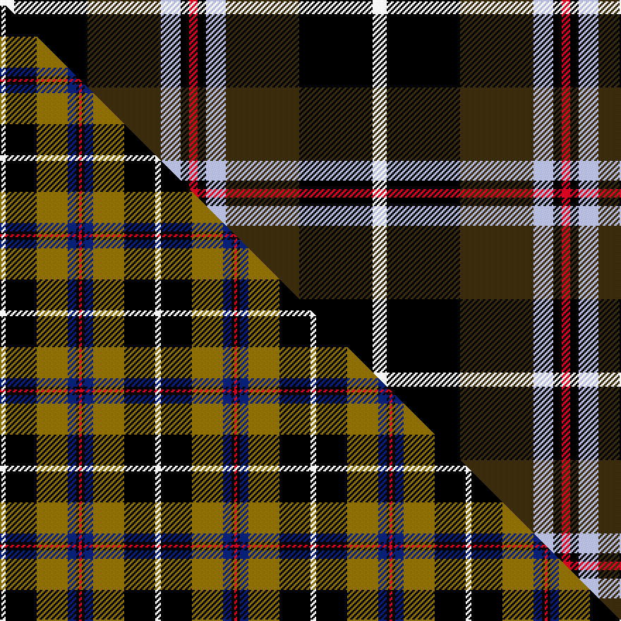

This is one **variant** — a specific cloth: this exact thread count and colourway, with its own
provenance below. It is one weaving of the [sett](/tartans/c/co/cornish-national-2/) (the scale-free proportion — the
same cloth at any scale or shade), whose colour order is pattern [RKWGKW](/stripes/rkwgkw/).

Part of the [Cornish National](/tartans/c/co/cornish-national-2/) tartan — the named design grouping this sett with its other cloths.

Sourced from house-of-tartan.  It is a [6 stripe tartan](/stripes/stripes6/).

Original link [http://www.house-of-tartan.scotland.net/house/TartanViewjs.asp?colr=Def&tnam=1567](http://www.house-of-tartan.scotland.net/house/TartanViewjs.asp?colr=Def&tnam=1567)

## Provenance

Earliest known date: 1963 The ancient kingdom of Cornwall is remembered in this tartan, designed by the Cornish poet, E.E. Morton-Nance. He regarded tartan as the "heritage of all Celts" and extold brave Cornishmen to wear the kilt of black and saffron, "Tints blazoned by her ancient Kings". There is also a Cornish Hunting tartan of more recent origin based on this sett.

Dataset <small>— provenance for this record, inherited from the source manifest</small>

<dl class="dataset-prov">
<dt>source</dt><dd><a href="/sources/house-of-tartan/">House of Tartan</a></dd>
<dt>data captured from</dt><dd><a href="https://github.com/thetartan/tartan-database/blob/master/data/house-of-tartan/data.csv">https://github.com/thetartan/tartan-database/blob/master/data/house-of-tartan/data.csv</a></dd>
<dt>data date</dt><dd>1963 <small>(this record)</small></dd>
<dt>licence</dt><dd><a href="https://creativecommons.org/licenses/by-nc-nd/4.0/">CC BY-NC-ND 4.0</a></dd>
</dl>

Capture chain <small>— the hands this data passed through, oldest first; each capture carries its own licence</small>

<ol class="capture-chain">
<li><a href="http://www.house-of-tartan.scotland.net/">House of Tartan</a> <small>the weaver/retailer's database — the site is now offline; the URL is kept as the ultimate source's identity</small></li>
<li><a href="https://github.com/thetartan/tartan-database">thetartan/tartan-database</a> <small>2016-2017</small> · <a href="https://creativecommons.org/licenses/by-nc-nd/4.0/">CC BY-NC-ND 4.0</a> <small>Levko Kravets's frozen compilation — the capture we vendored, and where its CC licence text came from</small></li>
<li>this dictionary <small>captured 2026-06-10 · commit 5bf86c7566</small> <small>each re-capture is a git commit to data/sources</small></li>
</ol>

## Thread count
W/10 K52 DY52 LB14 K6 R/6

One full sett is **264 threads**.

## Palette
<table><thead><tr><th>Colour</th><th>Shade</th><th>OKLCh</th></tr></thead><tbody><tr><td>LB</td><td><code style="background-color:#B5BBDE;">#B5BBDE</code> <small style="color:#888">#B5BBDE</small></td><td><small style="color:#888">oklch(79.9% 0.050 277.6)</small></td></tr><tr><td>K</td><td><code style="background-color:#000000;">#000000</code> <small style="color:#888">#000000</small></td><td><small style="color:#888">oklch(0.0% 0.000 0.0)</small></td></tr><tr><td>W</td><td><code style="background-color:#F7F7F7;">#F7F7F7</code> <small style="color:#888">#F7F7F7</small></td><td><small style="color:#888">oklch(97.6% 0.000 89.9)</small></td></tr><tr><td>R</td><td><code style="background-color:#D60020;">#D60020</code> <small style="color:#888">#D60020</small></td><td><small style="color:#888">oklch(55.2% 0.224 25.5)</small></td></tr><tr><td>DY</td><td><code style="background-color:#3A2B0D;">#3A2B0D</code> <small style="color:#888">#3A2B0D</small></td><td><small style="color:#888">oklch(30.0% 0.049 82.0)</small></td></tr></tbody></table>

# Sample pattern

## Compared to the master

This cloth is one sett of its design; the master sett (the exemplar the design is anchored on) is below for comparison.

Its **ΔTartan distance** from the master is **0.41** — the same measure the nearest-tartans table ranks by (0 is identical; a re-scale of the same cloth is near 0, a recolour or a different proportion further).

<figure class="master-compare" style="margin:0">

this sett
master sett ★

<figcaption style="color:#888;font-size:smaller">One weave of this sett against the <a href="/setts/w2k11y11db3k1r1/">master sett ★</a>, split on the diagonal: a shared proportion runs seamlessly across it with only the shades shifting; a different proportion breaks on it.</figcaption>
</figure>

## Nearest tartan variants

The nearest existing variants by ΔTartan distance, with this cloth at the top so the swatches line up against it.

ΔTartan

Threads

Variant

Sett

—

264

<a href="/variants/s6/w5k26dy26lb7k3r3~x2/">Cornish National District Tartan</a>

<a href="/ttd/edit/#slug=w5k26y26lb7k3r3~x2&amp;base=w5k26dy26lb7k3r3~x2" title="compare in the TTD">0.15</a>

264

<a href="/variants/s6/w5k26y26lb7k3r3~x2/">Cornish, National</a>

<a href="/ttd/edit/#slug=w2k11y11lb3k1r1~x2&amp;base=w5k26dy26lb7k3r3~x2" title="compare in the TTD">0.38</a>

110

<a href="/variants/s6/w2k11y11lb3k1r1~x2/">Cornish National Small Set Tartan</a>

<a href="/ttd/edit/#slug=w2k11y11db3k1r1~x2&amp;base=w5k26dy26lb7k3r3~x2" title="compare in the TTD">0.41</a>

110

<a href="/variants/s6/w2k11y11db3k1r1~x2/">Cornish National #2</a>

<a href="/ttd/edit/#slug=dy30ly5lb10k10w2k2~x2&amp;base=w5k26dy26lb7k3r3~x2" title="compare in the TTD">1.55</a>

172

<a href="/variants/s6/dy30ly5lb10k10w2k2~x2/">Bryan Wedding (Personal)</a>

<a href="/ttd/edit/#slug=y4k4lb5t24y2k24w4~x2&amp;base=w5k26dy26lb7k3r3~x2" title="compare in the TTD">1.56</a>

252

<a href="/variants/s7/y4k4lb5t24y2k24w4~x2/">Mina Perhonen</a>

<a href="/ttd/edit/#slug=lr4k13g6dr16lb2dr2g2~x2~lr3200000-lb3103284&amp;base=w5k26dy26lb7k3r3~x2" title="compare in the TTD">1.65</a>

168

<a href="/variants/s7/lbi4k13g6dr16lb2dr2g2~x2~lbi3200000-lb3103284/">Caledonian Brewery Corporate Tartan</a>

<a href="/ttd/edit/#slug=w5k26y2dg24db7k3r3~x2&amp;base=w5k26dy26lb7k3r3~x2" title="compare in the TTD">1.89</a>

264

<a href="/variants/s7/w5k26y2dg24db7k3r3~x2/">Cornish Hunting District Tartan</a>

<a href="/ttd/edit/#slug=w5k26y2dg24ki7k3r3~x2~ki0604259&amp;base=w5k26dy26lb7k3r3~x2" title="compare in the TTD">1.89</a>

264

<a href="/variants/s7/w5k26y2dg24ki7k3r3~x2~ki0604259/">Cornish, hunting</a>

<a href="/ttd/edit/#slug=w6k29n29dp7k3r3~x2&amp;base=w5k26dy26lb7k3r3~x2" title="compare in the TTD">2.11</a>

290

<a href="/variants/s6/w6k29n29dp7k3r3~x2/">Jewell of Kernow (Personal)</a>

<a href="/ttd/edit/#slug=w6k29o29dp7k3r3~x2~o2500000&amp;base=w5k26dy26lb7k3r3~x2" title="compare in the TTD">2.11</a>

290

<a href="/variants/s6/w6k29o29dp7k3r3~x2~o2500000/">Jewell of Kernow (Personal)</a>

## Neighbour map

Every grey dot is one of 13657 variants placed by the first two principal components of the ΔTartan feature space (42% of its variance). Red is this tartan; blue dots are its nearest — click one to open its page. The map is a flat projection of a many-dimensional space — [how to read it](/posts/neighbourhood-maps/).

<svg viewBox="0 0 640 380" role="img" style="max-width:100%;height:auto;border:1px solid #e0e0e0;border-radius:4px;display:block" xmlns="http://www.w3.org/2000/svg"><image href="/nn/cloud.v1.png" width="640" height="380"/><a href="/variants/s6/w5k26y26lb7k3r3~x2/"><circle cx="147.1" cy="172.2" r="4" fill="#3465a4"><title>Cornish, National</title></circle></a><a href="/variants/s6/w2k11y11lb3k1r1~x2/"><circle cx="158.4" cy="160.8" r="4" fill="#3465a4"><title>Cornish National Small Set Tartan</title></circle></a><a href="/variants/s6/w2k11y11db3k1r1~x2/"><circle cx="163.2" cy="162.1" r="4" fill="#3465a4"><title>Cornish National #2</title></circle></a><a href="/variants/s6/dy30ly5lb10k10w2k2~x2/"><circle cx="213.1" cy="147.7" r="4" fill="#3465a4"><title>Bryan Wedding (Personal)</title></circle></a><a href="/variants/s7/y4k4lb5t24y2k24w4~x2/"><circle cx="158.2" cy="154.2" r="4" fill="#3465a4"><title>Mina Perhonen</title></circle></a><a href="/variants/s7/lbi4k13g6dr16lb2dr2g2~x2~lbi3200000-lb3103284/"><circle cx="139.0" cy="180.0" r="4" fill="#3465a4"><title>Caledonian Brewery Corporate Tartan</title></circle></a><a href="/variants/s7/w5k26y2dg24db7k3r3~x2/"><circle cx="154.3" cy="138.7" r="4" fill="#3465a4"><title>Cornish Hunting District Tartan</title></circle></a><a href="/variants/s7/w5k26y2dg24ki7k3r3~x2~ki0604259/"><circle cx="150.6" cy="135.6" r="4" fill="#3465a4"><title>Cornish, hunting</title></circle></a><a href="/variants/s6/w6k29n29dp7k3r3~x2/"><circle cx="163.1" cy="168.2" r="4" fill="#3465a4"><title>Jewell of Kernow (Personal)</title></circle></a><a href="/variants/s6/w6k29o29dp7k3r3~x2~o2500000/"><circle cx="154.7" cy="165.6" r="4" fill="#3465a4"><title>Jewell of Kernow (Personal)</title></circle></a><circle cx="154.1" cy="173.4" r="5" fill="#c00000"/><text x="320" y="376" text-anchor="middle" font-size="11" fill="#999">ground</text><text x="11" y="190" text-anchor="middle" font-size="11" fill="#999" transform="rotate(-90 11 190)">complexity</text></svg>

ID: /variants/s6/w5k26dy26lb7k3r3~x2/
