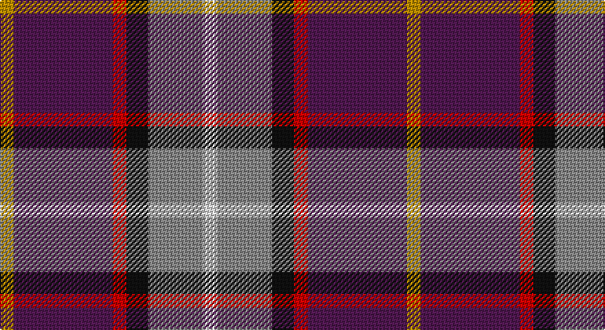

This page is one **sett** — a single exact thread-count. It belongs to the [tartan](/setts/w5o20k8r5dp36lo5/)
(the same proportion at any scale), whose colour order is pattern [WRKRBY](/stripes/wrkrby/).

Sourced from tartans-authority.  It is a [6 stripe tartan](/stripes/stripes6/).

Original link http://www.tartansauthority.com/tartan-ferret/display/7902/

## Register references

External register numbers recorded for this tartan.

- Scottish Register of Tartans: [7902](https://www.tartanregister.gov.uk/tartanDetails?ref=7902)
- Scottish Tartans Authority (ITI): 7902

## Thread count
DY/10 DP72 R10 K16 N40 LN/10

One full sett is **296 threads**.

## Palette

Palette: <strong>Tartan Register</strong> <small style="color:#888">(5 of 6 colours)</small>
<table><thead><tr><th>Colour</th><th>Threads</th><th>Shade</th><th>Base</th><th>OKLCh</th></tr></thead><tbody><tr><td>DY/</td><td style="text-align:right;font-variant-numeric:tabular-nums">10</td><td><code style="background-color:#BC8C00;">#BC8C00</code> <small style="color:#888">#BC8C00</small></td><td>Y <code style="background-color:#F2BF00;">#F2BF00</code></td><td><small style="color:#888">oklch(66.8% 0.137 84.1)</small></td></tr><tr><td>DP</td><td style="text-align:right;font-variant-numeric:tabular-nums">72</td><td><code style="background-color:#501850;">#501850</code> <small style="color:#888">#501850</small></td><td>B <code style="background-color:#2A418A;">#2A418A</code></td><td><small style="color:#888">oklch(32.3% 0.112 327.8)</small></td></tr><tr><td>R</td><td style="text-align:right;font-variant-numeric:tabular-nums">10</td><td><code style="background-color:#C80000;">#C80000</code> <small style="color:#888">#C80000</small></td><td>R <code style="background-color:#CC0000;">#CC0000</code></td><td><small style="color:#888">oklch(52.3% 0.215 29.2)</small></td></tr><tr><td>K</td><td style="text-align:right;font-variant-numeric:tabular-nums">16</td><td><code style="background-color:#101010;">#101010</code> <small style="color:#888">#101010</small></td><td>K <code style="background-color:#000000;">#000000</code></td><td><small style="color:#888">oklch(17.3% 0.000 89.9)</small></td></tr><tr><td>N</td><td style="text-align:right;font-variant-numeric:tabular-nums">40</td><td><code style="background-color:#888888;">#888888</code> <small style="color:#888">#888888</small></td><td>R <code style="background-color:#CC0000;">#CC0000</code></td><td><small style="color:#888">oklch(62.7% 0.000 89.9)</small></td></tr><tr><td>LN/</td><td style="text-align:right;font-variant-numeric:tabular-nums">10</td><td><code style="background-color:#E0E0E0;">#E0E0E0</code> <small style="color:#888">#E0E0E0</small></td><td>W <code style="background-color:#F7F7F7;">#F7F7F7</code></td><td><small style="color:#888">oklch(90.7% 0.000 89.9)</small></td></tr></tbody></table>

# Sample pattern

## Nearest tartans

The nearest existing variants by ΔTartan distance, with this tartan at the top so the swatches line up against it.

ΔTartan

Tartan

Sett

—

<a href="/ttd/edit/#slug=w5o20k8r5dp36lo5~x2">Lord's Own Highlanders (Corporate)</a> <a class="nn-out" href="/variants/s6/w5o20k8r5dp36lo5~x2/" title="open its dictionary page">↗</a>

0.97

<a href="/ttd/edit/#slug=gi3g3r22k5db22ly2~x2&amp;base=w5o20k8r5dp36lo5~x2">MacLeod Society of Scotland</a> <a class="nn-out" href="/variants/s6/gi3g3r22k5db22ly2~x2/" title="open its dictionary page">↗</a>

1.12

<a href="/ttd/edit/#slug=dt36lo5ri12r9dp5w12lo7~x2&amp;base=w5o20k8r5dp36lo5~x2">Galvez-Brown (Personal)</a> <a class="nn-out" href="/variants/s7/dt36lo5ri12r9dp5w12lo7~x2/" title="open its dictionary page">↗</a>

1.12

<a href="/ttd/edit/#slug=r12dbi3g5db16ly2g2~x2&amp;base=w5o20k8r5dp36lo5~x2">Dunbog Primary School Corporate Tartan</a> <a class="nn-out" href="/variants/s6/r12dbi3g5db16ly2g2~x2/" title="open its dictionary page">↗</a>

1.15

<a href="/ttd/edit/#slug=g3db8r11dt3k2dp2~x4&amp;base=w5o20k8r5dp36lo5~x2">Nicolson of Tiree &amp; Coll (Clan)</a> <a class="nn-out" href="/variants/s6/g3db8r11dt3k2dp2~x4/" title="open its dictionary page">↗</a>

1.19

<a href="/ttd/edit/#slug=k4db12lb3db4g8lo2r24db4r4~x2&amp;base=w5o20k8r5dp36lo5~x2">MacCreary (Personal)</a> <a class="nn-out" href="/variants/s9/k4db12lb3db4g8lo2r24db4r4~x2/" title="open its dictionary page">↗</a>

1.23

<a href="/ttd/edit/#slug=k20r6ly3db24g3r8w4~x2&amp;base=w5o20k8r5dp36lo5~x2">Eichelberger (Perrsonal)</a> <a class="nn-out" href="/variants/s7/k20r6ly3db24g3r8w4~x2/" title="open its dictionary page">↗</a>

1.24

<a href="/ttd/edit/#slug=w1o1dp2o7g1db5ly1~x4&amp;base=w5o20k8r5dp36lo5~x2">Deeside District Tartan</a> <a class="nn-out" href="/variants/s7/w1o1dp2o7g1db5ly1~x4/" title="open its dictionary page">↗</a>

1.25

<a href="/ttd/edit/#slug=db31t4db6k19r20ly4~x2&amp;base=w5o20k8r5dp36lo5~x2">Fife (McGill)</a> <a class="nn-out" href="/variants/s6/db31t4db6k19r20ly4~x2/" title="open its dictionary page">↗</a>

1.29

<a href="/ttd/edit/#slug=r15ri98db72t25db8w15&amp;base=w5o20k8r5dp36lo5~x2">Afternoon Tea / Assam</a> <a class="nn-out" href="/variants/s6/r15ri98db72t25db8w15/" title="open its dictionary page">↗</a>

1.30

<a href="/ttd/edit/#slug=w5db6r18k8b5k4db27w3~x2&amp;base=w5o20k8r5dp36lo5~x2">Clinton (Personal)</a> <a class="nn-out" href="/variants/s8/w5db6r18k8b5k4db27w3~x2/" title="open its dictionary page">↗</a>

## Neighbour map

Every grey dot is one of 14360 variants placed by the first two principal components of the ΔTartan feature space (44% of its variance). Red is this tartan; blue dots are its nearest — click one to open its page.

<svg viewBox="0 0 640 380" role="img" style="max-width:100%;height:auto;border:1px solid #e0e0e0;border-radius:4px;display:block" xmlns="http://www.w3.org/2000/svg"><image href="/nn/cloud.v1.png" width="640" height="380"/><a href="/variants/s6/gi3g3r22k5db22ly2~x2/"><circle cx="187.6" cy="158.5" r="4" fill="#3465a4"><title>MacLeod Society of Scotland</title></circle></a><a href="/variants/s7/dt36lo5ri12r9dp5w12lo7~x2/"><circle cx="119.6" cy="164.5" r="4" fill="#3465a4"><title>Galvez-Brown (Personal)</title></circle></a><a href="/variants/s6/r12dbi3g5db16ly2g2~x2/"><circle cx="180.0" cy="200.4" r="4" fill="#3465a4"><title>Dunbog Primary School Corporate Tartan</title></circle></a><a href="/variants/s6/g3db8r11dt3k2dp2~x4/"><circle cx="127.8" cy="205.1" r="4" fill="#3465a4"><title>Nicolson of Tiree &amp; Coll (Clan)</title></circle></a><a href="/variants/s9/k4db12lb3db4g8lo2r24db4r4~x2/"><circle cx="182.0" cy="135.7" r="4" fill="#3465a4"><title>MacCreary (Personal)</title></circle></a><a href="/variants/s7/k20r6ly3db24g3r8w4~x2/"><circle cx="117.4" cy="169.7" r="4" fill="#3465a4"><title>Eichelberger (Perrsonal)</title></circle></a><a href="/variants/s7/w1o1dp2o7g1db5ly1~x4/"><circle cx="157.9" cy="170.7" r="4" fill="#3465a4"><title>Deeside District Tartan</title></circle></a><a href="/variants/s6/db31t4db6k19r20ly4~x2/"><circle cx="188.2" cy="210.2" r="4" fill="#3465a4"><title>Fife (McGill)</title></circle></a><a href="/variants/s6/r15ri98db72t25db8w15/"><circle cx="216.2" cy="175.2" r="4" fill="#3465a4"><title>Afternoon Tea / Assam</title></circle></a><a href="/variants/s8/w5db6r18k8b5k4db27w3~x2/"><circle cx="172.1" cy="171.1" r="4" fill="#3465a4"><title>Clinton (Personal)</title></circle></a><circle cx="178.4" cy="177.2" r="5" fill="#c00000"/></svg>

ID: /variants/s6/w5o20k8r5dp36lo5~x2/
