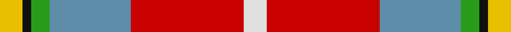
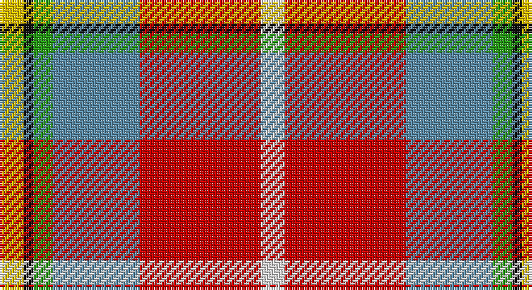

This page is one **sett** — a single exact thread-count. It belongs to the [tartan](/setts/w5r25t18g4k2ly5/)
(the same proportion at any scale), whose colour order is pattern [WRBGKY](/stripes/wrbgky/).

Sourced from tartans-authority.  It is a [6 stripe tartan](/stripes/stripes6/).

Original link http://www.tartansauthority.com/tartan-ferret/display/10293/

## Register references

External register numbers recorded for this tartan.

- Scottish Register of Tartans: [10293](https://www.tartanregister.gov.uk/tartanDetails?ref=10293)
- Scottish Tartans Authority (ITI): 10293

## Thread count
Y/10 K4 G8 B36 R50 LN/10

One full sett is **216 threads**.

## Palette

Palette: <strong>Tartan Register</strong>
<table><thead><tr><th>Colour</th><th>Threads</th><th>Shade</th><th>Base</th><th>OKLCh</th></tr></thead><tbody><tr><td>Y/</td><td style="text-align:right;font-variant-numeric:tabular-nums">10</td><td><code style="background-color:#E8C000;">#E8C000</code> <small style="color:#888">#E8C000</small></td><td>Y <code style="background-color:#F2BF00;">#F2BF00</code></td><td><small style="color:#888">oklch(81.9% 0.168 93.7)</small></td></tr><tr><td>K</td><td style="text-align:right;font-variant-numeric:tabular-nums">4</td><td><code style="background-color:#101010;">#101010</code> <small style="color:#888">#101010</small></td><td>K <code style="background-color:#000000;">#000000</code></td><td><small style="color:#888">oklch(17.3% 0.000 89.9)</small></td></tr><tr><td>G</td><td style="text-align:right;font-variant-numeric:tabular-nums">8</td><td><code style="background-color:#289C18;">#289C18</code> <small style="color:#888">#289C18</small></td><td>G <code style="background-color:#006100;">#006100</code></td><td><small style="color:#888">oklch(60.6% 0.191 141.6)</small></td></tr><tr><td>B</td><td style="text-align:right;font-variant-numeric:tabular-nums">36</td><td><code style="background-color:#5C8CA8;">#5C8CA8</code> <small style="color:#888">#5C8CA8</small></td><td>B <code style="background-color:#2A418A;">#2A418A</code></td><td><small style="color:#888">oklch(61.7% 0.067 235.0)</small></td></tr><tr><td>R</td><td style="text-align:right;font-variant-numeric:tabular-nums">50</td><td><code style="background-color:#C80000;">#C80000</code> <small style="color:#888">#C80000</small></td><td>R <code style="background-color:#CC0000;">#CC0000</code></td><td><small style="color:#888">oklch(52.3% 0.215 29.2)</small></td></tr><tr><td>LN/</td><td style="text-align:right;font-variant-numeric:tabular-nums">10</td><td><code style="background-color:#E0E0E0;">#E0E0E0</code> <small style="color:#888">#E0E0E0</small></td><td>W <code style="background-color:#F7F7F7;">#F7F7F7</code></td><td><small style="color:#888">oklch(90.7% 0.000 89.9)</small></td></tr></tbody></table>

# Sample pattern

## Nearest tartans

The nearest existing variants by ΔTartan distance, with this tartan at the top so the swatches line up against it.

ΔTartan

Tartan

Sett

—

<a href="/ttd/edit/#slug=w5r25t18g4k2ly5~x2">Christie (London) (Personal)</a> <a class="nn-out" href="/variants/s6/w5r25t18g4k2ly5~x2/" title="open its dictionary page">↗</a>

0.83

<a href="/ttd/edit/#slug=lo13b8r5k3w2g1~x4&amp;base=w5r25t18g4k2ly5~x2">Ball</a> <a class="nn-out" href="/variants/s6/lo13b8r5k3w2g1~x4/" title="open its dictionary page">↗</a>

0.91

<a href="/ttd/edit/#slug=r48b16lo5g17w8dy3~x2&amp;base=w5r25t18g4k2ly5~x2">Scottish American Soc. of Michigan</a> <a class="nn-out" href="/variants/s6/r48b16lo5g17w8dy3~x2/" title="open its dictionary page">↗</a>

1.15

<a href="/ttd/edit/#slug=r3lo15g4t6w2r30t6ly3~x2&amp;base=w5r25t18g4k2ly5~x2">Round Table Sweden</a> <a class="nn-out" href="/variants/s8/r3lo15g4t6w2r30t6ly3~x2/" title="open its dictionary page">↗</a>

1.20

<a href="/ttd/edit/#slug=r48t16lo5dg17w8k3~x2&amp;base=w5r25t18g4k2ly5~x2">Scottish American Society of Michigan (Official)</a> <a class="nn-out" href="/variants/s6/r48t16lo5dg17w8k3~x2/" title="open its dictionary page">↗</a>

1.22

<a href="/ttd/edit/#slug=w5r25lt18g4k2ly5~x2&amp;base=w5r25t18g4k2ly5~x2">Christie (London)</a> <a class="nn-out" href="/variants/s6/w5r25lt18g4k2ly5~x2/" title="open its dictionary page">↗</a>

1.26

<a href="/ttd/edit/#slug=lyi3r3ly2r20k16lb24w2~x2&amp;base=w5r25t18g4k2ly5~x2">Oor Wullie (Corporate)</a> <a class="nn-out" href="/variants/s7/lyi3r3ly2r20k16lb24w2~x2/" title="open its dictionary page">↗</a>

1.26

<a href="/ttd/edit/#slug=r26t7p8ly3r3w3g20p10w2~x2&amp;base=w5r25t18g4k2ly5~x2">Wilson's, No 227</a> <a class="nn-out" href="/variants/s9/r26t7p8ly3r3w3g20p10w2~x2/" title="open its dictionary page">↗</a>

1.26

<a href="/ttd/edit/#slug=o4do2o21db11w2oi20r3~x2&amp;base=w5r25t18g4k2ly5~x2">Barbour Dress</a> <a class="nn-out" href="/variants/s7/o4do2o21db11w2oi20r3~x2/" title="open its dictionary page">↗</a>

1.28

<a href="/ttd/edit/#slug=r30db12k6dg12ly2dg3w2~x2&amp;base=w5r25t18g4k2ly5~x2">Hewitt</a> <a class="nn-out" href="/variants/s7/r30db12k6dg12ly2dg3w2~x2/" title="open its dictionary page">↗</a>

1.28

<a href="/ttd/edit/#slug=r10n3db1lb8db1lo2g5~x4&amp;base=w5r25t18g4k2ly5~x2">Porcupine City of</a> <a class="nn-out" href="/variants/s7/r10n3db1lb8db1lo2g5~x4/" title="open its dictionary page">↗</a>

## Neighbour map

Every grey dot is one of 14360 variants placed by the first two principal components of the ΔTartan feature space (44% of its variance). Red is this tartan; blue dots are its nearest — click one to open its page.

<svg viewBox="0 0 640 380" role="img" style="max-width:100%;height:auto;border:1px solid #e0e0e0;border-radius:4px;display:block" xmlns="http://www.w3.org/2000/svg"><image href="/nn/cloud.v1.png" width="640" height="380"/><a href="/variants/s6/lo13b8r5k3w2g1~x4/"><circle cx="150.2" cy="152.2" r="4" fill="#3465a4"><title>Ball</title></circle></a><a href="/variants/s6/r48b16lo5g17w8dy3~x2/"><circle cx="242.6" cy="140.8" r="4" fill="#3465a4"><title>Scottish American Soc. of Michigan</title></circle></a><a href="/variants/s8/r3lo15g4t6w2r30t6ly3~x2/"><circle cx="215.9" cy="115.6" r="4" fill="#3465a4"><title>Round Table Sweden</title></circle></a><a href="/variants/s6/r48t16lo5dg17w8k3~x2/"><circle cx="231.2" cy="135.4" r="4" fill="#3465a4"><title>Scottish American Society of Michigan (Official)</title></circle></a><a href="/variants/s6/w5r25lt18g4k2ly5~x2/"><circle cx="165.3" cy="130.2" r="4" fill="#3465a4"><title>Christie (London)</title></circle></a><a href="/variants/s7/lyi3r3ly2r20k16lb24w2~x2/"><circle cx="128.5" cy="128.5" r="4" fill="#3465a4"><title>Oor Wullie (Corporate)</title></circle></a><a href="/variants/s9/r26t7p8ly3r3w3g20p10w2~x2/"><circle cx="145.1" cy="132.3" r="4" fill="#3465a4"><title>Wilson's, No 227</title></circle></a><a href="/variants/s7/o4do2o21db11w2oi20r3~x2/"><circle cx="189.2" cy="168.1" r="4" fill="#3465a4"><title>Barbour Dress</title></circle></a><a href="/variants/s7/r30db12k6dg12ly2dg3w2~x2/"><circle cx="206.9" cy="131.8" r="4" fill="#3465a4"><title>Hewitt</title></circle></a><a href="/variants/s7/r10n3db1lb8db1lo2g5~x4/"><circle cx="115.9" cy="164.2" r="4" fill="#3465a4"><title>Porcupine City of</title></circle></a><circle cx="188.7" cy="148.9" r="5" fill="#c00000"/></svg>

ID: /variants/s6/w5r25t18g4k2ly5~x2/
