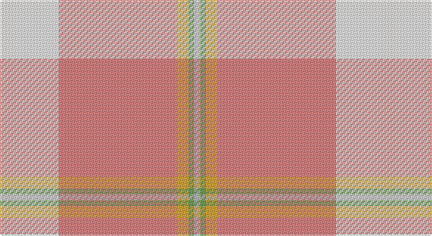

This page is one **sett** — a single exact thread-count. It belongs to the [tartan](/setts/w5wi15r40lo4g2lr2/)
(the same proportion at any scale), whose colour order is pattern [WWRYGY](/stripes/wwrygy/).

Part of the [Tomomi](/tartans/tomomi/) tartan — the named design grouping this sett with its other cloths.

Sourced from register-of-tartans.  It is a [6 stripe tartan](/stripes/stripes6/).

Original link https://www.tartanregister.gov.uk/tartanDetails.aspx?ref=11001

## Register references

External register numbers recorded for this tartan.

- Scottish Register of Tartans: [11001](https://www.tartanregister.gov.uk/tartanDetails.aspx?ref=11001)

## Thread count
Wa/10 W30 LR80 Y8 LG4 N/4

One full sett is **258 threads**.

## Palette

Palette: <strong>Tartan Register</strong> <small style="color:#888">(4 of 6 colours)</small>
<table><thead><tr><th>Colour</th><th>Threads</th><th>Shade</th><th>Base</th><th>OKLCh</th></tr></thead><tbody><tr><td>Wa/</td><td style="text-align:right;font-variant-numeric:tabular-nums">10</td><td><code style="background-color:#F9F5EF;">#F9F5EF</code> <small style="color:#888">#F9F5EF</small></td><td>W <code style="background-color:#F7F7F7;">#F7F7F7</code></td><td><small style="color:#888">oklch(97.2% 0.009 78.3)</small></td></tr><tr><td>W</td><td style="text-align:right;font-variant-numeric:tabular-nums">30</td><td><code style="background-color:#FCFCFC;">#FCFCFC</code> <small style="color:#888">#FCFCFC</small></td><td>W <code style="background-color:#F7F7F7;">#F7F7F7</code></td><td><small style="color:#888">oklch(99.1% 0.000 89.9)</small></td></tr><tr><td>LR</td><td style="text-align:right;font-variant-numeric:tabular-nums">80</td><td><code style="background-color:#E87878;">#E87878</code> <small style="color:#888">#E87878</small></td><td>R <code style="background-color:#CC0000;">#CC0000</code></td><td><small style="color:#888">oklch(70.0% 0.139 21.2)</small></td></tr><tr><td>Y</td><td style="text-align:right;font-variant-numeric:tabular-nums">8</td><td><code style="background-color:#E0A126;">#E0A126</code> <small style="color:#888">#E0A126</small></td><td>Y <code style="background-color:#F2BF00;">#F2BF00</code></td><td><small style="color:#888">oklch(75.1% 0.146 78.3)</small></td></tr><tr><td>LG</td><td style="text-align:right;font-variant-numeric:tabular-nums">4</td><td><code style="background-color:#649848;">#649848</code> <small style="color:#888">#649848</small></td><td>G <code style="background-color:#006100;">#006100</code></td><td><small style="color:#888">oklch(62.4% 0.125 135.7)</small></td></tr><tr><td>N/</td><td style="text-align:right;font-variant-numeric:tabular-nums">4</td><td><code style="background-color:#B8B8B8;">#B8B8B8</code> <small style="color:#888">#B8B8B8</small></td><td>Y <code style="background-color:#F2BF00;">#F2BF00</code></td><td><small style="color:#888">oklch(78.3% 0.000 89.9)</small></td></tr></tbody></table>

# Sample pattern

## Nearest tartans

The nearest existing variants by ΔTartan distance, with this tartan at the top so the swatches line up against it.

ΔTartan

Tartan

Sett

—

<a href="/ttd/edit/#slug=w5wi15r40lo4g2lr2~x2">Tomomi</a> <a class="nn-out" href="/variants/s6/w5wi15r40lo4g2lr2~x2/" title="open its dictionary page">↗</a>

1.96

<a href="/ttd/edit/#slug=o47w6r24w3dt5lo3~x2&amp;base=w5wi15r40lo4g2lr2~x2">Duminiak (Personal)</a> <a class="nn-out" href="/variants/s6/o47w6r24w3dt5lo3~x2/" title="open its dictionary page">↗</a>

1.97

<a href="/ttd/edit/#slug=w2r12lg5lb35b4r4ly2~x2&amp;base=w5wi15r40lo4g2lr2~x2">Nicolson of the Isles (Personal)</a> <a class="nn-out" href="/variants/s7/w2r12lg5lb35b4r4ly2~x2/" title="open its dictionary page">↗</a>

2.10

<a href="/ttd/edit/#slug=lb40dp5lb6ly26o13lb9dy3~x2&amp;base=w5wi15r40lo4g2lr2~x2">de Meuron Dress (Family)</a> <a class="nn-out" href="/variants/s7/lb40dp5lb6ly26o13lb9dy3~x2/" title="open its dictionary page">↗</a>

2.15

<a href="/ttd/edit/#slug=rii26ri5m12ly1g1r3~x2&amp;base=w5wi15r40lo4g2lr2~x2">Roseate Sunrise</a> <a class="nn-out" href="/variants/s6/rii26ri5m12ly1g1r3~x2/" title="open its dictionary page">↗</a>

2.28

<a href="/ttd/edit/#slug=do2ri3r3ri21ly3ri2r6g6r4lb2~x2&amp;base=w5wi15r40lo4g2lr2~x2">Hello Kitty (Corporate)</a> <a class="nn-out" href="/variants/s10/do2ri3r3ri21ly3ri2r6g6r4lb2~x2/" title="open its dictionary page">↗</a>

2.32

<a href="/ttd/edit/#slug=o59t28ly5dg3w4ly5~x2&amp;base=w5wi15r40lo4g2lr2~x2">Dundhuin Gold</a> <a class="nn-out" href="/variants/s6/o59t28ly5dg3w4ly5~x2/" title="open its dictionary page">↗</a>

2.34

<a href="/ttd/edit/#slug=w6r25o2g3o30k3o2r30ly6~x2&amp;base=w5wi15r40lo4g2lr2~x2">Virginia Military Institute, New Market</a> <a class="nn-out" href="/variants/s9/w6r25o2g3o30k3o2r30ly6~x2/" title="open its dictionary page">↗</a>

2.36

<a href="/ttd/edit/#slug=t12lyi4r4lyi4ly2lyi56r18w1db4w3~x2&amp;base=w5wi15r40lo4g2lr2~x2">Confederate Memorial (Military)</a> <a class="nn-out" href="/variants/s10/t12lyi4r4lyi4ly2lyi56r18w1db4w3~x2/" title="open its dictionary page">↗</a>

2.39

<a href="/ttd/edit/#slug=lg8lr2r3lr2ly2lr28r10lb1db3lb2~x2&amp;base=w5wi15r40lo4g2lr2~x2">Confederate Memorial Commemmorative Tartan</a> <a class="nn-out" href="/variants/s10/lg8lr2r3lr2ly2lr28r10lb1db3lb2~x2/" title="open its dictionary page">↗</a>

2.40

<a href="/ttd/edit/#slug=lo18r3w3r3lo2r1w1g1lo2ly1r1k1~x4&amp;base=w5wi15r40lo4g2lr2~x2">Studio Wolf Polysun</a> <a class="nn-out" href="/variants/s12/lo18r3w3r3lo2r1w1g1lo2ly1r1k1~x4/" title="open its dictionary page">↗</a>

## Neighbour map

Every grey dot is one of 14360 variants placed by the first two principal components of the ΔTartan feature space (44% of its variance). Red is this tartan; blue dots are its nearest — click one to open its page.

<svg viewBox="0 0 640 380" role="img" style="max-width:100%;height:auto;border:1px solid #e0e0e0;border-radius:4px;display:block" xmlns="http://www.w3.org/2000/svg"><image href="/nn/cloud.v1.png" width="640" height="380"/><a href="/variants/s6/o47w6r24w3dt5lo3~x2/"><circle cx="324.6" cy="158.8" r="4" fill="#3465a4"><title>Duminiak (Personal)</title></circle></a><a href="/variants/s7/w2r12lg5lb35b4r4ly2~x2/"><circle cx="289.3" cy="114.8" r="4" fill="#3465a4"><title>Nicolson of the Isles (Personal)</title></circle></a><a href="/variants/s7/lb40dp5lb6ly26o13lb9dy3~x2/"><circle cx="285.4" cy="166.7" r="4" fill="#3465a4"><title>de Meuron Dress (Family)</title></circle></a><a href="/variants/s6/rii26ri5m12ly1g1r3~x2/"><circle cx="349.7" cy="122.6" r="4" fill="#3465a4"><title>Roseate Sunrise</title></circle></a><a href="/variants/s10/do2ri3r3ri21ly3ri2r6g6r4lb2~x2/"><circle cx="271.7" cy="132.5" r="4" fill="#3465a4"><title>Hello Kitty (Corporate)</title></circle></a><a href="/variants/s6/o59t28ly5dg3w4ly5~x2/"><circle cx="373.9" cy="160.5" r="4" fill="#3465a4"><title>Dundhuin Gold</title></circle></a><a href="/variants/s9/w6r25o2g3o30k3o2r30ly6~x2/"><circle cx="281.0" cy="125.6" r="4" fill="#3465a4"><title>Virginia Military Institute, New Market</title></circle></a><a href="/variants/s10/t12lyi4r4lyi4ly2lyi56r18w1db4w3~x2/"><circle cx="374.4" cy="54.5" r="4" fill="#3465a4"><title>Confederate Memorial (Military)</title></circle></a><a href="/variants/s10/lg8lr2r3lr2ly2lr28r10lb1db3lb2~x2/"><circle cx="286.3" cy="79.6" r="4" fill="#3465a4"><title>Confederate Memorial Commemmorative Tartan</title></circle></a><a href="/variants/s12/lo18r3w3r3lo2r1w1g1lo2ly1r1k1~x4/"><circle cx="322.5" cy="62.2" r="4" fill="#3465a4"><title>Studio Wolf Polysun</title></circle></a><circle cx="356.5" cy="120.4" r="5" fill="#c00000"/></svg>

ID: /variants/s6/w5wi15r40lo4g2lr2~x2/
