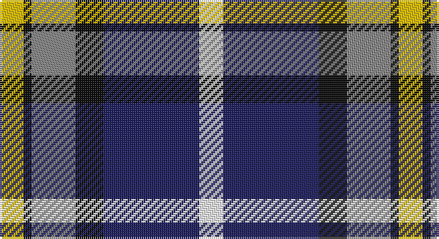

This page is one **sett** — a single exact thread-count. It belongs to the [tartan](/setts/w6db24k7o11k2ly6/)
(the same proportion at any scale), whose colour order is pattern [WBKRKY](/stripes/wbkrky/).

Part of the [Clunie](/tartans/clunie/) tartan — the named design grouping this sett with its other cloths.

Sourced from tartans-authority.  It is a [6 stripe tartan](/stripes/stripes6/).

Original link http://www.tartansauthority.com/tartan-ferret/display/6708/

## Provenance

Earliest known date: 2005 Designed by David McGill of International Tartans for a John and Ben Clunie from Aberdeen and Edinburgh respectively but it can be worn by all of the name. The colours are from the Clunie coat of arms.

2 attestations — the source records this cloth was collapsed from (oldest owns this page)

<ul>
<li>pre 2005 — Clunie (Name) (tartans-authority, <a href="http://www.tartansauthority.com/tartan-ferret/display/6708/">record</a>)</li>
<li>undated — Clunie Name Tartan (house-of-tartan, <a href="http://www.house-of-tartan.scotland.net/house/TartanViewjs.asp?colr=Def&tnam=6708">record</a>)</li>
</ul>

## Register references

External register numbers recorded for this tartan.

- Scottish Tartans Authority (ITI): 6708

## Thread count
Y/12 K4 N22 K14 DB48 W/12

One full sett is **200 threads**.

## Palette

Palette: <strong>Tartan Register</strong>
<table><thead><tr><th>Colour</th><th>Threads</th><th>Shade</th><th>Base</th><th>OKLCh</th></tr></thead><tbody><tr><td>Y/</td><td style="text-align:right;font-variant-numeric:tabular-nums">12</td><td><code style="background-color:#E8C000;">#E8C000</code> <small style="color:#888">#E8C000</small></td><td>Y <code style="background-color:#F2BF00;">#F2BF00</code></td><td><small style="color:#888">oklch(81.9% 0.168 93.7)</small></td></tr><tr><td>K</td><td style="text-align:right;font-variant-numeric:tabular-nums">4</td><td><code style="background-color:#101010;">#101010</code> <small style="color:#888">#101010</small></td><td>K <code style="background-color:#000000;">#000000</code></td><td><small style="color:#888">oklch(17.3% 0.000 89.9)</small></td></tr><tr><td>N</td><td style="text-align:right;font-variant-numeric:tabular-nums">22</td><td><code style="background-color:#888888;">#888888</code> <small style="color:#888">#888888</small></td><td>R <code style="background-color:#CC0000;">#CC0000</code></td><td><small style="color:#888">oklch(62.7% 0.000 89.9)</small></td></tr><tr><td>K</td><td style="text-align:right;font-variant-numeric:tabular-nums">14</td><td><code style="background-color:#101010;">#101010</code> <small style="color:#888">#101010</small></td><td>K <code style="background-color:#000000;">#000000</code></td><td><small style="color:#888">oklch(17.3% 0.000 89.9)</small></td></tr><tr><td>DB</td><td style="text-align:right;font-variant-numeric:tabular-nums">48</td><td><code style="background-color:#202060;">#202060</code> <small style="color:#888">#202060</small></td><td>B <code style="background-color:#2A418A;">#2A418A</code></td><td><small style="color:#888">oklch(28.9% 0.111 276.9)</small></td></tr><tr><td>W/</td><td style="text-align:right;font-variant-numeric:tabular-nums">12</td><td><code style="background-color:#F8F8F8;">#F8F8F8</code> <small style="color:#888">#F8F8F8</small></td><td>W <code style="background-color:#F7F7F7;">#F7F7F7</code></td><td><small style="color:#888">oklch(97.9% 0.000 89.9)</small></td></tr></tbody></table>

# Sample pattern

## Compared to the master

This cloth is one sett of its design; the master sett (the exemplar the design is anchored on) is below for comparison.

<figure style="margin:0"><figcaption style="color:#888;font-size:smaller">this sett</figcaption></figure>
<figure style="margin:0"><figcaption style="color:#888;font-size:smaller"><a href="/setts/w12db48k13o22k3ly6/">master sett →</a></figcaption></figure>

## Nearest tartans

The nearest existing variants by ΔTartan distance, with this tartan at the top so the swatches line up against it.

ΔTartan

Tartan

Sett

—

<a href="/ttd/edit/#slug=w6db24k7o11k2ly6~x2">Clunie (Name)</a> <a class="nn-out" href="/variants/s6/w6db24k7o11k2ly6~x2/" title="open its dictionary page">↗</a>

0.66

<a href="/ttd/edit/#slug=r4t28k6w12k12ly3~x2&amp;base=w6db24k7o11k2ly6~x2">MacTavish / Thom(p)son, dress</a> <a class="nn-out" href="/variants/s6/r4t28k6w12k12ly3~x2/" title="open its dictionary page">↗</a>

0.73

<a href="/ttd/edit/#slug=w12db48k13o22k3ly6&amp;base=w6db24k7o11k2ly6~x2">Clunie (Personal)</a> <a class="nn-out" href="/variants/s6/w12db48k13o22k3ly6/" title="open its dictionary page">↗</a>

0.80

<a href="/ttd/edit/#slug=db49ly12r12ly12dg32w8db3&amp;base=w6db24k7o11k2ly6~x2">Kuznetsov (2014)</a> <a class="nn-out" href="/variants/s7/db49ly12r12ly12dg32w8db3/" title="open its dictionary page">↗</a>

0.88

<a href="/ttd/edit/#slug=r1b10k2w4k4ly1~x6&amp;base=w6db24k7o11k2ly6~x2">Thomson Dress (Blue)</a> <a class="nn-out" href="/variants/s6/r1b10k2w4k4ly1~x6/" title="open its dictionary page">↗</a>

0.88

<a href="/ttd/edit/#slug=r4t28k6lb12k12lo3~x2&amp;base=w6db24k7o11k2ly6~x2">MacTavish Dress</a> <a class="nn-out" href="/variants/s6/r4t28k6lb12k12lo3~x2/" title="open its dictionary page">↗</a>

0.90

<a href="/ttd/edit/#slug=y10k1db13k3lb9lo3~x2&amp;base=w6db24k7o11k2ly6~x2">Inverary</a> <a class="nn-out" href="/variants/s6/y10k1db13k3lb9lo3~x2/" title="open its dictionary page">↗</a>

0.99

<a href="/ttd/edit/#slug=r15t98db72ly25db8w15&amp;base=w6db24k7o11k2ly6~x2">Afternoon Tea / Earl Grey</a> <a class="nn-out" href="/variants/s6/r15t98db72ly25db8w15/" title="open its dictionary page">↗</a>

1.04

<a href="/ttd/edit/#slug=w15y98db72r25db8ly15&amp;base=w6db24k7o11k2ly6~x2">Afternoon Tea / Darjeeling</a> <a class="nn-out" href="/variants/s6/w15y98db72r25db8ly15/" title="open its dictionary page">↗</a>

1.05

<a href="/ttd/edit/#slug=ly2k2dbi14db4k5r2ly5r1~x4&amp;base=w6db24k7o11k2ly6~x2">Lovell (2014)</a> <a class="nn-out" href="/variants/s8/ly2k2dbi14db4k5r2ly5r1~x4/" title="open its dictionary page">↗</a>

1.08

<a href="/ttd/edit/#slug=r5w2db20ly2k16w18k2w5~x2&amp;base=w6db24k7o11k2ly6~x2">Ailsa, Craig</a> <a class="nn-out" href="/variants/s8/r5w2db20ly2k16w18k2w5~x2/" title="open its dictionary page">↗</a>

## Neighbour map

Every grey dot is one of 14360 variants placed by the first two principal components of the ΔTartan feature space (44% of its variance). Red is this tartan; blue dots are its nearest — click one to open its page.

<svg viewBox="0 0 640 380" role="img" style="max-width:100%;height:auto;border:1px solid #e0e0e0;border-radius:4px;display:block" xmlns="http://www.w3.org/2000/svg"><image href="/nn/cloud.v1.png" width="640" height="380"/><a href="/variants/s6/r4t28k6w12k12ly3~x2/"><circle cx="147.7" cy="179.0" r="4" fill="#3465a4"><title>MacTavish / Thom(p)son, dress</title></circle></a><a href="/variants/s6/w12db48k13o22k3ly6/"><circle cx="197.0" cy="161.4" r="4" fill="#3465a4"><title>Clunie (Personal)</title></circle></a><a href="/variants/s7/db49ly12r12ly12dg32w8db3/"><circle cx="156.5" cy="153.3" r="4" fill="#3465a4"><title>Kuznetsov (2014)</title></circle></a><a href="/variants/s6/r1b10k2w4k4ly1~x6/"><circle cx="179.4" cy="179.2" r="4" fill="#3465a4"><title>Thomson Dress (Blue)</title></circle></a><a href="/variants/s6/r4t28k6lb12k12lo3~x2/"><circle cx="167.8" cy="188.3" r="4" fill="#3465a4"><title>MacTavish Dress</title></circle></a><a href="/variants/s6/y10k1db13k3lb9lo3~x2/"><circle cx="117.1" cy="185.8" r="4" fill="#3465a4"><title>Inverary</title></circle></a><a href="/variants/s6/r15t98db72ly25db8w15/"><circle cx="185.4" cy="169.2" r="4" fill="#3465a4"><title>Afternoon Tea / Earl Grey</title></circle></a><a href="/variants/s6/w15y98db72r25db8ly15/"><circle cx="202.7" cy="181.2" r="4" fill="#3465a4"><title>Afternoon Tea / Darjeeling</title></circle></a><a href="/variants/s8/ly2k2dbi14db4k5r2ly5r1~x4/"><circle cx="165.7" cy="153.9" r="4" fill="#3465a4"><title>Lovell (2014)</title></circle></a><a href="/variants/s8/r5w2db20ly2k16w18k2w5~x2/"><circle cx="116.3" cy="155.2" r="4" fill="#3465a4"><title>Ailsa, Craig</title></circle></a><circle cx="154.2" cy="177.4" r="5" fill="#c00000"/></svg>

ID: /variants/s6/w6db24k7o11k2ly6~x2/
