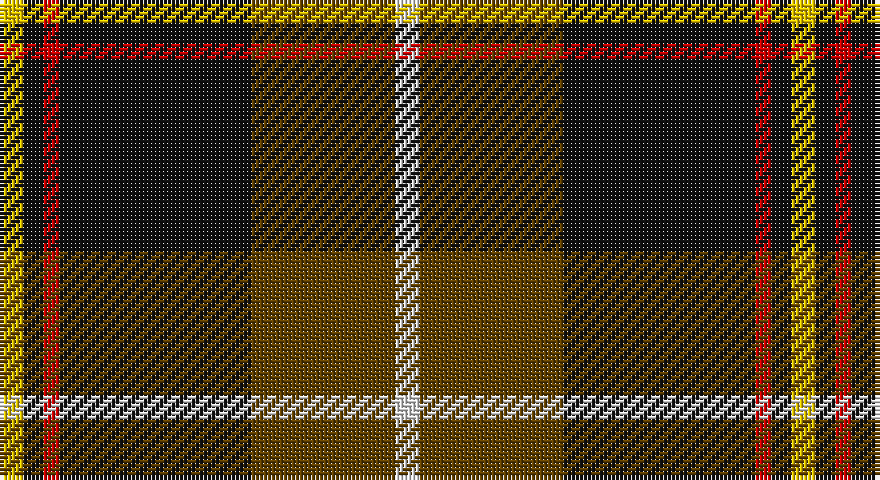

This page is one **sett** — a single exact thread-count. It belongs to the [tartan](/setts/w6dy36k48r4k5ly6/)
(the same proportion at any scale), whose colour order is pattern [WGKRKY](/stripes/wgkrky/).

Part of the [Drambuie Dress](/tartans/drambuie-dress/) tartan — the named design grouping this sett with its other cloths.

Sourced from register-of-tartans.  It is a [6 stripe tartan](/stripes/stripes6/).

Original link https://www.tartanregister.gov.uk/tartanDetails.aspx?ref=973

## Also known as

This cloth is also recorded under:

- Drambuie dress

2 attestations — the source records this cloth was collapsed from (oldest owns this page)

<ul>
<li>01/07/1998 — Drambuie Dress (register-of-tartans, <a href="https://www.tartanregister.gov.uk/tartanDetails.aspx?ref=973">record</a>)</li>
<li>pre 1998 — Drambuie Dress (Corporate) (tartans-authority, <a href="http://www.tartansauthority.com/tartan-ferret/display/2485/">record</a>)</li>
</ul>

## Register references

External register numbers recorded for this tartan.

- Scottish Register of Tartans: [973](https://www.tartanregister.gov.uk/tartanDetails.aspx?ref=973)
- Scottish Tartans Authority (ITI): 2485
- Scottish Tartans World Register: 2485

## Thread count
Y/6 K5 R4 K48 T36 LN/6

One full sett is **198 threads**.

## Palette

Palette: <strong>Tartan Register</strong>
<table><thead><tr><th>Colour</th><th>Threads</th><th>Shade</th><th>Base</th><th>OKLCh</th></tr></thead><tbody><tr><td>Y/</td><td style="text-align:right;font-variant-numeric:tabular-nums">6</td><td><code style="background-color:#E8C000;">#E8C000</code> <small style="color:#888">#E8C000</small></td><td>Y <code style="background-color:#F2BF00;">#F2BF00</code></td><td><small style="color:#888">oklch(81.9% 0.168 93.7)</small></td></tr><tr><td>K</td><td style="text-align:right;font-variant-numeric:tabular-nums">5</td><td><code style="background-color:#101010;">#101010</code> <small style="color:#888">#101010</small></td><td>K <code style="background-color:#000000;">#000000</code></td><td><small style="color:#888">oklch(17.3% 0.000 89.9)</small></td></tr><tr><td>R</td><td style="text-align:right;font-variant-numeric:tabular-nums">4</td><td><code style="background-color:#C80000;">#C80000</code> <small style="color:#888">#C80000</small></td><td>R <code style="background-color:#CC0000;">#CC0000</code></td><td><small style="color:#888">oklch(52.3% 0.215 29.2)</small></td></tr><tr><td>K</td><td style="text-align:right;font-variant-numeric:tabular-nums">48</td><td><code style="background-color:#101010;">#101010</code> <small style="color:#888">#101010</small></td><td>K <code style="background-color:#000000;">#000000</code></td><td><small style="color:#888">oklch(17.3% 0.000 89.9)</small></td></tr><tr><td>T</td><td style="text-align:right;font-variant-numeric:tabular-nums">36</td><td><code style="background-color:#604000;">#604000</code> <small style="color:#888">#604000</small></td><td>G <code style="background-color:#006100;">#006100</code></td><td><small style="color:#888">oklch(39.8% 0.083 76.8)</small></td></tr><tr><td>LN/</td><td style="text-align:right;font-variant-numeric:tabular-nums">6</td><td><code style="background-color:#E0E0E0;">#E0E0E0</code> <small style="color:#888">#E0E0E0</small></td><td>W <code style="background-color:#F7F7F7;">#F7F7F7</code></td><td><small style="color:#888">oklch(90.7% 0.000 89.9)</small></td></tr></tbody></table>

# Sample pattern

## Nearest tartans

The nearest existing variants by ΔTartan distance, with this tartan at the top so the swatches line up against it.

ΔTartan

Tartan

Sett

—

<a href="/ttd/edit/#slug=w6dy36k48r4k5ly6">Drambuie Dress</a> <a class="nn-out" href="/variants/s6/w6dy36k48r4k5ly6/" title="open its dictionary page">↗</a>

0.78

<a href="/ttd/edit/#slug=w6r36k48lo4k5ly6&amp;base=w6dy36k48r4k5ly6">Drambuie</a> <a class="nn-out" href="/variants/s6/w6r36k48lo4k5ly6/" title="open its dictionary page">↗</a>

1.01

<a href="/ttd/edit/#slug=k17dg48ly4r10lb12dg4&amp;base=w6dy36k48r4k5ly6">Asheville Firefighters, The</a> <a class="nn-out" href="/variants/s6/k17dg48ly4r10lb12dg4/" title="open its dictionary page">↗</a>

1.02

<a href="/ttd/edit/#slug=n6dp4n2w2n25k26ly4~x2&amp;base=w6dy36k48r4k5ly6">New York State Troopers</a> <a class="nn-out" href="/variants/s7/n6dp4n2w2n25k26ly4~x2/" title="open its dictionary page">↗</a>

1.04

<a href="/ttd/edit/#slug=w6o36k48r4k5ly6&amp;base=w6dy36k48r4k5ly6">Drambuie dress</a> <a class="nn-out" href="/variants/s6/w6o36k48r4k5ly6/" title="open its dictionary page">↗</a>

1.08

<a href="/ttd/edit/#slug=dy30ly5t10k10w2k2~x2&amp;base=w6dy36k48r4k5ly6">Bryan Wedding (Personal)</a> <a class="nn-out" href="/variants/s6/dy30ly5t10k10w2k2~x2/" title="open its dictionary page">↗</a>

1.08

<a href="/ttd/edit/#slug=k3dy3lo6k12lo1o2dy2~x4&amp;base=w6dy36k48r4k5ly6">Strummer, Joe (Commemorative)</a> <a class="nn-out" href="/variants/s7/k3dy3lo6k12lo1o2dy2~x4/" title="open its dictionary page">↗</a>

1.11

<a href="/ttd/edit/#slug=g3ly5r14k36w3~x2&amp;base=w6dy36k48r4k5ly6">Papua New Guinea</a> <a class="nn-out" href="/variants/s5/g3ly5r14k36w3~x2/" title="open its dictionary page">↗</a>

1.11

<a href="/ttd/edit/#slug=dg37k22w4r15ly3~x2&amp;base=w6dy36k48r4k5ly6">Oakley (2015)</a> <a class="nn-out" href="/variants/s5/dg37k22w4r15ly3~x2/" title="open its dictionary page">↗</a>

1.12

<a href="/ttd/edit/#slug=r6dt4w2g27dt37ly2~x2&amp;base=w6dy36k48r4k5ly6">Highlands of Durham (Corporate)</a> <a class="nn-out" href="/variants/s6/r6dt4w2g27dt37ly2~x2/" title="open its dictionary page">↗</a>

1.14

<a href="/ttd/edit/#slug=lo6k5r4k48dy36loi6&amp;base=w6dy36k48r4k5ly6">Drambuie Hunting</a> <a class="nn-out" href="/variants/s6/lo6k5r4k48dy36loi6/" title="open its dictionary page">↗</a>

## Neighbour map

Every grey dot is one of 14360 variants placed by the first two principal components of the ΔTartan feature space (44% of its variance). Red is this tartan; blue dots are its nearest — click one to open its page.

<svg viewBox="0 0 640 380" role="img" style="max-width:100%;height:auto;border:1px solid #e0e0e0;border-radius:4px;display:block" xmlns="http://www.w3.org/2000/svg"><image href="/nn/cloud.v1.png" width="640" height="380"/><a href="/variants/s6/w6r36k48lo4k5ly6/"><circle cx="265.6" cy="167.5" r="4" fill="#3465a4"><title>Drambuie</title></circle></a><a href="/variants/s6/k17dg48ly4r10lb12dg4/"><circle cx="261.5" cy="178.8" r="4" fill="#3465a4"><title>Asheville Firefighters, The</title></circle></a><a href="/variants/s7/n6dp4n2w2n25k26ly4~x2/"><circle cx="257.6" cy="167.8" r="4" fill="#3465a4"><title>New York State Troopers</title></circle></a><a href="/variants/s6/w6o36k48r4k5ly6/"><circle cx="242.2" cy="164.3" r="4" fill="#3465a4"><title>Drambuie dress</title></circle></a><a href="/variants/s6/dy30ly5t10k10w2k2~x2/"><circle cx="251.9" cy="162.2" r="4" fill="#3465a4"><title>Bryan Wedding (Personal)</title></circle></a><a href="/variants/s7/k3dy3lo6k12lo1o2dy2~x4/"><circle cx="264.1" cy="194.4" r="4" fill="#3465a4"><title>Strummer, Joe (Commemorative)</title></circle></a><a href="/variants/s5/g3ly5r14k36w3~x2/"><circle cx="298.1" cy="170.2" r="4" fill="#3465a4"><title>Papua New Guinea</title></circle></a><a href="/variants/s5/dg37k22w4r15ly3~x2/"><circle cx="213.1" cy="198.1" r="4" fill="#3465a4"><title>Oakley (2015)</title></circle></a><a href="/variants/s6/r6dt4w2g27dt37ly2~x2/"><circle cx="301.0" cy="159.8" r="4" fill="#3465a4"><title>Highlands of Durham (Corporate)</title></circle></a><a href="/variants/s6/lo6k5r4k48dy36loi6/"><circle cx="300.3" cy="190.7" r="4" fill="#3465a4"><title>Drambuie Hunting</title></circle></a><circle cx="266.3" cy="174.6" r="5" fill="#c00000"/></svg>

ID: /variants/s6/w6dy36k48r4k5ly6/
