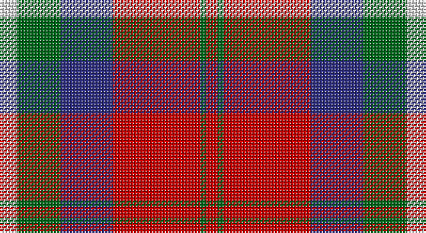

This page is one **sett** — a single exact thread-count. It belongs to the [tartan](/setts/w6g15db18r30g2r4/)
(the same proportion at any scale), whose colour order is pattern [RGRBGW](/stripes/rgrbgw/).

Part of the [Ruthven](/tartans/ruthven/) tartan — the named design grouping this sett with its other cloths.

Sourced from register-of-tartans.  It is a [6 stripe tartan](/stripes/stripes6/).

Original link https://www.tartanregister.gov.uk/tartanDetails.aspx?ref=3622

2 attestations — the source records this cloth was collapsed from (oldest owns this page)

<ul>
<li>01/01/1842 — Ruthven (V.S.) (register-of-tartans, <a href="https://www.tartanregister.gov.uk/tartanDetails.aspx?ref=3622">record</a>)</li>
<li>1842 — Ruthven (V.S.) (Name) (tartans-authority, <a href="http://www.tartansauthority.com/tartan-ferret/display/1521/">record</a>)</li>
</ul>

## Register references

External register numbers recorded for this tartan.

- Scottish Register of Tartans: [3622](https://www.tartanregister.gov.uk/tartanDetails.aspx?ref=3622)
- Scottish Tartans Authority (ITI): 1521
- Scottish Tartans World Register: 1521

## Thread count
LN/12 G30 DB36 R60 G4 R/8

One full sett is **280 threads**.

## Palette

Palette: <strong>Tartan Register</strong>
<table><thead><tr><th>Colour</th><th>Threads</th><th>Shade</th><th>Base</th><th>OKLCh</th></tr></thead><tbody><tr><td>LN/</td><td style="text-align:right;font-variant-numeric:tabular-nums">12</td><td><code style="background-color:#E0E0E0;">#E0E0E0</code> <small style="color:#888">#E0E0E0</small></td><td>W <code style="background-color:#F7F7F7;">#F7F7F7</code></td><td><small style="color:#888">oklch(90.7% 0.000 89.9)</small></td></tr><tr><td>G</td><td style="text-align:right;font-variant-numeric:tabular-nums">30</td><td><code style="background-color:#006818;">#006818</code> <small style="color:#888">#006818</small></td><td>G <code style="background-color:#006100;">#006100</code></td><td><small style="color:#888">oklch(45.0% 0.142 145.0)</small></td></tr><tr><td>DB</td><td style="text-align:right;font-variant-numeric:tabular-nums">36</td><td><code style="background-color:#2C2C80;">#2C2C80</code> <small style="color:#888">#2C2C80</small></td><td>B <code style="background-color:#2A418A;">#2A418A</code></td><td><small style="color:#888">oklch(35.0% 0.138 276.6)</small></td></tr><tr><td>R</td><td style="text-align:right;font-variant-numeric:tabular-nums">60</td><td><code style="background-color:#C80000;">#C80000</code> <small style="color:#888">#C80000</small></td><td>R <code style="background-color:#CC0000;">#CC0000</code></td><td><small style="color:#888">oklch(52.3% 0.215 29.2)</small></td></tr><tr><td>G</td><td style="text-align:right;font-variant-numeric:tabular-nums">4</td><td><code style="background-color:#006818;">#006818</code> <small style="color:#888">#006818</small></td><td>G <code style="background-color:#006100;">#006100</code></td><td><small style="color:#888">oklch(45.0% 0.142 145.0)</small></td></tr><tr><td>R/</td><td style="text-align:right;font-variant-numeric:tabular-nums">8</td><td><code style="background-color:#C80000;">#C80000</code> <small style="color:#888">#C80000</small></td><td>R <code style="background-color:#CC0000;">#CC0000</code></td><td><small style="color:#888">oklch(52.3% 0.215 29.2)</small></td></tr></tbody></table>

# Sample pattern

## Nearest tartans

The nearest existing variants by ΔTartan distance, with this tartan at the top so the swatches line up against it.

ΔTartan

Tartan

Sett

—

<a href="/ttd/edit/#slug=w6g15db18r30g2r4~x2">Ruthven (V.S.)</a> <a class="nn-out" href="/variants/s6/w6g15db18r30g2r4~x2/" title="open its dictionary page">↗</a>

0.62

<a href="/ttd/edit/#slug=t2r12db2t6k6t1~x2&amp;base=w6g15db18r30g2r4~x2">MacTavish Thomson Clan Tartan</a> <a class="nn-out" href="/variants/s6/t2r12db2t6k6t1~x2/" title="open its dictionary page">↗</a>

0.67

<a href="/ttd/edit/#slug=t2r12db2t6k6t1~x4&amp;base=w6g15db18r30g2r4~x2">Thompson/Thomson/MacTavish</a> <a class="nn-out" href="/variants/s6/t2r12db2t6k6t1~x4/" title="open its dictionary page">↗</a>

0.85

<a href="/ttd/edit/#slug=db8r8dg17w3r35db10dg15w3~x2&amp;base=w6g15db18r30g2r4~x2">James of Glencarr (Personal)</a> <a class="nn-out" href="/variants/s8/db8r8dg17w3r35db10dg15w3~x2/" title="open its dictionary page">↗</a>

0.85

<a href="/ttd/edit/#slug=k2r12db6r3dg12r4db1~x2&amp;base=w6g15db18r30g2r4~x2">MacBean/MacElvain</a> <a class="nn-out" href="/variants/s7/k2r12db6r3dg12r4db1~x2/" title="open its dictionary page">↗</a>

0.86

<a href="/ttd/edit/#slug=dp1r5g15r3dp9r10w1~x4&amp;base=w6g15db18r30g2r4~x2">Geddes</a> <a class="nn-out" href="/variants/s7/dp1r5g15r3dp9r10w1~x4/" title="open its dictionary page">↗</a>

0.89

<a href="/ttd/edit/#slug=k3y28k3r22k8w3~x2&amp;base=w6g15db18r30g2r4~x2">Henkel (Corporate)</a> <a class="nn-out" href="/variants/s6/k3y28k3r22k8w3~x2/" title="open its dictionary page">↗</a>

0.90

<a href="/ttd/edit/#slug=r6dg16r4db12r16lb1r2~x2&amp;base=w6g15db18r30g2r4~x2">MacQuarrie LO</a> <a class="nn-out" href="/variants/s7/r6dg16r4db12r16lb1r2~x2/" title="open its dictionary page">↗</a>

0.92

<a href="/ttd/edit/#slug=db1r5dg18r4db9r10w1~x4&amp;base=w6g15db18r30g2r4~x2">MacKintosh Geddes</a> <a class="nn-out" href="/variants/s7/db1r5dg18r4db9r10w1~x4/" title="open its dictionary page">↗</a>

0.92

<a href="/ttd/edit/#slug=r6dg16r4db12r16t1r2~x2&amp;base=w6g15db18r30g2r4~x2">MacQuarrie #6</a> <a class="nn-out" href="/variants/s7/r6dg16r4db12r16t1r2~x2/" title="open its dictionary page">↗</a>

0.94

<a href="/ttd/edit/#slug=p9r4p1r4g15ri4p1~x2&amp;base=w6g15db18r30g2r4~x2">Logan, Light</a> <a class="nn-out" href="/variants/s7/p9r4p1r4g15ri4p1~x2/" title="open its dictionary page">↗</a>

## Neighbour map

Every grey dot is one of 14360 variants placed by the first two principal components of the ΔTartan feature space (44% of its variance). Red is this tartan; blue dots are its nearest — click one to open its page.

<svg viewBox="0 0 640 380" role="img" style="max-width:100%;height:auto;border:1px solid #e0e0e0;border-radius:4px;display:block" xmlns="http://www.w3.org/2000/svg"><image href="/nn/cloud.v1.png" width="640" height="380"/><a href="/variants/s6/t2r12db2t6k6t1~x2/"><circle cx="220.0" cy="195.5" r="4" fill="#3465a4"><title>MacTavish Thomson Clan Tartan</title></circle></a><a href="/variants/s6/t2r12db2t6k6t1~x4/"><circle cx="215.9" cy="193.1" r="4" fill="#3465a4"><title>Thompson/Thomson/MacTavish</title></circle></a><a href="/variants/s8/db8r8dg17w3r35db10dg15w3~x2/"><circle cx="227.4" cy="186.0" r="4" fill="#3465a4"><title>James of Glencarr (Personal)</title></circle></a><a href="/variants/s7/k2r12db6r3dg12r4db1~x2/"><circle cx="259.2" cy="199.0" r="4" fill="#3465a4"><title>MacBean/MacElvain</title></circle></a><a href="/variants/s7/dp1r5g15r3dp9r10w1~x4/"><circle cx="242.8" cy="188.1" r="4" fill="#3465a4"><title>Geddes</title></circle></a><a href="/variants/s6/k3y28k3r22k8w3~x2/"><circle cx="222.1" cy="190.4" r="4" fill="#3465a4"><title>Henkel (Corporate)</title></circle></a><a href="/variants/s7/r6dg16r4db12r16lb1r2~x2/"><circle cx="267.5" cy="187.0" r="4" fill="#3465a4"><title>MacQuarrie LO</title></circle></a><a href="/variants/s7/db1r5dg18r4db9r10w1~x4/"><circle cx="249.2" cy="180.7" r="4" fill="#3465a4"><title>MacKintosh Geddes</title></circle></a><a href="/variants/s7/r6dg16r4db12r16t1r2~x2/"><circle cx="284.4" cy="191.1" r="4" fill="#3465a4"><title>MacQuarrie #6</title></circle></a><a href="/variants/s7/p9r4p1r4g15ri4p1~x2/"><circle cx="218.0" cy="174.3" r="4" fill="#3465a4"><title>Logan, Light</title></circle></a><circle cx="241.1" cy="185.6" r="5" fill="#c00000"/></svg>

ID: /variants/s6/w6g15db18r30g2r4~x2/
