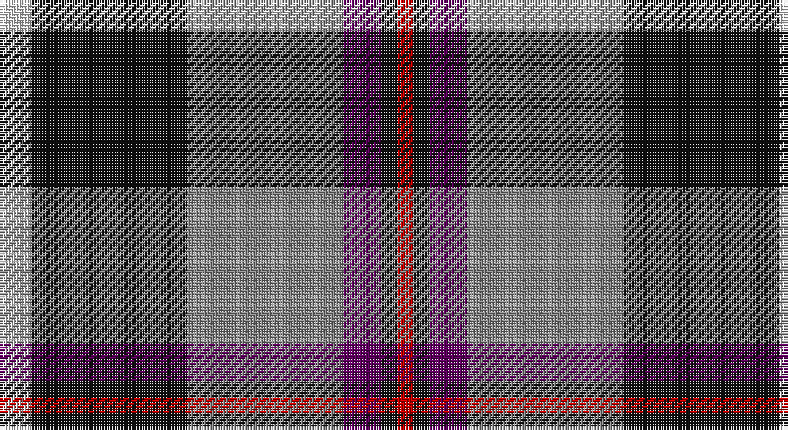

This page is one **sett** — a single exact thread-count. It belongs to the [tartan](/setts/w6k29o29dp7k3r3/)
(the same proportion at any scale), whose colour order is pattern [RKBRKW](/stripes/rkbrkw/).

Sourced from tartans-authority.  It is a [6 stripe tartan](/stripes/stripes6/).

Original link http://www.tartansauthority.com/tartan-ferret/display/7478/

2 attestations — the source records this cloth was collapsed from (oldest owns this page)

<ul>
<li>June 2007 — Jewell of Kernow (Personal) (tartans-authority, <a href="http://www.tartansauthority.com/tartan-ferret/display/7478/">record</a>)</li>
<li>undated — Jewell of Kernow (Personal) (register-of-tartans, <a href="https://www.tartanregister.gov.uk/tartanDetails.aspx?ref=5520">record</a>)</li>
</ul>

## Register references

External register numbers recorded for this tartan.

- Scottish Register of Tartans: [5520](https://www.tartanregister.gov.uk/tartanDetails.aspx?ref=5520)
- Scottish Tartans Authority (ITI): 7478

## Thread count
LN/12 K58 N58 P14 K6 R/6

One full sett is **290 threads**.

## Palette

Palette: <strong>Tartan Register</strong> <small style="color:#888">(4 of 5 colours)</small>
<table><thead><tr><th>Colour</th><th>Threads</th><th>Shade</th><th>Base</th><th>OKLCh</th></tr></thead><tbody><tr><td>LN/</td><td style="text-align:right;font-variant-numeric:tabular-nums">12</td><td><code style="background-color:#E0E0E0;">#E0E0E0</code> <small style="color:#888">#E0E0E0</small></td><td>W <code style="background-color:#F7F7F7;">#F7F7F7</code></td><td><small style="color:#888">oklch(90.7% 0.000 89.9)</small></td></tr><tr><td>K</td><td style="text-align:right;font-variant-numeric:tabular-nums">58</td><td><code style="background-color:#101010;">#101010</code> <small style="color:#888">#101010</small></td><td>K <code style="background-color:#000000;">#000000</code></td><td><small style="color:#888">oklch(17.3% 0.000 89.9)</small></td></tr><tr><td>N</td><td style="text-align:right;font-variant-numeric:tabular-nums">58</td><td><code style="background-color:#888888;">#888888</code> <small style="color:#888">#888888</small></td><td>R <code style="background-color:#CC0000;">#CC0000</code></td><td><small style="color:#888">oklch(62.7% 0.000 89.9)</small></td></tr><tr><td>P</td><td style="text-align:right;font-variant-numeric:tabular-nums">14</td><td><code style="background-color:#600060;">#600060</code> <small style="color:#888">#600060</small></td><td>B <code style="background-color:#2A418A;">#2A418A</code></td><td><small style="color:#888">oklch(34.3% 0.158 328.4)</small></td></tr><tr><td>K</td><td style="text-align:right;font-variant-numeric:tabular-nums">6</td><td><code style="background-color:#101010;">#101010</code> <small style="color:#888">#101010</small></td><td>K <code style="background-color:#000000;">#000000</code></td><td><small style="color:#888">oklch(17.3% 0.000 89.9)</small></td></tr><tr><td>R/</td><td style="text-align:right;font-variant-numeric:tabular-nums">6</td><td><code style="background-color:#C80000;">#C80000</code> <small style="color:#888">#C80000</small></td><td>R <code style="background-color:#CC0000;">#CC0000</code></td><td><small style="color:#888">oklch(52.3% 0.215 29.2)</small></td></tr></tbody></table>

# Sample pattern

## Nearest tartans

The nearest existing variants by ΔTartan distance, with this tartan at the top so the swatches line up against it.

ΔTartan

Tartan

Sett

—

<a href="/ttd/edit/#slug=w6k29o29dp7k3r3~x2">Jewell of Kernow (Personal)</a> <a class="nn-out" href="/variants/s6/w6k29o29dp7k3r3~x2/" title="open its dictionary page">↗</a>

0.68

<a href="/ttd/edit/#slug=r12db3g5dbi16ly2g2~x2&amp;base=w6k29o29dp7k3r3~x2">Dunbog, Primary School</a> <a class="nn-out" href="/variants/s6/r12db3g5dbi16ly2g2~x2/" title="open its dictionary page">↗</a>

0.83

<a href="/ttd/edit/#slug=p19w2g12t3k4~x2&amp;base=w6k29o29dp7k3r3~x2">Wilson's, No 111</a> <a class="nn-out" href="/variants/s5/p19w2g12t3k4~x2/" title="open its dictionary page">↗</a>

0.86

<a href="/ttd/edit/#slug=w15y98db72r25db8ly15&amp;base=w6k29o29dp7k3r3~x2">Afternoon Tea / Darjeeling</a> <a class="nn-out" href="/variants/s6/w15y98db72r25db8ly15/" title="open its dictionary page">↗</a>

0.90

<a href="/ttd/edit/#slug=k2t1p6g6r1g1~x4&amp;base=w6k29o29dp7k3r3~x2">Wilson's, No 183</a> <a class="nn-out" href="/variants/s6/k2t1p6g6r1g1~x4/" title="open its dictionary page">↗</a>

0.94

<a href="/ttd/edit/#slug=o6dp4o2w2o24k25lo4~x2&amp;base=w6k29o29dp7k3r3~x2">New York State Troopers (Corporate)</a> <a class="nn-out" href="/variants/s7/o6dp4o2w2o24k25lo4~x2/" title="open its dictionary page">↗</a>

0.95

<a href="/ttd/edit/#slug=k7t3o30dt30w3~x2&amp;base=w6k29o29dp7k3r3~x2">Douglas, brown</a> <a class="nn-out" href="/variants/s5/k7t3o30dt30w3~x2/" title="open its dictionary page">↗</a>

0.97

<a href="/ttd/edit/#slug=m15dt8y25dt72n98w15&amp;base=w6k29o29dp7k3r3~x2">Afternoon Tea / Black Tea</a> <a class="nn-out" href="/variants/s6/m15dt8y25dt72n98w15/" title="open its dictionary page">↗</a>

0.99

<a href="/ttd/edit/#slug=m3k17n11m2o20w2~x2&amp;base=w6k29o29dp7k3r3~x2">Commonwealth Games Council (Corp.)</a> <a class="nn-out" href="/variants/s6/m3k17n11m2o20w2~x2/" title="open its dictionary page">↗</a>

0.99

<a href="/ttd/edit/#slug=dg7dp3w1g2dg1r2dp1~x8&amp;base=w6k29o29dp7k3r3~x2">Lindley-Highfield (Name)</a> <a class="nn-out" href="/variants/s7/dg7dp3w1g2dg1r2dp1~x8/" title="open its dictionary page">↗</a>

1.00

<a href="/ttd/edit/#slug=lb5k26ly4lb24dp8k3r4~x2&amp;base=w6k29o29dp7k3r3~x2">Pengelly, The Cornish (Name)</a> <a class="nn-out" href="/variants/s7/lb5k26ly4lb24dp8k3r4~x2/" title="open its dictionary page">↗</a>

## Neighbour map

Every grey dot is one of 14360 variants placed by the first two principal components of the ΔTartan feature space (44% of its variance). Red is this tartan; blue dots are its nearest — click one to open its page.

<svg viewBox="0 0 640 380" role="img" style="max-width:100%;height:auto;border:1px solid #e0e0e0;border-radius:4px;display:block" xmlns="http://www.w3.org/2000/svg"><image href="/nn/cloud.v1.png" width="640" height="380"/><a href="/variants/s6/r12db3g5dbi16ly2g2~x2/"><circle cx="159.6" cy="194.4" r="4" fill="#3465a4"><title>Dunbog, Primary School</title></circle></a><a href="/variants/s5/p19w2g12t3k4~x2/"><circle cx="208.2" cy="192.3" r="4" fill="#3465a4"><title>Wilson's, No 111</title></circle></a><a href="/variants/s6/w15y98db72r25db8ly15/"><circle cx="202.7" cy="181.2" r="4" fill="#3465a4"><title>Afternoon Tea / Darjeeling</title></circle></a><a href="/variants/s6/k2t1p6g6r1g1~x4/"><circle cx="161.0" cy="206.6" r="4" fill="#3465a4"><title>Wilson's, No 183</title></circle></a><a href="/variants/s7/o6dp4o2w2o24k25lo4~x2/"><circle cx="241.7" cy="159.1" r="4" fill="#3465a4"><title>New York State Troopers (Corporate)</title></circle></a><a href="/variants/s5/k7t3o30dt30w3~x2/"><circle cx="216.1" cy="202.7" r="4" fill="#3465a4"><title>Douglas, brown</title></circle></a><a href="/variants/s6/m15dt8y25dt72n98w15/"><circle cx="211.2" cy="183.6" r="4" fill="#3465a4"><title>Afternoon Tea / Black Tea</title></circle></a><a href="/variants/s6/m3k17n11m2o20w2~x2/"><circle cx="159.8" cy="192.2" r="4" fill="#3465a4"><title>Commonwealth Games Council (Corp.)</title></circle></a><a href="/variants/s7/dg7dp3w1g2dg1r2dp1~x8/"><circle cx="185.0" cy="195.1" r="4" fill="#3465a4"><title>Lindley-Highfield (Name)</title></circle></a><a href="/variants/s7/lb5k26ly4lb24dp8k3r4~x2/"><circle cx="151.8" cy="163.3" r="4" fill="#3465a4"><title>Pengelly, The Cornish (Name)</title></circle></a><circle cx="188.2" cy="178.3" r="5" fill="#c00000"/></svg>

ID: /variants/s6/w6k29o29dp7k3r3~x2/
