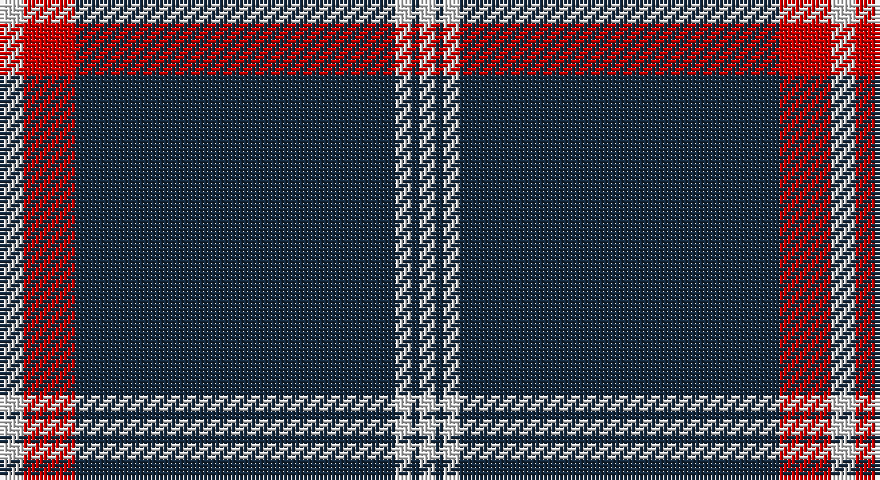

This page is one **sett** — a single exact thread-count. It belongs to the [tartan](/setts/w6r13dt80w4dt2w4/)
(the same proportion at any scale), whose colour order is pattern [WBWBRW](/stripes/wbwbrw/).

Sourced from register-of-tartans.  It is a [6 stripe tartan](/stripes/stripes6/).

Original link https://www.tartanregister.gov.uk/tartanDetails.aspx?ref=2999

2 attestations — the source records this cloth was collapsed from (oldest owns this page)

<ul>
<li>01/01/2005 — Montrose Football Club (register-of-tartans, <a href="https://www.tartanregister.gov.uk/tartanDetails.aspx?ref=2999">record</a>)</li>
<li>pre 2005 — Montrose Football Club (Sports) (tartans-authority, <a href="http://www.tartansauthority.com/tartan-ferret/display/6579/">record</a>)</li>
</ul>

## Register references

External register numbers recorded for this tartan.

- Scottish Register of Tartans: [2999](https://www.tartanregister.gov.uk/tartanDetails.aspx?ref=2999)
- Scottish Tartans Authority (ITI): 6579

## Thread count
LN/6 R13 DN80 LN4 DN2 LN/4

One full sett is **208 threads**.

## Palette

Palette: <strong>Tartan Register</strong>
<table><thead><tr><th>Colour</th><th>Threads</th><th>Shade</th><th>Base</th><th>OKLCh</th></tr></thead><tbody><tr><td>LN/</td><td style="text-align:right;font-variant-numeric:tabular-nums">6</td><td><code style="background-color:#E0E0E0;">#E0E0E0</code> <small style="color:#888">#E0E0E0</small></td><td>W <code style="background-color:#F7F7F7;">#F7F7F7</code></td><td><small style="color:#888">oklch(90.7% 0.000 89.9)</small></td></tr><tr><td>R</td><td style="text-align:right;font-variant-numeric:tabular-nums">13</td><td><code style="background-color:#C80000;">#C80000</code> <small style="color:#888">#C80000</small></td><td>R <code style="background-color:#CC0000;">#CC0000</code></td><td><small style="color:#888">oklch(52.3% 0.215 29.2)</small></td></tr><tr><td>DN</td><td style="text-align:right;font-variant-numeric:tabular-nums">80</td><td><code style="background-color:#14283C;">#14283C</code> <small style="color:#888">#14283C</small></td><td>B <code style="background-color:#2A418A;">#2A418A</code></td><td><small style="color:#888">oklch(27.1% 0.046 249.9)</small></td></tr><tr><td>LN</td><td style="text-align:right;font-variant-numeric:tabular-nums">4</td><td><code style="background-color:#E0E0E0;">#E0E0E0</code> <small style="color:#888">#E0E0E0</small></td><td>W <code style="background-color:#F7F7F7;">#F7F7F7</code></td><td><small style="color:#888">oklch(90.7% 0.000 89.9)</small></td></tr><tr><td>DN</td><td style="text-align:right;font-variant-numeric:tabular-nums">2</td><td><code style="background-color:#14283C;">#14283C</code> <small style="color:#888">#14283C</small></td><td>B <code style="background-color:#2A418A;">#2A418A</code></td><td><small style="color:#888">oklch(27.1% 0.046 249.9)</small></td></tr><tr><td>LN/</td><td style="text-align:right;font-variant-numeric:tabular-nums">4</td><td><code style="background-color:#E0E0E0;">#E0E0E0</code> <small style="color:#888">#E0E0E0</small></td><td>W <code style="background-color:#F7F7F7;">#F7F7F7</code></td><td><small style="color:#888">oklch(90.7% 0.000 89.9)</small></td></tr></tbody></table>

# Sample pattern

## Nearest tartans

The nearest existing variants by ΔTartan distance, with this tartan at the top so the swatches line up against it.

ΔTartan

Tartan

Sett

—

<a href="/ttd/edit/#slug=w6r13dt80w4dt2w4">Montrose Football Club</a> <a class="nn-out" href="/variants/s6/w6r13dt80w4dt2w4/" title="open its dictionary page">↗</a>

1.21

<a href="/ttd/edit/#slug=db67w10ly14db10w2&amp;base=w6r13dt80w4dt2w4">St. John (Corporate?)</a> <a class="nn-out" href="/variants/s5/db67w10ly14db10w2/" title="open its dictionary page">↗</a>

1.22

<a href="/ttd/edit/#slug=k38lo1w7lo1k4lo2k3lo2~x2&amp;base=w6r13dt80w4dt2w4">Erck, Georges van (Personal),</a> <a class="nn-out" href="/variants/s8/k38lo1w7lo1k4lo2k3lo2~x2/" title="open its dictionary page">↗</a>

1.28

<a href="/ttd/edit/#slug=k75lb6k5lb18k2lb2k3~x2&amp;base=w6r13dt80w4dt2w4">Bargain Booze</a> <a class="nn-out" href="/variants/s7/k75lb6k5lb18k2lb2k3~x2/" title="open its dictionary page">↗</a>

1.30

<a href="/ttd/edit/#slug=w4ly3db3ly2db3ly4db48ly4&amp;base=w6r13dt80w4dt2w4">Morris of Wales</a> <a class="nn-out" href="/variants/s8/w4ly3db3ly2db3ly4db48ly4/" title="open its dictionary page">↗</a>

1.30

<a href="/ttd/edit/#slug=k31w1k2w2dt3k2t4w2~x4&amp;base=w6r13dt80w4dt2w4">Capco</a> <a class="nn-out" href="/variants/s8/k31w1k2w2dt3k2t4w2~x4/" title="open its dictionary page">↗</a>

1.31

<a href="/ttd/edit/#slug=w6ly3db3ly2db3ly4db48ly4&amp;base=w6r13dt80w4dt2w4">Morris Welsh Name Tartan</a> <a class="nn-out" href="/variants/s8/w6ly3db3ly2db3ly4db48ly4/" title="open its dictionary page">↗</a>

1.41

<a href="/ttd/edit/#slug=k44r2w10r3k6r1w2k18~x2&amp;base=w6r13dt80w4dt2w4">Mull Rugby Club</a> <a class="nn-out" href="/variants/s8/k44r2w10r3k6r1w2k18~x2/" title="open its dictionary page">↗</a>

1.47

<a href="/ttd/edit/#slug=db39lo8r3w1~x4&amp;base=w6r13dt80w4dt2w4">Norwich University</a> <a class="nn-out" href="/variants/s4/db39lo8r3w1~x4/" title="open its dictionary page">↗</a>

1.50

<a href="/ttd/edit/#slug=k75y26y3k4ly6~x2&amp;base=w6r13dt80w4dt2w4">Perry Ancient (Personal)</a> <a class="nn-out" href="/variants/s5/k75y26y3k4ly6~x2/" title="open its dictionary page">↗</a>

1.54

<a href="/ttd/edit/#slug=db5ly1g7r1db45r5ly3db4ly3~x2&amp;base=w6r13dt80w4dt2w4">Brooks Brothers Signature</a> <a class="nn-out" href="/variants/s9/db5ly1g7r1db45r5ly3db4ly3~x2/" title="open its dictionary page">↗</a>

## Neighbour map

Every grey dot is one of 14360 variants placed by the first two principal components of the ΔTartan feature space (44% of its variance). Red is this tartan; blue dots are its nearest — click one to open its page.

<svg viewBox="0 0 640 380" role="img" style="max-width:100%;height:auto;border:1px solid #e0e0e0;border-radius:4px;display:block" xmlns="http://www.w3.org/2000/svg"><image href="/nn/cloud.v1.png" width="640" height="380"/><a href="/variants/s5/db67w10ly14db10w2/"><circle cx="481.7" cy="165.0" r="4" fill="#3465a4"><title>St. John (Corporate?)</title></circle></a><a href="/variants/s8/k38lo1w7lo1k4lo2k3lo2~x2/"><circle cx="529.6" cy="120.4" r="4" fill="#3465a4"><title>Erck, Georges van (Personal),</title></circle></a><a href="/variants/s7/k75lb6k5lb18k2lb2k3~x2/"><circle cx="547.2" cy="148.4" r="4" fill="#3465a4"><title>Bargain Booze</title></circle></a><a href="/variants/s8/w4ly3db3ly2db3ly4db48ly4/"><circle cx="501.9" cy="133.3" r="4" fill="#3465a4"><title>Morris of Wales</title></circle></a><a href="/variants/s8/k31w1k2w2dt3k2t4w2~x4/"><circle cx="483.1" cy="117.3" r="4" fill="#3465a4"><title>Capco</title></circle></a><a href="/variants/s8/w6ly3db3ly2db3ly4db48ly4/"><circle cx="479.4" cy="132.6" r="4" fill="#3465a4"><title>Morris Welsh Name Tartan</title></circle></a><a href="/variants/s8/k44r2w10r3k6r1w2k18~x2/"><circle cx="527.3" cy="132.2" r="4" fill="#3465a4"><title>Mull Rugby Club</title></circle></a><a href="/variants/s4/db39lo8r3w1~x4/"><circle cx="519.0" cy="164.6" r="4" fill="#3465a4"><title>Norwich University</title></circle></a><a href="/variants/s5/k75y26y3k4ly6~x2/"><circle cx="462.0" cy="183.0" r="4" fill="#3465a4"><title>Perry Ancient (Personal)</title></circle></a><a href="/variants/s9/db5ly1g7r1db45r5ly3db4ly3~x2/"><circle cx="481.0" cy="103.7" r="4" fill="#3465a4"><title>Brooks Brothers Signature</title></circle></a><circle cx="523.0" cy="137.3" r="5" fill="#c00000"/></svg>

ID: /variants/s6/w6r13dt80w4dt2w4/
