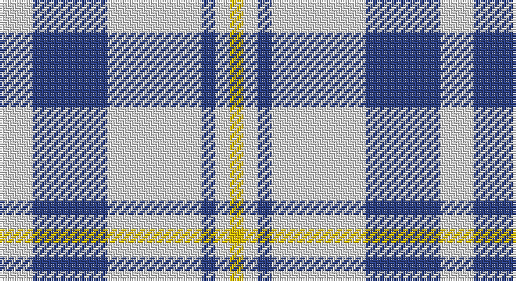

This page is one **sett** — a single exact thread-count. It belongs to the [tartan](/setts/w7db16w20db3w3ly3/)
(the same proportion at any scale), whose colour order is pattern [WBWBWY](/stripes/wbwbwy/).

Part of the [Unidentified](/tartans/unidentified/) tartan — the named design grouping this sett with its other cloths.

Sourced from register-of-tartans.  It is a [6 stripe tartan](/stripes/stripes6/).

Original link https://www.tartanregister.gov.uk/tartanDetails.aspx?ref=4272

## Also known as

This cloth is also recorded under:

- Unidentified #10
- Unidentified #12
- Unidentified #14
- Unidentified #15
- Unidentified #16
- Unidentified #18
- Unidentified #2
- Unidentified #21
- Unidentified #22
- Unidentified #24
- Unidentified #25
- Unidentified #28
- Unidentified #29
- Unidentified #30
- Unidentified #31
- Unidentified #32
- Unidentified #36
- Unidentified #37
- Unidentified #38
- Unidentified #40
- Unidentified #43
- Unidentified #44
- Unidentified #45
- Unidentified #46
- Unidentified #47
- Unidentified #48
- Unidentified #49
- Unidentified #5
- Unidentified #50
- Unidentified #51
- Unidentified #52
- Unidentified #53
- Unidentified #54
- Unidentified #55
- Unidentified #56
- Unidentified #57
- Unidentified #58
- Unidentified #59
- Unidentified #60
- Unidentified #61
- Unidentified #62
- Unidentified #63
- Unidentified #64
- Unidentified #65
- Unidentified #66
- Unidentified #7
- Unidentified #8
- Unidentified #9
- Unidentified 16
- Unidentified Artifact
- Unidentified Plaid
- Unidentified Plaid #11
- Unidentified Plaid #13
- Unidentified Plaid #2
- Unidentified Plaid #3
- Unidentified Plaid #7
- Unidentified Plaid #8
- Unidentified Plaid #9
- Unidentified Portrait

2 attestations — the source records this cloth was collapsed from (oldest owns this page)

<ul>
<li>01/01/1997 — Unidentified (Shirt) (register-of-tartans, <a href="https://www.tartanregister.gov.uk/tartanDetails.aspx?ref=4272">record</a>)</li>
<li>undated — Unidentified (Shirt) (weddslist, <a href="http://www.weddslist.com/cgi-bin/tartans/pg.pl?source=sts">record</a>)</li>
</ul>

## Register references

External register numbers recorded for this tartan.

- Scottish Register of Tartans: [4272](https://www.tartanregister.gov.uk/tartanDetails.aspx?ref=4272)
- Scottish Tartans World Register: 2542

## Thread count
LN/14 B32 LN40 B6 LN6 Y/6

One full sett is **188 threads**.

## Palette

Palette: <strong>Tartan Register</strong>
<table><thead><tr><th>Colour</th><th>Threads</th><th>Shade</th><th>Base</th><th>OKLCh</th></tr></thead><tbody><tr><td>LN/</td><td style="text-align:right;font-variant-numeric:tabular-nums">14</td><td><code style="background-color:#E0E0E0;">#E0E0E0</code> <small style="color:#888">#E0E0E0</small></td><td>W <code style="background-color:#F7F7F7;">#F7F7F7</code></td><td><small style="color:#888">oklch(90.7% 0.000 89.9)</small></td></tr><tr><td>B</td><td style="text-align:right;font-variant-numeric:tabular-nums">32</td><td><code style="background-color:#2C4084;">#2C4084</code> <small style="color:#888">#2C4084</small></td><td>B <code style="background-color:#2A418A;">#2A418A</code></td><td><small style="color:#888">oklch(39.4% 0.117 268.3)</small></td></tr><tr><td>LN</td><td style="text-align:right;font-variant-numeric:tabular-nums">40</td><td><code style="background-color:#E0E0E0;">#E0E0E0</code> <small style="color:#888">#E0E0E0</small></td><td>W <code style="background-color:#F7F7F7;">#F7F7F7</code></td><td><small style="color:#888">oklch(90.7% 0.000 89.9)</small></td></tr><tr><td>B</td><td style="text-align:right;font-variant-numeric:tabular-nums">6</td><td><code style="background-color:#2C4084;">#2C4084</code> <small style="color:#888">#2C4084</small></td><td>B <code style="background-color:#2A418A;">#2A418A</code></td><td><small style="color:#888">oklch(39.4% 0.117 268.3)</small></td></tr><tr><td>LN</td><td style="text-align:right;font-variant-numeric:tabular-nums">6</td><td><code style="background-color:#E0E0E0;">#E0E0E0</code> <small style="color:#888">#E0E0E0</small></td><td>W <code style="background-color:#F7F7F7;">#F7F7F7</code></td><td><small style="color:#888">oklch(90.7% 0.000 89.9)</small></td></tr><tr><td>Y/</td><td style="text-align:right;font-variant-numeric:tabular-nums">6</td><td><code style="background-color:#E8C000;">#E8C000</code> <small style="color:#888">#E8C000</small></td><td>Y <code style="background-color:#F2BF00;">#F2BF00</code></td><td><small style="color:#888">oklch(81.9% 0.168 93.7)</small></td></tr></tbody></table>

# Sample pattern

## Compared to the master

This cloth is one sett of its design; the master sett (the exemplar the design is anchored on) is below for comparison.

<figure style="margin:0"><figcaption style="color:#888;font-size:smaller">this sett</figcaption></figure>
<figure style="margin:0"><figcaption style="color:#888;font-size:smaller"><a href="/setts/dp4r3dp26r26dg26r4/">master sett →</a></figcaption></figure>

## Nearest tartans

The nearest existing variants by ΔTartan distance, with this tartan at the top so the swatches line up against it.

ΔTartan

Tartan

Sett

—

<a href="/ttd/edit/#slug=w7db16w20db3w3ly3~x2">Unidentified (Shirt)</a> <a class="nn-out" href="/variants/s6/w7db16w20db3w3ly3~x2/" title="open its dictionary page">↗</a>

1.29

<a href="/ttd/edit/#slug=w24n5w24db36w28n6w12r6&amp;base=w7db16w20db3w3ly3~x2">Milne Royal Blue Dress Fashion Tartan</a> <a class="nn-out" href="/variants/s8/w24n5w24db36w28n6w12r6/" title="open its dictionary page">↗</a>

1.31

<a href="/ttd/edit/#slug=w5db16w5db16w33r3~x2&amp;base=w7db16w20db3w3ly3~x2">Buchanan Dress Blue (Dance)</a> <a class="nn-out" href="/variants/s6/w5db16w5db16w33r3~x2/" title="open its dictionary page">↗</a>

1.32

<a href="/ttd/edit/#slug=dt3w16dt4w3dt12w2~x3&amp;base=w7db16w20db3w3ly3~x2">MacMugen</a> <a class="nn-out" href="/variants/s6/dt3w16dt4w3dt12w2~x3/" title="open its dictionary page">↗</a>

1.35

<a href="/ttd/edit/#slug=w12t2w12db17w12t2w5r2~x4&amp;base=w7db16w20db3w3ly3~x2">Milne Royal Blue Dress (Dance)</a> <a class="nn-out" href="/variants/s8/w12t2w12db17w12t2w5r2~x4/" title="open its dictionary page">↗</a>

1.38

<a href="/ttd/edit/#slug=w5r3w26db21w3db8ly3~x2&amp;base=w7db16w20db3w3ly3~x2">MacPherson, Blue &amp; White</a> <a class="nn-out" href="/variants/s7/w5r3w26db21w3db8ly3~x2/" title="open its dictionary page">↗</a>

1.38

<a href="/ttd/edit/#slug=db1w1db5w5db1w1~x8&amp;base=w7db16w20db3w3ly3~x2">Erskine Blanket</a> <a class="nn-out" href="/variants/s6/db1w1db5w5db1w1~x8/" title="open its dictionary page">↗</a>

1.41

<a href="/ttd/edit/#slug=w16db3w2db3w2db3r5db6w2~x4&amp;base=w7db16w20db3w3ly3~x2">Jeux Canada Games '87 (Corporate)</a> <a class="nn-out" href="/variants/s9/w16db3w2db3w2db3r5db6w2~x4/" title="open its dictionary page">↗</a>

1.44

<a href="/ttd/edit/#slug=w13r3w2k5w2r3w13db8~x2&amp;base=w7db16w20db3w3ly3~x2">Boswell Dress Personal Tartan</a> <a class="nn-out" href="/variants/s8/w13r3w2k5w2r3w13db8~x2/" title="open its dictionary page">↗</a>

1.49

<a href="/ttd/edit/#slug=b18w4b3lo12~x2&amp;base=w7db16w20db3w3ly3~x2">Genesee Community College</a> <a class="nn-out" href="/variants/s4/b18w4b3lo12~x2/" title="open its dictionary page">↗</a>

1.51

<a href="/ttd/edit/#slug=db19ly2db3w7db3w7db9w3db2w19~x2&amp;base=w7db16w20db3w3ly3~x2">Yorkshire, The Spirit of</a> <a class="nn-out" href="/variants/s10/db19ly2db3w7db3w7db9w3db2w19~x2/" title="open its dictionary page">↗</a>

## Neighbour map

Every grey dot is one of 14360 variants placed by the first two principal components of the ΔTartan feature space (44% of its variance). Red is this tartan; blue dots are its nearest — click one to open its page.

<svg viewBox="0 0 640 380" role="img" style="max-width:100%;height:auto;border:1px solid #e0e0e0;border-radius:4px;display:block" xmlns="http://www.w3.org/2000/svg"><image href="/nn/cloud.v1.png" width="640" height="380"/><a href="/variants/s8/w24n5w24db36w28n6w12r6/"><circle cx="261.3" cy="202.6" r="4" fill="#3465a4"><title>Milne Royal Blue Dress Fashion Tartan</title></circle></a><a href="/variants/s6/w5db16w5db16w33r3~x2/"><circle cx="282.6" cy="195.7" r="4" fill="#3465a4"><title>Buchanan Dress Blue (Dance)</title></circle></a><a href="/variants/s6/dt3w16dt4w3dt12w2~x3/"><circle cx="293.2" cy="227.3" r="4" fill="#3465a4"><title>MacMugen</title></circle></a><a href="/variants/s8/w12t2w12db17w12t2w5r2~x4/"><circle cx="280.4" cy="189.0" r="4" fill="#3465a4"><title>Milne Royal Blue Dress (Dance)</title></circle></a><a href="/variants/s7/w5r3w26db21w3db8ly3~x2/"><circle cx="240.9" cy="178.8" r="4" fill="#3465a4"><title>MacPherson, Blue &amp; White</title></circle></a><a href="/variants/s6/db1w1db5w5db1w1~x8/"><circle cx="279.9" cy="248.5" r="4" fill="#3465a4"><title>Erskine Blanket</title></circle></a><a href="/variants/s9/w16db3w2db3w2db3r5db6w2~x4/"><circle cx="255.4" cy="181.8" r="4" fill="#3465a4"><title>Jeux Canada Games '87 (Corporate)</title></circle></a><a href="/variants/s8/w13r3w2k5w2r3w13db8~x2/"><circle cx="245.4" cy="191.5" r="4" fill="#3465a4"><title>Boswell Dress Personal Tartan</title></circle></a><a href="/variants/s4/b18w4b3lo12~x2/"><circle cx="288.0" cy="268.7" r="4" fill="#3465a4"><title>Genesee Community College</title></circle></a><a href="/variants/s10/db19ly2db3w7db3w7db9w3db2w19~x2/"><circle cx="264.3" cy="184.9" r="4" fill="#3465a4"><title>Yorkshire, The Spirit of</title></circle></a><circle cx="285.1" cy="219.6" r="5" fill="#c00000"/></svg>

ID: /variants/s6/w7db16w20db3w3ly3~x2/
