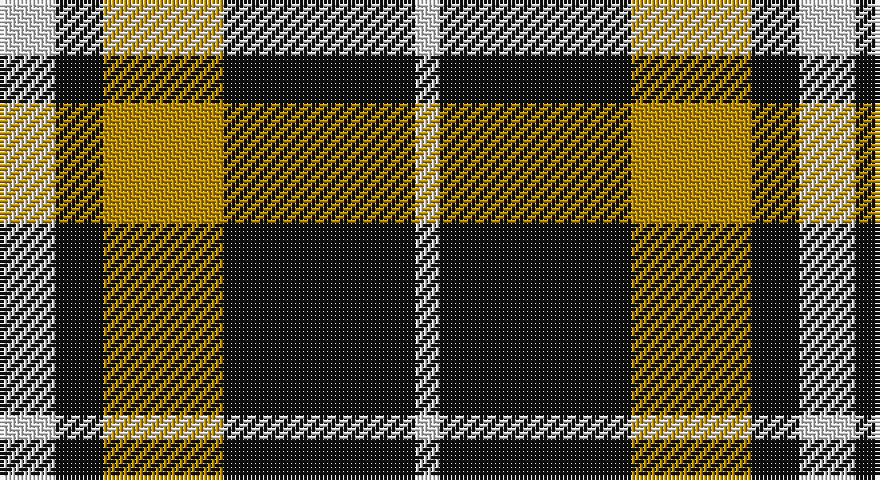

This page is one **sett** — a single exact thread-count. It belongs to the [tartan](/setts/w7k6lo15k16k8w3/)
(the same proportion at any scale), whose colour order is pattern [WKKYKW](/stripes/wkkykw/).

Sourced from register-of-tartans.  It is a [6 stripe tartan](/stripes/stripes6/).

Original link https://www.tartanregister.gov.uk/tartanDetails.aspx?ref=5366

## Register references

External register numbers recorded for this tartan.

- Scottish Register of Tartans: [5366](https://www.tartanregister.gov.uk/tartanDetails.aspx?ref=5366)
- Scottish Tartans Authority (ITI): 7408
- Scottish Tartans World Register: 3092

## Thread count
LN/14 K12 DY30 K32 K16 LN/6

One full sett is **200 threads**.

## Palette

Palette: <strong>Tartan Register</strong>
<table><thead><tr><th>Colour</th><th>Threads</th><th>Shade</th><th>Base</th><th>OKLCh</th></tr></thead><tbody><tr><td>LN/</td><td style="text-align:right;font-variant-numeric:tabular-nums">14</td><td><code style="background-color:#E0E0E0;">#E0E0E0</code> <small style="color:#888">#E0E0E0</small></td><td>W <code style="background-color:#F7F7F7;">#F7F7F7</code></td><td><small style="color:#888">oklch(90.7% 0.000 89.9)</small></td></tr><tr><td>K</td><td style="text-align:right;font-variant-numeric:tabular-nums">12</td><td><code style="background-color:#101010;">#101010</code> <small style="color:#888">#101010</small></td><td>K <code style="background-color:#000000;">#000000</code></td><td><small style="color:#888">oklch(17.3% 0.000 89.9)</small></td></tr><tr><td>DY</td><td style="text-align:right;font-variant-numeric:tabular-nums">30</td><td><code style="background-color:#BC8C00;">#BC8C00</code> <small style="color:#888">#BC8C00</small></td><td>Y <code style="background-color:#F2BF00;">#F2BF00</code></td><td><small style="color:#888">oklch(66.8% 0.137 84.1)</small></td></tr><tr><td>K</td><td style="text-align:right;font-variant-numeric:tabular-nums">32</td><td><code style="background-color:#101010;">#101010</code> <small style="color:#888">#101010</small></td><td>K <code style="background-color:#000000;">#000000</code></td><td><small style="color:#888">oklch(17.3% 0.000 89.9)</small></td></tr><tr><td>K</td><td style="text-align:right;font-variant-numeric:tabular-nums">16</td><td><code style="background-color:#101010;">#101010</code> <small style="color:#888">#101010</small></td><td>K <code style="background-color:#000000;">#000000</code></td><td><small style="color:#888">oklch(17.3% 0.000 89.9)</small></td></tr><tr><td>LN/</td><td style="text-align:right;font-variant-numeric:tabular-nums">6</td><td><code style="background-color:#E0E0E0;">#E0E0E0</code> <small style="color:#888">#E0E0E0</small></td><td>W <code style="background-color:#F7F7F7;">#F7F7F7</code></td><td><small style="color:#888">oklch(90.7% 0.000 89.9)</small></td></tr></tbody></table>

# Sample pattern

## Nearest tartans

The nearest existing variants by ΔTartan distance, with this tartan at the top so the swatches line up against it.

ΔTartan

Tartan

Sett

—

<a href="/ttd/edit/#slug=w7k6lo15k16k8w3~x2">Longford County, Crest Range</a> <a class="nn-out" href="/variants/s6/w7k6lo15k16k8w3~x2/" title="open its dictionary page">↗</a>

0.95

<a href="/ttd/edit/#slug=db20k5db18ly26k6~x2&amp;base=w7k6lo15k16k8w3~x2">Jahore</a> <a class="nn-out" href="/variants/s5/db20k5db18ly26k6~x2/" title="open its dictionary page">↗</a>

1.19

<a href="/ttd/edit/#slug=k5lo5w1lo5k5r1~x10&amp;base=w7k6lo15k16k8w3~x2">Canyon County Idaho Sheriff</a> <a class="nn-out" href="/variants/s6/k5lo5w1lo5k5r1~x10/" title="open its dictionary page">↗</a>

1.22

<a href="/ttd/edit/#slug=k4ly1k4ly6r1~x4&amp;base=w7k6lo15k16k8w3~x2">MacLeod Dress Clan Tartan</a> <a class="nn-out" href="/variants/s5/k4ly1k4ly6r1~x4/" title="open its dictionary page">↗</a>

1.27

<a href="/ttd/edit/#slug=k10ly2k10w2k2ly13w3~x2&amp;base=w7k6lo15k16k8w3~x2">Nooten-Boom (Personal)</a> <a class="nn-out" href="/variants/s7/k10ly2k10w2k2ly13w3~x2/" title="open its dictionary page">↗</a>

1.40

<a href="/variants/s8/db20k5db18lo26k6~x2/">Johore Regiment</a>

1.43

<a href="/ttd/edit/#slug=db20k5db18lo26k6~x2&amp;base=w7k6lo15k16k8w3~x2">Johore Regiment (Military)</a> <a class="nn-out" href="/variants/s5/db20k5db18lo26k6~x2/" title="open its dictionary page">↗</a>

1.52

<a href="/ttd/edit/#slug=dg14o5dg14w5k2o5k2w9~x4&amp;base=w7k6lo15k16k8w3~x2">Unnamed (Hip Flask)</a> <a class="nn-out" href="/variants/s8/dg14o5dg14w5k2o5k2w9~x4/" title="open its dictionary page">↗</a>

1.54

<a href="/ttd/edit/#slug=w5r5w5k15r2~x2&amp;base=w7k6lo15k16k8w3~x2">Braes High School Falkirk (School)</a> <a class="nn-out" href="/variants/s5/w5r5w5k15r2~x2/" title="open its dictionary page">↗</a>

1.55

<a href="/ttd/edit/#slug=r35g52db18g17r12g17k18&amp;base=w7k6lo15k16k8w3~x2">MacDona</a> <a class="nn-out" href="/variants/s7/r35g52db18g17r12g17k18/" title="open its dictionary page">↗</a>

1.65

<a href="/ttd/edit/#slug=dg10db4dg4db5dg6ly10r6dg18ly4&amp;base=w7k6lo15k16k8w3~x2">Arkansas (Unofficial)</a> <a class="nn-out" href="/variants/s9/dg10db4dg4db5dg6ly10r6dg18ly4/" title="open its dictionary page">↗</a>

## Neighbour map

Every grey dot is one of 14360 variants placed by the first two principal components of the ΔTartan feature space (44% of its variance). Red is this tartan; blue dots are its nearest — click one to open its page.

<svg viewBox="0 0 640 380" role="img" style="max-width:100%;height:auto;border:1px solid #e0e0e0;border-radius:4px;display:block" xmlns="http://www.w3.org/2000/svg"><image href="/nn/cloud.v1.png" width="640" height="380"/><a href="/variants/s5/db20k5db18ly26k6~x2/"><circle cx="205.7" cy="266.2" r="4" fill="#3465a4"><title>Jahore</title></circle></a><a href="/variants/s6/k5lo5w1lo5k5r1~x10/"><circle cx="186.7" cy="255.3" r="4" fill="#3465a4"><title>Canyon County Idaho Sheriff</title></circle></a><a href="/variants/s5/k4ly1k4ly6r1~x4/"><circle cx="233.8" cy="251.7" r="4" fill="#3465a4"><title>MacLeod Dress Clan Tartan</title></circle></a><a href="/variants/s7/k10ly2k10w2k2ly13w3~x2/"><circle cx="234.8" cy="220.3" r="4" fill="#3465a4"><title>Nooten-Boom (Personal)</title></circle></a><a href="/variants/s8/db20k5db18lo26k6~x2/"><circle cx="195.4" cy="253.2" r="4" fill="#3465a4"><title>Johore Regiment</title></circle></a><a href="/variants/s5/db20k5db18lo26k6~x2/"><circle cx="226.7" cy="276.1" r="4" fill="#3465a4"><title>Johore Regiment (Military)</title></circle></a><a href="/variants/s8/dg14o5dg14w5k2o5k2w9~x4/"><circle cx="188.6" cy="213.0" r="4" fill="#3465a4"><title>Unnamed (Hip Flask)</title></circle></a><a href="/variants/s5/w5r5w5k15r2~x2/"><circle cx="213.3" cy="229.2" r="4" fill="#3465a4"><title>Braes High School Falkirk (School)</title></circle></a><a href="/variants/s7/r35g52db18g17r12g17k18/"><circle cx="181.5" cy="255.2" r="4" fill="#3465a4"><title>MacDona</title></circle></a><a href="/variants/s9/dg10db4dg4db5dg6ly10r6dg18ly4/"><circle cx="212.4" cy="240.6" r="4" fill="#3465a4"><title>Arkansas (Unofficial)</title></circle></a><circle cx="217.3" cy="262.4" r="5" fill="#c00000"/></svg>

ID: /variants/s6/w7k6lo15k16k8w3~x2/
