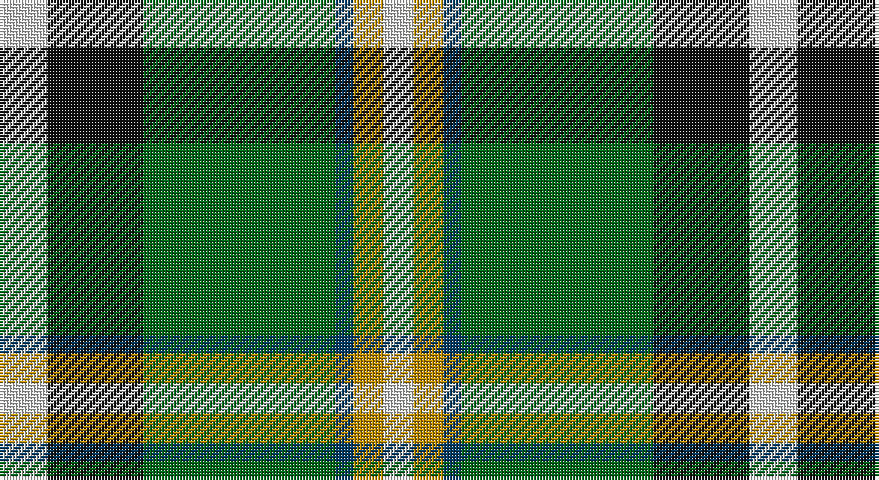

This page is one **sett** — a single exact thread-count. It belongs to the [tartan](/setts/w8k16g32dt3lo5w5/)
(the same proportion at any scale), whose colour order is pattern [WKGBYW](/stripes/wkgbyw/).

Sourced from tartans-authority.  It is a [6 stripe tartan](/stripes/stripes6/).

Original link http://www.tartansauthority.com/tartan-ferret/display/10320/

## Provenance

Earliest known date: 10th Oct. 2009 Designed by a Phillip Mellor of Oldham who is happy for all of the name to wear it.

2 attestations — the source records this cloth was collapsed from (oldest owns this page)

<ul>
<li>10th Oct. 2009 — Mellor (Name) (tartans-authority, <a href="http://www.tartansauthority.com/tartan-ferret/display/10320/">record</a>)</li>
<li>undated — Mellor Name Tartan (house-of-tartan, <a href="http://www.house-of-tartan.scotland.net/house/TartanViewjs.asp?colr=Def&tnam=10320">record</a>)</li>
</ul>

## Register references

External register numbers recorded for this tartan.

- Scottish Register of Tartans: [10320](https://www.tartanregister.gov.uk/tartanDetails?ref=10320)
- Scottish Tartans Authority (ITI): 10320

## Thread count
LN/16 K32 G64 DB6 DY10 LN/10

One full sett is **250 threads**.

## Palette

Palette: <strong>Tartan Register</strong>
<table><thead><tr><th>Colour</th><th>Threads</th><th>Shade</th><th>Base</th><th>OKLCh</th></tr></thead><tbody><tr><td>LN/</td><td style="text-align:right;font-variant-numeric:tabular-nums">16</td><td><code style="background-color:#E0E0E0;">#E0E0E0</code> <small style="color:#888">#E0E0E0</small></td><td>W <code style="background-color:#F7F7F7;">#F7F7F7</code></td><td><small style="color:#888">oklch(90.7% 0.000 89.9)</small></td></tr><tr><td>K</td><td style="text-align:right;font-variant-numeric:tabular-nums">32</td><td><code style="background-color:#101010;">#101010</code> <small style="color:#888">#101010</small></td><td>K <code style="background-color:#000000;">#000000</code></td><td><small style="color:#888">oklch(17.3% 0.000 89.9)</small></td></tr><tr><td>G</td><td style="text-align:right;font-variant-numeric:tabular-nums">64</td><td><code style="background-color:#006818;">#006818</code> <small style="color:#888">#006818</small></td><td>G <code style="background-color:#006100;">#006100</code></td><td><small style="color:#888">oklch(45.0% 0.142 145.0)</small></td></tr><tr><td>DB</td><td style="text-align:right;font-variant-numeric:tabular-nums">6</td><td><code style="background-color:#003C64;">#003C64</code> <small style="color:#888">#003C64</small></td><td>B <code style="background-color:#2A418A;">#2A418A</code></td><td><small style="color:#888">oklch(34.5% 0.089 246.0)</small></td></tr><tr><td>DY</td><td style="text-align:right;font-variant-numeric:tabular-nums">10</td><td><code style="background-color:#BC8C00;">#BC8C00</code> <small style="color:#888">#BC8C00</small></td><td>Y <code style="background-color:#F2BF00;">#F2BF00</code></td><td><small style="color:#888">oklch(66.8% 0.137 84.1)</small></td></tr><tr><td>LN/</td><td style="text-align:right;font-variant-numeric:tabular-nums">10</td><td><code style="background-color:#E0E0E0;">#E0E0E0</code> <small style="color:#888">#E0E0E0</small></td><td>W <code style="background-color:#F7F7F7;">#F7F7F7</code></td><td><small style="color:#888">oklch(90.7% 0.000 89.9)</small></td></tr></tbody></table>

# Sample pattern

## Nearest tartans

The nearest existing variants by ΔTartan distance, with this tartan at the top so the swatches line up against it.

ΔTartan

Tartan

Sett

—

<a href="/ttd/edit/#slug=w8k16g32dt3lo5w5~x2">Mellor (Name)</a> <a class="nn-out" href="/variants/s6/w8k16g32dt3lo5w5~x2/" title="open its dictionary page">↗</a>

0.90

<a href="/ttd/edit/#slug=g7p3w1lg2g1k2p1~x8&amp;base=w8k16g32dt3lo5w5~x2">Lindley-Highfield Name Tartan</a> <a class="nn-out" href="/variants/s7/g7p3w1lg2g1k2p1~x8/" title="open its dictionary page">↗</a>

0.90

<a href="/ttd/edit/#slug=k20w4r4gi20w5gi2g2~x2&amp;base=w8k16g32dt3lo5w5~x2">Hackett (Personal)</a> <a class="nn-out" href="/variants/s7/k20w4r4gi20w5gi2g2~x2/" title="open its dictionary page">↗</a>

1.00

<a href="/ttd/edit/#slug=g11w11k3ly3dg36lo7~x2&amp;base=w8k16g32dt3lo5w5~x2">Driver (Name)</a> <a class="nn-out" href="/variants/s6/g11w11k3ly3dg36lo7~x2/" title="open its dictionary page">↗</a>

1.11

<a href="/ttd/edit/#slug=k7ly3g28db28w3~x2&amp;base=w8k16g32dt3lo5w5~x2">Turnbull, hunting</a> <a class="nn-out" href="/variants/s5/k7ly3g28db28w3~x2/" title="open its dictionary page">↗</a>

1.13

<a href="/ttd/edit/#slug=g7p3w1lg2g1lp2p1~x8&amp;base=w8k16g32dt3lo5w5~x2">Lindley-Highfield of Ballumbie Castle</a> <a class="nn-out" href="/variants/s7/g7p3w1lg2g1lp2p1~x8/" title="open its dictionary page">↗</a>

1.15

<a href="/ttd/edit/#slug=lo16k7w1g7k1ly3~x4&amp;base=w8k16g32dt3lo5w5~x2">Hamilton of Brandon (Fashion)</a> <a class="nn-out" href="/variants/s6/lo16k7w1g7k1ly3~x4/" title="open its dictionary page">↗</a>

1.17

<a href="/ttd/edit/#slug=dg8gi6dg48w31o42g6o8&amp;base=w8k16g32dt3lo5w5~x2">Bannockbane, Green</a> <a class="nn-out" href="/variants/s7/dg8gi6dg48w31o42g6o8/" title="open its dictionary page">↗</a>

1.17

<a href="/ttd/edit/#slug=w15k8m25k72g98ly15&amp;base=w8k16g32dt3lo5w5~x2">Afternoon Tea / Afternoon Tea</a> <a class="nn-out" href="/variants/s6/w15k8m25k72g98ly15/" title="open its dictionary page">↗</a>

1.21

<a href="/ttd/edit/#slug=g11w11k3ly3dg36r7~x2&amp;base=w8k16g32dt3lo5w5~x2">Driver, RC</a> <a class="nn-out" href="/variants/s6/g11w11k3ly3dg36r7~x2/" title="open its dictionary page">↗</a>

1.21

<a href="/ttd/edit/#slug=dg4g3dg24w15lo21gi3lo4~x2&amp;base=w8k16g32dt3lo5w5~x2">Bannockbane Dark Green</a> <a class="nn-out" href="/variants/s7/dg4g3dg24w15lo21gi3lo4~x2/" title="open its dictionary page">↗</a>

## Neighbour map

Every grey dot is one of 14360 variants placed by the first two principal components of the ΔTartan feature space (44% of its variance). Red is this tartan; blue dots are its nearest — click one to open its page.

<svg viewBox="0 0 640 380" role="img" style="max-width:100%;height:auto;border:1px solid #e0e0e0;border-radius:4px;display:block" xmlns="http://www.w3.org/2000/svg"><image href="/nn/cloud.v1.png" width="640" height="380"/><a href="/variants/s7/g7p3w1lg2g1k2p1~x8/"><circle cx="162.6" cy="190.2" r="4" fill="#3465a4"><title>Lindley-Highfield Name Tartan</title></circle></a><a href="/variants/s7/k20w4r4gi20w5gi2g2~x2/"><circle cx="152.9" cy="167.0" r="4" fill="#3465a4"><title>Hackett (Personal)</title></circle></a><a href="/variants/s6/g11w11k3ly3dg36lo7~x2/"><circle cx="201.4" cy="155.5" r="4" fill="#3465a4"><title>Driver (Name)</title></circle></a><a href="/variants/s5/k7ly3g28db28w3~x2/"><circle cx="185.3" cy="203.5" r="4" fill="#3465a4"><title>Turnbull, hunting</title></circle></a><a href="/variants/s7/g7p3w1lg2g1lp2p1~x8/"><circle cx="169.8" cy="188.1" r="4" fill="#3465a4"><title>Lindley-Highfield of Ballumbie Castle</title></circle></a><a href="/variants/s6/lo16k7w1g7k1ly3~x4/"><circle cx="215.3" cy="163.5" r="4" fill="#3465a4"><title>Hamilton of Brandon (Fashion)</title></circle></a><a href="/variants/s7/dg8gi6dg48w31o42g6o8/"><circle cx="142.4" cy="185.0" r="4" fill="#3465a4"><title>Bannockbane, Green</title></circle></a><a href="/variants/s6/w15k8m25k72g98ly15/"><circle cx="201.0" cy="181.5" r="4" fill="#3465a4"><title>Afternoon Tea / Afternoon Tea</title></circle></a><a href="/variants/s6/g11w11k3ly3dg36r7~x2/"><circle cx="193.7" cy="150.8" r="4" fill="#3465a4"><title>Driver, RC</title></circle></a><a href="/variants/s7/dg4g3dg24w15lo21gi3lo4~x2/"><circle cx="144.3" cy="185.4" r="4" fill="#3465a4"><title>Bannockbane Dark Green</title></circle></a><circle cx="186.7" cy="179.4" r="5" fill="#c00000"/></svg>

ID: /variants/s6/w8k16g32dt3lo5w5~x2/
