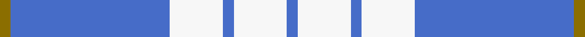

This page is one **sett** — a single exact thread-count. It belongs to the [tartan](/setts/y1b15w5b1w5b1/)
(the same proportion at any scale), whose colour order is pattern [BWBWBG](/stripes/bwbwbg/).

Sourced from register-of-tartans.  It is a [6 stripe tartan](/stripes/stripes6/).

Original link https://www.tartanregister.gov.uk/tartanDetails.aspx?ref=4616

2 attestations — the source records this cloth was collapsed from (oldest owns this page)

<ul>
<li>01/01/2007 — Whitley (Personal) (register-of-tartans, <a href="https://www.tartanregister.gov.uk/tartanDetails.aspx?ref=4616">record</a>)  <em>Details from Phil Smith in June 2007 who does not have any details of source or provenance. Phil Smith comments that this is an unimaginative design, a copy of so many in the Vestiarium Scoticum.</em></li>
<li>pre 2007 — Whitley (Personal) (tartans-authority, <a href="http://www.tartansauthority.com/tartan-ferret/display/7233/">record</a>)  <em>Details from Phil Smith in June 2007 who does not have any details of source or provenance. PS comments that this is an unimaginative design, a copy of so many in the Vestiarium Scoticum.</em></li>
</ul>

## Register references

External register numbers recorded for this tartan.

- Scottish Register of Tartans: [4616](https://www.tartanregister.gov.uk/tartanDetails.aspx?ref=4616)
- Scottish Tartans Authority (ITI): 7233

## Thread count
Y/4 B60 W20 B4 W20 B/4

One full sett is **216 threads**.

## Palette
<table><thead><tr><th>Colour</th><th>Shade</th><th>OKLCh</th></tr></thead><tbody><tr><td>B</td><td><code style="background-color:#466CC8;">#466CC8</code> <small style="color:#888">#466CC8</small></td><td><small style="color:#888">oklch(55.1% 0.149 265.0)</small></td></tr><tr><td>LN</td><td><code style="background-color:#F7F7F7;">#F7F7F7</code> <small style="color:#888">#F7F7F7</small></td><td><small style="color:#888">oklch(97.6% 0.000 89.9)</small></td></tr><tr><td>Y</td><td><code style="background-color:#8B6E00;">#8B6E00</code> <small style="color:#888">#8B6E00</small></td><td><small style="color:#888">oklch(55.1% 0.113 90.4)</small></td></tr></tbody></table>

# Sample pattern

## Nearest variants

The nearest existing variants by ΔTartan distance, with this cloth at the top so the swatches line up against it.

ΔTartan

Threads

Variant

Sett

—

216

<a href="/variants/s6/y1b15w5b1w5b1~x4/">Whitley (Personal)</a>

<a href="/ttd/edit/#slug=b30w7b18w11b6y3~x2&amp;base=y1b15w5b1w5b1~x4" title="compare in the TTD">0.71</a>

234

<a href="/variants/s6/b30w7b18w11b6y3~x2/">Ochterlonie</a>

<a href="/ttd/edit/#slug=y2w21db16lb8db30w8db1~x2&amp;base=y1b15w5b1w5b1~x4" title="compare in the TTD">1.15</a>

338

<a href="/variants/s7/y2w21db16lb8db30w8db1~x2/">Muir, John</a>

<a href="/ttd/edit/#slug=w8db16w2db2w1db1~x4&amp;base=y1b15w5b1w5b1~x4" title="compare in the TTD">1.45</a>

204

<a href="/variants/s6/w8db16w2db2w1db1~x4/">Ikelman #1 (Personal)</a>

<a href="/ttd/edit/#slug=w20b20w3b3~x2&amp;base=y1b15w5b1w5b1~x4" title="compare in the TTD">1.55</a>

138

<a href="/variants/s4/w20b20w3b3~x2/">Unidentified, Plaid Barbie's Moss</a>

<a href="/ttd/edit/#slug=db6w2db29w29db2w6~x2&amp;base=y1b15w5b1w5b1~x4" title="compare in the TTD">1.62</a>

272

<a href="/variants/s6/db6w2db29w29db2w6~x2/">Erskine Blue (Dance)</a>

<a href="/ttd/edit/#slug=db37w9db3r9w3~x2&amp;base=y1b15w5b1w5b1~x4" title="compare in the TTD">2.20</a>

164

<a href="/variants/s5/db37w9db3r9w3~x2/">Glen Moy</a>

<a href="/ttd/edit/#slug=w5r3w26db21w3db8y3~x2&amp;base=y1b15w5b1w5b1~x4" title="compare in the TTD">2.20</a>

260

<a href="/variants/s7/w5r3w26db21w3db8y3~x2/">MacPherson, Blue &amp; White</a>

<a href="/ttd/edit/#slug=w32dr12db12w2db3~x2&amp;base=y1b15w5b1w5b1~x4" title="compare in the TTD">2.26</a>

174

<a href="/variants/s5/w32dr12db12w2db3~x2/">Fraser Arisaid Red (Dance)</a>

<a href="/ttd/edit/#slug=lb60db19w3db2r2db7~x2&amp;base=y1b15w5b1w5b1~x4" title="compare in the TTD">2.28</a>

238

<a href="/variants/s6/lb60db19w3db2r2db7~x2/">Federal Bureaux of Investigation</a>

<a href="/ttd/edit/#slug=lb28db15r2db2w1db6~x2&amp;base=y1b15w5b1w5b1~x4" title="compare in the TTD">2.30</a>

148

<a href="/variants/s6/lb28db15r2db2w1db6~x2/">Corries</a>

## Neighbour map

Every grey dot is one of 13620 variants placed by the first two principal components of the ΔTartan feature space (42% of its variance). Red is this tartan; blue dots are its nearest — click one to open its page.

<svg viewBox="0 0 640 380" role="img" style="max-width:100%;height:auto;border:1px solid #e0e0e0;border-radius:4px;display:block" xmlns="http://www.w3.org/2000/svg"><image href="/nn/cloud.v1.png" width="640" height="380"/><a href="/variants/s6/b30w7b18w11b6y3~x2/"><circle cx="448.5" cy="252.8" r="4" fill="#3465a4"><title>Ochterlonie</title></circle></a><a href="/variants/s7/y2w21db16lb8db30w8db1~x2/"><circle cx="314.6" cy="175.3" r="4" fill="#3465a4"><title>Muir, John</title></circle></a><a href="/variants/s6/w8db16w2db2w1db1~x4/"><circle cx="439.8" cy="223.1" r="4" fill="#3465a4"><title>Ikelman #1 (Personal)</title></circle></a><a href="/variants/s4/w20b20w3b3~x2/"><circle cx="421.5" cy="296.3" r="4" fill="#3465a4"><title>Unidentified, Plaid Barbie's Moss</title></circle></a><a href="/variants/s6/db6w2db29w29db2w6~x2/"><circle cx="375.9" cy="239.3" r="4" fill="#3465a4"><title>Erskine Blue (Dance)</title></circle></a><a href="/variants/s5/db37w9db3r9w3~x2/"><circle cx="372.6" cy="197.6" r="4" fill="#3465a4"><title>Glen Moy</title></circle></a><a href="/variants/s7/w5r3w26db21w3db8y3~x2/"><circle cx="251.3" cy="202.2" r="4" fill="#3465a4"><title>MacPherson, Blue &amp; White</title></circle></a><a href="/variants/s5/w32dr12db12w2db3~x2/"><circle cx="342.6" cy="228.1" r="4" fill="#3465a4"><title>Fraser Arisaid Red (Dance)</title></circle></a><a href="/variants/s6/lb60db19w3db2r2db7~x2/"><circle cx="411.3" cy="135.1" r="4" fill="#3465a4"><title>Federal Bureaux of Investigation</title></circle></a><a href="/variants/s6/lb28db15r2db2w1db6~x2/"><circle cx="334.6" cy="153.7" r="4" fill="#3465a4"><title>Corries</title></circle></a><circle cx="408.8" cy="210.3" r="5" fill="#c00000"/><text x="320" y="376" text-anchor="middle" font-size="11" fill="#999">ground</text><text x="11" y="190" text-anchor="middle" font-size="11" fill="#999" transform="rotate(-90 11 190)">complexity</text></svg>

ID: /variants/s6/y1b15w5b1w5b1~x4/
