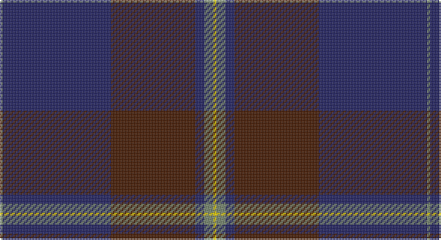

This page is one **sett** — a single exact thread-count. It belongs to the [tartan](/setts/y1db36do28db3y3ly1/)
(the same proportion at any scale), whose colour order is pattern [GBBBGY](/stripes/gbbbgy/).

Part of the [Potts](/tartans/potts/) tartan — the named design grouping this sett with its other cloths.

Sourced from tartans-authority.  It is a [6 stripe tartan](/stripes/stripes6/).

Original link http://www.tartansauthority.com/tartan-ferret/display/4538/

## Register references

External register numbers recorded for this tartan.

- Scottish Tartans Authority (ITI): 4538

## Thread count
N/2 DB72 DR56 DB6 N6 Y/2

One full sett is **284 threads**.

## Palette

Palette: <strong>Tartan Register</strong> <small style="color:#888">(3 of 4 colours)</small>
<table><thead><tr><th>Colour</th><th>Threads</th><th>Shade</th><th>Base</th><th>OKLCh</th></tr></thead><tbody><tr><td>N/</td><td style="text-align:right;font-variant-numeric:tabular-nums">2</td><td><code style="background-color:#74846C;">#74846C</code> <small style="color:#888">#74846C</small></td><td>G <code style="background-color:#006100;">#006100</code></td><td><small style="color:#888">oklch(59.3% 0.040 135.2)</small></td></tr><tr><td>DB</td><td style="text-align:right;font-variant-numeric:tabular-nums">72</td><td><code style="background-color:#202060;">#202060</code> <small style="color:#888">#202060</small></td><td>B <code style="background-color:#2A418A;">#2A418A</code></td><td><small style="color:#888">oklch(28.9% 0.111 276.9)</small></td></tr><tr><td>DR</td><td style="text-align:right;font-variant-numeric:tabular-nums">56</td><td><code style="background-color:#441800;">#441800</code> <small style="color:#888">#441800</small></td><td>B <code style="background-color:#2A418A;">#2A418A</code></td><td><small style="color:#888">oklch(27.3% 0.076 46.3)</small></td></tr><tr><td>DB</td><td style="text-align:right;font-variant-numeric:tabular-nums">6</td><td><code style="background-color:#202060;">#202060</code> <small style="color:#888">#202060</small></td><td>B <code style="background-color:#2A418A;">#2A418A</code></td><td><small style="color:#888">oklch(28.9% 0.111 276.9)</small></td></tr><tr><td>N</td><td style="text-align:right;font-variant-numeric:tabular-nums">6</td><td><code style="background-color:#74846C;">#74846C</code> <small style="color:#888">#74846C</small></td><td>G <code style="background-color:#006100;">#006100</code></td><td><small style="color:#888">oklch(59.3% 0.040 135.2)</small></td></tr><tr><td>Y/</td><td style="text-align:right;font-variant-numeric:tabular-nums">2</td><td><code style="background-color:#FCCC00;">#FCCC00</code> <small style="color:#888">#FCCC00</small></td><td>Y <code style="background-color:#F2BF00;">#F2BF00</code></td><td><small style="color:#888">oklch(86.2% 0.176 91.5)</small></td></tr></tbody></table>

# Sample pattern

## Compared to the master

This cloth is one sett of its design; the master sett (the exemplar the design is anchored on) is below for comparison.

<figure style="margin:0"><figcaption style="color:#888;font-size:smaller">this sett</figcaption></figure>
<figure style="margin:0"><figcaption style="color:#888;font-size:smaller"><a href="/setts/k1y3db3do28db36y1/">master sett →</a></figcaption></figure>

## Nearest tartans

The nearest existing variants by ΔTartan distance, with this tartan at the top so the swatches line up against it.

ΔTartan

Tartan

Sett

—

<a href="/ttd/edit/#slug=y1db36do28db3y3ly1~x2">Potts (Personal)</a> <a class="nn-out" href="/variants/s6/y1db36do28db3y3ly1~x2/" title="open its dictionary page">↗</a>

0.67

<a href="/ttd/edit/#slug=k1y3db3do28db36y1~x2&amp;base=y1db36do28db3y3ly1~x2">Potts (Personal)</a> <a class="nn-out" href="/variants/s6/k1y3db3do28db36y1~x2/" title="open its dictionary page">↗</a>

1.26

<a href="/ttd/edit/#slug=k28r1k2r1k8db24dg2db3~x2&amp;base=y1db36do28db3y3ly1~x2">Home or Hume (Vestiarium Scoticum)</a> <a class="nn-out" href="/variants/s8/k28r1k2r1k8db24dg2db3~x2/" title="open its dictionary page">↗</a>

1.29

<a href="/ttd/edit/#slug=db80k28dp9k3m5k12~x2&amp;base=y1db36do28db3y3ly1~x2">Earl Blue Marl</a> <a class="nn-out" href="/variants/s6/db80k28dp9k3m5k12~x2/" title="open its dictionary page">↗</a>

1.38

<a href="/ttd/edit/#slug=db47dg14dp5do2r3dg7~x2&amp;base=y1db36do28db3y3ly1~x2">Round Table (1997)</a> <a class="nn-out" href="/variants/s6/db47dg14dp5do2r3dg7~x2/" title="open its dictionary page">↗</a>

1.41

<a href="/ttd/edit/#slug=db56k4w1db6k20w2k20~x2&amp;base=y1db36do28db3y3ly1~x2">Dalziel Rugby Club (Corporate)</a> <a class="nn-out" href="/variants/s7/db56k4w1db6k20w2k20~x2/" title="open its dictionary page">↗</a>

1.45

<a href="/ttd/edit/#slug=r1k1dt30k6dt1k6dy8k1r1~x2&amp;base=y1db36do28db3y3ly1~x2">Klappert Original (Odsherred, Denmark) (Personal)</a> <a class="nn-out" href="/variants/s9/r1k1dt30k6dt1k6dy8k1r1~x2/" title="open its dictionary page">↗</a>

1.48

<a href="/ttd/edit/#slug=dt48k32r1k8r3w3~x2&amp;base=y1db36do28db3y3ly1~x2">Koot Wedding (Personal)</a> <a class="nn-out" href="/variants/s6/dt48k32r1k8r3w3~x2/" title="open its dictionary page">↗</a>

1.48

<a href="/ttd/edit/#slug=lr4dt1r15dt42r6dt4lo1~x2&amp;base=y1db36do28db3y3ly1~x2">Lion Brand Sportswear</a> <a class="nn-out" href="/variants/s7/lr4dt1r15dt42r6dt4lo1~x2/" title="open its dictionary page">↗</a>

1.55

<a href="/ttd/edit/#slug=dt45db7w3db27r1db7~x2&amp;base=y1db36do28db3y3ly1~x2">U.S. Navy/Edzell (Military)</a> <a class="nn-out" href="/variants/s6/dt45db7w3db27r1db7~x2/" title="open its dictionary page">↗</a>

1.57

<a href="/ttd/edit/#slug=db4r1db18n18lr1~x4&amp;base=y1db36do28db3y3ly1~x2">Ardee (Corporate)</a> <a class="nn-out" href="/variants/s5/db4r1db18n18lr1~x4/" title="open its dictionary page">↗</a>

## Neighbour map

Every grey dot is one of 14360 variants placed by the first two principal components of the ΔTartan feature space (44% of its variance). Red is this tartan; blue dots are its nearest — click one to open its page.

<svg viewBox="0 0 640 380" role="img" style="max-width:100%;height:auto;border:1px solid #e0e0e0;border-radius:4px;display:block" xmlns="http://www.w3.org/2000/svg"><image href="/nn/cloud.v1.png" width="640" height="380"/><a href="/variants/s6/k1y3db3do28db36y1~x2/"><circle cx="472.5" cy="197.6" r="4" fill="#3465a4"><title>Potts (Personal)</title></circle></a><a href="/variants/s8/k28r1k2r1k8db24dg2db3~x2/"><circle cx="424.2" cy="178.3" r="4" fill="#3465a4"><title>Home or Hume (Vestiarium Scoticum)</title></circle></a><a href="/variants/s6/db80k28dp9k3m5k12~x2/"><circle cx="453.0" cy="201.0" r="4" fill="#3465a4"><title>Earl Blue Marl</title></circle></a><a href="/variants/s6/db47dg14dp5do2r3dg7~x2/"><circle cx="442.1" cy="192.3" r="4" fill="#3465a4"><title>Round Table (1997)</title></circle></a><a href="/variants/s7/db56k4w1db6k20w2k20~x2/"><circle cx="499.6" cy="195.5" r="4" fill="#3465a4"><title>Dalziel Rugby Club (Corporate)</title></circle></a><a href="/variants/s9/r1k1dt30k6dt1k6dy8k1r1~x2/"><circle cx="444.1" cy="164.9" r="4" fill="#3465a4"><title>Klappert Original (Odsherred, Denmark) (Personal)</title></circle></a><a href="/variants/s6/dt48k32r1k8r3w3~x2/"><circle cx="404.3" cy="166.6" r="4" fill="#3465a4"><title>Koot Wedding (Personal)</title></circle></a><a href="/variants/s7/lr4dt1r15dt42r6dt4lo1~x2/"><circle cx="495.1" cy="156.2" r="4" fill="#3465a4"><title>Lion Brand Sportswear</title></circle></a><a href="/variants/s6/dt45db7w3db27r1db7~x2/"><circle cx="450.4" cy="200.6" r="4" fill="#3465a4"><title>U.S. Navy/Edzell (Military)</title></circle></a><a href="/variants/s5/db4r1db18n18lr1~x4/"><circle cx="399.7" cy="228.4" r="4" fill="#3465a4"><title>Ardee (Corporate)</title></circle></a><circle cx="452.8" cy="187.0" r="5" fill="#c00000"/></svg>

ID: /variants/s6/y1db36do28db3y3ly1~x2/
