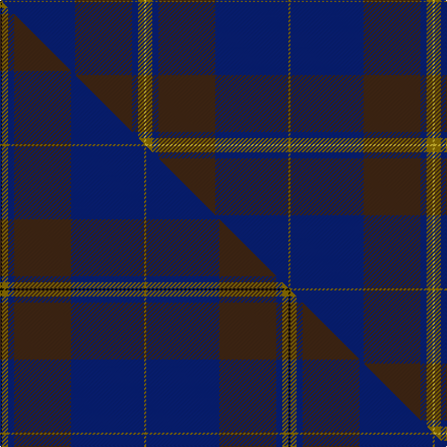

This is one **variant** — a specific cloth: this exact thread count and colourway, with its own
provenance below. It is one weaving of the [sett](/setts/y1db36do28db3y3ly1/) (the scale-free proportion — the
same cloth at any scale or shade), whose colour order is pattern [GBBBGY](/stripes/gbbbgy/).

Part of the [Potts](/tartans/potts/) tartan — the named design grouping this sett with its other cloths.

Sourced from tartans-authority.  It is a [6 stripe tartan](/stripes/stripes6/).

Original link [https://www.tartanregister.gov.uk/tartanDetails.aspx?ref=4538](https://www.tartanregister.gov.uk/tartanDetails.aspx?ref=4538)

Dataset <small>— provenance for this record, inherited from the source manifest</small>

<dl class="dataset-prov">
<dt>source</dt><dd><a href="/sources/tartans-authority/">Scottish Tartans Authority</a></dd>
<dt>data captured from</dt><dd><a href="https://github.com/thetartan/tartan-database/blob/master/data/tartans-authority/data.csv">https://github.com/thetartan/tartan-database/blob/master/data/tartans-authority/data.csv</a></dd>
<dt>data date</dt><dd>2002 <small>(this record)</small></dd>
<dt>licence</dt><dd><a href="https://creativecommons.org/licenses/by-nc-nd/4.0/">CC BY-NC-ND 4.0</a></dd>
</dl>

Capture chain <small>— the hands this data passed through, oldest first; each capture carries its own licence</small>

<ol class="capture-chain">
<li><a href="https://www.tartansauthority.com/">Scottish Tartans Authority</a> <small>the heritage body's archive — its tartan-ferret record browser is retired (links repaired to the SRT, above)</small></li>
<li><a href="https://github.com/thetartan/tartan-database">thetartan/tartan-database</a> <small>2016-2017</small> · <a href="https://creativecommons.org/licenses/by-nc-nd/4.0/">CC BY-NC-ND 4.0</a> <small>Levko Kravets's frozen compilation — the capture we vendored, and where its CC licence text came from</small></li>
<li>this dictionary <small>captured 2026-06-10 · commit 5bf86c7566</small> <small>each re-capture is a git commit to data/sources</small></li>
</ol>

## Register references

External register numbers recorded for this tartan.

- Scottish Tartans Authority (ITI): 4538

## Thread count
Y/2 DB72 DO56 DB6 Y6 LY/2

One full sett is **284 threads**.

## Palette
<table><thead><tr><th>Colour</th><th>Shade</th><th>OKLCh</th></tr></thead><tbody><tr><td>DB</td><td><code style="background-color:#082077;">#082077</code> <small style="color:#888">#082077</small></td><td><small style="color:#888">oklch(30.0% 0.149 265.1)</small></td></tr><tr><td>DO</td><td><code style="background-color:#412714;">#412714</code> <small style="color:#888">#412714</small></td><td><small style="color:#888">oklch(30.1% 0.050 55.7)</small></td></tr><tr><td>Y</td><td><code style="background-color:#8B6E00;">#8B6E00</code> <small style="color:#888">#8B6E00</small></td><td><small style="color:#888">oklch(55.1% 0.113 90.4)</small></td></tr><tr><td>LY</td><td><code style="background-color:#DCBC32;">#DCBC32</code> <small style="color:#888">#DCBC32</small></td><td><small style="color:#888">oklch(80.0% 0.150 95.2)</small></td></tr></tbody></table>

# Sample pattern

## Compared to the master

This cloth is one sett of its design; the master sett (the exemplar the design is anchored on) is below for comparison.

Its **ΔTartan distance** from the master is **0.88** — the same measure the nearest-tartans table ranks by (0 is identical; a re-scale of the same cloth is near 0, a recolour or a different proportion further).

<figure class="master-compare" style="margin:0">

this sett
master sett ★

<figcaption style="color:#888;font-size:smaller">One weave of this sett against the <a href="/setts/k1y3db3do28db36y1/">master sett ★</a>, split on the diagonal: a shared proportion runs seamlessly across it with only the shades shifting; a different proportion breaks on it.</figcaption>
</figure>

## Nearest tartan variants

The nearest existing variants by ΔTartan distance, with this cloth at the top so the swatches line up against it.

ΔTartan

Threads

Variant

Sett

—

284

<a href="/variants/s6/y1db36do28db3y3ly1~x2/">Potts (Personal)</a>

<a href="/ttd/edit/#slug=k1y3db3do28db36y1~x2&amp;base=y1db36do28db3y3ly1~x2" title="compare in the TTD">0.30</a>

284

<a href="/variants/s6/k1y3db3do28db36y1~x2/">Potts (Personal)</a>

<a href="/ttd/edit/#slug=lo3dy33db24dy2db2dy2~x2~db1406275&amp;base=y1db36do28db3y3ly1~x2" title="compare in the TTD">2.35</a>

254

<a href="/variants/s6/lo3dy33db24dy2db2dy2~x2~db1406275/">Keepers of the Quaich</a>

<a href="/ttd/edit/#slug=lo3dy33db24dy2db2dy2~x2&amp;base=y1db36do28db3y3ly1~x2" title="compare in the TTD">2.35</a>

254

<a href="/variants/s6/lo3dy33db24dy2db2dy2~x2/">Keepers of the Quaich (Corporate)</a>

<a href="/ttd/edit/#slug=db30do9w1dr5y1~x4&amp;base=y1db36do28db3y3ly1~x2" title="compare in the TTD">2.50</a>

244

<a href="/variants/s5/db30do9w1dr5y1~x4/">Dunning Primary (School)</a>

<a href="/ttd/edit/#slug=y1db11dbi5db2g1~x4~db1003265-dbi1605267&amp;base=y1db36do28db3y3ly1~x2" title="compare in the TTD">2.99</a>

152

<a href="/variants/s5/y1db11dbi5db2g1~x4~db1003265-dbi1605267/">Open Championship, The</a>

<a href="/ttd/edit/#slug=n4db1dr15db42dr6db4dy1~x2&amp;base=y1db36do28db3y3ly1~x2" title="compare in the TTD">3.18</a>

282

<a href="/variants/s7/n4db1dr15db42dr6db4dy1~x2/">Lion Brand Sportswear</a>

<a href="/ttd/edit/#slug=db26dg6db2dg17dy4w1dy4~x4&amp;base=y1db36do28db3y3ly1~x2" title="compare in the TTD">3.43</a>

360

<a href="/variants/s7/db26dg6db2dg17dy4w1dy4~x4/">Doral</a>

<a href="/ttd/edit/#slug=dt45db7w3db27r1db7~x2&amp;base=y1db36do28db3y3ly1~x2" title="compare in the TTD">3.56</a>

256

<a href="/variants/s6/dt45db7w3db27r1db7~x2/">U.S. Navy/Edzell (Military)</a>

<a href="/ttd/edit/#slug=dr28r1db18y2g6db18~x2&amp;base=y1db36do28db3y3ly1~x2" title="compare in the TTD">3.58</a>

200

<a href="/variants/s6/dr28r1db18y2g6db18~x2/">British Judo Association</a>

<a href="/ttd/edit/#slug=db4r1db18n18lb1~x4&amp;base=y1db36do28db3y3ly1~x2" title="compare in the TTD">3.86</a>

316

<a href="/variants/s5/db4r1db18n18lb1~x4/">Ardee (Corporate)</a>

## Neighbour map

Every grey dot is one of 13621 variants placed by the first two principal components of the ΔTartan feature space (42% of its variance). Red is this tartan; blue dots are its nearest — click one to open its page.

<svg viewBox="0 0 640 380" role="img" style="max-width:100%;height:auto;border:1px solid #e0e0e0;border-radius:4px;display:block" xmlns="http://www.w3.org/2000/svg"><image href="/nn/cloud.v1.png" width="640" height="380"/><a href="/variants/s6/k1y3db3do28db36y1~x2/"><circle cx="467.7" cy="165.0" r="4" fill="#3465a4"><title>Potts (Personal)</title></circle></a><a href="/variants/s6/lo3dy33db24dy2db2dy2~x2~db1406275/"><circle cx="488.9" cy="228.4" r="4" fill="#3465a4"><title>Keepers of the Quaich</title></circle></a><a href="/variants/s6/lo3dy33db24dy2db2dy2~x2/"><circle cx="478.9" cy="226.0" r="4" fill="#3465a4"><title>Keepers of the Quaich (Corporate)</title></circle></a><a href="/variants/s5/db30do9w1dr5y1~x4/"><circle cx="505.2" cy="183.1" r="4" fill="#3465a4"><title>Dunning Primary (School)</title></circle></a><a href="/variants/s5/y1db11dbi5db2g1~x4~db1003265-dbi1605267/"><circle cx="516.4" cy="260.9" r="4" fill="#3465a4"><title>Open Championship, The</title></circle></a><a href="/variants/s7/n4db1dr15db42dr6db4dy1~x2/"><circle cx="582.9" cy="177.3" r="4" fill="#3465a4"><title>Lion Brand Sportswear</title></circle></a><a href="/variants/s7/db26dg6db2dg17dy4w1dy4~x4/"><circle cx="441.9" cy="218.9" r="4" fill="#3465a4"><title>Doral</title></circle></a><a href="/variants/s6/dt45db7w3db27r1db7~x2/"><circle cx="461.0" cy="181.4" r="4" fill="#3465a4"><title>U.S. Navy/Edzell (Military)</title></circle></a><a href="/variants/s6/dr28r1db18y2g6db18~x2/"><circle cx="364.4" cy="186.9" r="4" fill="#3465a4"><title>British Judo Association</title></circle></a><a href="/variants/s5/db4r1db18n18lb1~x4/"><circle cx="416.0" cy="217.3" r="4" fill="#3465a4"><title>Ardee (Corporate)</title></circle></a><circle cx="495.7" cy="188.9" r="5" fill="#c00000"/><text x="320" y="376" text-anchor="middle" font-size="11" fill="#999">ground</text><text x="11" y="190" text-anchor="middle" font-size="11" fill="#999" transform="rotate(-90 11 190)">complexity</text></svg>

ID: /variants/s6/y1db36do28db3y3ly1~x2/
