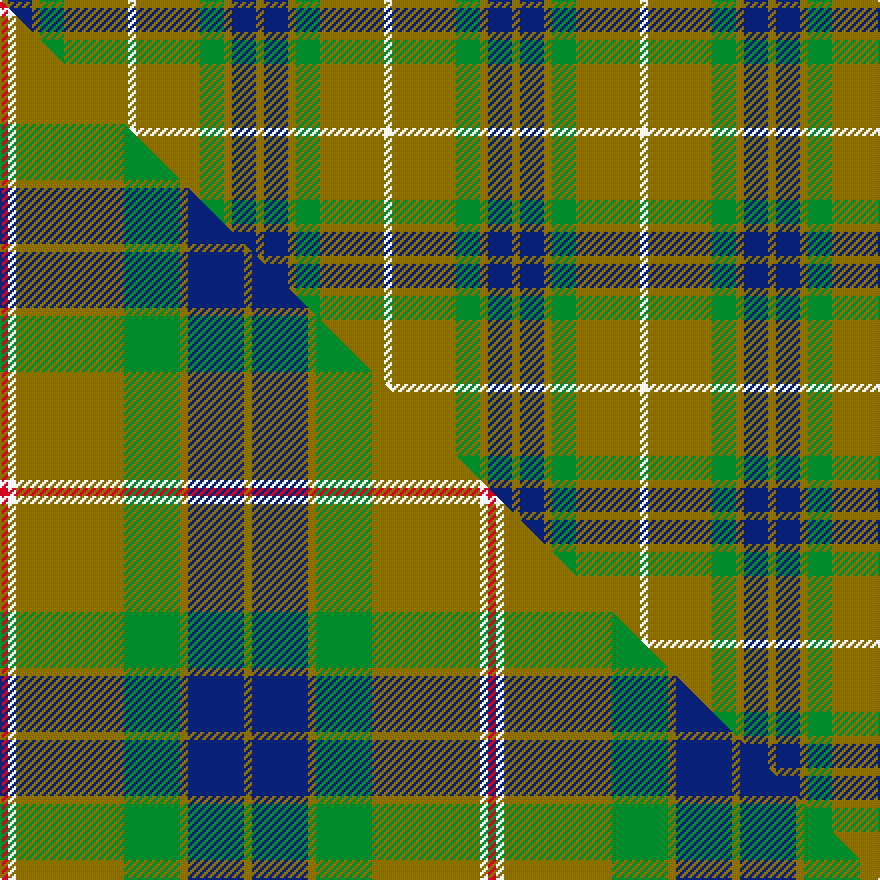

This is one **variant** — a specific cloth: this exact thread count and colourway, with its own
provenance below. It is one weaving of the [sett](/setts/y1db3y1g3y8w1/) (the scale-free proportion — the
same cloth at any scale or shade), whose colour order is pattern [GBGGGW](/stripes/gbgggw/).

Part of the [Fraser](/tartans/fraser-3/) tartan — the named design grouping this sett with its other cloths.

Sourced from register-of-tartans.  It is a [6 stripe tartan](/stripes/stripes6/).

Original link [https://www.tartanregister.gov.uk/tartanDetails.aspx?ref=1269](https://www.tartanregister.gov.uk/tartanDetails.aspx?ref=1269)

2 attestations — the source records this cloth was collapsed from (oldest owns this page)

<ul>
<li>undated — Fraser Yellow #2 (register-of-tartans, <a href="https://www.tartanregister.gov.uk/tartanDetails.aspx?ref=1269">record</a>)  <em>Similar to Vestiarium Scoticum. See also Scottish Tartans Society #1709 (original Scottish Tartans World Register reference). MacGregor-Hastie collection is found in the Scottish Tartans Society archive.</em></li>
<li>undated — Fraser, Yellow (weddslist, <a href="http://www.weddslist.com/cgi-bin/tartans/pg.pl?source=sts">record</a>) </li>
</ul>

Dataset <small>— provenance for this record, inherited from the source manifest</small>

<dl class="dataset-prov">
<dt>source</dt><dd><a href="/sources/register-of-tartans/">Scottish Register of Tartans</a></dd>
<dt>data captured from</dt><dd><a href="https://github.com/thetartan/tartan-database/blob/master/data/register-of-tartans/data.csv">https://github.com/thetartan/tartan-database/blob/master/data/register-of-tartans/data.csv</a></dd>
<dt>data date</dt><dd>2017-01-06 <small>(dataset default)</small></dd>
<dt>licence</dt><dd><a href="https://www.tartanregister.gov.uk/copyright">Crown copyright</a></dd>
</dl>

Capture chain <small>— the hands this data passed through, oldest first; each capture carries its own licence</small>

<ol class="capture-chain">
<li><a href="https://www.tartanregister.gov.uk/">Scottish Register of Tartans</a> · <a href="https://www.tartanregister.gov.uk/copyright">Crown copyright</a> <small>the living register — still published by National Records of Scotland</small></li>
<li><a href="https://github.com/thetartan/tartan-database">thetartan/tartan-database</a> <small>2016-2017</small> · <a href="https://creativecommons.org/licenses/by-nc-nd/4.0/">CC BY-NC-ND 4.0</a> <small>Levko Kravets's frozen compilation — the capture we vendored, and where its CC licence text came from</small></li>
<li>this dictionary <small>captured 2026-06-10 · commit 5bf86c7566</small> <small>each re-capture is a git commit to data/sources</small></li>
</ol>

## Register references

External register numbers recorded for this tartan.

- Scottish Register of Tartans: [1269](https://www.tartanregister.gov.uk/tartanDetails.aspx?ref=1269)
- Scottish Tartans World Register: 1878

## Thread count
Y/4 DB12 Y4 G12 Y32 W/4

One full sett is **128 threads**.

## Palette
<table><thead><tr><th>Colour</th><th>Shade</th><th>OKLCh</th></tr></thead><tbody><tr><td>DB</td><td><code style="background-color:#082077;">#082077</code> <small style="color:#888">#082077</small></td><td><small style="color:#888">oklch(30.0% 0.149 265.1)</small></td></tr><tr><td>G</td><td><code style="background-color:#008B2A;">#008B2A</code> <small style="color:#888">#008B2A</small></td><td><small style="color:#888">oklch(55.4% 0.170 145.9)</small></td></tr><tr><td>W</td><td><code style="background-color:#F7F7F7;">#F7F7F7</code> <small style="color:#888">#F7F7F7</small></td><td><small style="color:#888">oklch(97.6% 0.000 89.9)</small></td></tr><tr><td>Y</td><td><code style="background-color:#8B6E00;">#8B6E00</code> <small style="color:#888">#8B6E00</small></td><td><small style="color:#888">oklch(55.1% 0.113 90.4)</small></td></tr></tbody></table>

# Sample pattern

## Compared to the master

This cloth is one sett of its design; the master sett (the exemplar the design is anchored on) is below for comparison.

Its **ΔTartan distance** from the master is **0.96** — the same measure the nearest-tartans table ranks by (0 is identical; a re-scale of the same cloth is near 0, a recolour or a different proportion further).

<figure class="master-compare" style="margin:0">

this sett
master sett ★

<figcaption style="color:#888;font-size:smaller">One weave of this sett against the <a href="/setts/r2w2y27g14y2db14y2/">master sett ★</a>, split on the diagonal: a shared proportion runs seamlessly across it with only the shades shifting; a different proportion breaks on it.</figcaption>
</figure>

## Nearest tartan variants

The nearest existing variants by ΔTartan distance, with this cloth at the top so the swatches line up against it.

ΔTartan

Threads

Variant

Sett

—

128

<a href="/variants/s6/y1db3y1g3y8w1~x4/">Fraser Yellow #2</a>

<a href="/ttd/edit/#slug=r2w2y27g14y2db14y2~x2&amp;base=y1db3y1g3y8w1~x4" title="compare in the TTD">0.96</a>

244

<a href="/variants/s7/r2w2y27g14y2db14y2~x2/">Fraser Yellow Tartan</a>

<a href="/ttd/edit/#slug=ly5g14dy4db4dy27g3dy4ly5~x2~ly3307090-dy1603076&amp;base=y1db3y1g3y8w1~x4" title="compare in the TTD">2.26</a>

244

<a href="/variants/s8/ly5g14dy4db4dy27g3dy4ly5~x2~ly3307090-dy1603076/">Invertere (Daks #2) (Fashion)</a>

<a href="/ttd/edit/#slug=dy15r5dy30t32dy4lo3~x2&amp;base=y1db3y1g3y8w1~x4" title="compare in the TTD">2.30</a>

320

<a href="/variants/s6/dy15r5dy30t32dy4lo3~x2/">Cameron Hunting</a>

<a href="/ttd/edit/#slug=ly11dg5ly10g4dg26ly4~x2~dg1806142-g2408144&amp;base=y1db3y1g3y8w1~x4" title="compare in the TTD">2.89</a>

210

<a href="/variants/s6/ly11dg5ly10g4dg26ly4~x2~dg1806142-g2408144/">North Dakota State University (Corp.</a>

<a href="/ttd/edit/#slug=n57w5g20n5lo10~x2&amp;base=y1db3y1g3y8w1~x4" title="compare in the TTD">3.01</a>

254

<a href="/variants/s5/n57w5g20n5lo10~x2/">Johore</a>

<a href="/ttd/edit/#slug=g10db2dr8lo2g5~x4&amp;base=y1db3y1g3y8w1~x4" title="compare in the TTD">3.34</a>

156

<a href="/variants/s5/g10db2dr8lo2g5~x4/">Cub Scouts of America</a>

<a href="/ttd/edit/#slug=db3dy7g2y2g14dy2g2db3~x2&amp;base=y1db3y1g3y8w1~x4" title="compare in the TTD">3.34</a>

128

<a href="/variants/s8/db3dy7g2y2g14dy2g2db3~x2/">Daks (Loden)</a>

<a href="/ttd/edit/#slug=y2g12db6r3g12r4db1~x2&amp;base=y1db3y1g3y8w1~x4" title="compare in the TTD">3.38</a>

154

<a href="/variants/s7/y2g12db6r3g12r4db1~x2/">MacKintosh Hunting</a>

<a href="/ttd/edit/#slug=y2g12db6r3g12r4db1&amp;base=y1db3y1g3y8w1~x4" title="compare in the TTD">3.38</a>

77

<a href="/variants/s7/y2g12db6r3g12r4db1/">MacKintosh Hunting</a>

<a href="/ttd/edit/#slug=g16lo3g14dr16g2dr2g3~x2&amp;base=y1db3y1g3y8w1~x4" title="compare in the TTD">3.39</a>

186

<a href="/variants/s7/g16lo3g14dr16g2dr2g3~x2/">Scott Autumn (Fashion)</a>

## Neighbour map

Every grey dot is one of 13621 variants placed by the first two principal components of the ΔTartan feature space (42% of its variance). Red is this tartan; blue dots are its nearest — click one to open its page.

<svg viewBox="0 0 640 380" role="img" style="max-width:100%;height:auto;border:1px solid #e0e0e0;border-radius:4px;display:block" xmlns="http://www.w3.org/2000/svg"><image href="/nn/cloud.v1.png" width="640" height="380"/><a href="/variants/s7/r2w2y27g14y2db14y2~x2/"><circle cx="288.1" cy="184.3" r="4" fill="#3465a4"><title>Fraser Yellow Tartan</title></circle></a><a href="/variants/s8/ly5g14dy4db4dy27g3dy4ly5~x2~ly3307090-dy1603076/"><circle cx="326.9" cy="222.9" r="4" fill="#3465a4"><title>Invertere (Daks #2) (Fashion)</title></circle></a><a href="/variants/s6/dy15r5dy30t32dy4lo3~x2/"><circle cx="343.0" cy="223.7" r="4" fill="#3465a4"><title>Cameron Hunting</title></circle></a><a href="/variants/s6/ly11dg5ly10g4dg26ly4~x2~dg1806142-g2408144/"><circle cx="342.0" cy="279.4" r="4" fill="#3465a4"><title>North Dakota State University (Corp.</title></circle></a><a href="/variants/s5/n57w5g20n5lo10~x2/"><circle cx="370.8" cy="219.6" r="4" fill="#3465a4"><title>Johore</title></circle></a><a href="/variants/s5/g10db2dr8lo2g5~x4/"><circle cx="296.7" cy="291.9" r="4" fill="#3465a4"><title>Cub Scouts of America</title></circle></a><a href="/variants/s8/db3dy7g2y2g14dy2g2db3~x2/"><circle cx="317.5" cy="243.8" r="4" fill="#3465a4"><title>Daks (Loden)</title></circle></a><a href="/variants/s7/y2g12db6r3g12r4db1~x2/"><circle cx="331.9" cy="219.0" r="4" fill="#3465a4"><title>MacKintosh Hunting</title></circle></a><a href="/variants/s7/y2g12db6r3g12r4db1/"><circle cx="331.9" cy="219.0" r="4" fill="#3465a4"><title>MacKintosh Hunting</title></circle></a><a href="/variants/s7/g16lo3g14dr16g2dr2g3~x2/"><circle cx="398.0" cy="256.5" r="4" fill="#3465a4"><title>Scott Autumn (Fashion)</title></circle></a><circle cx="354.2" cy="242.8" r="5" fill="#c00000"/><text x="320" y="376" text-anchor="middle" font-size="11" fill="#999">ground</text><text x="11" y="190" text-anchor="middle" font-size="11" fill="#999" transform="rotate(-90 11 190)">complexity</text></svg>

ID: /variants/s6/y1db3y1g3y8w1~x4/
