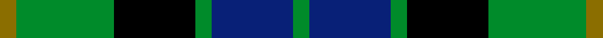

This is one **variant** — a specific cloth: this exact thread count and colourway, with its own
provenance below. It is one weaving of the [sett](/setts/y1g6k5g1db5g1/) (the scale-free proportion — the
same cloth at any scale or shade), whose colour order is pattern [GBGKGG](/stripes/gbgkgg/).

Part of the [MacKay](/tartans/m/ma/mackay-6/) tartan — the named design grouping this sett with its other cloths.

Sourced from register-of-tartans.  It is a [6 stripe tartan](/stripes/stripes6/).

Original link [https://www.tartanregister.gov.uk/tartanDetails.aspx?ref=2499](https://www.tartanregister.gov.uk/tartanDetails.aspx?ref=2499)

2 attestations — the source records this cloth was collapsed from (oldest owns this page)

<ul>
<li>undated — MacKay (Bonner) (register-of-tartans, <a href="https://www.tartanregister.gov.uk/tartanDetails.aspx?ref=2499">record</a>)  <em>From the Coulson Bonner collection. The Coulson Bonner collection is in the Scottish Tartans Society archive.</em></li>
<li>undated — MacKay (weddslist, <a href="http://www.weddslist.com/cgi-bin/tartans/pg.pl?source=sts">record</a>) </li>
</ul>

Dataset <small>— provenance for this record, inherited from the source manifest</small>

<dl class="dataset-prov">
<dt>source</dt><dd><a href="/sources/register-of-tartans/">Scottish Register of Tartans</a></dd>
<dt>data captured from</dt><dd><a href="https://github.com/thetartan/tartan-database/blob/master/data/register-of-tartans/data.csv">https://github.com/thetartan/tartan-database/blob/master/data/register-of-tartans/data.csv</a></dd>
<dt>data date</dt><dd>2017-01-06 <small>(dataset default)</small></dd>
<dt>licence</dt><dd><a href="https://www.tartanregister.gov.uk/copyright">Crown copyright</a></dd>
</dl>

Capture chain <small>— the hands this data passed through, oldest first; each capture carries its own licence</small>

<ol class="capture-chain">
<li><a href="https://www.tartanregister.gov.uk/">Scottish Register of Tartans</a> · <a href="https://www.tartanregister.gov.uk/copyright">Crown copyright</a> <small>the living register — still published by National Records of Scotland</small></li>
<li><a href="https://github.com/thetartan/tartan-database">thetartan/tartan-database</a> <small>2016-2017</small> · <a href="https://creativecommons.org/licenses/by-nc-nd/4.0/">CC BY-NC-ND 4.0</a> <small>Levko Kravets's frozen compilation — the capture we vendored, and where its CC licence text came from</small></li>
<li>this dictionary <small>captured 2026-06-10 · commit 5bf86c7566</small> <small>each re-capture is a git commit to data/sources</small></li>
</ol>

## Register references

External register numbers recorded for this tartan.

- Scottish Register of Tartans: [2499](https://www.tartanregister.gov.uk/tartanDetails.aspx?ref=2499)
- Scottish Tartans World Register: 718

## Thread count
Y/2 G12 K10 G2 DB10 G/2

One full sett is **72 threads**.

## Palette
<table><thead><tr><th>Colour</th><th>Shade</th><th>OKLCh</th></tr></thead><tbody><tr><td>DB</td><td><code style="background-color:#082077;">#082077</code> <small style="color:#888">#082077</small></td><td><small style="color:#888">oklch(30.0% 0.149 265.1)</small></td></tr><tr><td>G</td><td><code style="background-color:#008B2A;">#008B2A</code> <small style="color:#888">#008B2A</small></td><td><small style="color:#888">oklch(55.4% 0.170 145.9)</small></td></tr><tr><td>K</td><td><code style="background-color:#000000;">#000000</code> <small style="color:#888">#000000</small></td><td><small style="color:#888">oklch(0.0% 0.000 0.0)</small></td></tr><tr><td>Y</td><td><code style="background-color:#8B6E00;">#8B6E00</code> <small style="color:#888">#8B6E00</small></td><td><small style="color:#888">oklch(55.1% 0.113 90.4)</small></td></tr></tbody></table>

# Sample pattern

## Nearest tartan variants

The nearest existing variants by ΔTartan distance, with this cloth at the top so the swatches line up against it.

ΔTartan

Threads

Variant

Sett

—

72

<a href="/variants/s6/y1g6k5g1db5g1~x2/">MacKay (Bonner)</a>

<a href="/ttd/edit/#slug=r4g12k12g2db12g3~x2&amp;base=y1g6k5g1db5g1~x2" title="compare in the TTD">0.53</a>

166

<a href="/variants/s6/r4g12k12g2db12g3~x2/">Gunn - 1810 (Clan)</a>

<a href="/ttd/edit/#slug=r2g12k12g1db12g2&amp;base=y1g6k5g1db5g1~x2" title="compare in the TTD">0.94</a>

78

<a href="/variants/s6/r2g12k12g1db12g2/">Gunn</a>

<a href="/ttd/edit/#slug=r2g12k12g1db12g2~x2&amp;base=y1g6k5g1db5g1~x2" title="compare in the TTD">0.94</a>

156

<a href="/variants/s6/r2g12k12g1db12g2~x2/">Gunn</a>

<a href="/ttd/edit/#slug=k3g14k14g2db14g3&amp;base=y1g6k5g1db5g1~x2" title="compare in the TTD">1.47</a>

94

<a href="/variants/s6/k3g14k14g2db14g3/">MacKay</a>

<a href="/ttd/edit/#slug=k3g14k14g2db14g3~x2&amp;base=y1g6k5g1db5g1~x2" title="compare in the TTD">1.47</a>

188

<a href="/variants/s6/k3g14k14g2db14g3~x2/">MacKay Clan Tartan</a>

<a href="/ttd/edit/#slug=dg4g18dg3k17dg18b4~x2&amp;base=y1g6k5g1db5g1~x2" title="compare in the TTD">1.78</a>

240

<a href="/variants/s6/dg4g18dg3k17dg18b4~x2/">Scottish Airports</a>

<a href="/ttd/edit/#slug=k2g9lb1k6b4g2~x2&amp;base=y1g6k5g1db5g1~x2" title="compare in the TTD">1.80</a>

88

<a href="/variants/s6/k2g9lb1k6b4g2~x2/">Unnamed 3</a>

<a href="/ttd/edit/#slug=t10k3t10k14r2g14k4~x2&amp;base=y1g6k5g1db5g1~x2" title="compare in the TTD">1.83</a>

200

<a href="/variants/s7/t10k3t10k14r2g14k4~x2/">Fletcher #2</a>

<a href="/ttd/edit/#slug=g24db6lb3k6db12k15g4~x2&amp;base=y1g6k5g1db5g1~x2" title="compare in the TTD">1.94</a>

224

<a href="/variants/s7/g24db6lb3k6db12k15g4~x2/">Blaylock Annandale</a>

<a href="/ttd/edit/#slug=g21k6lb3g11k17db17k3~x2&amp;base=y1g6k5g1db5g1~x2" title="compare in the TTD">2.02</a>

264

<a href="/variants/s7/g21k6lb3g11k17db17k3~x2/">MacCallum</a>

## Neighbour map

Every grey dot is one of 13621 variants placed by the first two principal components of the ΔTartan feature space (42% of its variance). Red is this tartan; blue dots are its nearest — click one to open its page.

<svg viewBox="0 0 640 380" role="img" style="max-width:100%;height:auto;border:1px solid #e0e0e0;border-radius:4px;display:block" xmlns="http://www.w3.org/2000/svg"><image href="/nn/cloud.v1.png" width="640" height="380"/><a href="/variants/s6/r4g12k12g2db12g3~x2/"><circle cx="125.8" cy="238.4" r="4" fill="#3465a4"><title>Gunn - 1810 (Clan)</title></circle></a><a href="/variants/s6/r2g12k12g1db12g2/"><circle cx="162.0" cy="198.5" r="4" fill="#3465a4"><title>Gunn</title></circle></a><a href="/variants/s6/r2g12k12g1db12g2~x2/"><circle cx="162.0" cy="198.5" r="4" fill="#3465a4"><title>Gunn</title></circle></a><a href="/variants/s6/k3g14k14g2db14g3/"><circle cx="169.8" cy="239.6" r="4" fill="#3465a4"><title>MacKay</title></circle></a><a href="/variants/s6/k3g14k14g2db14g3~x2/"><circle cx="169.8" cy="239.6" r="4" fill="#3465a4"><title>MacKay Clan Tartan</title></circle></a><a href="/variants/s6/dg4g18dg3k17dg18b4~x2/"><circle cx="157.3" cy="241.6" r="4" fill="#3465a4"><title>Scottish Airports</title></circle></a><a href="/variants/s6/k2g9lb1k6b4g2~x2/"><circle cx="179.2" cy="213.0" r="4" fill="#3465a4"><title>Unnamed 3</title></circle></a><a href="/variants/s7/t10k3t10k14r2g14k4~x2/"><circle cx="120.8" cy="227.8" r="4" fill="#3465a4"><title>Fletcher #2</title></circle></a><a href="/variants/s7/g24db6lb3k6db12k15g4~x2/"><circle cx="150.3" cy="212.8" r="4" fill="#3465a4"><title>Blaylock Annandale</title></circle></a><a href="/variants/s7/g21k6lb3g11k17db17k3~x2/"><circle cx="142.7" cy="225.4" r="4" fill="#3465a4"><title>MacCallum</title></circle></a><circle cx="157.1" cy="231.9" r="5" fill="#c00000"/><text x="320" y="376" text-anchor="middle" font-size="11" fill="#999">ground</text><text x="11" y="190" text-anchor="middle" font-size="11" fill="#999" transform="rotate(-90 11 190)">complexity</text></svg>

ID: /variants/s6/y1g6k5g1db5g1~x2/
