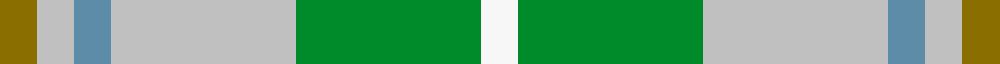

This is one **variant** — a specific cloth: this exact thread count and colourway, with its own
provenance below. It is one weaving of the [sett](/setts/y1lb1t1lb5g5w1/) (the scale-free proportion — the
same cloth at any scale or shade), whose colour order is pattern [GWBWGW](/stripes/gwbwgw/).

Part of the [MacGibboney](/tartans/m/ma/macgibboney-2/) tartan — the named design grouping this sett with its other cloths.

Sourced from tartans-authority.  It is a [6 stripe tartan](/stripes/stripes6/).

Original link [https://www.tartanregister.gov.uk/tartanDetails.aspx?ref=3839](https://www.tartanregister.gov.uk/tartanDetails.aspx?ref=3839)

Dataset <small>— provenance for this record, inherited from the source manifest</small>

<dl class="dataset-prov">
<dt>source</dt><dd><a href="/sources/tartans-authority/">Scottish Tartans Authority</a></dd>
<dt>data captured from</dt><dd><a href="https://github.com/thetartan/tartan-database/blob/master/data/tartans-authority/data.csv">https://github.com/thetartan/tartan-database/blob/master/data/tartans-authority/data.csv</a></dd>
<dt>data date</dt><dd>2000 <small>(this record)</small></dd>
<dt>licence</dt><dd><a href="https://creativecommons.org/licenses/by-nc-nd/4.0/">CC BY-NC-ND 4.0</a></dd>
</dl>

Capture chain <small>— the hands this data passed through, oldest first; each capture carries its own licence</small>

<ol class="capture-chain">
<li><a href="https://www.tartansauthority.com/">Scottish Tartans Authority</a> <small>the heritage body's archive — its tartan-ferret record browser is retired (links repaired to the SRT, above)</small></li>
<li><a href="https://github.com/thetartan/tartan-database">thetartan/tartan-database</a> <small>2016-2017</small> · <a href="https://creativecommons.org/licenses/by-nc-nd/4.0/">CC BY-NC-ND 4.0</a> <small>Levko Kravets's frozen compilation — the capture we vendored, and where its CC licence text came from</small></li>
<li>this dictionary <small>captured 2026-06-10 · commit 5bf86c7566</small> <small>each re-capture is a git commit to data/sources</small></li>
</ol>

## Register references

External register numbers recorded for this tartan.

- Scottish Tartans Authority (ITI): 3839

## Thread count
Y/8 LB8 T8 LB40 G40 W/8

One full sett is **208 threads**.

## Palette
<table><thead><tr><th>Colour</th><th>Shade</th><th>OKLCh</th></tr></thead><tbody><tr><td>T</td><td><code style="background-color:#5C8CA8;">#5C8CA8</code> <small style="color:#888">#5C8CA8</small></td><td><small style="color:#888">oklch(61.7% 0.067 235.0)</small></td></tr><tr><td>G</td><td><code style="background-color:#008B2A;">#008B2A</code> <small style="color:#888">#008B2A</small></td><td><small style="color:#888">oklch(55.4% 0.170 145.9)</small></td></tr><tr><td>W</td><td><code style="background-color:#F7F7F7;">#F7F7F7</code> <small style="color:#888">#F7F7F7</small></td><td><small style="color:#888">oklch(97.6% 0.000 89.9)</small></td></tr><tr><td>LB</td><td><code style="background-color:#C0C0C0;">#C0C0C0</code> <small style="color:#888">#C0C0C0</small></td><td><small style="color:#888">oklch(80.8% 0.000 89.9)</small></td></tr><tr><td>Y</td><td><code style="background-color:#8B6E00;">#8B6E00</code> <small style="color:#888">#8B6E00</small></td><td><small style="color:#888">oklch(55.1% 0.113 90.4)</small></td></tr></tbody></table>

# Sample pattern

## Nearest tartan variants

The nearest existing variants by ΔTartan distance, with this cloth at the top so the swatches line up against it.

ΔTartan

Threads

Variant

Sett

—

208

<a href="/variants/s6/y1lb1t1lb5g5w1~x8~lb3200000-t2503227/">MacGibboney (Name)</a>

<a href="/ttd/edit/#slug=n57w5g20n5lo10~x2&amp;base=y1lb1t1lb5g5w1~x8~lb3200000-t2503227" title="compare in the TTD">1.57</a>

254

<a href="/variants/s5/n57w5g20n5lo10~x2/">Johore</a>

<a href="/ttd/edit/#slug=g11y10dp11n33w3~x2~dp1502305-n2203265&amp;base=y1lb1t1lb5g5w1~x8~lb3200000-t2503227" title="compare in the TTD">2.42</a>

244

<a href="/variants/s5/g11y10dp11n33w3~x2~dp1502305-n2203265/">Sterling, Rob (Florida) (Persona Name Tartan</a>

<a href="/ttd/edit/#slug=g11y10dp11b33w3~x2~dp1502305-b2105244&amp;base=y1lb1t1lb5g5w1~x8~lb3200000-t2503227" title="compare in the TTD">2.43</a>

244

<a href="/variants/s5/g11y10dp11t33w3~x2~dp1502305-t2105244/">Sterling, Rob (Florida) (Personal)</a>

<a href="/ttd/edit/#slug=lb53g20w18db14~x2&amp;base=y1lb1t1lb5g5w1~x8~lb3200000-t2503227" title="compare in the TTD">2.68</a>

286

<a href="/variants/s4/lb53g20w18db14~x2/">Leutz (Name?)</a>

<a href="/ttd/edit/#slug=t5dy2dg4n3w1t5~x8&amp;base=y1lb1t1lb5g5w1~x8~lb3200000-t2503227" title="compare in the TTD">2.70</a>

240

<a href="/variants/s6/t5dy2dg4n3w1t5~x8/">Heriot Bay (District)</a>

<a href="/ttd/edit/#slug=g5lr5t1lr1y1lr1t1lr5g5w1~x4~lr3200000-t2503227&amp;base=y1lb1t1lb5g5w1~x8~lb3200000-t2503227" title="compare in the TTD">2.74</a>

184

<a href="/variants/s10/g5lb5t1lb1y1lb1t1lb5g5w1~x4~lb3200000-t2503227/">MacGiboney Clan Tartan</a>

<a href="/ttd/edit/#slug=w3lb2b4lb14g2t14lo2~x4~lb3300000-t2405244&amp;base=y1lb1t1lb5g5w1~x8~lb3200000-t2503227" title="compare in the TTD">2.76</a>

308

<a href="/variants/s7/w3lb2b4lb14g2t14lo2~x4~lb3300000-t2405244/">Seaside (Fashion)</a>

<a href="/ttd/edit/#slug=g5lr5t1lr1y1lr1t1lr5g5w1~x8~lr3200000-t2503227-w3600000&amp;base=y1lb1t1lb5g5w1~x8~lb3200000-t2503227" title="compare in the TTD">2.79</a>

368

<a href="/variants/s10/g5lb5t1lb1y1lb1t1lb5g5w1~x8~lb3200000-t2503227-w3600000/">MacGiboney Dress</a>

<a href="/ttd/edit/#slug=y1b5g1n7dp2n1w1~x4&amp;base=y1lb1t1lb5g5w1~x8~lb3200000-t2503227" title="compare in the TTD">2.85</a>

136

<a href="/variants/s7/y1b5g1n7dp2n1w1~x4/">Deeside</a>

<a href="/ttd/edit/#slug=w2g13lo13w2~x6&amp;base=y1lb1t1lb5g5w1~x8~lb3200000-t2503227" title="compare in the TTD">2.87</a>

336

<a href="/variants/s4/w2g13lo13w2~x6/">Dunoon Irish Corporate Tartan</a>

## Neighbour map

Every grey dot is one of 13621 variants placed by the first two principal components of the ΔTartan feature space (42% of its variance). Red is this tartan; blue dots are its nearest — click one to open its page.

<svg viewBox="0 0 640 380" role="img" style="max-width:100%;height:auto;border:1px solid #e0e0e0;border-radius:4px;display:block" xmlns="http://www.w3.org/2000/svg"><image href="/nn/cloud.v1.png" width="640" height="380"/><a href="/variants/s5/n57w5g20n5lo10~x2/"><circle cx="370.8" cy="219.6" r="4" fill="#3465a4"><title>Johore</title></circle></a><a href="/variants/s5/g11y10dp11n33w3~x2~dp1502305-n2203265/"><circle cx="333.5" cy="258.8" r="4" fill="#3465a4"><title>Sterling, Rob (Florida) (Persona Name Tartan</title></circle></a><a href="/variants/s5/g11y10dp11t33w3~x2~dp1502305-t2105244/"><circle cx="321.7" cy="257.2" r="4" fill="#3465a4"><title>Sterling, Rob (Florida) (Personal)</title></circle></a><a href="/variants/s4/lb53g20w18db14~x2/"><circle cx="247.4" cy="313.7" r="4" fill="#3465a4"><title>Leutz (Name?)</title></circle></a><a href="/variants/s6/t5dy2dg4n3w1t5~x8/"><circle cx="251.1" cy="305.7" r="4" fill="#3465a4"><title>Heriot Bay (District)</title></circle></a><a href="/variants/s10/g5lb5t1lb1y1lb1t1lb5g5w1~x4~lb3200000-t2503227/"><circle cx="287.1" cy="261.7" r="4" fill="#3465a4"><title>MacGiboney Clan Tartan</title></circle></a><a href="/variants/s7/w3lb2b4lb14g2t14lo2~x4~lb3300000-t2405244/"><circle cx="247.0" cy="234.5" r="4" fill="#3465a4"><title>Seaside (Fashion)</title></circle></a><a href="/variants/s10/g5lb5t1lb1y1lb1t1lb5g5w1~x8~lb3200000-t2503227-w3600000/"><circle cx="293.4" cy="263.9" r="4" fill="#3465a4"><title>MacGiboney Dress</title></circle></a><a href="/variants/s7/y1b5g1n7dp2n1w1~x4/"><circle cx="274.2" cy="231.8" r="4" fill="#3465a4"><title>Deeside</title></circle></a><a href="/variants/s4/w2g13lo13w2~x6/"><circle cx="314.4" cy="301.1" r="4" fill="#3465a4"><title>Dunoon Irish Corporate Tartan</title></circle></a><circle cx="273.1" cy="275.3" r="5" fill="#c00000"/><text x="320" y="376" text-anchor="middle" font-size="11" fill="#999">ground</text><text x="11" y="190" text-anchor="middle" font-size="11" fill="#999" transform="rotate(-90 11 190)">complexity</text></svg>

ID: /variants/s6/y1lb1t1lb5g5w1~x8~lb3200000-t2503227/
