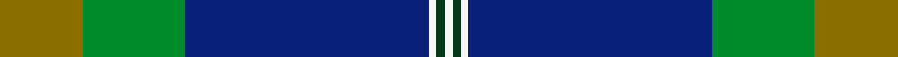

This page is one **sett** — a single exact thread-count. It belongs to the [tartan](/setts/y21g26db62w2dg2w2/)
(the same proportion at any scale), whose colour order is pattern [GGBWGW](/stripes/ggbwgw/).

Sourced from tartans-authority.  It is a [6 stripe tartan](/stripes/stripes6/).

Original link http://www.tartansauthority.com/tartan-ferret/display/7641/

2 attestations — the source records this cloth was collapsed from (oldest owns this page)

<ul>
<li>pre 2008 — Nynashamn Whisky Society (Corporate) (tartans-authority, <a href="http://www.tartansauthority.com/tartan-ferret/display/7641/">record</a>)  <em>Designed by Joacim Nieminen and Patrick McVey. The blue is for the sea surrounding the peninsula of Nyn?shamn on the coast of Stockholm. The green and blue symbolise the shores and the full green where the shores and islands meet. Most important is the pale yellow which symbolises the Scotch sungle malt. Woven by Marton Mills. The Municipality of Nyn?shamn is situated at the farthest point of S?dert?rn. To the south is a beautiful part of the Stockholm archipelago, to the north a varied cultural countryside. There are almost two thousand islets nearby and the coastline is around 1,000 kilometres.</em></li>
<li>undated — Nynaeshamn Whisky Society (register-of-tartans, <a href="https://www.tartanregister.gov.uk/tartanDetails.aspx?ref=5655">record</a>)  <em>Designed by Joacim Nieminen and Patrick McVey Gillion. The blue is for the sea surrounding the peninsula of Nynäshamn on the coast of Stockholm. The green and blue symbolise the shores and the full green where the shores and islands meet. Most important is the pale yellow which symbolises the Scotch sungle malt. Woven by Marton Mills. The Municipality of Nynäshamn is situated at the farthest point of Södertörn. To the south is a beautiful part of the Stockholm archipelago, to the north a varied cultural countryside. There are almost two thousand islets nearby and the coastline is around 1,000 kilometres.</em></li>
</ul>

## Register references

External register numbers recorded for this tartan.

- Scottish Register of Tartans: [5655](https://www.tartanregister.gov.uk/tartanDetails.aspx?ref=5655)
- Scottish Tartans Authority (ITI): 7641

## Thread count
Y/21 G26 DB62 W2 DG2 W/2

One full sett is **207 threads**.

## Palette
<table><thead><tr><th>Colour</th><th>Shade</th><th>OKLCh</th></tr></thead><tbody><tr><td>DB</td><td><code style="background-color:#082077;">#082077</code> <small style="color:#888">#082077</small></td><td><small style="color:#888">oklch(30.0% 0.149 265.1)</small></td></tr><tr><td>DG</td><td><code style="background-color:#053819;">#053819</code> <small style="color:#888">#053819</small></td><td><small style="color:#888">oklch(30.0% 0.075 151.3)</small></td></tr><tr><td>G</td><td><code style="background-color:#008B2A;">#008B2A</code> <small style="color:#888">#008B2A</small></td><td><small style="color:#888">oklch(55.4% 0.170 145.9)</small></td></tr><tr><td>W</td><td><code style="background-color:#F7F7F7;">#F7F7F7</code> <small style="color:#888">#F7F7F7</small></td><td><small style="color:#888">oklch(97.6% 0.000 89.9)</small></td></tr><tr><td>Y</td><td><code style="background-color:#8B6E00;">#8B6E00</code> <small style="color:#888">#8B6E00</small></td><td><small style="color:#888">oklch(55.1% 0.113 90.4)</small></td></tr></tbody></table>

# Sample pattern

## Nearest tartan variants

The nearest existing variants by ΔTartan distance, with this cloth at the top so the swatches line up against it.

ΔTartan

Threads

Variant

Sett

—

207

<a href="/variants/s6/y21g26db62w2dg2w2/">Nynashamn Whisky Society (Corporate)</a>

<a href="/ttd/edit/#slug=db62ly4dy10do3g21~x2&amp;base=y21g26db62w2dg2w2" title="compare in the TTD">2.47</a>

234

<a href="/variants/s5/db62ly4dy10do3g21~x2/">McGovern (2016)</a>

<a href="/ttd/edit/#slug=lb52y2n24dr3dy26n4~x2&amp;base=y21g26db62w2dg2w2" title="compare in the TTD">2.57</a>

332

<a href="/variants/s6/lb52y2n24dr3dy26n4~x2/">Outlander #1</a>

<a href="/ttd/edit/#slug=w3r2db31dg30y2dg2y1~x2&amp;base=y21g26db62w2dg2w2" title="compare in the TTD">2.70</a>

276

<a href="/variants/s7/w3r2db31dg30y2dg2y1~x2/">Caig (Personal)</a>

<a href="/ttd/edit/#slug=db50g25ly3lb8r1w1r1~x2&amp;base=y21g26db62w2dg2w2" title="compare in the TTD">2.78</a>

254

<a href="/variants/s7/db50g25ly3lb8r1w1r1~x2/">Wells (2014)</a>

<a href="/ttd/edit/#slug=db50g25y3n8r1w1r1~x2&amp;base=y21g26db62w2dg2w2" title="compare in the TTD">2.80</a>

254

<a href="/variants/s7/db50g25y3n8r1w1r1~x2/">Wells (2014)</a>

<a href="/ttd/edit/#slug=dg30w8b32y1b8~x2&amp;base=y21g26db62w2dg2w2" title="compare in the TTD">2.90</a>

240

<a href="/variants/s5/dg30w8b32y1b8~x2/">Boroughmuir</a>

<a href="/ttd/edit/#slug=g30w8db32y1db8~x2&amp;base=y21g26db62w2dg2w2" title="compare in the TTD">2.90</a>

240

<a href="/variants/s5/g30w8db32y1db8~x2/">Wimbledon</a>

## Neighbour map

Every grey dot is one of 13620 variants placed by the first two principal components of the ΔTartan feature space (42% of its variance). Red is this tartan; blue dots are its nearest — click one to open its page.

<svg viewBox="0 0 640 380" role="img" style="max-width:100%;height:auto;border:1px solid #e0e0e0;border-radius:4px;display:block" xmlns="http://www.w3.org/2000/svg"><image href="/nn/cloud.v1.png" width="640" height="380"/><a href="/variants/s5/db62ly4dy10do3g21~x2/"><circle cx="402.6" cy="184.3" r="4" fill="#3465a4"><title>McGovern (2016)</title></circle></a><a href="/variants/s6/lb52y2n24dr3dy26n4~x2/"><circle cx="300.3" cy="172.8" r="4" fill="#3465a4"><title>Outlander #1</title></circle></a><a href="/variants/s7/w3r2db31dg30y2dg2y1~x2/"><circle cx="342.4" cy="140.7" r="4" fill="#3465a4"><title>Caig (Personal)</title></circle></a><a href="/variants/s7/db50g25ly3lb8r1w1r1~x2/"><circle cx="333.8" cy="88.9" r="4" fill="#3465a4"><title>Wells (2014)</title></circle></a><a href="/variants/s7/db50g25y3n8r1w1r1~x2/"><circle cx="363.0" cy="98.3" r="4" fill="#3465a4"><title>Wells (2014)</title></circle></a><a href="/variants/s5/dg30w8b32y1b8~x2/"><circle cx="344.0" cy="199.1" r="4" fill="#3465a4"><title>Boroughmuir</title></circle></a><a href="/variants/s5/g30w8db32y1db8~x2/"><circle cx="326.7" cy="196.4" r="4" fill="#3465a4"><title>Wimbledon</title></circle></a><circle cx="344.3" cy="155.9" r="5" fill="#c00000"/><text x="320" y="376" text-anchor="middle" font-size="11" fill="#999">ground</text><text x="11" y="190" text-anchor="middle" font-size="11" fill="#999" transform="rotate(-90 11 190)">complexity</text></svg>

ID: /variants/s6/y21g26db62w2dg2w2/
