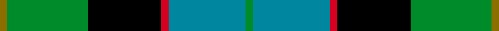

This is one **variant** — a specific cloth: this exact thread count and colourway, with its own
provenance below. It is one weaving of the [sett](/setts/y2g23k21r2t22g2/) (the scale-free proportion — the
same cloth at any scale or shade), whose colour order is pattern [GBRKGG](/stripes/gbrkgg/).

Sourced from register-of-tartans.  It is a [6 stripe tartan](/stripes/stripes6/).

Original link [https://www.tartanregister.gov.uk/tartanDetails.aspx?ref=3589](https://www.tartanregister.gov.uk/tartanDetails.aspx?ref=3589)

2 attestations — the source records this cloth was collapsed from (oldest owns this page)

<ul>
<li>01/08/2005 — Royal Ashburn Golf Club (register-of-tartans, <a href="https://www.tartanregister.gov.uk/tartanDetails.aspx?ref=3589">record</a>)  <em>For the Royal Ashburn Gold Club in Ashburn, Ontario (about 25 miles NE of Toronto) which was established in 1961 and originally known as the Thunderbird Golf Club. In spring 2000 it was renamed the Royal Ashburn to reflect the history and heritage of the hamlet of Ashburn. The red is for Canada, yellow the sunrise, green the manicured lawns and fairways and black the trees and rough areas.</em></li>
<li>2005 August — Royal Ashburn Golf Club (Sports) (tartans-authority, <a href="https://www.tartanregister.gov.uk/tartanDetails.aspx?ref=6779">record</a>)  <em>For the Royal Ashburn Gold Club in Ashburn, Ontario (about 25 miles NE of Toronto) which was established in 1961 and originally known as the Thunderbird Golf Club. In spring 2000 it was renamed the Royal Ashburn to reflect the history and heritage of the hamlet of Ashburn. The red is for Canada, yellow the sunrise, green the manicured lawns and fairways and black the trees and rough areas.</em></li>
</ul>

Dataset <small>— provenance for this record, inherited from the source manifest</small>

<dl class="dataset-prov">
<dt>source</dt><dd><a href="/sources/register-of-tartans/">Scottish Register of Tartans</a></dd>
<dt>data captured from</dt><dd><a href="https://github.com/thetartan/tartan-database/blob/master/data/register-of-tartans/data.csv">https://github.com/thetartan/tartan-database/blob/master/data/register-of-tartans/data.csv</a></dd>
<dt>data date</dt><dd>01/08/2005 <small>(this record)</small></dd>
<dt>licence</dt><dd><a href="https://www.tartanregister.gov.uk/copyright">Crown copyright</a></dd>
</dl>

Capture chain <small>— the hands this data passed through, oldest first; each capture carries its own licence</small>

<ol class="capture-chain">
<li><a href="https://www.tartanregister.gov.uk/">Scottish Register of Tartans</a> · <a href="https://www.tartanregister.gov.uk/copyright">Crown copyright</a> <small>the living register — still published by National Records of Scotland</small></li>
<li><a href="https://github.com/thetartan/tartan-database">thetartan/tartan-database</a> <small>2016-2017</small> · <a href="https://creativecommons.org/licenses/by-nc-nd/4.0/">CC BY-NC-ND 4.0</a> <small>Levko Kravets's frozen compilation — the capture we vendored, and where its CC licence text came from</small></li>
<li>this dictionary <small>captured 2026-06-10 · commit 5bf86c7566</small> <small>each re-capture is a git commit to data/sources</small></li>
</ol>

## Register references

External register numbers recorded for this tartan.

- Scottish Register of Tartans: [3589](https://www.tartanregister.gov.uk/tartanDetails.aspx?ref=3589)
- Scottish Tartans Authority (ITI): 6779

## Thread count
Y/4 G46 K42 R4 T44 G/4

One full sett is **280 threads**.

## Palette
<table><thead><tr><th>Colour</th><th>Shade</th><th>OKLCh</th></tr></thead><tbody><tr><td>T</td><td><code style="background-color:#00879F;">#00879F</code> <small style="color:#888">#00879F</small></td><td><small style="color:#888">oklch(57.4% 0.102 216.1)</small></td></tr><tr><td>G</td><td><code style="background-color:#008B2A;">#008B2A</code> <small style="color:#888">#008B2A</small></td><td><small style="color:#888">oklch(55.4% 0.170 145.9)</small></td></tr><tr><td>K</td><td><code style="background-color:#000000;">#000000</code> <small style="color:#888">#000000</small></td><td><small style="color:#888">oklch(0.0% 0.000 0.0)</small></td></tr><tr><td>R</td><td><code style="background-color:#D60020;">#D60020</code> <small style="color:#888">#D60020</small></td><td><small style="color:#888">oklch(55.2% 0.224 25.5)</small></td></tr><tr><td>Y</td><td><code style="background-color:#8B6E00;">#8B6E00</code> <small style="color:#888">#8B6E00</small></td><td><small style="color:#888">oklch(55.1% 0.113 90.4)</small></td></tr></tbody></table>

# Sample pattern

## Nearest tartan variants

The nearest existing variants by ΔTartan distance, with this cloth at the top so the swatches line up against it.

ΔTartan

Threads

Variant

Sett

—

280

<a href="/variants/s6/y2g23k21r2t22g2~x2/">Royal Ashburn Golf Club</a>

<a href="/ttd/edit/#slug=w3b22r3k22g22y2~x2&amp;base=y2g23k21r2t22g2~x2" title="compare in the TTD">1.10</a>

286

<a href="/variants/s6/w3b22r3k22g22y2~x2/">Morris of Balgonie</a>

<a href="/ttd/edit/#slug=r12db68w7k39g75r6g6&amp;base=y2g23k21r2t22g2~x2" title="compare in the TTD">1.13</a>

408

<a href="/variants/s7/r12db68w7k39g75r6g6/">Rhun (Fashion)</a>

<a href="/ttd/edit/#slug=g4w1g10k10db10r2&amp;base=y2g23k21r2t22g2~x2" title="compare in the TTD">1.22</a>

68

<a href="/variants/s6/g4w1g10k10db10r2/">Rose Hunting</a>

<a href="/ttd/edit/#slug=k2g11y1k8t9r2~x4&amp;base=y2g23k21r2t22g2~x2" title="compare in the TTD">1.42</a>

248

<a href="/variants/s6/k2g11y1k8t9r2~x4/">Forsyth (1795)</a>

<a href="/ttd/edit/#slug=k2g11y1k8db9r2~x4&amp;base=y2g23k21r2t22g2~x2" title="compare in the TTD">1.42</a>

248

<a href="/variants/s6/k2g11y1k8db9r2~x4/">Forsyth Clan Tartan</a>

<a href="/ttd/edit/#slug=r2g12k12g1db12g1~x2&amp;base=y2g23k21r2t22g2~x2" title="compare in the TTD">1.43</a>

154

<a href="/variants/s6/r2g12k12g1db12g1~x2/">Gunn Clan Tartan</a>

<a href="/ttd/edit/#slug=dy2g12k10r1t16r2~x4&amp;base=y2g23k21r2t22g2~x2" title="compare in the TTD">1.43</a>

328

<a href="/variants/s6/dy2g12k10r1t16r2~x4/">MacWilliam (Clan)</a>

<a href="/ttd/edit/#slug=r2g12k12g1db12g2&amp;base=y2g23k21r2t22g2~x2" title="compare in the TTD">1.48</a>

78

<a href="/variants/s6/r2g12k12g1db12g2/">Gunn</a>

<a href="/ttd/edit/#slug=r2g12k12g1db12g2~x2&amp;base=y2g23k21r2t22g2~x2" title="compare in the TTD">1.48</a>

156

<a href="/variants/s6/r2g12k12g1db12g2~x2/">Gunn</a>

<a href="/ttd/edit/#slug=k3g14k14g2t14r3~x2&amp;base=y2g23k21r2t22g2~x2" title="compare in the TTD">1.56</a>

188

<a href="/variants/s6/k3g14k14g2t14r3~x2/">Morrison Society</a>

## Neighbour map

Every grey dot is one of 13621 variants placed by the first two principal components of the ΔTartan feature space (42% of its variance). Red is this tartan; blue dots are its nearest — click one to open its page.

<svg viewBox="0 0 640 380" role="img" style="max-width:100%;height:auto;border:1px solid #e0e0e0;border-radius:4px;display:block" xmlns="http://www.w3.org/2000/svg"><image href="/nn/cloud.v1.png" width="640" height="380"/><a href="/variants/s6/w3b22r3k22g22y2~x2/"><circle cx="81.9" cy="169.2" r="4" fill="#3465a4"><title>Morris of Balgonie</title></circle></a><a href="/variants/s7/r12db68w7k39g75r6g6/"><circle cx="149.5" cy="162.0" r="4" fill="#3465a4"><title>Rhun (Fashion)</title></circle></a><a href="/variants/s6/g4w1g10k10db10r2/"><circle cx="125.2" cy="203.4" r="4" fill="#3465a4"><title>Rose Hunting</title></circle></a><a href="/variants/s6/k2g11y1k8t9r2~x4/"><circle cx="113.7" cy="191.9" r="4" fill="#3465a4"><title>Forsyth (1795)</title></circle></a><a href="/variants/s6/k2g11y1k8db9r2~x4/"><circle cx="118.8" cy="190.3" r="4" fill="#3465a4"><title>Forsyth Clan Tartan</title></circle></a><a href="/variants/s6/r2g12k12g1db12g1~x2/"><circle cx="160.0" cy="194.6" r="4" fill="#3465a4"><title>Gunn Clan Tartan</title></circle></a><a href="/variants/s6/dy2g12k10r1t16r2~x4/"><circle cx="149.0" cy="171.4" r="4" fill="#3465a4"><title>MacWilliam (Clan)</title></circle></a><a href="/variants/s6/r2g12k12g1db12g2/"><circle cx="162.0" cy="198.5" r="4" fill="#3465a4"><title>Gunn</title></circle></a><a href="/variants/s6/r2g12k12g1db12g2~x2/"><circle cx="162.0" cy="198.5" r="4" fill="#3465a4"><title>Gunn</title></circle></a><a href="/variants/s6/k3g14k14g2t14r3~x2/"><circle cx="119.1" cy="224.3" r="4" fill="#3465a4"><title>Morrison Society</title></circle></a><circle cx="135.6" cy="181.1" r="5" fill="#c00000"/><text x="320" y="376" text-anchor="middle" font-size="11" fill="#999">ground</text><text x="11" y="190" text-anchor="middle" font-size="11" fill="#999" transform="rotate(-90 11 190)">complexity</text></svg>

ID: /variants/s6/y2g23k21r2t22g2~x2/
