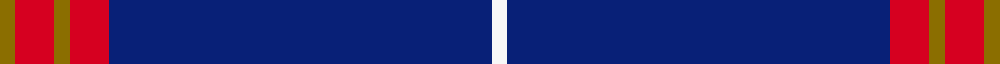

This is one **variant** — a specific cloth: this exact thread count and colourway, with its own
provenance below. It is one weaving of the [sett](/tartans/b/ba/balmer/) (the scale-free proportion — the
same cloth at any scale or shade), whose colour order is pattern [GRGRBW](/stripes/grgrbw/).

Part of the [Balmer](/tartans/b/ba/balmer/) tartan — the named design grouping this sett with its other cloths.

Sourced from tartans-authority.  It is a [6 stripe tartan](/stripes/stripes6/).

Original link <code>http://www.tartansauthority.com/tartan-ferret/display/7133/</code> — retired · [Internet Archive copy](https://web.archive.org/web/*/http://www.tartansauthority.com/tartan-ferret/display/7133/*)

2 attestations — the source records this cloth was collapsed from (oldest owns this page)

<ul>
<li>Dec 2001 — Balmer (Personal) (tartans-authority, <a href="https://web.archive.org/web/*/http://www.tartansauthority.com/tartan-ferret/display/7133/*">record</a>)  <em>Apparently designed in December 2001 but not 'registered' with the STWR until 2005. For the exclusive family use of Alex Balmer from East Kilbride. Woven by D C Dalgliesh. In January of 2008 a tartan was submitted for the Caledonian Club of San Francisco which was so close to this sett that the STA declined to 'register' it. Alex Balmer also confirmed his wish that the design be reserved for his family only. The CC of San Francisco count (taken from a woven sample) is as follows: Y/4 R4 Y6 R20 K2 B92 W/8.</em></li>
<li>undated — Balmer (Personal) (register-of-tartans, <a href="https://www.tartanregister.gov.uk/tartanDetails.aspx?ref=5437">record</a>)  <em>For family use of Alex Balmer from East Kilbride.</em></li>
</ul>

Dataset <small>— provenance for this record, inherited from the source manifest</small>

<dl class="dataset-prov">
<dt>source</dt><dd><a href="/sources/tartans-authority/">Scottish Tartans Authority</a></dd>
<dt>data captured from</dt><dd><a href="https://github.com/thetartan/tartan-database/blob/master/data/tartans-authority/data.csv">https://github.com/thetartan/tartan-database/blob/master/data/tartans-authority/data.csv</a></dd>
<dt>data date</dt><dd>Dec 2001 <small>(this record)</small></dd>
<dt>licence</dt><dd><a href="https://creativecommons.org/licenses/by-nc-nd/4.0/">CC BY-NC-ND 4.0</a></dd>
</dl>

Capture chain <small>— the hands this data passed through, oldest first; each capture carries its own licence</small>

<ol class="capture-chain">
<li><a href="https://www.tartansauthority.com/">Scottish Tartans Authority</a> <small>the heritage body’s archive — its tartan-ferret record browser is retired; dead record links are shown unlinked, with an Internet Archive copy (ITI numbers are not SRT references)</small></li>
<li><a href="https://github.com/thetartan/tartan-database">thetartan/tartan-database</a> <small>2016-2017</small> · <a href="https://creativecommons.org/licenses/by-nc-nd/4.0/">CC BY-NC-ND 4.0</a> <small>Levko Kravets's frozen compilation — the capture we vendored, and where its CC licence text came from</small></li>
<li>this dictionary <small>captured 2026-06-10 · commit 5bf86c7566</small> <small>each re-capture is a git commit to data/sources</small></li>
</ol>

## Register references

External register numbers recorded for this tartan.

- Scottish Register of Tartans: [5437](https://www.tartanregister.gov.uk/tartanDetails.aspx?ref=5437)
- Scottish Tartans Authority (ITI): 7133
- Scottish Tartans World Register: 3040

## Thread count
Y/4 R10 Y4 R10 DB98 W/4

One full sett is **252 threads**.

## Palette
<table><thead><tr><th>Colour</th><th>Shade</th><th>OKLCh</th></tr></thead><tbody><tr><td>DB</td><td><code style="background-color:#082077;">#082077</code> <small style="color:#888">#082077</small></td><td><small style="color:#888">oklch(30.0% 0.149 265.1)</small></td></tr><tr><td>W</td><td><code style="background-color:#F7F7F7;">#F7F7F7</code> <small style="color:#888">#F7F7F7</small></td><td><small style="color:#888">oklch(97.6% 0.000 89.9)</small></td></tr><tr><td>R</td><td><code style="background-color:#D60020;">#D60020</code> <small style="color:#888">#D60020</small></td><td><small style="color:#888">oklch(55.2% 0.224 25.5)</small></td></tr><tr><td>Y</td><td><code style="background-color:#8B6E00;">#8B6E00</code> <small style="color:#888">#8B6E00</small></td><td><small style="color:#888">oklch(55.1% 0.113 90.4)</small></td></tr></tbody></table>

# Sample pattern

## Nearest tartan variants

The nearest existing variants by ΔTartan distance, with this cloth at the top so the swatches line up against it.

ΔTartan

Threads

Variant

Sett

—

252

<a href="/variants/s6/y2r5y2r5db49w2~x2/">Balmer (Personal)</a>

<a href="/ttd/edit/#slug=db19r2w2r2k2~x4&amp;base=y2r5y2r5db49w2~x2" title="compare in the TTD">1.14</a>

132

<a href="/variants/s5/db19r2w2r2k2~x4/">Laing of Archiestown</a>

<a href="/ttd/edit/#slug=g5w1r5k5db43r1~x2&amp;base=y2r5y2r5db49w2~x2" title="compare in the TTD">1.48</a>

228

<a href="/variants/s6/g5w1r5k5db43r1~x2/">Michael (John) (Personal)</a>

<a href="/ttd/edit/#slug=y2db66dr16w2dr1w1~x2&amp;base=y2r5y2r5db49w2~x2" title="compare in the TTD">1.58</a>

346

<a href="/variants/s6/y2db66dr16w2dr1w1~x2/">Coogan (Personal)</a>

<a href="/ttd/edit/#slug=w2dp2db25r3y3g1~x4&amp;base=y2r5y2r5db49w2~x2" title="compare in the TTD">1.90</a>

276

<a href="/variants/s6/w2dp2db25r3y3g1~x4/">Pool, Robert David (Personal)</a>

<a href="/ttd/edit/#slug=db35w4db10r3ri3r3~x4~r1706009-ri2109032&amp;base=y2r5y2r5db49w2~x2" title="compare in the TTD">1.91</a>

312

<a href="/variants/s6/db35w4db10r3ri3r3~x4~r1706009-ri2109032/">Steffen, Morris (Personal)</a>

<a href="/ttd/edit/#slug=db35w4db10dr3r3dr3~x4&amp;base=y2r5y2r5db49w2~x2" title="compare in the TTD">1.91</a>

312

<a href="/variants/s6/db35w4db10dr3r3dr3~x4/">Steffen, Markus (Personal)</a>

<a href="/ttd/edit/#slug=db58y2r1lb4y2r2lb7r8y6~x2&amp;base=y2r5y2r5db49w2~x2" title="compare in the TTD">2.06</a>

232

<a href="/variants/s9/db58y2r1lb4y2r2lb7r8y6~x2/">Hybelius, J-A (Personal)</a>

<a href="/ttd/edit/#slug=r5w4k4db80w4~x2&amp;base=y2r5y2r5db49w2~x2" title="compare in the TTD">2.07</a>

370

<a href="/variants/s5/r5w4k4db80w4~x2/">Volunteer Lifesaving Corps (Corp.)</a>

<a href="/ttd/edit/#slug=db32r3db4k1y3&amp;base=y2r5y2r5db49w2~x2" title="compare in the TTD">2.08</a>

51

<a href="/variants/s5/db32r3db4k1y3/">MacLaine of Lochbuie Hunting</a>

<a href="/ttd/edit/#slug=db32r3db4k1y3~x2&amp;base=y2r5y2r5db49w2~x2" title="compare in the TTD">2.08</a>

102

<a href="/variants/s5/db32r3db4k1y3~x2/">MacLaine of Lochbuie Hunting Clan Tartan</a>

## Neighbour map

Every grey dot is one of 13657 variants placed by the first two principal components of the ΔTartan feature space (42% of its variance). Red is this tartan; blue dots are its nearest — click one to open its page. The map is a flat projection of a many-dimensional space — [how to read it](/posts/neighbourhood-maps/).

<svg viewBox="0 0 640 380" role="img" style="max-width:100%;height:auto;border:1px solid #e0e0e0;border-radius:4px;display:block" xmlns="http://www.w3.org/2000/svg"><image href="/nn/cloud.v1.png" width="640" height="380"/><a href="/variants/s5/db19r2w2r2k2~x4/"><circle cx="374.5" cy="164.2" r="4" fill="#3465a4"><title>Laing of Archiestown</title></circle></a><a href="/variants/s6/g5w1r5k5db43r1~x2/"><circle cx="437.5" cy="85.6" r="4" fill="#3465a4"><title>Michael (John) (Personal)</title></circle></a><a href="/variants/s6/y2db66dr16w2dr1w1~x2/"><circle cx="587.1" cy="133.0" r="4" fill="#3465a4"><title>Coogan (Personal)</title></circle></a><a href="/variants/s6/w2dp2db25r3y3g1~x4/"><circle cx="403.5" cy="109.4" r="4" fill="#3465a4"><title>Pool, Robert David (Personal)</title></circle></a><a href="/variants/s6/db35w4db10r3ri3r3~x4~r1706009-ri2109032/"><circle cx="466.9" cy="171.3" r="4" fill="#3465a4"><title>Steffen, Morris (Personal)</title></circle></a><a href="/variants/s6/db35w4db10dr3r3dr3~x4/"><circle cx="475.6" cy="177.5" r="4" fill="#3465a4"><title>Steffen, Markus (Personal)</title></circle></a><a href="/variants/s9/db58y2r1lb4y2r2lb7r8y6~x2/"><circle cx="424.7" cy="81.8" r="4" fill="#3465a4"><title>Hybelius, J-A (Personal)</title></circle></a><a href="/variants/s5/r5w4k4db80w4~x2/"><circle cx="516.3" cy="128.4" r="4" fill="#3465a4"><title>Volunteer Lifesaving Corps (Corp.)</title></circle></a><a href="/variants/s5/db32r3db4k1y3/"><circle cx="589.4" cy="135.2" r="4" fill="#3465a4"><title>MacLaine of Lochbuie Hunting</title></circle></a><a href="/variants/s5/db32r3db4k1y3~x2/"><circle cx="589.4" cy="135.2" r="4" fill="#3465a4"><title>MacLaine of Lochbuie Hunting Clan Tartan</title></circle></a><circle cx="497.8" cy="127.7" r="5" fill="#c00000"/><text x="320" y="376" text-anchor="middle" font-size="11" fill="#999">ground</text><text x="11" y="190" text-anchor="middle" font-size="11" fill="#999" transform="rotate(-90 11 190)">complexity</text></svg>

ID: /variants/s6/y2r5y2r5db49w2~x2/
