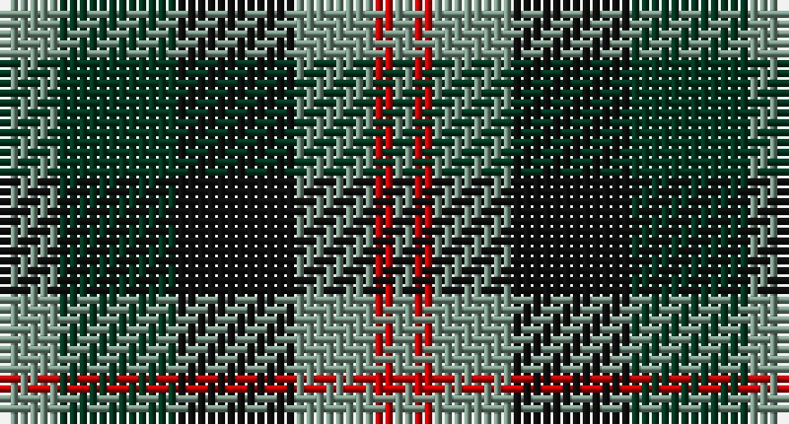

This page is one **sett** — a single exact thread-count. It belongs to the [tartan](/setts/y3dg6k6y4r1y1/)
(the same proportion at any scale), whose colour order is pattern [GGKGRG](/stripes/ggkgrg/).

Sourced from register-of-tartans.  It is a [6 stripe tartan](/stripes/stripes6/).

Original link https://www.tartanregister.gov.uk/tartanDetails.aspx?ref=4499

## Register references

External register numbers recorded for this tartan.

- Scottish Register of Tartans: [4499](https://www.tartanregister.gov.uk/tartanDetails.aspx?ref=4499)
- Scottish Tartans Authority (ITI): 154
- Scottish Tartans World Register: 154

## Thread count
LG/6 DG12 K12 LG8 R2 LG/2

One full sett is **76 threads**.

## Palette

Palette: <strong>Tartan Register</strong>
<table><thead><tr><th>Colour</th><th>Threads</th><th>Shade</th><th>Base</th><th>OKLCh</th></tr></thead><tbody><tr><td>LG/</td><td style="text-align:right;font-variant-numeric:tabular-nums">6</td><td><code style="background-color:#789484;">#789484</code> <small style="color:#888">#789484</small></td><td>G <code style="background-color:#006100;">#006100</code></td><td><small style="color:#888">oklch(64.0% 0.040 160.0)</small></td></tr><tr><td>DG</td><td style="text-align:right;font-variant-numeric:tabular-nums">12</td><td><code style="background-color:#003820;">#003820</code> <small style="color:#888">#003820</small></td><td>G <code style="background-color:#006100;">#006100</code></td><td><small style="color:#888">oklch(30.0% 0.070 158.3)</small></td></tr><tr><td>K</td><td style="text-align:right;font-variant-numeric:tabular-nums">12</td><td><code style="background-color:#101010;">#101010</code> <small style="color:#888">#101010</small></td><td>K <code style="background-color:#000000;">#000000</code></td><td><small style="color:#888">oklch(17.3% 0.000 89.9)</small></td></tr><tr><td>LG</td><td style="text-align:right;font-variant-numeric:tabular-nums">8</td><td><code style="background-color:#789484;">#789484</code> <small style="color:#888">#789484</small></td><td>G <code style="background-color:#006100;">#006100</code></td><td><small style="color:#888">oklch(64.0% 0.040 160.0)</small></td></tr><tr><td>R</td><td style="text-align:right;font-variant-numeric:tabular-nums">2</td><td><code style="background-color:#C80000;">#C80000</code> <small style="color:#888">#C80000</small></td><td>R <code style="background-color:#CC0000;">#CC0000</code></td><td><small style="color:#888">oklch(52.3% 0.215 29.2)</small></td></tr><tr><td>LG/</td><td style="text-align:right;font-variant-numeric:tabular-nums">2</td><td><code style="background-color:#789484;">#789484</code> <small style="color:#888">#789484</small></td><td>G <code style="background-color:#006100;">#006100</code></td><td><small style="color:#888">oklch(64.0% 0.040 160.0)</small></td></tr></tbody></table>

# Sample pattern

## Nearest tartans

The nearest existing variants by ΔTartan distance, with this tartan at the top so the swatches line up against it.

ΔTartan

Tartan

Sett

—

<a href="/ttd/edit/#slug=y3dg6k6y4r1y1~x2">Waterloo</a> <a class="nn-out" href="/variants/s6/y3dg6k6y4r1y1~x2/" title="open its dictionary page">↗</a>

0.75

<a href="/ttd/edit/#slug=t3dg12k14t11r3t3~x2&amp;base=y3dg6k6y4r1y1~x2">Wellington or Waterloo</a> <a class="nn-out" href="/variants/s6/t3dg12k14t11r3t3~x2/" title="open its dictionary page">↗</a>

0.77

<a href="/ttd/edit/#slug=k4w2g13k13t12k2~x2&amp;base=y3dg6k6y4r1y1~x2">Melville</a> <a class="nn-out" href="/variants/s6/k4w2g13k13t12k2~x2/" title="open its dictionary page">↗</a>

0.79

<a href="/ttd/edit/#slug=b10k3b10k14r2g14r5~x2&amp;base=y3dg6k6y4r1y1~x2">Fletcher of Dunans</a> <a class="nn-out" href="/variants/s7/b10k3b10k14r2g14r5~x2/" title="open its dictionary page">↗</a>

0.85

<a href="/ttd/edit/#slug=k3g14k14g2b14r3~x2&amp;base=y3dg6k6y4r1y1~x2">Morrison Society</a> <a class="nn-out" href="/variants/s6/k3g14k14g2b14r3~x2/" title="open its dictionary page">↗</a>

0.86

<a href="/ttd/edit/#slug=k2g10t2k9dp8g2~x2&amp;base=y3dg6k6y4r1y1~x2">Lennie Family Tartan</a> <a class="nn-out" href="/variants/s6/k2g10t2k9dp8g2~x2/" title="open its dictionary page">↗</a>

0.89

<a href="/ttd/edit/#slug=r4g12k12g2db12g3~x2&amp;base=y3dg6k6y4r1y1~x2">Gunn - 1810 (Clan)</a> <a class="nn-out" href="/variants/s6/r4g12k12g2db12g3~x2/" title="open its dictionary page">↗</a>

0.91

<a href="/ttd/edit/#slug=o6r1k6r1g6~x6&amp;base=y3dg6k6y4r1y1~x2">Timespan</a> <a class="nn-out" href="/variants/s5/o6r1k6r1g6~x6/" title="open its dictionary page">↗</a>

1.03

<a href="/ttd/edit/#slug=t3g6k6t4r1t1~x2&amp;base=y3dg6k6y4r1y1~x2">Wellington, or Waterloo</a> <a class="nn-out" href="/variants/s6/t3g6k6t4r1t1~x2/" title="open its dictionary page">↗</a>

1.04

<a href="/ttd/edit/#slug=ly5g16k16db16k2db2~x2&amp;base=y3dg6k6y4r1y1~x2">Hudson Valley Reg. Police P &amp; D (Cor</a> <a class="nn-out" href="/variants/s6/ly5g16k16db16k2db2~x2/" title="open its dictionary page">↗</a>

1.04

<a href="/ttd/edit/#slug=k4dy9k13g6dy3g9w4~x2&amp;base=y3dg6k6y4r1y1~x2">Ramsay Hunting Family Tartan</a> <a class="nn-out" href="/variants/s7/k4dy9k13g6dy3g9w4~x2/" title="open its dictionary page">↗</a>

## Neighbour map

Every grey dot is one of 14360 variants placed by the first two principal components of the ΔTartan feature space (44% of its variance). Red is this tartan; blue dots are its nearest — click one to open its page.

<svg viewBox="0 0 640 380" role="img" style="max-width:100%;height:auto;border:1px solid #e0e0e0;border-radius:4px;display:block" xmlns="http://www.w3.org/2000/svg"><image href="/nn/cloud.v1.png" width="640" height="380"/><a href="/variants/s6/t3dg12k14t11r3t3~x2/"><circle cx="149.5" cy="265.5" r="4" fill="#3465a4"><title>Wellington or Waterloo</title></circle></a><a href="/variants/s6/k4w2g13k13t12k2~x2/"><circle cx="166.3" cy="239.3" r="4" fill="#3465a4"><title>Melville</title></circle></a><a href="/variants/s7/b10k3b10k14r2g14r5~x2/"><circle cx="141.7" cy="251.8" r="4" fill="#3465a4"><title>Fletcher of Dunans</title></circle></a><a href="/variants/s6/k3g14k14g2b14r3~x2/"><circle cx="163.0" cy="248.5" r="4" fill="#3465a4"><title>Morrison Society</title></circle></a><a href="/variants/s6/k2g10t2k9dp8g2~x2/"><circle cx="165.6" cy="263.1" r="4" fill="#3465a4"><title>Lennie Family Tartan</title></circle></a><a href="/variants/s6/r4g12k12g2db12g3~x2/"><circle cx="167.6" cy="264.9" r="4" fill="#3465a4"><title>Gunn - 1810 (Clan)</title></circle></a><a href="/variants/s5/o6r1k6r1g6~x6/"><circle cx="129.3" cy="257.6" r="4" fill="#3465a4"><title>Timespan</title></circle></a><a href="/variants/s6/t3g6k6t4r1t1~x2/"><circle cx="128.4" cy="245.2" r="4" fill="#3465a4"><title>Wellington, or Waterloo</title></circle></a><a href="/variants/s6/ly5g16k16db16k2db2~x2/"><circle cx="151.4" cy="240.0" r="4" fill="#3465a4"><title>Hudson Valley Reg. Police P &amp; D (Cor</title></circle></a><a href="/variants/s7/k4dy9k13g6dy3g9w4~x2/"><circle cx="117.1" cy="274.4" r="4" fill="#3465a4"><title>Ramsay Hunting Family Tartan</title></circle></a><circle cx="157.3" cy="255.4" r="5" fill="#c00000"/></svg>

ID: /variants/s6/y3dg6k6y4r1y1~x2/
