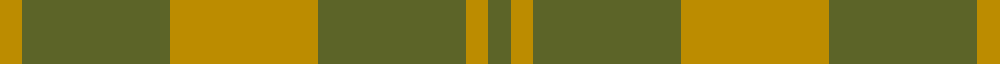
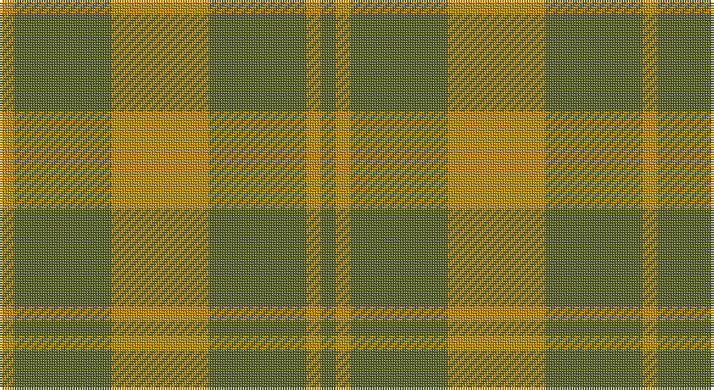

This page is one **sett** — a single exact thread-count. It belongs to the [tartan](/setts/y3lo3y20lo20y20lo3/)
(the same proportion at any scale), whose colour order is pattern [GYGYGY](/stripes/gygygy/).

Part of the [Barbie's Moss](/tartans/barbie-s-moss/) tartan — the named design grouping this sett with its other cloths.

Sourced from register-of-tartans.  It is a [6 stripe tartan](/stripes/stripes6/).

Original link https://www.tartanregister.gov.uk/tartanDetails.aspx?ref=210

## Also known as

This cloth is also recorded under:

- Barbie's Moss Plaid

## Register references

External register numbers recorded for this tartan.

- Scottish Register of Tartans: [210](https://www.tartanregister.gov.uk/tartanDetails.aspx?ref=210)
- Scottish Tartans Authority (ITI): 2695
- Scottish Tartans World Register: 2695

## Thread count
DY/6 G40 DY40 G40 DY6 G/6

One full sett is **264 threads**.

## Palette

Palette: <strong>Tartan Register</strong>
<table><thead><tr><th>Colour</th><th>Threads</th><th>Shade</th><th>Base</th><th>OKLCh</th></tr></thead><tbody><tr><td>DY/</td><td style="text-align:right;font-variant-numeric:tabular-nums">6</td><td><code style="background-color:#BC8C00;">#BC8C00</code> <small style="color:#888">#BC8C00</small></td><td>Y <code style="background-color:#F2BF00;">#F2BF00</code></td><td><small style="color:#888">oklch(66.8% 0.137 84.1)</small></td></tr><tr><td>G</td><td style="text-align:right;font-variant-numeric:tabular-nums">40</td><td><code style="background-color:#5C6428;">#5C6428</code> <small style="color:#888">#5C6428</small></td><td>G <code style="background-color:#006100;">#006100</code></td><td><small style="color:#888">oklch(48.3% 0.084 116.0)</small></td></tr><tr><td>DY</td><td style="text-align:right;font-variant-numeric:tabular-nums">40</td><td><code style="background-color:#BC8C00;">#BC8C00</code> <small style="color:#888">#BC8C00</small></td><td>Y <code style="background-color:#F2BF00;">#F2BF00</code></td><td><small style="color:#888">oklch(66.8% 0.137 84.1)</small></td></tr><tr><td>G</td><td style="text-align:right;font-variant-numeric:tabular-nums">40</td><td><code style="background-color:#5C6428;">#5C6428</code> <small style="color:#888">#5C6428</small></td><td>G <code style="background-color:#006100;">#006100</code></td><td><small style="color:#888">oklch(48.3% 0.084 116.0)</small></td></tr><tr><td>DY</td><td style="text-align:right;font-variant-numeric:tabular-nums">6</td><td><code style="background-color:#BC8C00;">#BC8C00</code> <small style="color:#888">#BC8C00</small></td><td>Y <code style="background-color:#F2BF00;">#F2BF00</code></td><td><small style="color:#888">oklch(66.8% 0.137 84.1)</small></td></tr><tr><td>G/</td><td style="text-align:right;font-variant-numeric:tabular-nums">6</td><td><code style="background-color:#5C6428;">#5C6428</code> <small style="color:#888">#5C6428</small></td><td>G <code style="background-color:#006100;">#006100</code></td><td><small style="color:#888">oklch(48.3% 0.084 116.0)</small></td></tr></tbody></table>

# Sample pattern

## Compared to the master

This cloth is one sett of its design; the master sett (the exemplar the design is anchored on) is below for comparison.

<figure style="margin:0"><figcaption style="color:#888;font-size:smaller">this sett</figcaption></figure>
<figure style="margin:0"><figcaption style="color:#888;font-size:smaller"><a href="/setts/w20dt20w3dt3/">master sett →</a></figcaption></figure>

## Nearest tartans

The nearest existing variants by ΔTartan distance, with this tartan at the top so the swatches line up against it.

ΔTartan

Tartan

Sett

—

<a href="/ttd/edit/#slug=y3lo3y20lo20y20lo3~x2">Barbie's Moss Plaid (Yellow &amp; Green)</a> <a class="nn-out" href="/variants/s6/y3lo3y20lo20y20lo3~x2/" title="open its dictionary page">↗</a>

1.60

<a href="/ttd/edit/#slug=r2g12o3g8o14g2~x2&amp;base=y3lo3y20lo20y20lo3~x2">Confederate Artillery (Military)</a> <a class="nn-out" href="/variants/s6/r2g12o3g8o14g2~x2/" title="open its dictionary page">↗</a>

2.05

<a href="/ttd/edit/#slug=o6g2o29g29o2g6~x2&amp;base=y3lo3y20lo20y20lo3~x2">Harmony, 11</a> <a class="nn-out" href="/variants/s6/o6g2o29g29o2g6~x2/" title="open its dictionary page">↗</a>

2.13

<a href="/ttd/edit/#slug=g46o20g9o20g46lg5~x2&amp;base=y3lo3y20lo20y20lo3~x2">O'Neill, Red</a> <a class="nn-out" href="/variants/s6/g46o20g9o20g46lg5~x2/" title="open its dictionary page">↗</a>

2.15

<a href="/ttd/edit/#slug=o20g40w5g40o20g9~x2&amp;base=y3lo3y20lo20y20lo3~x2">O'Neill (Australia)</a> <a class="nn-out" href="/variants/s6/o20g40w5g40o20g9~x2/" title="open its dictionary page">↗</a>

2.23

<a href="/ttd/edit/#slug=y9g9lo1g9y9g1~x4&amp;base=y3lo3y20lo20y20lo3~x2">Spring Morning</a> <a class="nn-out" href="/variants/s6/y9g9lo1g9y9g1~x4/" title="open its dictionary page">↗</a>

2.23

<a href="/ttd/edit/#slug=g56dy13lo13lo5~x2&amp;base=y3lo3y20lo20y20lo3~x2">Colonial Marine (Corporate)</a> <a class="nn-out" href="/variants/s4/g56dy13lo13lo5~x2/" title="open its dictionary page">↗</a>

2.28

<a href="/ttd/edit/#slug=g1y9g9lo1~x4&amp;base=y3lo3y20lo20y20lo3~x2">Spring Morning (Fashion)</a> <a class="nn-out" href="/variants/s4/g1y9g9lo1~x4/" title="open its dictionary page">↗</a>

2.32

<a href="/ttd/edit/#slug=lo11gi5lo10g4gi26lo4~x2&amp;base=y3lo3y20lo20y20lo3~x2">North Dakota State University (Corp.</a> <a class="nn-out" href="/variants/s6/lo11gi5lo10g4gi26lo4~x2/" title="open its dictionary page">↗</a>

2.36

<a href="/ttd/edit/#slug=g37o9g3dr9o3~x2&amp;base=y3lo3y20lo20y20lo3~x2">Glen Boig</a> <a class="nn-out" href="/variants/s5/g37o9g3dr9o3~x2/" title="open its dictionary page">↗</a>

2.37

<a href="/ttd/edit/#slug=g9o20g46lg5~x2&amp;base=y3lo3y20lo20y20lo3~x2">O'Neill, Red (Corporate?)</a> <a class="nn-out" href="/variants/s4/g9o20g46lg5~x2/" title="open its dictionary page">↗</a>

## Neighbour map

Every grey dot is one of 14360 variants placed by the first two principal components of the ΔTartan feature space (44% of its variance). Red is this tartan; blue dots are its nearest — click one to open its page.

<svg viewBox="0 0 640 380" role="img" style="max-width:100%;height:auto;border:1px solid #e0e0e0;border-radius:4px;display:block" xmlns="http://www.w3.org/2000/svg"><image href="/nn/cloud.v1.png" width="640" height="380"/><a href="/variants/s6/r2g12o3g8o14g2~x2/"><circle cx="384.8" cy="298.7" r="4" fill="#3465a4"><title>Confederate Artillery (Military)</title></circle></a><a href="/variants/s6/o6g2o29g29o2g6~x2/"><circle cx="480.7" cy="285.5" r="4" fill="#3465a4"><title>Harmony, 11</title></circle></a><a href="/variants/s6/g46o20g9o20g46lg5~x2/"><circle cx="454.9" cy="286.6" r="4" fill="#3465a4"><title>O'Neill, Red</title></circle></a><a href="/variants/s6/o20g40w5g40o20g9~x2/"><circle cx="421.3" cy="295.6" r="4" fill="#3465a4"><title>O'Neill (Australia)</title></circle></a><a href="/variants/s6/y9g9lo1g9y9g1~x4/"><circle cx="402.3" cy="322.7" r="4" fill="#3465a4"><title>Spring Morning</title></circle></a><a href="/variants/s4/g56dy13lo13lo5~x2/"><circle cx="458.9" cy="281.3" r="4" fill="#3465a4"><title>Colonial Marine (Corporate)</title></circle></a><a href="/variants/s4/g1y9g9lo1~x4/"><circle cx="413.5" cy="313.5" r="4" fill="#3465a4"><title>Spring Morning (Fashion)</title></circle></a><a href="/variants/s6/lo11gi5lo10g4gi26lo4~x2/"><circle cx="345.3" cy="280.2" r="4" fill="#3465a4"><title>North Dakota State University (Corp.</title></circle></a><a href="/variants/s5/g37o9g3dr9o3~x2/"><circle cx="492.4" cy="271.6" r="4" fill="#3465a4"><title>Glen Boig</title></circle></a><a href="/variants/s4/g9o20g46lg5~x2/"><circle cx="463.0" cy="289.0" r="4" fill="#3465a4"><title>O'Neill, Red (Corporate?)</title></circle></a><circle cx="476.6" cy="317.7" r="5" fill="#c00000"/></svg>

ID: /variants/s6/y3lo3y20lo20y20lo3~x2/
