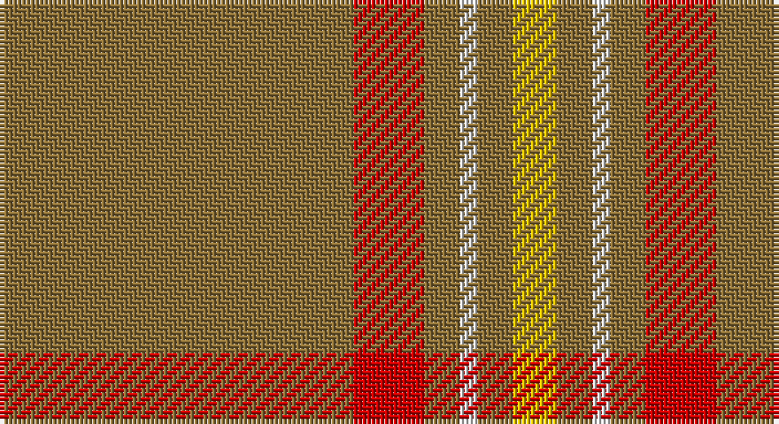

This page is one **sett** — a single exact thread-count. It belongs to the [tartan](/setts/y40r8y4w2y4ly5/)
(the same proportion at any scale), whose colour order is pattern [GRGWGY](/stripes/grgwgy/).

Part of the [Reid](/tartans/reid/) tartan — the named design grouping this sett with its other cloths.

Sourced from register-of-tartans.  It is a [6 stripe tartan](/stripes/stripes6/).

Original link https://www.tartanregister.gov.uk/tartanDetails.aspx?ref=3492

## Also known as

This cloth is also recorded under:

- Reid, Green

2 attestations — the source records this cloth was collapsed from (oldest owns this page)

<ul>
<li>01/01/2003 — Reid (1939) (register-of-tartans, <a href="https://www.tartanregister.gov.uk/tartanDetails.aspx?ref=3492">record</a>)</li>
<li>pre 2003 — Reid (1939) (Artefact) (tartans-authority, <a href="http://www.tartansauthority.com/tartan-ferret/display/5874/">record</a>)</li>
</ul>

## Register references

External register numbers recorded for this tartan.

- Scottish Register of Tartans: [3492](https://www.tartanregister.gov.uk/tartanDetails.aspx?ref=3492)
- Scottish Tartans Authority (ITI): 5874

## Thread count
LT/80 R16 LT8 LN4 LT8 Y/10

One full sett is **162 threads**.

## Palette

Palette: <strong>Tartan Register</strong>
<table><thead><tr><th>Colour</th><th>Threads</th><th>Shade</th><th>Base</th><th>OKLCh</th></tr></thead><tbody><tr><td>LT/</td><td style="text-align:right;font-variant-numeric:tabular-nums">80</td><td><code style="background-color:#8C7038;">#8C7038</code> <small style="color:#888">#8C7038</small></td><td>G <code style="background-color:#006100;">#006100</code></td><td><small style="color:#888">oklch(56.0% 0.082 83.0)</small></td></tr><tr><td>R</td><td style="text-align:right;font-variant-numeric:tabular-nums">16</td><td><code style="background-color:#C80000;">#C80000</code> <small style="color:#888">#C80000</small></td><td>R <code style="background-color:#CC0000;">#CC0000</code></td><td><small style="color:#888">oklch(52.3% 0.215 29.2)</small></td></tr><tr><td>LT</td><td style="text-align:right;font-variant-numeric:tabular-nums">8</td><td><code style="background-color:#8C7038;">#8C7038</code> <small style="color:#888">#8C7038</small></td><td>G <code style="background-color:#006100;">#006100</code></td><td><small style="color:#888">oklch(56.0% 0.082 83.0)</small></td></tr><tr><td>LN</td><td style="text-align:right;font-variant-numeric:tabular-nums">4</td><td><code style="background-color:#E0E0E0;">#E0E0E0</code> <small style="color:#888">#E0E0E0</small></td><td>W <code style="background-color:#F7F7F7;">#F7F7F7</code></td><td><small style="color:#888">oklch(90.7% 0.000 89.9)</small></td></tr><tr><td>LT</td><td style="text-align:right;font-variant-numeric:tabular-nums">8</td><td><code style="background-color:#8C7038;">#8C7038</code> <small style="color:#888">#8C7038</small></td><td>G <code style="background-color:#006100;">#006100</code></td><td><small style="color:#888">oklch(56.0% 0.082 83.0)</small></td></tr><tr><td>Y/</td><td style="text-align:right;font-variant-numeric:tabular-nums">10</td><td><code style="background-color:#E8C000;">#E8C000</code> <small style="color:#888">#E8C000</small></td><td>Y <code style="background-color:#F2BF00;">#F2BF00</code></td><td><small style="color:#888">oklch(81.9% 0.168 93.7)</small></td></tr></tbody></table>

# Sample pattern

## Compared to the master

This cloth is one sett of its design; the master sett (the exemplar the design is anchored on) is below for comparison.

<figure style="margin:0"><figcaption style="color:#888;font-size:smaller">this sett</figcaption></figure>
<figure style="margin:0"><figcaption style="color:#888;font-size:smaller"><a href="/setts/db11dbii11dbi11g11gi11dg11w3r5/">master sett →</a></figcaption></figure>

## Nearest tartans

The nearest existing variants by ΔTartan distance, with this tartan at the top so the swatches line up against it.

ΔTartan

Tartan

Sett

—

<a href="/ttd/edit/#slug=y40r8y4w2y4ly5~x2">Reid (1939)</a> <a class="nn-out" href="/variants/s6/y40r8y4w2y4ly5~x2/" title="open its dictionary page">↗</a>

1.76

<a href="/ttd/edit/#slug=y60g13y9r8ly4~x2&amp;base=y40r8y4w2y4ly5~x2">Ballantyne (Personal)</a> <a class="nn-out" href="/variants/s5/y60g13y9r8ly4~x2/" title="open its dictionary page">↗</a>

1.79

<a href="/ttd/edit/#slug=o5g1o32r1o8r9o2g2g3r3g1~x2&amp;base=y40r8y4w2y4ly5~x2">Portosalvo (Corporate)</a> <a class="nn-out" href="/variants/s11/o5g1o32r1o8r9o2g2g3r3g1~x2/" title="open its dictionary page">↗</a>

1.84

<a href="/ttd/edit/#slug=r13o3r4o56n4o4~x2&amp;base=y40r8y4w2y4ly5~x2">Auchairne Grey</a> <a class="nn-out" href="/variants/s6/r13o3r4o56n4o4~x2/" title="open its dictionary page">↗</a>

1.85

<a href="/ttd/edit/#slug=y65r27w2y4ly5~x2&amp;base=y40r8y4w2y4ly5~x2">Perry, Arisaid</a> <a class="nn-out" href="/variants/s5/y65r27w2y4ly5~x2/" title="open its dictionary page">↗</a>

1.85

<a href="/ttd/edit/#slug=lo100dy26g3r2~x2&amp;base=y40r8y4w2y4ly5~x2">Canadian Irish Regiment</a> <a class="nn-out" href="/variants/s4/lo100dy26g3r2~x2/" title="open its dictionary page">↗</a>

1.88

<a href="/ttd/edit/#slug=o60dg13o9oi8ly4~x2&amp;base=y40r8y4w2y4ly5~x2">Ballantyne Personal Tartan</a> <a class="nn-out" href="/variants/s5/o60dg13o9oi8ly4~x2/" title="open its dictionary page">↗</a>

1.90

<a href="/ttd/edit/#slug=w2o44dt8o2dt2o3r1~x2&amp;base=y40r8y4w2y4ly5~x2">Reece, Mathew</a> <a class="nn-out" href="/variants/s7/w2o44dt8o2dt2o3r1~x2/" title="open its dictionary page">↗</a>

1.92

<a href="/ttd/edit/#slug=y40n3y8r2y2w2y10n6do2n2w2~x2&amp;base=y40r8y4w2y4ly5~x2">Spencer</a> <a class="nn-out" href="/variants/s11/y40n3y8r2y2w2y10n6do2n2w2~x2/" title="open its dictionary page">↗</a>

1.93

<a href="/ttd/edit/#slug=r13y3r4y56n4y4~x2&amp;base=y40r8y4w2y4ly5~x2">Auchairne grey</a> <a class="nn-out" href="/variants/s6/r13y3r4y56n4y4~x2/" title="open its dictionary page">↗</a>

1.94

<a href="/ttd/edit/#slug=o45k5o28k5r5w2do6~x2&amp;base=y40r8y4w2y4ly5~x2">Leiato of American Samoa (Personal)</a> <a class="nn-out" href="/variants/s7/o45k5o28k5r5w2do6~x2/" title="open its dictionary page">↗</a>

## Neighbour map

Every grey dot is one of 14360 variants placed by the first two principal components of the ΔTartan feature space (44% of its variance). Red is this tartan; blue dots are its nearest — click one to open its page.

<svg viewBox="0 0 640 380" role="img" style="max-width:100%;height:auto;border:1px solid #e0e0e0;border-radius:4px;display:block" xmlns="http://www.w3.org/2000/svg"><image href="/nn/cloud.v1.png" width="640" height="380"/><a href="/variants/s5/y60g13y9r8ly4~x2/"><circle cx="526.7" cy="226.0" r="4" fill="#3465a4"><title>Ballantyne (Personal)</title></circle></a><a href="/variants/s11/o5g1o32r1o8r9o2g2g3r3g1~x2/"><circle cx="538.0" cy="141.2" r="4" fill="#3465a4"><title>Portosalvo (Corporate)</title></circle></a><a href="/variants/s6/r13o3r4o56n4o4~x2/"><circle cx="602.4" cy="213.0" r="4" fill="#3465a4"><title>Auchairne Grey</title></circle></a><a href="/variants/s5/y65r27w2y4ly5~x2/"><circle cx="507.0" cy="174.4" r="4" fill="#3465a4"><title>Perry, Arisaid</title></circle></a><a href="/variants/s4/lo100dy26g3r2~x2/"><circle cx="601.7" cy="169.9" r="4" fill="#3465a4"><title>Canadian Irish Regiment</title></circle></a><a href="/variants/s5/o60dg13o9oi8ly4~x2/"><circle cx="505.7" cy="212.7" r="4" fill="#3465a4"><title>Ballantyne Personal Tartan</title></circle></a><a href="/variants/s7/w2o44dt8o2dt2o3r1~x2/"><circle cx="626.0" cy="135.6" r="4" fill="#3465a4"><title>Reece, Mathew</title></circle></a><a href="/variants/s11/y40n3y8r2y2w2y10n6do2n2w2~x2/"><circle cx="537.7" cy="140.5" r="4" fill="#3465a4"><title>Spencer</title></circle></a><a href="/variants/s6/r13y3r4y56n4y4~x2/"><circle cx="608.4" cy="217.5" r="4" fill="#3465a4"><title>Auchairne grey</title></circle></a><a href="/variants/s7/o45k5o28k5r5w2do6~x2/"><circle cx="524.1" cy="163.4" r="4" fill="#3465a4"><title>Leiato of American Samoa (Personal)</title></circle></a><circle cx="564.5" cy="187.4" r="5" fill="#c00000"/></svg>

ID: /variants/s6/y40r8y4w2y4ly5~x2/
