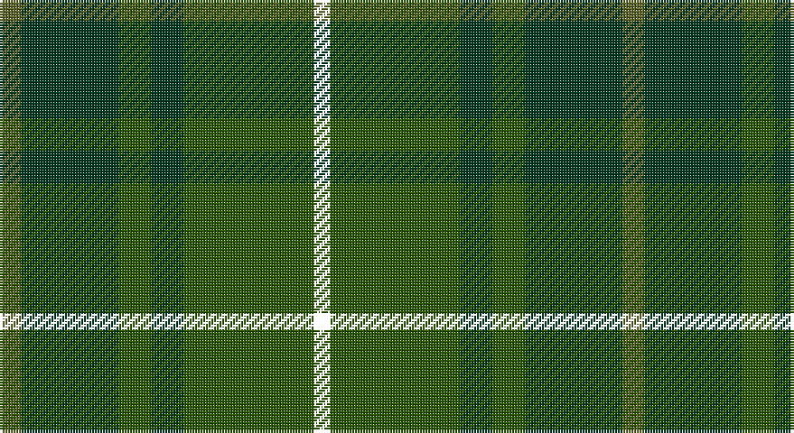

This page is one **sett** — a single exact thread-count. It belongs to the [tartan](/setts/y4dg18dgi6dg6dgi24k3/)
(the same proportion at any scale), whose colour order is pattern [GGGGGK](/stripes/gggggk/).

Sourced from register-of-tartans.  It is a [6 stripe tartan](/stripes/stripes6/).

Original link https://www.tartanregister.gov.uk/tartanDetails.aspx?ref=3291

## Register references

External register numbers recorded for this tartan.

- Scottish Register of Tartans: [3291](https://www.tartanregister.gov.uk/tartanDetails.aspx?ref=3291)
- Scottish Tartans Authority (ITI): 5519

## Thread count
Ga/8 DG36 G12 DG12 G48 YY/6

One full sett is **230 threads**.

## Palette

Palette: <strong>Tartan Register</strong>
<table><thead><tr><th>Colour</th><th>Threads</th><th>Shade</th><th>Base</th><th>OKLCh</th></tr></thead><tbody><tr><td>Ga/</td><td style="text-align:right;font-variant-numeric:tabular-nums">8</td><td><code style="background-color:#5C6428;">#5C6428</code> <small style="color:#888">#5C6428</small></td><td>G <code style="background-color:#006100;">#006100</code></td><td><small style="color:#888">oklch(48.3% 0.084 116.0)</small></td></tr><tr><td>DG</td><td style="text-align:right;font-variant-numeric:tabular-nums">36</td><td><code style="background-color:#003820;">#003820</code> <small style="color:#888">#003820</small></td><td>G <code style="background-color:#006100;">#006100</code></td><td><small style="color:#888">oklch(30.0% 0.070 158.3)</small></td></tr><tr><td>G</td><td style="text-align:right;font-variant-numeric:tabular-nums">12</td><td><code style="background-color:#285800;">#285800</code> <small style="color:#888">#285800</small></td><td>G <code style="background-color:#006100;">#006100</code></td><td><small style="color:#888">oklch(41.0% 0.122 135.8)</small></td></tr><tr><td>DG</td><td style="text-align:right;font-variant-numeric:tabular-nums">12</td><td><code style="background-color:#003820;">#003820</code> <small style="color:#888">#003820</small></td><td>G <code style="background-color:#006100;">#006100</code></td><td><small style="color:#888">oklch(30.0% 0.070 158.3)</small></td></tr><tr><td>G</td><td style="text-align:right;font-variant-numeric:tabular-nums">48</td><td><code style="background-color:#285800;">#285800</code> <small style="color:#888">#285800</small></td><td>G <code style="background-color:#006100;">#006100</code></td><td><small style="color:#888">oklch(41.0% 0.122 135.8)</small></td></tr><tr><td>/</td><td style="text-align:right;font-variant-numeric:tabular-nums">6</td><td><code style="background-color:;"></code> <small style="color:#888"></small></td><td> <code style="background-color:;"></code></td><td><small style="color:#888"></small></td></tr></tbody></table>

# Sample pattern

## Nearest tartans

The nearest existing variants by ΔTartan distance, with this tartan at the top so the swatches line up against it.

ΔTartan

Tartan

Sett

—

<a href="/ttd/edit/#slug=y4dg18dgi6dg6dgi24k3~x2">Park Estate</a> <a class="nn-out" href="/variants/s6/y4dg18dgi6dg6dgi24k3~x2/" title="open its dictionary page">↗</a>

0.45

<a href="/ttd/edit/#slug=y4dg18dgi6dg6dgi24ly3~x2&amp;base=y4dg18dgi6dg6dgi24k3~x2">Park (Estate Check)</a> <a class="nn-out" href="/variants/s6/y4dg18dgi6dg6dgi24ly3~x2/" title="open its dictionary page">↗</a>

1.12

<a href="/ttd/edit/#slug=dg1dy8dg8r1dg8dy8w1~x2&amp;base=y4dg18dgi6dg6dgi24k3~x2">MacKinnon Hunting</a> <a class="nn-out" href="/variants/s7/dg1dy8dg8r1dg8dy8w1~x2/" title="open its dictionary page">↗</a>

1.48

<a href="/ttd/edit/#slug=dg5k2dg28k10dy26db4dg4~x2&amp;base=y4dg18dgi6dg6dgi24k3~x2">John Telfar Dunbar Hunting</a> <a class="nn-out" href="/variants/s7/dg5k2dg28k10dy26db4dg4~x2/" title="open its dictionary page">↗</a>

1.56

<a href="/ttd/edit/#slug=g1dy8g8r1g8dy8w1~x2&amp;base=y4dg18dgi6dg6dgi24k3~x2">MacKinnon Hunting Clan Tartan</a> <a class="nn-out" href="/variants/s7/g1dy8g8r1g8dy8w1~x2/" title="open its dictionary page">↗</a>

1.57

<a href="/ttd/edit/#slug=dgi4ly2dgi17dg2r4dg2dgi3dg11dgi2~x2&amp;base=y4dg18dgi6dg6dgi24k3~x2">Armagh, County</a> <a class="nn-out" href="/variants/s9/dgi4ly2dgi17dg2r4dg2dgi3dg11dgi2~x2/" title="open its dictionary page">↗</a>

1.75

<a href="/ttd/edit/#slug=dg11n4dg6dy11n1k1dy4~x4&amp;base=y4dg18dgi6dg6dgi24k3~x2">Calais (Fashion)</a> <a class="nn-out" href="/variants/s7/dg11n4dg6dy11n1k1dy4~x4/" title="open its dictionary page">↗</a>

1.83

<a href="/ttd/edit/#slug=db3dy7g2y2g14dy2g2db3~x2&amp;base=y4dg18dgi6dg6dgi24k3~x2">Daks (Loden)</a> <a class="nn-out" href="/variants/s8/db3dy7g2y2g14dy2g2db3~x2/" title="open its dictionary page">↗</a>

1.84

<a href="/ttd/edit/#slug=g4k2g28k8dg21g3~x2&amp;base=y4dg18dgi6dg6dgi24k3~x2">Dunbar Hunting</a> <a class="nn-out" href="/variants/s6/g4k2g28k8dg21g3~x2/" title="open its dictionary page">↗</a>

1.88

<a href="/ttd/edit/#slug=dg20dgi2ly3dgi2dg32dgi32dg2r3dg2dgi32dg12~x2&amp;base=y4dg18dgi6dg6dgi24k3~x2">Galloway District Tartan</a> <a class="nn-out" href="/variants/s11/dg20dgi2ly3dgi2dg32dgi32dg2r3dg2dgi32dg12~x2/" title="open its dictionary page">↗</a>

1.95

<a href="/ttd/edit/#slug=dg8do2dg13db4dg12n22dg5ly3~x2&amp;base=y4dg18dgi6dg6dgi24k3~x2">Scottish Pup</a> <a class="nn-out" href="/variants/s8/dg8do2dg13db4dg12n22dg5ly3~x2/" title="open its dictionary page">↗</a>

## Neighbour map

Every grey dot is one of 14360 variants placed by the first two principal components of the ΔTartan feature space (44% of its variance). Red is this tartan; blue dots are its nearest — click one to open its page.

<svg viewBox="0 0 640 380" role="img" style="max-width:100%;height:auto;border:1px solid #e0e0e0;border-radius:4px;display:block" xmlns="http://www.w3.org/2000/svg"><image href="/nn/cloud.v1.png" width="640" height="380"/><a href="/variants/s6/y4dg18dgi6dg6dgi24ly3~x2/"><circle cx="377.6" cy="303.8" r="4" fill="#3465a4"><title>Park (Estate Check)</title></circle></a><a href="/variants/s7/dg1dy8dg8r1dg8dy8w1~x2/"><circle cx="371.4" cy="296.3" r="4" fill="#3465a4"><title>MacKinnon Hunting</title></circle></a><a href="/variants/s7/dg5k2dg28k10dy26db4dg4~x2/"><circle cx="392.5" cy="269.3" r="4" fill="#3465a4"><title>John Telfar Dunbar Hunting</title></circle></a><a href="/variants/s7/g1dy8g8r1g8dy8w1~x2/"><circle cx="353.0" cy="282.1" r="4" fill="#3465a4"><title>MacKinnon Hunting Clan Tartan</title></circle></a><a href="/variants/s9/dgi4ly2dgi17dg2r4dg2dgi3dg11dgi2~x2/"><circle cx="386.1" cy="256.5" r="4" fill="#3465a4"><title>Armagh, County</title></circle></a><a href="/variants/s7/dg11n4dg6dy11n1k1dy4~x4/"><circle cx="370.0" cy="292.8" r="4" fill="#3465a4"><title>Calais (Fashion)</title></circle></a><a href="/variants/s8/db3dy7g2y2g14dy2g2db3~x2/"><circle cx="329.5" cy="256.6" r="4" fill="#3465a4"><title>Daks (Loden)</title></circle></a><a href="/variants/s6/g4k2g28k8dg21g3~x2/"><circle cx="402.1" cy="271.2" r="4" fill="#3465a4"><title>Dunbar Hunting</title></circle></a><a href="/variants/s11/dg20dgi2ly3dgi2dg32dgi32dg2r3dg2dgi32dg12~x2/"><circle cx="428.3" cy="241.1" r="4" fill="#3465a4"><title>Galloway District Tartan</title></circle></a><a href="/variants/s8/dg8do2dg13db4dg12n22dg5ly3~x2/"><circle cx="358.2" cy="250.6" r="4" fill="#3465a4"><title>Scottish Pup</title></circle></a><circle cx="370.3" cy="301.5" r="5" fill="#c00000"/></svg>

ID: /variants/s6/y4dg18dgi6dg6dgi24k3~x2/
