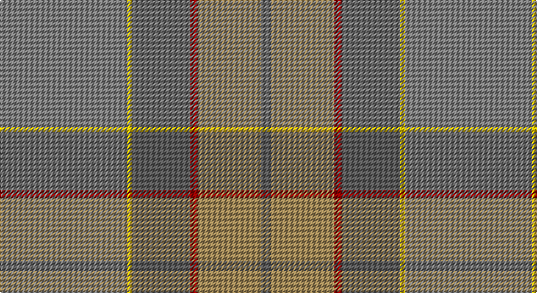

This page is one **sett** — a single exact thread-count. It belongs to the [tartan](/setts/y52ly2n24r3lo26n4/)
(the same proportion at any scale), whose colour order is pattern [BYRBYG](/stripes/byrbyg/).

Sourced from register-of-tartans.  It is a [6 stripe tartan](/stripes/stripes6/).

Original link https://www.tartanregister.gov.uk/tartanDetails.aspx?ref=11113

## Register references

External register numbers recorded for this tartan.

- Scottish Register of Tartans: [11113](https://www.tartanregister.gov.uk/tartanDetails.aspx?ref=11113)

## Thread count
N/104 Y4 Na48 DR6 LT52 Na/8

One full sett is **332 threads**.

## Palette

Palette: <strong>Tartan Register</strong> <small style="color:#888">(4 of 5 colours)</small>
<table><thead><tr><th>Colour</th><th>Threads</th><th>Shade</th><th>Base</th><th>OKLCh</th></tr></thead><tbody><tr><td>N/</td><td style="text-align:right;font-variant-numeric:tabular-nums">104</td><td><code style="background-color:#808080;">#808080</code> <small style="color:#888">#808080</small></td><td>G <code style="background-color:#006100;">#006100</code></td><td><small style="color:#888">oklch(60.0% 0.000 89.9)</small></td></tr><tr><td>Y</td><td style="text-align:right;font-variant-numeric:tabular-nums">4</td><td><code style="background-color:#E8C000;">#E8C000</code> <small style="color:#888">#E8C000</small></td><td>Y <code style="background-color:#F2BF00;">#F2BF00</code></td><td><small style="color:#888">oklch(81.9% 0.168 93.7)</small></td></tr><tr><td>Na</td><td style="text-align:right;font-variant-numeric:tabular-nums">48</td><td><code style="background-color:#5C5C5C;">#5C5C5C</code> <small style="color:#888">#5C5C5C</small></td><td>B <code style="background-color:#2A418A;">#2A418A</code></td><td><small style="color:#888">oklch(47.5% 0.000 89.9)</small></td></tr><tr><td>DR</td><td style="text-align:right;font-variant-numeric:tabular-nums">6</td><td><code style="background-color:#960000;">#960000</code> <small style="color:#888">#960000</small></td><td>R <code style="background-color:#CC0000;">#CC0000</code></td><td><small style="color:#888">oklch(42.3% 0.173 29.2)</small></td></tr><tr><td>LT</td><td style="text-align:right;font-variant-numeric:tabular-nums">52</td><td><code style="background-color:#A08858;">#A08858</code> <small style="color:#888">#A08858</small></td><td>Y <code style="background-color:#F2BF00;">#F2BF00</code></td><td><small style="color:#888">oklch(63.7% 0.071 84.0)</small></td></tr><tr><td>Na/</td><td style="text-align:right;font-variant-numeric:tabular-nums">8</td><td><code style="background-color:#5C5C5C;">#5C5C5C</code> <small style="color:#888">#5C5C5C</small></td><td>B <code style="background-color:#2A418A;">#2A418A</code></td><td><small style="color:#888">oklch(47.5% 0.000 89.9)</small></td></tr></tbody></table>

# Sample pattern

## Nearest tartans

The nearest existing variants by ΔTartan distance, with this tartan at the top so the swatches line up against it.

ΔTartan

Tartan

Sett

—

<a href="/ttd/edit/#slug=y52ly2n24r3lo26n4~x2">Outlander #1</a> <a class="nn-out" href="/variants/s6/y52ly2n24r3lo26n4~x2/" title="open its dictionary page">↗</a>

0.58

<a href="/ttd/edit/#slug=o52ly2n24r3lo26n4~x2&amp;base=y52ly2n24r3lo26n4~x2">Outlander #1</a> <a class="nn-out" href="/variants/s6/o52ly2n24r3lo26n4~x2/" title="open its dictionary page">↗</a>

1.78

<a href="/ttd/edit/#slug=lri3lb3lri1y25lri15lr5lb4ly2~x2&amp;base=y52ly2n24r3lo26n4~x2">Rikaco Morning Dew #2</a> <a class="nn-out" href="/variants/s8/lri3lb3lri1y25lri15lr5lb4ly2~x2/" title="open its dictionary page">↗</a>

1.84

<a href="/ttd/edit/#slug=k3y3r3y28n28lb2n2~x2&amp;base=y52ly2n24r3lo26n4~x2">Isle of Cumbrae (Corporate)</a> <a class="nn-out" href="/variants/s7/k3y3r3y28n28lb2n2~x2/" title="open its dictionary page">↗</a>

1.87

<a href="/ttd/edit/#slug=y30n3y3n3y3n10g10yi20m2g5~x2&amp;base=y52ly2n24r3lo26n4~x2">Roddy's Highland Spirit (Fashion)</a> <a class="nn-out" href="/variants/s10/y30n3y3n3y3n10g10yi20m2g5~x2/" title="open its dictionary page">↗</a>

1.99

<a href="/ttd/edit/#slug=y22dp1yi22r4~x4&amp;base=y52ly2n24r3lo26n4~x2">McWilliams (2014)</a> <a class="nn-out" href="/variants/s4/y22dp1yi22r4~x4/" title="open its dictionary page">↗</a>

2.06

<a href="/ttd/edit/#slug=n9o9y9r1yi1o9yi1r1~x4&amp;base=y52ly2n24r3lo26n4~x2">Jardine</a> <a class="nn-out" href="/variants/s8/n9o9y9r1yi1o9yi1r1~x4/" title="open its dictionary page">↗</a>

2.24

<a href="/variants/s9/r3k1y8lo1dyi7lo1y19dy25k1~x2/">The Broons (Corporate)</a>

2.32

<a href="/variants/s12/y23o4dy6g6y4lb1y4~x4/">Tricor</a>

2.34

<a href="/ttd/edit/#slug=o55yi6y3lb3y3lb3y10yii5y5lr2y3~x2&amp;base=y52ly2n24r3lo26n4~x2">Long Way Down, The (Corporate)</a> <a class="nn-out" href="/variants/s11/o55yi6y3lb3y3lb3y10yii5y5lr2y3~x2/" title="open its dictionary page">↗</a>

2.36

<a href="/variants/s8/k3n3k3n21ni21k3ni3lr1~x2/">Granite City (Fashion)</a>

## Neighbour map

Every grey dot is one of 14360 variants placed by the first two principal components of the ΔTartan feature space (44% of its variance). Red is this tartan; blue dots are its nearest — click one to open its page.

<svg viewBox="0 0 640 380" role="img" style="max-width:100%;height:auto;border:1px solid #e0e0e0;border-radius:4px;display:block" xmlns="http://www.w3.org/2000/svg"><image href="/nn/cloud.v1.png" width="640" height="380"/><a href="/variants/s6/o52ly2n24r3lo26n4~x2/"><circle cx="409.1" cy="221.0" r="4" fill="#3465a4"><title>Outlander #1</title></circle></a><a href="/variants/s8/lri3lb3lri1y25lri15lr5lb4ly2~x2/"><circle cx="374.3" cy="191.3" r="4" fill="#3465a4"><title>Rikaco Morning Dew #2</title></circle></a><a href="/variants/s7/k3y3r3y28n28lb2n2~x2/"><circle cx="396.2" cy="221.9" r="4" fill="#3465a4"><title>Isle of Cumbrae (Corporate)</title></circle></a><a href="/variants/s10/y30n3y3n3y3n10g10yi20m2g5~x2/"><circle cx="361.1" cy="239.2" r="4" fill="#3465a4"><title>Roddy's Highland Spirit (Fashion)</title></circle></a><a href="/variants/s4/y22dp1yi22r4~x4/"><circle cx="469.0" cy="293.3" r="4" fill="#3465a4"><title>McWilliams (2014)</title></circle></a><a href="/variants/s8/n9o9y9r1yi1o9yi1r1~x4/"><circle cx="357.2" cy="266.1" r="4" fill="#3465a4"><title>Jardine</title></circle></a><a href="/variants/s9/r3k1y8lo1dyi7lo1y19dy25k1~x2/"><circle cx="375.7" cy="185.2" r="4" fill="#3465a4"><title>The Broons (Corporate)</title></circle></a><a href="/variants/s12/y23o4dy6g6y4lb1y4~x4/"><circle cx="384.8" cy="190.3" r="4" fill="#3465a4"><title>Tricor</title></circle></a><a href="/variants/s11/o55yi6y3lb3y3lb3y10yii5y5lr2y3~x2/"><circle cx="480.3" cy="154.0" r="4" fill="#3465a4"><title>Long Way Down, The (Corporate)</title></circle></a><a href="/variants/s8/k3n3k3n21ni21k3ni3lr1~x2/"><circle cx="395.4" cy="224.9" r="4" fill="#3465a4"><title>Granite City (Fashion)</title></circle></a><circle cx="424.2" cy="230.2" r="5" fill="#c00000"/></svg>

ID: /variants/s6/y52ly2n24r3lo26n4~x2/
