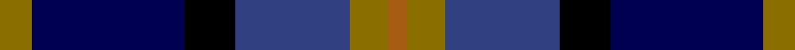

This is one **variant** — a specific cloth: this exact thread count and colourway, with its own
provenance below. It is one weaving of the [sett](/tartans/c/ca/cala-homes/) (the scale-free proportion — the
same cloth at any scale or shade), whose colour order is pattern [GBKBGR](/stripes/gbkbgr/).

Part of the [CALA Homes](/tartans/c/ca/cala-homes/) tartan — the named design grouping this sett with its other cloths.

Sourced from weddslist.  It is a [6 stripe tartan](/stripes/stripes6/).

Original link [http://www.weddslist.com/cgi-bin/tartans/pg.pl?source=sts](http://www.weddslist.com/cgi-bin/tartans/pg.pl?source=sts)

Dataset <small>— provenance for this record, inherited from the source manifest</small>

<dl class="dataset-prov">
<dt>source</dt><dd><a href="/sources/weddslist/">Weddslist</a></dd>
<dt>data captured from</dt><dd><a href="https://github.com/thetartan/tartan-database/blob/master/data/weddslist/data.csv">https://github.com/thetartan/tartan-database/blob/master/data/weddslist/data.csv</a></dd>
<dt>data date</dt><dd>2016-11-17 <small>(dataset default)</small></dd>
<dt>licence</dt><dd><a href="https://creativecommons.org/licenses/by-nc-nd/4.0/">CC BY-NC-ND 4.0</a></dd>
</dl>

Capture chain <small>— the hands this data passed through, oldest first; each capture carries its own licence</small>

<ol class="capture-chain">
<li><a href="https://www.weddslist.com/tartans/">Weddslist</a> <small>the living privately compiled reference</small></li>
<li><a href="https://github.com/thetartan/tartan-database">thetartan/tartan-database</a> <small>2016-2017</small> · <a href="https://creativecommons.org/licenses/by-nc-nd/4.0/">CC BY-NC-ND 4.0</a> <small>Levko Kravets's frozen compilation — the capture we vendored, and where its CC licence text came from</small></li>
<li>this dictionary <small>captured 2026-06-10 · commit 5bf86c7566</small> <small>each re-capture is a git commit to data/sources</small></li>
</ol>

## Thread count
Y/5 DB24 K8 DBi18 Y6 O/3

One full sett is **120 threads**.

## Palette
<table><thead><tr><th>Colour</th><th>Shade</th><th>OKLCh</th></tr></thead><tbody><tr><td>DB</td><td><code style="background-color:#304080;">#304080</code> <small style="color:#888">#304080</small></td><td><small style="color:#888">oklch(39.4% 0.109 270.2)</small></td></tr><tr><td>DB</td><td><code style="background-color:#000050;">#000050</code> <small style="color:#888">#000050</small></td><td><small style="color:#888">oklch(19.5% 0.135 264.1)</small></td></tr><tr><td>K</td><td><code style="background-color:#000000;">#000000</code> <small style="color:#888">#000000</small></td><td><small style="color:#888">oklch(0.0% 0.000 0.0)</small></td></tr><tr><td>O</td><td><code style="background-color:#A65C11;">#A65C11</code> <small style="color:#888">#A65C11</small></td><td><small style="color:#888">oklch(55.0% 0.125 58.3)</small></td></tr><tr><td>Y</td><td><code style="background-color:#8B6E00;">#8B6E00</code> <small style="color:#888">#8B6E00</small></td><td><small style="color:#888">oklch(55.1% 0.113 90.4)</small></td></tr></tbody></table>

# Sample pattern

## Nearest tartan variants

The nearest existing variants by ΔTartan distance, with this cloth at the top so the swatches line up against it.

ΔTartan

Threads

Variant

Sett

—

120

<a href="/variants/s6/y5db24k8dbi18y6o3~db1913264-dbi3911270/">CALA Homes</a>

<a href="/ttd/edit/#slug=ly5db24k8dbi18ly6dy3~ly8117093-db2911276-dbi3514276-dy3908078&amp;base=y5db24k8dbi18y6o3~db1913264-dbi3911270" title="compare in the TTD">0.16</a>

120

<a href="/variants/s6/ly5db24k8dbi18ly6dy3~ly8117093-db2911276-dbi3514276-dy3908078/">Cala Homes (Corporate)</a>

<a href="/ttd/edit/#slug=r2db16k11b19y2~x2&amp;base=y5db24k8dbi18y6o3~db1913264-dbi3911270" title="compare in the TTD">1.88</a>

192

<a href="/variants/s5/r2db16k11b19y2~x2/">Sanix Modern</a>

<a href="/ttd/edit/#slug=r1n5k5db1k1db6y1~x8&amp;base=y5db24k8dbi18y6o3~db1913264-dbi3911270" title="compare in the TTD">1.99</a>

304

<a href="/variants/s7/r1n5k5db1k1db6y1~x8/">Lopez-Gasparotto</a>

<a href="/ttd/edit/#slug=lb4dg17k10db3k3db17dr3db3~x2&amp;base=y5db24k8dbi18y6o3~db1913264-dbi3911270" title="compare in the TTD">2.06</a>

226

<a href="/variants/s8/lb4dg17k10db3k3db17dr3db3~x2/">Royal Highland</a>

<a href="/ttd/edit/#slug=g4dy7o9dy9db20w2db2~x2&amp;base=y5db24k8dbi18y6o3~db1913264-dbi3911270" title="compare in the TTD">2.10</a>

200

<a href="/variants/s7/g4dy7o9dy9db20w2db2~x2/">Tombow 140th Anniversary, The</a>

<a href="/ttd/edit/#slug=dp3db17n13dp2k20w2~x2&amp;base=y5db24k8dbi18y6o3~db1913264-dbi3911270" title="compare in the TTD">2.15</a>

218

<a href="/variants/s6/dp3db17n13dp2k20w2~x2/">Commonwealth Games</a>

<a href="/ttd/edit/#slug=r3db24k7dbi11g11y2~x2~db3409246-dbi3514276&amp;base=y5db24k8dbi18y6o3~db1913264-dbi3911270" title="compare in the TTD">2.18</a>

222

<a href="/variants/s6/r3db24k7dbi11g11y2~x2~db3409246-dbi3514276/">Cowie</a>

<a href="/ttd/edit/#slug=ly4dg17k10db3k3db17dr3db3~x2&amp;base=y5db24k8dbi18y6o3~db1913264-dbi3911270" title="compare in the TTD">2.30</a>

226

<a href="/variants/s8/ly4dg17k10db3k3db17dr3db3~x2/">Royal Highland Society (Corporate)</a>

<a href="/ttd/edit/#slug=dr4dg16k16db4dg3db12lo2~x2&amp;base=y5db24k8dbi18y6o3~db1913264-dbi3911270" title="compare in the TTD">2.32</a>

216

<a href="/variants/s7/dr4dg16k16db4dg3db12lo2~x2/">Junior Chamber International (Corp)</a>

<a href="/ttd/edit/#slug=dr4k2db24k20dg20lo3~x2&amp;base=y5db24k8dbi18y6o3~db1913264-dbi3911270" title="compare in the TTD">2.34</a>

278

<a href="/variants/s6/dr4k2db24k20dg20lo3~x2/">Loudoun's Highlanders - 1747 #1 (Mil</a>

## Neighbour map

Every grey dot is one of 13662 variants placed by the first two principal components of the ΔTartan feature space (42% of its variance). Red is this tartan; blue dots are its nearest — click one to open its page. The map is a flat projection of a many-dimensional space — [how to read it](/posts/neighbourhood-maps/).

<svg viewBox="0 0 640 380" role="img" style="max-width:100%;height:auto;border:1px solid #e0e0e0;border-radius:4px;display:block" xmlns="http://www.w3.org/2000/svg"><image href="/nn/cloud.v1.png" width="640" height="380"/><a href="/variants/s6/ly5db24k8dbi18ly6dy3~ly8117093-db2911276-dbi3514276-dy3908078/"><circle cx="137.7" cy="206.0" r="4" fill="#3465a4"><title>Cala Homes (Corporate)</title></circle></a><a href="/variants/s5/r2db16k11b19y2~x2/"><circle cx="162.5" cy="209.8" r="4" fill="#3465a4"><title>Sanix Modern</title></circle></a><a href="/variants/s7/r1n5k5db1k1db6y1~x8/"><circle cx="133.5" cy="208.1" r="4" fill="#3465a4"><title>Lopez-Gasparotto</title></circle></a><a href="/variants/s8/lb4dg17k10db3k3db17dr3db3~x2/"><circle cx="155.7" cy="209.6" r="4" fill="#3465a4"><title>Royal Highland</title></circle></a><a href="/variants/s7/g4dy7o9dy9db20w2db2~x2/"><circle cx="216.6" cy="209.6" r="4" fill="#3465a4"><title>Tombow 140th Anniversary, The</title></circle></a><a href="/variants/s6/dp3db17n13dp2k20w2~x2/"><circle cx="146.1" cy="191.4" r="4" fill="#3465a4"><title>Commonwealth Games</title></circle></a><a href="/variants/s6/r3db24k7dbi11g11y2~x2~db3409246-dbi3514276/"><circle cx="178.1" cy="188.1" r="4" fill="#3465a4"><title>Cowie</title></circle></a><a href="/variants/s8/ly4dg17k10db3k3db17dr3db3~x2/"><circle cx="150.7" cy="207.8" r="4" fill="#3465a4"><title>Royal Highland Society (Corporate)</title></circle></a><a href="/variants/s7/dr4dg16k16db4dg3db12lo2~x2/"><circle cx="157.7" cy="213.0" r="4" fill="#3465a4"><title>Junior Chamber International (Corp)</title></circle></a><a href="/variants/s6/dr4k2db24k20dg20lo3~x2/"><circle cx="170.8" cy="197.1" r="4" fill="#3465a4"><title>Loudoun's Highlanders - 1747 #1 (Mil</title></circle></a><circle cx="166.0" cy="215.7" r="5" fill="#c00000"/><text x="320" y="376" text-anchor="middle" font-size="11" fill="#999">ground</text><text x="11" y="190" text-anchor="middle" font-size="11" fill="#999" transform="rotate(-90 11 190)">complexity</text></svg>

ID: /variants/s6/y5db24k8dbi18y6o3~db1913264-dbi3911270/
