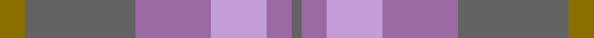

This is one **variant** — a specific cloth: this exact thread count and colourway, with its own
provenance below. It is one weaving of the [sett](/tartans/s/sc/scottish-ballet-2/) (the scale-free proportion — the
same cloth at any scale or shade), whose colour order is pattern [BRWRBG](/stripes/brwrbg/).

Part of the [Scottish Ballet](/tartans/s/sc/scottish-ballet-2/) tartan — the named design grouping this sett with its other cloths.

Sourced from register-of-tartans.  It is a [6 stripe tartan](/stripes/stripes6/).

Original link [https://www.tartanregister.gov.uk/tartanDetails.aspx?ref=10896](https://www.tartanregister.gov.uk/tartanDetails.aspx?ref=10896)

Dataset <small>— provenance for this record, inherited from the source manifest</small>

<dl class="dataset-prov">
<dt>source</dt><dd><a href="/sources/register-of-tartans/">Scottish Register of Tartans</a></dd>
<dt>data captured from</dt><dd><a href="https://github.com/thetartan/tartan-database/blob/master/data/register-of-tartans/data.csv">https://github.com/thetartan/tartan-database/blob/master/data/register-of-tartans/data.csv</a></dd>
<dt>data date</dt><dd>16/08/2013 <small>(this record)</small></dd>
<dt>licence</dt><dd><a href="https://www.tartanregister.gov.uk/copyright">Crown copyright</a></dd>
</dl>

Capture chain <small>— the hands this data passed through, oldest first; each capture carries its own licence</small>

<ol class="capture-chain">
<li><a href="https://www.tartanregister.gov.uk/">Scottish Register of Tartans</a> · <a href="https://www.tartanregister.gov.uk/copyright">Crown copyright</a> <small>the living register — still published by National Records of Scotland</small></li>
<li><a href="https://github.com/thetartan/tartan-database">thetartan/tartan-database</a> <small>2016-2017</small> · <a href="https://creativecommons.org/licenses/by-nc-nd/4.0/">CC BY-NC-ND 4.0</a> <small>Levko Kravets's frozen compilation — the capture we vendored, and where its CC licence text came from</small></li>
<li>this dictionary <small>captured 2026-06-10 · commit 5bf86c7566</small> <small>each re-capture is a git commit to data/sources</small></li>
</ol>

## Register references

External register numbers recorded for this tartan.

- Scottish Register of Tartans: [10896](https://www.tartanregister.gov.uk/tartanDetails.aspx?ref=10896)

## Thread count
Y/10 N44 O30 LP22 O10 N/4

One full sett is **226 threads**.

## Palette
<table><thead><tr><th>Colour</th><th>Shade</th><th>OKLCh</th></tr></thead><tbody><tr><td>N</td><td><code style="background-color:#636363;">#636363</code> <small style="color:#888">#636363</small></td><td><small style="color:#888">oklch(50.0% 0.000 89.9)</small></td></tr><tr><td>O</td><td><code style="background-color:#9C68A4;">#9C68A4</code> <small style="color:#888">#9C68A4</small></td><td><small style="color:#888">oklch(59.4% 0.107 322.0)</small></td></tr><tr><td>LP</td><td><code style="background-color:#C49CD8;">#C49CD8</code> <small style="color:#888">#C49CD8</small></td><td><small style="color:#888">oklch(75.0% 0.095 314.2)</small></td></tr><tr><td>Y</td><td><code style="background-color:#8B6E00;">#8B6E00</code> <small style="color:#888">#8B6E00</small></td><td><small style="color:#888">oklch(55.1% 0.113 90.4)</small></td></tr></tbody></table>

# Sample pattern

## Nearest tartan variants

The nearest existing variants by ΔTartan distance, with this cloth at the top so the swatches line up against it.

ΔTartan

Threads

Variant

Sett

—

226

<a href="/variants/s6/y5n22o15lp11o5n2~x2~o2404317-lp3004317/">Scottish Ballet</a>

<a href="/ttd/edit/#slug=dp30n20dg8y3dg8n20dp30y2~x2~dp1303322&amp;base=y5n22o15lp11o5n2~x2~o2404317-lp3004317" title="compare in the TTD">2.66</a>

420

<a href="/variants/s8/dp30n20dg8y3dg8n20dp30y2~x2~dp1303322/">Wicks Personal Tartan</a>

<a href="/ttd/edit/#slug=dp30n20dg8y3dg8n20dp30y2~x2&amp;base=y5n22o15lp11o5n2~x2~o2404317-lp3004317" title="compare in the TTD">2.80</a>

420

<a href="/variants/s8/dp30n20dg8y3dg8n20dp30y2~x2/">Wicks (Personal)</a>

## Neighbour map

Every grey dot is one of 13656 variants placed by the first two principal components of the ΔTartan feature space (42% of its variance). Red is this tartan; blue dots are its nearest — click one to open its page. The map is a flat projection of a many-dimensional space — [how to read it](/posts/neighbourhood-maps/).

<svg viewBox="0 0 640 380" role="img" style="max-width:100%;height:auto;border:1px solid #e0e0e0;border-radius:4px;display:block" xmlns="http://www.w3.org/2000/svg"><image href="/nn/cloud.v1.png" width="640" height="380"/><a href="/variants/s8/dp30n20dg8y3dg8n20dp30y2~x2~dp1303322/"><circle cx="438.6" cy="263.0" r="4" fill="#3465a4"><title>Wicks Personal Tartan</title></circle></a><a href="/variants/s8/dp30n20dg8y3dg8n20dp30y2~x2/"><circle cx="399.5" cy="245.9" r="4" fill="#3465a4"><title>Wicks (Personal)</title></circle></a><circle cx="380.0" cy="283.6" r="5" fill="#c00000"/><text x="320" y="376" text-anchor="middle" font-size="11" fill="#999">ground</text><text x="11" y="190" text-anchor="middle" font-size="11" fill="#999" transform="rotate(-90 11 190)">complexity</text></svg>

ID: /variants/s6/y5n22o15lp11o5n2~x2~o2404317-lp3004317/
