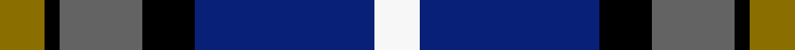
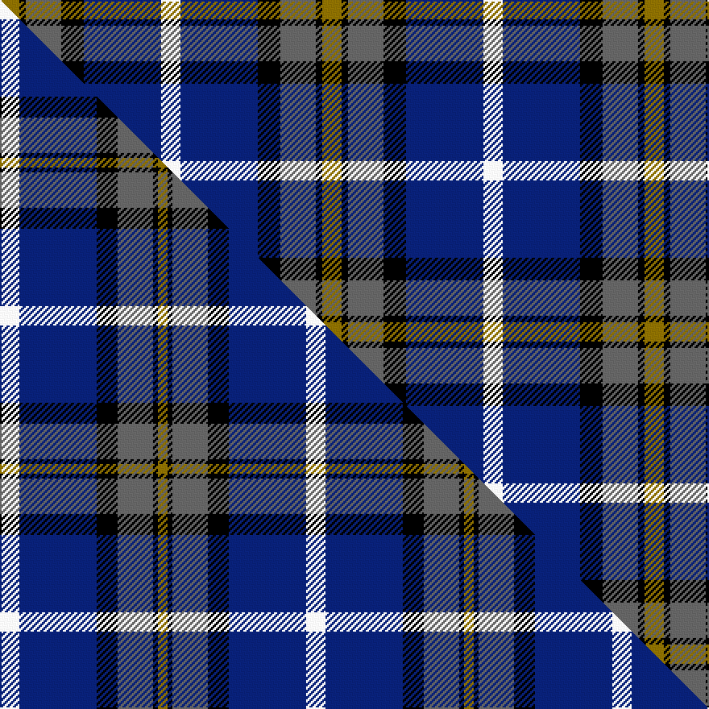

This page is one **sett** — a single exact thread-count. It belongs to the [tartan](/setts/y6k2n11k7db24w6/)
(the same proportion at any scale), whose colour order is pattern [GKBKBW](/stripes/gkbkbw/).

Part of the [Clunie](/tartans/clunie/) tartan — the named design grouping this sett with its other cloths.

Sourced from tartans-authority.  It is a [6 stripe tartan](/stripes/stripes6/).

Original link http://www.tartansauthority.com/tartan-ferret/display/6708/

## Provenance

Earliest known date: 2005 Designed by David McGill of International Tartans for a John and Ben Clunie from Aberdeen and Edinburgh respectively but it can be worn by all of the name. The colours are from the Clunie coat of arms.

2 attestations — the source records this cloth was collapsed from (oldest owns this page)

<ul>
<li>pre 2005 — Clunie (Name) (tartans-authority, <a href="http://www.tartansauthority.com/tartan-ferret/display/6708/">record</a>)  <em>Designed by David McGill of International Tartans for a John and Ben Clunie from Aberdeen and Edinburgh respectively but it can be worn by all of the name. The colours are from the Clunie coat of arms. Threadcount estimated.</em></li>
<li>undated — Clunie Name Tartan (house-of-tartan, <a href="http://www.house-of-tartan.scotland.net/house/TartanViewjs.asp?colr=Def&tnam=6708">record</a>) </li>
</ul>

## Register references

External register numbers recorded for this tartan.

- Scottish Tartans Authority (ITI): 6708

## Thread count
Y/12 K4 N22 K14 DB48 W/12

One full sett is **200 threads**.

## Palette
<table><thead><tr><th>Colour</th><th>Shade</th><th>OKLCh</th></tr></thead><tbody><tr><td>DB</td><td><code style="background-color:#082077;">#082077</code> <small style="color:#888">#082077</small></td><td><small style="color:#888">oklch(30.0% 0.149 265.1)</small></td></tr><tr><td>K</td><td><code style="background-color:#000000;">#000000</code> <small style="color:#888">#000000</small></td><td><small style="color:#888">oklch(0.0% 0.000 0.0)</small></td></tr><tr><td>N</td><td><code style="background-color:#636363;">#636363</code> <small style="color:#888">#636363</small></td><td><small style="color:#888">oklch(50.0% 0.000 89.9)</small></td></tr><tr><td>W</td><td><code style="background-color:#F7F7F7;">#F7F7F7</code> <small style="color:#888">#F7F7F7</small></td><td><small style="color:#888">oklch(97.6% 0.000 89.9)</small></td></tr><tr><td>Y</td><td><code style="background-color:#8B6E00;">#8B6E00</code> <small style="color:#888">#8B6E00</small></td><td><small style="color:#888">oklch(55.1% 0.113 90.4)</small></td></tr></tbody></table>

# Sample pattern

## Compared to the master

This cloth is one sett of its design; the master sett (the exemplar the design is anchored on) is below for comparison.

Its **ΔTartan distance** from the master is **0.30** — the same measure the nearest-tartans table ranks by (0 is identical; a re-scale of the same cloth is near 0, a recolour or a different proportion further).

<figure class="master-compare" style="margin:0">

this sett
master sett ★

<figcaption style="color:#888;font-size:smaller">One weave of this sett against the <a href="/setts/w12db48k13n22k3y6/">master sett ★</a>, split on the diagonal: a shared proportion runs seamlessly across it with only the shades shifting; a different proportion breaks on it.</figcaption>
</figure>

## Nearest tartan variants

The nearest existing variants by ΔTartan distance, with this cloth at the top so the swatches line up against it.

ΔTartan

Threads

Variant

Sett

—

200

<a href="/variants/s6/y6k2n11k7db24w6~x2/">Clunie (Name)</a>

<a href="/ttd/edit/#slug=w12db48k13n22k3y6&amp;base=y6k2n11k7db24w6~x2" title="compare in the TTD">0.30</a>

190

<a href="/variants/s6/w12db48k13n22k3y6/">Clunie (Personal)</a>

<a href="/ttd/edit/#slug=r1t10k2w4k4y1~x6&amp;base=y6k2n11k7db24w6~x2" title="compare in the TTD">0.90</a>

252

<a href="/variants/s6/r1t10k2w4k4y1~x6/">Thomson Dress (Blue)</a>

<a href="/ttd/edit/#slug=dr4t28k6lr12k12lo3~x2~t2503227-lr3200000&amp;base=y6k2n11k7db24w6~x2" title="compare in the TTD">1.15</a>

246

<a href="/variants/s6/dr4t28k6lb12k12lo3~x2~t2503227-lb3200000/">MacTavish Dress</a>

<a href="/ttd/edit/#slug=y4k4lb5t24y2k24w4~x2&amp;base=y6k2n11k7db24w6~x2" title="compare in the TTD">1.80</a>

252

<a href="/variants/s7/y4k4lb5t24y2k24w4~x2/">Mina Perhonen</a>

<a href="/ttd/edit/#slug=r2w12lb1k12b12k1~x2&amp;base=y6k2n11k7db24w6~x2" title="compare in the TTD">1.89</a>

154

<a href="/variants/s6/r2w12lb1k12b12k1~x2/">Dutch, dress</a>

<a href="/ttd/edit/#slug=db22w2k10g11r3g4~x2&amp;base=y6k2n11k7db24w6~x2" title="compare in the TTD">2.01</a>

156

<a href="/variants/s6/db22w2k10g11r3g4~x2/">Paterson Blue (Personal)</a>

<a href="/ttd/edit/#slug=db15k10n30dy11w3lb5~x2&amp;base=y6k2n11k7db24w6~x2" title="compare in the TTD">2.17</a>

256

<a href="/variants/s6/db15k10n30dy11w3lb5~x2/">McHale, Barry</a>

<a href="/ttd/edit/#slug=db44k9w3k24ly15k6w7~x2&amp;base=y6k2n11k7db24w6~x2" title="compare in the TTD">2.19</a>

330

<a href="/variants/s7/db44k9w3k24ly15k6w7~x2/">Longford County Crest (Fashion)</a>

<a href="/ttd/edit/#slug=r3k1w5k4db11r1~x4&amp;base=y6k2n11k7db24w6~x2" title="compare in the TTD">2.19</a>

184

<a href="/variants/s6/r3k1w5k4db11r1~x4/">Hydro-Electric (Corporate)</a>

<a href="/ttd/edit/#slug=r2db23k14g16k2w2~x2&amp;base=y6k2n11k7db24w6~x2" title="compare in the TTD">2.21</a>

228

<a href="/variants/s6/r2db23k14g16k2w2~x2/">MacPhail Hunting</a>

## Neighbour map

Every grey dot is one of 13620 variants placed by the first two principal components of the ΔTartan feature space (42% of its variance). Red is this tartan; blue dots are its nearest — click one to open its page.

<svg viewBox="0 0 640 380" role="img" style="max-width:100%;height:auto;border:1px solid #e0e0e0;border-radius:4px;display:block" xmlns="http://www.w3.org/2000/svg"><image href="/nn/cloud.v1.png" width="640" height="380"/><a href="/variants/s6/w12db48k13n22k3y6/"><circle cx="189.4" cy="160.6" r="4" fill="#3465a4"><title>Clunie (Personal)</title></circle></a><a href="/variants/s6/r1t10k2w4k4y1~x6/"><circle cx="156.7" cy="175.2" r="4" fill="#3465a4"><title>Thomson Dress (Blue)</title></circle></a><a href="/variants/s6/dr4t28k6lb12k12lo3~x2~t2503227-lb3200000/"><circle cx="149.8" cy="186.7" r="4" fill="#3465a4"><title>MacTavish Dress</title></circle></a><a href="/variants/s7/y4k4lb5t24y2k24w4~x2/"><circle cx="158.5" cy="154.5" r="4" fill="#3465a4"><title>Mina Perhonen</title></circle></a><a href="/variants/s6/r2w12lb1k12b12k1~x2/"><circle cx="106.8" cy="170.0" r="4" fill="#3465a4"><title>Dutch, dress</title></circle></a><a href="/variants/s6/db22w2k10g11r3g4~x2/"><circle cx="160.7" cy="182.3" r="4" fill="#3465a4"><title>Paterson Blue (Personal)</title></circle></a><a href="/variants/s6/db15k10n30dy11w3lb5~x2/"><circle cx="136.5" cy="186.3" r="4" fill="#3465a4"><title>McHale, Barry</title></circle></a><a href="/variants/s7/db44k9w3k24ly15k6w7~x2/"><circle cx="179.0" cy="168.4" r="4" fill="#3465a4"><title>Longford County Crest (Fashion)</title></circle></a><a href="/variants/s6/r3k1w5k4db11r1~x4/"><circle cx="164.6" cy="180.2" r="4" fill="#3465a4"><title>Hydro-Electric (Corporate)</title></circle></a><a href="/variants/s6/r2db23k14g16k2w2~x2/"><circle cx="152.7" cy="176.0" r="4" fill="#3465a4"><title>MacPhail Hunting</title></circle></a><circle cx="154.3" cy="181.3" r="5" fill="#c00000"/><text x="320" y="376" text-anchor="middle" font-size="11" fill="#999">ground</text><text x="11" y="190" text-anchor="middle" font-size="11" fill="#999" transform="rotate(-90 11 190)">complexity</text></svg>

ID: /variants/s6/y6k2n11k7db24w6~x2/
