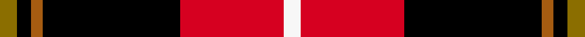
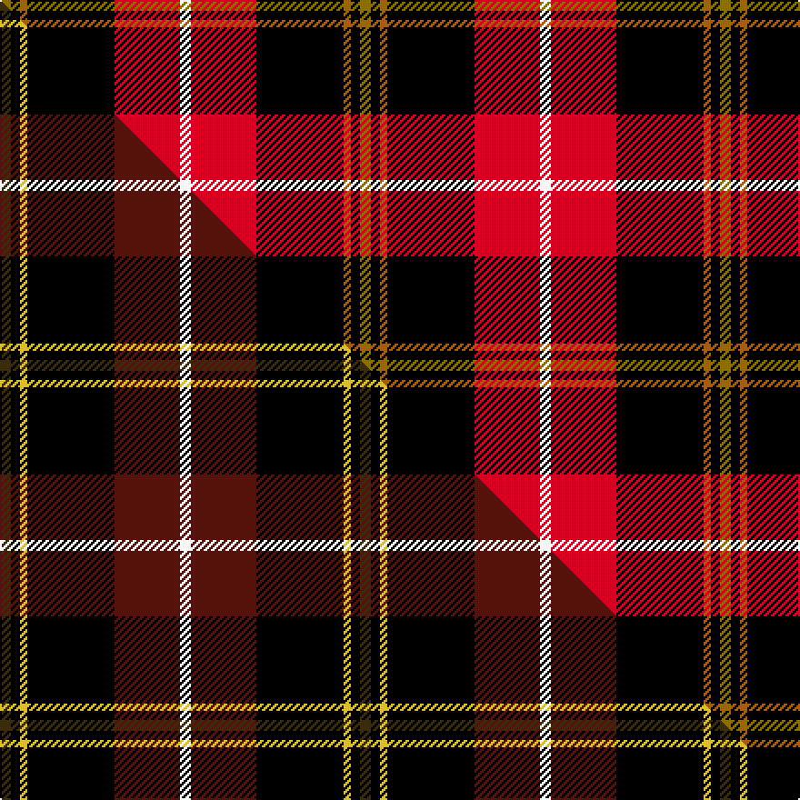

This is one **variant** — a specific cloth: this exact thread count and colourway, with its own
provenance below. It is one weaving of the [sett](/tartans/d/dr/drambuie/) (the scale-free proportion — the
same cloth at any scale or shade), whose colour order is pattern [GKRKRW](/stripes/gkrkrw/).

Part of the [Drambuie](/tartans/d/dr/drambuie/) tartan — the named design grouping this sett with its other cloths.

Sourced from weddslist.  It is a [6 stripe tartan](/stripes/stripes6/).

Original link [http://www.weddslist.com/cgi-bin/tartans/pg.pl?source=sts](http://www.weddslist.com/cgi-bin/tartans/pg.pl?source=sts)

Dataset <small>— provenance for this record, inherited from the source manifest</small>

<dl class="dataset-prov">
<dt>source</dt><dd><a href="/sources/weddslist/">Weddslist</a></dd>
<dt>data captured from</dt><dd><a href="https://github.com/thetartan/tartan-database/blob/master/data/weddslist/data.csv">https://github.com/thetartan/tartan-database/blob/master/data/weddslist/data.csv</a></dd>
<dt>data date</dt><dd>2016-11-17 <small>(dataset default)</small></dd>
<dt>licence</dt><dd><a href="https://creativecommons.org/licenses/by-nc-nd/4.0/">CC BY-NC-ND 4.0</a></dd>
</dl>

Capture chain <small>— the hands this data passed through, oldest first; each capture carries its own licence</small>

<ol class="capture-chain">
<li><a href="https://www.weddslist.com/tartans/">Weddslist</a> <small>the living privately compiled reference</small></li>
<li><a href="https://github.com/thetartan/tartan-database">thetartan/tartan-database</a> <small>2016-2017</small> · <a href="https://creativecommons.org/licenses/by-nc-nd/4.0/">CC BY-NC-ND 4.0</a> <small>Levko Kravets's frozen compilation — the capture we vendored, and where its CC licence text came from</small></li>
<li>this dictionary <small>captured 2026-06-10 · commit 5bf86c7566</small> <small>each re-capture is a git commit to data/sources</small></li>
</ol>

## Thread count
Y/6 K5 O4 K48 R36 W/6

One full sett is **198 threads**.

## Palette
<table><thead><tr><th>Colour</th><th>Shade</th><th>OKLCh</th></tr></thead><tbody><tr><td>R</td><td><code style="background-color:#D60020;">#D60020</code> <small style="color:#888">#D60020</small></td><td><small style="color:#888">oklch(55.2% 0.224 25.5)</small></td></tr><tr><td>K</td><td><code style="background-color:#000000;">#000000</code> <small style="color:#888">#000000</small></td><td><small style="color:#888">oklch(0.0% 0.000 0.0)</small></td></tr><tr><td>W</td><td><code style="background-color:#F7F7F7;">#F7F7F7</code> <small style="color:#888">#F7F7F7</small></td><td><small style="color:#888">oklch(97.6% 0.000 89.9)</small></td></tr><tr><td>O</td><td><code style="background-color:#A65C11;">#A65C11</code> <small style="color:#888">#A65C11</small></td><td><small style="color:#888">oklch(55.0% 0.125 58.3)</small></td></tr><tr><td>Y</td><td><code style="background-color:#8B6E00;">#8B6E00</code> <small style="color:#888">#8B6E00</small></td><td><small style="color:#888">oklch(55.1% 0.113 90.4)</small></td></tr></tbody></table>

# Sample pattern

## Compared to the master

This cloth is one sett of its design; the master sett (the exemplar the design is anchored on) is below for comparison.

Its **ΔTartan distance** from the master is **0.42** — the same measure the nearest-tartans table ranks by (0 is identical; a re-scale of the same cloth is near 0, a recolour or a different proportion further).

<figure class="master-compare" style="margin:0">

this sett
master sett ★

<figcaption style="color:#888;font-size:smaller">One weave of this sett against the <a href="/setts/dy6k5ly4k48dr36w6/">master sett ★</a>, split on the diagonal: a shared proportion runs seamlessly across it with only the shades shifting; a different proportion breaks on it.</figcaption>
</figure>

## Nearest tartan variants

The nearest existing variants by ΔTartan distance, with this cloth at the top so the swatches line up against it.

ΔTartan

Threads

Variant

Sett

—

198

<a href="/variants/s6/y6k5o4k48r36w6/">Drambuie</a>

<a href="/ttd/edit/#slug=dy6k5ly4k48dr36w6&amp;base=y6k5o4k48r36w6" title="compare in the TTD">0.42</a>

198

<a href="/variants/s6/dy6k5ly4k48dr36w6/">Drambuie</a>

<a href="/ttd/edit/#slug=k3y18g6r17k31g3~x2&amp;base=y6k5o4k48r36w6" title="compare in the TTD">1.28</a>

300

<a href="/variants/s6/k3y18g6r17k31g3~x2/">MacMillan Varient (Unidentified)</a>

<a href="/ttd/edit/#slug=db1r12k6y1k6db1~x4&amp;base=y6k5o4k48r36w6" title="compare in the TTD">1.57</a>

208

<a href="/variants/s6/db1r12k6y1k6db1~x4/">Cetoloni (Personal)</a>

<a href="/ttd/edit/#slug=k51r21ly4r12g8db4r5~x2&amp;base=y6k5o4k48r36w6" title="compare in the TTD">1.59</a>

308

<a href="/variants/s7/k51r21ly4r12g8db4r5~x2/">Tott (Personal))</a>

<a href="/ttd/edit/#slug=k51r21y4r12g8db4r5~x2&amp;base=y6k5o4k48r36w6" title="compare in the TTD">1.66</a>

308

<a href="/variants/s7/k51r21y4r12g8db4r5~x2/">Totté (from Hofstade de Baerebeeck) (Personal)</a>

<a href="/ttd/edit/#slug=g1r8k13ly1~x6&amp;base=y6k5o4k48r36w6" title="compare in the TTD">1.80</a>

264

<a href="/variants/s4/g1r8k13ly1~x6/">Billy Apple</a>

<a href="/ttd/edit/#slug=y1k8r8w1~x4&amp;base=y6k5o4k48r36w6" title="compare in the TTD">1.80</a>

136

<a href="/variants/s4/y1k8r8w1~x4/">Connel (Clan)</a>

<a href="/ttd/edit/#slug=y1k8r8w1~x2&amp;base=y6k5o4k48r36w6" title="compare in the TTD">1.80</a>

68

<a href="/variants/s4/y1k8r8w1~x2/">Connel Clan Tartan</a>

<a href="/ttd/edit/#slug=r10k15g2k2w1k1w1~x4&amp;base=y6k5o4k48r36w6" title="compare in the TTD">1.94</a>

212

<a href="/variants/s7/r10k15g2k2w1k1w1~x4/">Ikelman No 4</a>

<a href="/ttd/edit/#slug=db3k32r27w2~x2&amp;base=y6k5o4k48r36w6" title="compare in the TTD">2.06</a>

246

<a href="/variants/s4/db3k32r27w2~x2/">Templar Grand Priory USA</a>

## Neighbour map

Every grey dot is one of 13657 variants placed by the first two principal components of the ΔTartan feature space (42% of its variance). Red is this tartan; blue dots are its nearest — click one to open its page. The map is a flat projection of a many-dimensional space — [how to read it](/posts/neighbourhood-maps/).

<svg viewBox="0 0 640 380" role="img" style="max-width:100%;height:auto;border:1px solid #e0e0e0;border-radius:4px;display:block" xmlns="http://www.w3.org/2000/svg"><image href="/nn/cloud.v1.png" width="640" height="380"/><a href="/variants/s6/dy6k5ly4k48dr36w6/"><circle cx="235.7" cy="153.2" r="4" fill="#3465a4"><title>Drambuie</title></circle></a><a href="/variants/s6/k3y18g6r17k31g3~x2/"><circle cx="171.6" cy="186.9" r="4" fill="#3465a4"><title>MacMillan Varient (Unidentified)</title></circle></a><a href="/variants/s6/db1r12k6y1k6db1~x4/"><circle cx="227.4" cy="166.0" r="4" fill="#3465a4"><title>Cetoloni (Personal)</title></circle></a><a href="/variants/s7/k51r21ly4r12g8db4r5~x2/"><circle cx="213.8" cy="132.8" r="4" fill="#3465a4"><title>Tott (Personal))</title></circle></a><a href="/variants/s7/k51r21y4r12g8db4r5~x2/"><circle cx="216.3" cy="133.2" r="4" fill="#3465a4"><title>Totté (from Hofstade de Baerebeeck) (Personal)</title></circle></a><a href="/variants/s4/g1r8k13ly1~x6/"><circle cx="280.8" cy="176.8" r="4" fill="#3465a4"><title>Billy Apple</title></circle></a><a href="/variants/s4/y1k8r8w1~x4/"><circle cx="209.2" cy="204.9" r="4" fill="#3465a4"><title>Connel (Clan)</title></circle></a><a href="/variants/s4/y1k8r8w1~x2/"><circle cx="209.2" cy="204.9" r="4" fill="#3465a4"><title>Connel Clan Tartan</title></circle></a><a href="/variants/s7/r10k15g2k2w1k1w1~x4/"><circle cx="273.9" cy="132.1" r="4" fill="#3465a4"><title>Ikelman No 4</title></circle></a><a href="/variants/s4/db3k32r27w2~x2/"><circle cx="264.7" cy="172.7" r="4" fill="#3465a4"><title>Templar Grand Priory USA</title></circle></a><circle cx="216.1" cy="140.1" r="5" fill="#c00000"/><text x="320" y="376" text-anchor="middle" font-size="11" fill="#999">ground</text><text x="11" y="190" text-anchor="middle" font-size="11" fill="#999" transform="rotate(-90 11 190)">complexity</text></svg>

ID: /variants/s6/y6k5o4k48r36w6/
