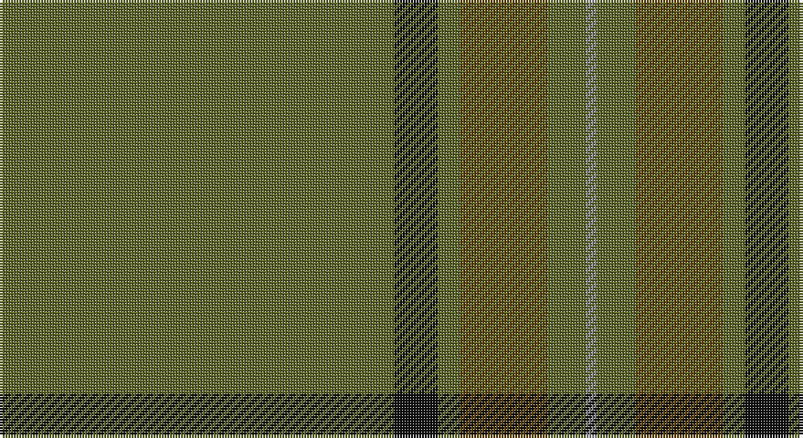

This page is one **sett** — a single exact thread-count. It belongs to the [tartan](/setts/y72k8y4dy16y7o2/)
(the same proportion at any scale), whose colour order is pattern [GKGGGR](/stripes/gkgggr/).

Sourced from tartans-authority.  It is a [6 stripe tartan](/stripes/stripes6/).

Original link http://www.tartansauthority.com/tartan-ferret/display/7609/

## Register references

External register numbers recorded for this tartan.

- Scottish Tartans Authority (ITI): 7609

## Thread count
G/144 K16 G8 T32 G14 N/4

One full sett is **288 threads**.

## Palette

Palette: <strong>Tartan Register</strong>
<table><thead><tr><th>Colour</th><th>Threads</th><th>Shade</th><th>Base</th><th>OKLCh</th></tr></thead><tbody><tr><td>G/</td><td style="text-align:right;font-variant-numeric:tabular-nums">144</td><td><code style="background-color:#5C6428;">#5C6428</code> <small style="color:#888">#5C6428</small></td><td>G <code style="background-color:#006100;">#006100</code></td><td><small style="color:#888">oklch(48.3% 0.084 116.0)</small></td></tr><tr><td>K</td><td style="text-align:right;font-variant-numeric:tabular-nums">16</td><td><code style="background-color:#101010;">#101010</code> <small style="color:#888">#101010</small></td><td>K <code style="background-color:#000000;">#000000</code></td><td><small style="color:#888">oklch(17.3% 0.000 89.9)</small></td></tr><tr><td>G</td><td style="text-align:right;font-variant-numeric:tabular-nums">8</td><td><code style="background-color:#5C6428;">#5C6428</code> <small style="color:#888">#5C6428</small></td><td>G <code style="background-color:#006100;">#006100</code></td><td><small style="color:#888">oklch(48.3% 0.084 116.0)</small></td></tr><tr><td>T</td><td style="text-align:right;font-variant-numeric:tabular-nums">32</td><td><code style="background-color:#604000;">#604000</code> <small style="color:#888">#604000</small></td><td>G <code style="background-color:#006100;">#006100</code></td><td><small style="color:#888">oklch(39.8% 0.083 76.8)</small></td></tr><tr><td>G</td><td style="text-align:right;font-variant-numeric:tabular-nums">14</td><td><code style="background-color:#5C6428;">#5C6428</code> <small style="color:#888">#5C6428</small></td><td>G <code style="background-color:#006100;">#006100</code></td><td><small style="color:#888">oklch(48.3% 0.084 116.0)</small></td></tr><tr><td>N/</td><td style="text-align:right;font-variant-numeric:tabular-nums">4</td><td><code style="background-color:#888888;">#888888</code> <small style="color:#888">#888888</small></td><td>R <code style="background-color:#CC0000;">#CC0000</code></td><td><small style="color:#888">oklch(62.7% 0.000 89.9)</small></td></tr></tbody></table>

# Sample pattern

## Nearest tartans

The nearest existing variants by ΔTartan distance, with this tartan at the top so the swatches line up against it.

ΔTartan

Tartan

Sett

—

<a href="/ttd/edit/#slug=y72k8y4dy16y7o2~x2">MacAndrew Hunting (Name)</a> <a class="nn-out" href="/variants/s6/y72k8y4dy16y7o2~x2/" title="open its dictionary page">↗</a>

1.79

<a href="/ttd/edit/#slug=y100o26dg3dr2&amp;base=y72k8y4dy16y7o2~x2">13, Irish Regiment</a> <a class="nn-out" href="/variants/s4/y100o26dg3dr2/" title="open its dictionary page">↗</a>

1.96

<a href="/ttd/edit/#slug=n44dg12dt1r6~x2&amp;base=y72k8y4dy16y7o2~x2">Heslop, William D (Name)</a> <a class="nn-out" href="/variants/s4/n44dg12dt1r6~x2/" title="open its dictionary page">↗</a>

2.13

<a href="/ttd/edit/#slug=r2g2r2g4ly3dy45g2dy3g2~x2&amp;base=y72k8y4dy16y7o2~x2">Welsh Stanley–Gpa (Personal)</a> <a class="nn-out" href="/variants/s9/r2g2r2g4ly3dy45g2dy3g2~x2/" title="open its dictionary page">↗</a>

2.13

<a href="/variants/s8/y3dyi3y4k4dy14k3y41g2~x2/">Huntsman</a>

2.36

<a href="/ttd/edit/#slug=dg32dy2dg2dy2dg2dy12dg22w1dg1w3~x2&amp;base=y72k8y4dy16y7o2~x2">Unidentified Plaid #2</a> <a class="nn-out" href="/variants/s10/dg32dy2dg2dy2dg2dy12dg22w1dg1w3~x2/" title="open its dictionary page">↗</a>

2.39

<a href="/ttd/edit/#slug=r1dy3dg2dy3r1dg24r1dy3dg2dy3r1~x2&amp;base=y72k8y4dy16y7o2~x2">Unnamed Green (Teddy Bear)</a> <a class="nn-out" href="/variants/s11/r1dy3dg2dy3r1dg24r1dy3dg2dy3r1~x2/" title="open its dictionary page">↗</a>

2.40

<a href="/ttd/edit/#slug=g18r6g75db6g13dy35g12db6&amp;base=y72k8y4dy16y7o2~x2">Glenlivet Corporate Tartan</a> <a class="nn-out" href="/variants/s8/g18r6g75db6g13dy35g12db6/" title="open its dictionary page">↗</a>

2.40

<a href="/ttd/edit/#slug=dy10k2y5k2dg46ly2k2~x2&amp;base=y72k8y4dy16y7o2~x2">Green Rover, The</a> <a class="nn-out" href="/variants/s7/dy10k2y5k2dg46ly2k2~x2/" title="open its dictionary page">↗</a>

2.51

<a href="/ttd/edit/#slug=dt44dg12g1o6~x2&amp;base=y72k8y4dy16y7o2~x2">Heslop Lurdenlaw by Kelso</a> <a class="nn-out" href="/variants/s4/dt44dg12g1o6~x2/" title="open its dictionary page">↗</a>

2.51

<a href="/ttd/edit/#slug=dg18r6dg75db6dg13dy35dg12db6&amp;base=y72k8y4dy16y7o2~x2">Gayre Bodyguard</a> <a class="nn-out" href="/variants/s8/dg18r6dg75db6dg13dy35dg12db6/" title="open its dictionary page">↗</a>

## Neighbour map

Every grey dot is one of 14360 variants placed by the first two principal components of the ΔTartan feature space (44% of its variance). Red is this tartan; blue dots are its nearest — click one to open its page.

<svg viewBox="0 0 640 380" role="img" style="max-width:100%;height:auto;border:1px solid #e0e0e0;border-radius:4px;display:block" xmlns="http://www.w3.org/2000/svg"><image href="/nn/cloud.v1.png" width="640" height="380"/><a href="/variants/s4/y100o26dg3dr2/"><circle cx="626.0" cy="222.4" r="4" fill="#3465a4"><title>13, Irish Regiment</title></circle></a><a href="/variants/s4/n44dg12dt1r6~x2/"><circle cx="585.5" cy="226.2" r="4" fill="#3465a4"><title>Heslop, William D (Name)</title></circle></a><a href="/variants/s9/r2g2r2g4ly3dy45g2dy3g2~x2/"><circle cx="585.6" cy="161.5" r="4" fill="#3465a4"><title>Welsh Stanley–Gpa (Personal)</title></circle></a><a href="/variants/s8/y3dyi3y4k4dy14k3y41g2~x2/"><circle cx="499.5" cy="192.3" r="4" fill="#3465a4"><title>Huntsman</title></circle></a><a href="/variants/s10/dg32dy2dg2dy2dg2dy12dg22w1dg1w3~x2/"><circle cx="581.3" cy="193.6" r="4" fill="#3465a4"><title>Unidentified Plaid #2</title></circle></a><a href="/variants/s11/r1dy3dg2dy3r1dg24r1dy3dg2dy3r1~x2/"><circle cx="545.0" cy="198.3" r="4" fill="#3465a4"><title>Unnamed Green (Teddy Bear)</title></circle></a><a href="/variants/s8/g18r6g75db6g13dy35g12db6/"><circle cx="498.1" cy="244.0" r="4" fill="#3465a4"><title>Glenlivet Corporate Tartan</title></circle></a><a href="/variants/s7/dy10k2y5k2dg46ly2k2~x2/"><circle cx="509.2" cy="187.3" r="4" fill="#3465a4"><title>Green Rover, The</title></circle></a><a href="/variants/s4/dt44dg12g1o6~x2/"><circle cx="595.9" cy="241.1" r="4" fill="#3465a4"><title>Heslop Lurdenlaw by Kelso</title></circle></a><a href="/variants/s8/dg18r6dg75db6dg13dy35dg12db6/"><circle cx="541.3" cy="270.0" r="4" fill="#3465a4"><title>Gayre Bodyguard</title></circle></a><circle cx="626.0" cy="208.3" r="5" fill="#c00000"/></svg>

ID: /variants/s6/y72k8y4dy16y7o2~x2/
