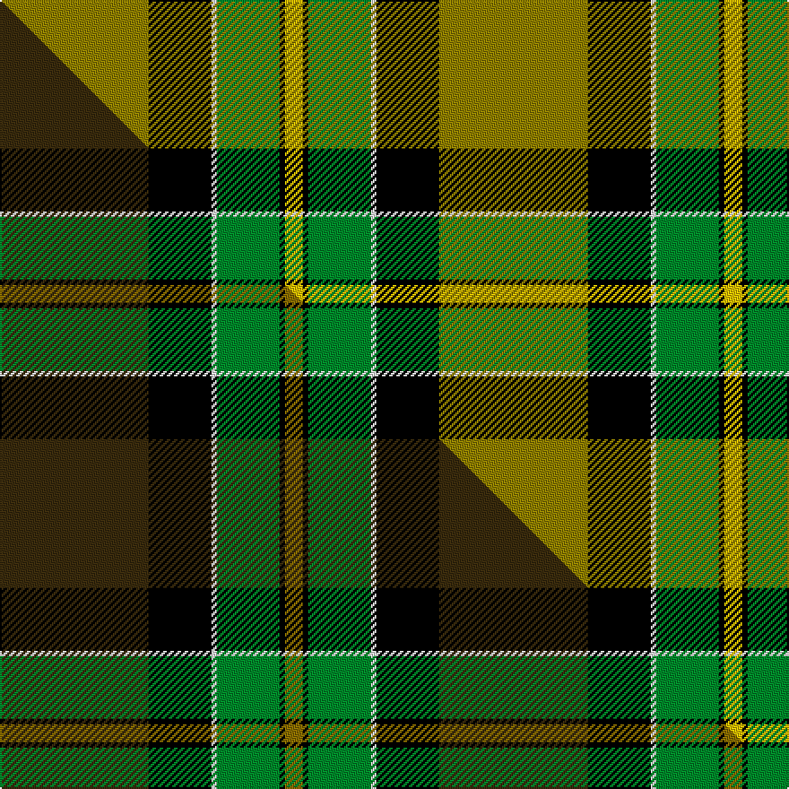

This page is one **sett** — a single exact thread-count. It belongs to the [tartan](/setts/y83k35w3g35k3ly10/)
(the same proportion at any scale), whose colour order is pattern [GKWGKY](/stripes/gkwgky/).

Part of the [Brandon Manitoba](/tartans/brandon-manitoba/) tartan — the named design grouping this sett with its other cloths.

Sourced from weddslist.  It is a [6 stripe tartan](/stripes/stripes6/).

Original link http://www.weddslist.com/cgi-bin/tartans/pg.pl?source=sts

## Thread count
Y/83 K35 W3 G35 K3 LY/10

One full sett is **245 threads**.

## Palette
<table><thead><tr><th>Colour</th><th>Shade</th><th>OKLCh</th></tr></thead><tbody><tr><td>G</td><td><code style="background-color:#008B2A;">#008B2A</code> <small style="color:#888">#008B2A</small></td><td><small style="color:#888">oklch(55.4% 0.170 145.9)</small></td></tr><tr><td>K</td><td><code style="background-color:#000000;">#000000</code> <small style="color:#888">#000000</small></td><td><small style="color:#888">oklch(0.0% 0.000 0.0)</small></td></tr><tr><td>Y</td><td><code style="background-color:#908000;">#908000</code> <small style="color:#888">#908000</small></td><td><small style="color:#888">oklch(59.6% 0.124 100.6)</small></td></tr><tr><td>W</td><td><code style="background-color:#F7F7F7;">#F7F7F7</code> <small style="color:#888">#F7F7F7</small></td><td><small style="color:#888">oklch(97.6% 0.000 89.9)</small></td></tr><tr><td>LY</td><td><code style="background-color:#F0C000;">#F0C000</code> <small style="color:#888">#F0C000</small></td><td><small style="color:#888">oklch(82.7% 0.169 90.5)</small></td></tr></tbody></table>

# Sample pattern

## Compared to the master

This cloth is one sett of its design; the master sett (the exemplar the design is anchored on) is below for comparison.

Its **ΔTartan distance** from the master is **1.61** — the same measure the nearest-tartans table ranks by (0 is identical; a re-scale of the same cloth is near 0, a recolour or a different proportion further).

<figure class="master-compare" style="margin:0">

this sett
master sett ★

<figcaption style="color:#888;font-size:smaller">One weave of this sett against the <a href="/setts/dy83k35w3g35k3y10/">master sett ★</a>, split on the diagonal: a shared proportion runs seamlessly across it with only the shades shifting; a different proportion breaks on it.</figcaption>
</figure>

## Nearest variants

The nearest existing variants by ΔTartan distance, with this cloth at the top so the swatches line up against it.

ΔTartan

Threads

Variant

Sett

—

245

<a href="/variants/s6/y83k35w3g35k3ly10~y2405105-ly3307090/">Brandon, Manitoba</a>

<a href="/ttd/edit/#slug=dy83k35w3g35k3y10&amp;base=y83k35w3g35k3ly10~y2405105-ly3307090" title="compare in the TTD">0.00</a>

245

<a href="/variants/s6/dy83k35w3g35k3y10/">Brandon Manitoba Trade Tartan</a>

<a href="/ttd/edit/#slug=y70k30w3g30k3y10&amp;base=y83k35w3g35k3ly10~y2405105-ly3307090" title="compare in the TTD">1.25</a>

212

<a href="/variants/s6/y70k30w3g30k3y10/">Jacobite #2</a>

<a href="/ttd/edit/#slug=o84k35lr3dg35k3ly10~o2205070-dg1806142&amp;base=y83k35w3g35k3ly10~y2405105-ly3307090" title="compare in the TTD">2.00</a>

246

<a href="/variants/s6/o84k35lr3dg35k3ly10~o2205070-dg1806142/">Brandon (Manitoba)</a>

<a href="/ttd/edit/#slug=g55k17r9k11y2k4~x2&amp;base=y83k35w3g35k3ly10~y2405105-ly3307090" title="compare in the TTD">2.60</a>

274

<a href="/variants/s6/g55k17r9k11y2k4~x2/">Moran (Name)</a>

<a href="/ttd/edit/#slug=g55k17r9k11y2db4~x2&amp;base=y83k35w3g35k3ly10~y2405105-ly3307090" title="compare in the TTD">2.83</a>

274

<a href="/variants/s6/g55k17r9k11y2db4~x2/">Moran Family Tartan</a>

## Neighbour map

Every grey dot is one of 13620 variants placed by the first two principal components of the ΔTartan feature space (42% of its variance). Red is this tartan; blue dots are its nearest — click one to open its page.

<svg viewBox="0 0 640 380" role="img" style="max-width:100%;height:auto;border:1px solid #e0e0e0;border-radius:4px;display:block" xmlns="http://www.w3.org/2000/svg"><image href="/nn/cloud.v1.png" width="640" height="380"/><a href="/variants/s6/dy83k35w3g35k3y10/"><circle cx="258.1" cy="136.9" r="4" fill="#3465a4"><title>Brandon Manitoba Trade Tartan</title></circle></a><a href="/variants/s6/y70k30w3g30k3y10/"><circle cx="286.2" cy="153.8" r="4" fill="#3465a4"><title>Jacobite #2</title></circle></a><a href="/variants/s6/o84k35lr3dg35k3ly10~o2205070-dg1806142/"><circle cx="242.8" cy="127.5" r="4" fill="#3465a4"><title>Brandon (Manitoba)</title></circle></a><a href="/variants/s6/g55k17r9k11y2k4~x2/"><circle cx="295.1" cy="132.3" r="4" fill="#3465a4"><title>Moran (Name)</title></circle></a><a href="/variants/s6/g55k17r9k11y2db4~x2/"><circle cx="273.0" cy="119.8" r="4" fill="#3465a4"><title>Moran Family Tartan</title></circle></a><circle cx="233.2" cy="132.5" r="5" fill="#c00000"/><text x="320" y="376" text-anchor="middle" font-size="11" fill="#999">ground</text><text x="11" y="190" text-anchor="middle" font-size="11" fill="#999" transform="rotate(-90 11 190)">complexity</text></svg>

ID: /variants/s6/y83k35w3g35k3ly10~y2405105-ly3307090/
