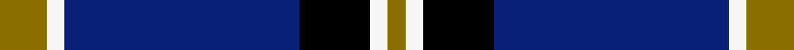

This is one **variant** — a specific cloth: this exact thread count and colourway, with its own
provenance below. It is one weaving of the [sett](/tartans/w/wo/wolverine-2/) (the scale-free proportion — the
same cloth at any scale or shade), whose colour order is pattern [GWBKWG](/stripes/gwbkwg/).

Part of the [Wolverine](/tartans/w/wo/wolverine-2/) tartan — the named design grouping this sett with its other cloths.

Sourced from register-of-tartans.  It is a [6 stripe tartan](/stripes/stripes6/).

Original link [https://www.tartanregister.gov.uk/tartanDetails.aspx?ref=10748](https://www.tartanregister.gov.uk/tartanDetails.aspx?ref=10748)

Dataset <small>— provenance for this record, inherited from the source manifest</small>

<dl class="dataset-prov">
<dt>source</dt><dd><a href="/sources/register-of-tartans/">Scottish Register of Tartans</a></dd>
<dt>data captured from</dt><dd><a href="https://github.com/thetartan/tartan-database/blob/master/data/register-of-tartans/data.csv">https://github.com/thetartan/tartan-database/blob/master/data/register-of-tartans/data.csv</a></dd>
<dt>data date</dt><dd>03/12/2012 <small>(this record)</small></dd>
<dt>licence</dt><dd><a href="https://www.tartanregister.gov.uk/copyright">Crown copyright</a></dd>
</dl>

Capture chain <small>— the hands this data passed through, oldest first; each capture carries its own licence</small>

<ol class="capture-chain">
<li><a href="https://www.tartanregister.gov.uk/">Scottish Register of Tartans</a> · <a href="https://www.tartanregister.gov.uk/copyright">Crown copyright</a> <small>the living register — still published by National Records of Scotland</small></li>
<li><a href="https://github.com/thetartan/tartan-database">thetartan/tartan-database</a> <small>2016-2017</small> · <a href="https://creativecommons.org/licenses/by-nc-nd/4.0/">CC BY-NC-ND 4.0</a> <small>Levko Kravets's frozen compilation — the capture we vendored, and where its CC licence text came from</small></li>
<li>this dictionary <small>captured 2026-06-10 · commit 5bf86c7566</small> <small>each re-capture is a git commit to data/sources</small></li>
</ol>

## Register references

External register numbers recorded for this tartan.

- Scottish Register of Tartans: [10748](https://www.tartanregister.gov.uk/tartanDetails.aspx?ref=10748)

## Thread count
Y/16 W6 DB80 K24 W6 Y/6

One full sett is **254 threads**.

## Palette
<table><thead><tr><th>Colour</th><th>Shade</th><th>OKLCh</th></tr></thead><tbody><tr><td>DB</td><td><code style="background-color:#082077;">#082077</code> <small style="color:#888">#082077</small></td><td><small style="color:#888">oklch(30.0% 0.149 265.1)</small></td></tr><tr><td>K</td><td><code style="background-color:#000000;">#000000</code> <small style="color:#888">#000000</small></td><td><small style="color:#888">oklch(0.0% 0.000 0.0)</small></td></tr><tr><td>Y</td><td><code style="background-color:#8B6E00;">#8B6E00</code> <small style="color:#888">#8B6E00</small></td><td><small style="color:#888">oklch(55.1% 0.113 90.4)</small></td></tr><tr><td>W</td><td><code style="background-color:#F7F7F7;">#F7F7F7</code> <small style="color:#888">#F7F7F7</small></td><td><small style="color:#888">oklch(97.6% 0.000 89.9)</small></td></tr></tbody></table>

# Sample pattern

[Sample sheet (PDF)](swatch.pdf) — the woven sample, thread count and palette on one printable A4, rendered on demand (the same sheet the TTD print page downloads).

## Nearest tartan variants

The nearest existing variants by ΔTartan distance, with this cloth at the top so the swatches line up against it.

ΔTartan

Threads

Variant

Sett

—

254

<a href="/variants/s6/y8w3db40k12w3y3~x2/">Wolverine (Corporate)</a>

<a href="/ttd/edit/#slug=y8k3db40k15y3~x2&amp;base=y8w3db40k12w3y3~x2" title="compare in the TTD">1.37</a>

254

<a href="/variants/s5/y8k3db40k15y3~x2/">Wolverine Corporate Tartan</a>

<a href="/ttd/edit/#slug=y2k9w3k9db35w2~x2&amp;base=y8w3db40k12w3y3~x2" title="compare in the TTD">1.58</a>

232

<a href="/variants/s6/y2k9w3k9db35w2~x2/">Hannah (Personal)</a>

<a href="/ttd/edit/#slug=k4y18db44k3y10k4&amp;base=y8w3db40k12w3y3~x2" title="compare in the TTD">1.86</a>

158

<a href="/variants/s6/k4y18db44k3y10k4/">Stutterheim</a>

<a href="/ttd/edit/#slug=k4ly18db44k3ly10k4&amp;base=y8w3db40k12w3y3~x2" title="compare in the TTD">1.86</a>

158

<a href="/variants/s6/k4ly18db44k3ly10k4/">Stutterheim (Corporate)</a>

<a href="/ttd/edit/#slug=lr8w3db40k12w3lr3~x2&amp;base=y8w3db40k12w3y3~x2" title="compare in the TTD">2.00</a>

254

<a href="/variants/s6/lr8w3db40k12w3lr3~x2/">Wolverines (Corporate)</a>

<a href="/ttd/edit/#slug=w4n15db8k4db28k2db4w2&amp;base=y8w3db40k12w3y3~x2" title="compare in the TTD">2.10</a>

128

<a href="/variants/s8/w4n15db8k4db28k2db4w2/">Kelvinside Academy (School)</a>

<a href="/ttd/edit/#slug=r1db12k5ly3db5lb1~x4&amp;base=y8w3db40k12w3y3~x2" title="compare in the TTD">2.19</a>

208

<a href="/variants/s6/r1db12k5ly3db5lb1~x4/">Massachusetts (Unofficial)</a>

<a href="/ttd/edit/#slug=db30lb2k9w3db6w4k3lb6~x2&amp;base=y8w3db40k12w3y3~x2" title="compare in the TTD">2.25</a>

180

<a href="/variants/s8/db30lb2k9w3db6w4k3lb6~x2/">Detroit Lions</a>

<a href="/ttd/edit/#slug=k3db30k8w8k2r3~x2&amp;base=y8w3db40k12w3y3~x2" title="compare in the TTD">2.32</a>

204

<a href="/variants/s6/k3db30k8w8k2r3~x2/">Hydro-Electric</a>

<a href="/ttd/edit/#slug=ly8k2db20lb4w1k2~x4&amp;base=y8w3db40k12w3y3~x2" title="compare in the TTD">2.32</a>

256

<a href="/variants/s6/ly8k2db20lb4w1k2~x4/">Solberg-Bell</a>

## Neighbour map

Every grey dot is one of 13662 variants placed by the first two principal components of the ΔTartan feature space (42% of its variance). Red is this tartan; blue dots are its nearest — click one to open its page. The map is a flat projection of a many-dimensional space — [how to read it](/posts/neighbourhood-maps/).

<svg viewBox="0 0 640 380" role="img" style="max-width:100%;height:auto;border:1px solid #e0e0e0;border-radius:4px;display:block" xmlns="http://www.w3.org/2000/svg"><image href="/nn/cloud.v1.png" width="640" height="380"/><a href="/variants/s5/y8k3db40k15y3~x2/"><circle cx="312.4" cy="161.6" r="4" fill="#3465a4"><title>Wolverine Corporate Tartan</title></circle></a><a href="/variants/s6/y2k9w3k9db35w2~x2/"><circle cx="311.0" cy="145.7" r="4" fill="#3465a4"><title>Hannah (Personal)</title></circle></a><a href="/variants/s6/k4y18db44k3y10k4/"><circle cx="308.9" cy="177.2" r="4" fill="#3465a4"><title>Stutterheim</title></circle></a><a href="/variants/s6/k4ly18db44k3ly10k4/"><circle cx="270.2" cy="166.4" r="4" fill="#3465a4"><title>Stutterheim (Corporate)</title></circle></a><a href="/variants/s6/lr8w3db40k12w3lr3~x2/"><circle cx="280.8" cy="154.4" r="4" fill="#3465a4"><title>Wolverines (Corporate)</title></circle></a><a href="/variants/s8/w4n15db8k4db28k2db4w2/"><circle cx="302.5" cy="158.9" r="4" fill="#3465a4"><title>Kelvinside Academy (School)</title></circle></a><a href="/variants/s6/r1db12k5ly3db5lb1~x4/"><circle cx="284.2" cy="170.6" r="4" fill="#3465a4"><title>Massachusetts (Unofficial)</title></circle></a><a href="/variants/s8/db30lb2k9w3db6w4k3lb6~x2/"><circle cx="273.5" cy="147.8" r="4" fill="#3465a4"><title>Detroit Lions</title></circle></a><a href="/variants/s6/k3db30k8w8k2r3~x2/"><circle cx="259.6" cy="148.4" r="4" fill="#3465a4"><title>Hydro-Electric</title></circle></a><a href="/variants/s6/ly8k2db20lb4w1k2~x4/"><circle cx="246.8" cy="134.4" r="4" fill="#3465a4"><title>Solberg-Bell</title></circle></a><circle cx="290.1" cy="159.0" r="5" fill="#c00000"/><text x="320" y="376" text-anchor="middle" font-size="11" fill="#999">ground</text><text x="11" y="190" text-anchor="middle" font-size="11" fill="#999" transform="rotate(-90 11 190)">complexity</text></svg>

ID: /variants/s6/y8w3db40k12w3y3~x2/
