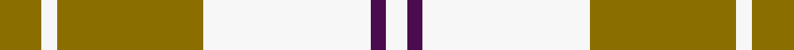

This page is one **sett** — a single exact thread-count. It belongs to the [tartan](/setts/y8w3y28w32dp3w4/)
(the same proportion at any scale), whose colour order is pattern [GWGWBW](/stripes/gwgwbw/).

Sourced from house-of-tartan.  It is a [6 stripe tartan](/stripes/stripes6/).

Original link http://www.house-of-tartan.scotland.net/house/TartanViewjs.asp?colr=Def&tnam=7604

## Provenance

Earliest known date: March 2008 One of a series of dancer's tartans for the House of Edgar's in-house collection designed by Kirsty Anderson.

## Thread count
Y/16 W6 Y56 W64 DP6 W/8

One full sett is **288 threads**.

## Palette
<table><thead><tr><th>Colour</th><th>Shade</th><th>OKLCh</th></tr></thead><tbody><tr><td>LY</td><td><code style="background-color:#8B6E00;">#8B6E00</code> <small style="color:#888">#8B6E00</small></td><td><small style="color:#888">oklch(55.1% 0.113 90.4)</small></td></tr><tr><td>P</td><td><code style="background-color:#4B0B4F;">#4B0B4F</code> <small style="color:#888">#4B0B4F</small></td><td><small style="color:#888">oklch(30.1% 0.125 325.4)</small></td></tr><tr><td>W</td><td><code style="background-color:#F7F7F7;">#F7F7F7</code> <small style="color:#888">#F7F7F7</small></td><td><small style="color:#888">oklch(97.6% 0.000 89.9)</small></td></tr></tbody></table>

# Sample pattern

## Nearest variants

The nearest existing variants by ΔTartan distance, with this cloth at the top so the swatches line up against it.

ΔTartan

Threads

Variant

Sett

—

288

<a href="/variants/s6/y8w3y28w32dp3w4~x2/">Ailsa Yellow Fashion Tartan</a>

<a href="/ttd/edit/#slug=ly38w9ly3do9w3~x2&amp;base=y8w3y28w32dp3w4~x2" title="compare in the TTD">2.29</a>

166

<a href="/variants/s5/ly38w9ly3do9w3~x2/">Loch Tummel Trade Tartan</a>

<a href="/ttd/edit/#slug=lo8w3lo28w32dp3w4~x2&amp;base=y8w3y28w32dp3w4~x2" title="compare in the TTD">2.40</a>

288

<a href="/variants/s6/lo8w3lo28w32dp3w4~x2/">Ailsa, Gold (Dance)</a>

<a href="/ttd/edit/#slug=w12g12w1g12w12ly1~x4&amp;base=y8w3y28w32dp3w4~x2" title="compare in the TTD">2.96</a>

348

<a href="/variants/s6/w12g12w1g12w12ly1~x4/">Wallace Green Dress Fashion Tartan</a>

<a href="/ttd/edit/#slug=w7db16w20db3w3y3~x2&amp;base=y8w3y28w32dp3w4~x2" title="compare in the TTD">2.99</a>

188

<a href="/variants/s6/w7db16w20db3w3y3~x2/">Unidentified (Shirt)</a>

## Neighbour map

Every grey dot is one of 13620 variants placed by the first two principal components of the ΔTartan feature space (42% of its variance). Red is this tartan; blue dots are its nearest — click one to open its page.

<svg viewBox="0 0 640 380" role="img" style="max-width:100%;height:auto;border:1px solid #e0e0e0;border-radius:4px;display:block" xmlns="http://www.w3.org/2000/svg"><image href="/nn/cloud.v1.png" width="640" height="380"/><a href="/variants/s5/ly38w9ly3do9w3~x2/"><circle cx="452.5" cy="239.8" r="4" fill="#3465a4"><title>Loch Tummel Trade Tartan</title></circle></a><a href="/variants/s6/lo8w3lo28w32dp3w4~x2/"><circle cx="424.2" cy="264.3" r="4" fill="#3465a4"><title>Ailsa, Gold (Dance)</title></circle></a><a href="/variants/s6/w12g12w1g12w12ly1~x4/"><circle cx="329.9" cy="266.9" r="4" fill="#3465a4"><title>Wallace Green Dress Fashion Tartan</title></circle></a><a href="/variants/s6/w7db16w20db3w3y3~x2/"><circle cx="317.6" cy="254.0" r="4" fill="#3465a4"><title>Unidentified (Shirt)</title></circle></a><circle cx="345.4" cy="233.9" r="5" fill="#c00000"/><text x="320" y="376" text-anchor="middle" font-size="11" fill="#999">ground</text><text x="11" y="190" text-anchor="middle" font-size="11" fill="#999" transform="rotate(-90 11 190)">complexity</text></svg>

ID: /variants/s6/y8w3y28w32dp3w4~x2/
