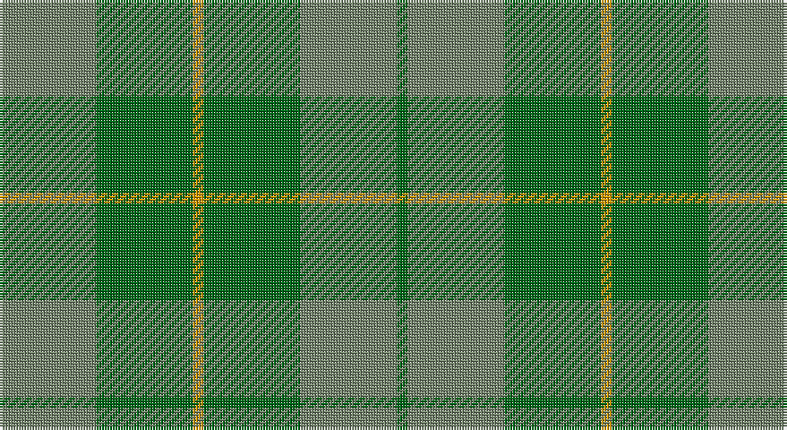

This page is one **sett** — a single exact thread-count. It belongs to the [tartan](/setts/y9g9lo1g9y9g1/)
(the same proportion at any scale), whose colour order is pattern [GGGYGG](/stripes/gggygg/).

Part of the [Spring Morning](/tartans/spring-morning/) tartan — the named design grouping this sett with its other cloths.

Sourced from register-of-tartans.  It is a [6 stripe tartan](/stripes/stripes6/).

Original link https://www.tartanregister.gov.uk/tartanDetails.aspx?ref=3869

## Register references

External register numbers recorded for this tartan.

- Scottish Register of Tartans: [3869](https://www.tartanregister.gov.uk/tartanDetails.aspx?ref=3869)
- Scottish Tartans Authority (ITI): 5311

## Thread count
N/36 G36 DY4 G36 N36 G/4

One full sett is **264 threads**.

## Palette

Palette: <strong>Tartan Register</strong> <small style="color:#888">(1 of 3 colours)</small>
<table><thead><tr><th>Colour</th><th>Threads</th><th>Shade</th><th>Base</th><th>OKLCh</th></tr></thead><tbody><tr><td>N/</td><td style="text-align:right;font-variant-numeric:tabular-nums">36</td><td><code style="background-color:#74846C;">#74846C</code> <small style="color:#888">#74846C</small></td><td>G <code style="background-color:#006100;">#006100</code></td><td><small style="color:#888">oklch(59.3% 0.040 135.2)</small></td></tr><tr><td>G</td><td style="text-align:right;font-variant-numeric:tabular-nums">36</td><td><code style="background-color:#006818;">#006818</code> <small style="color:#888">#006818</small></td><td>G <code style="background-color:#006100;">#006100</code></td><td><small style="color:#888">oklch(45.0% 0.142 145.0)</small></td></tr><tr><td>DY</td><td style="text-align:right;font-variant-numeric:tabular-nums">4</td><td><code style="background-color:#D09800;">#D09800</code> <small style="color:#888">#D09800</small></td><td>Y <code style="background-color:#F2BF00;">#F2BF00</code></td><td><small style="color:#888">oklch(71.4% 0.147 82.1)</small></td></tr><tr><td>G</td><td style="text-align:right;font-variant-numeric:tabular-nums">36</td><td><code style="background-color:#006818;">#006818</code> <small style="color:#888">#006818</small></td><td>G <code style="background-color:#006100;">#006100</code></td><td><small style="color:#888">oklch(45.0% 0.142 145.0)</small></td></tr><tr><td>N</td><td style="text-align:right;font-variant-numeric:tabular-nums">36</td><td><code style="background-color:#74846C;">#74846C</code> <small style="color:#888">#74846C</small></td><td>G <code style="background-color:#006100;">#006100</code></td><td><small style="color:#888">oklch(59.3% 0.040 135.2)</small></td></tr><tr><td>G/</td><td style="text-align:right;font-variant-numeric:tabular-nums">4</td><td><code style="background-color:#006818;">#006818</code> <small style="color:#888">#006818</small></td><td>G <code style="background-color:#006100;">#006100</code></td><td><small style="color:#888">oklch(45.0% 0.142 145.0)</small></td></tr></tbody></table>

# Sample pattern

## Nearest tartans

The nearest existing variants by ΔTartan distance, with this tartan at the top so the swatches line up against it.

ΔTartan

Tartan

Sett

—

<a href="/ttd/edit/#slug=y9g9lo1g9y9g1~x4">Spring Morning</a> <a class="nn-out" href="/variants/s6/y9g9lo1g9y9g1~x4/" title="open its dictionary page">↗</a>

1.22

<a href="/ttd/edit/#slug=g1y9g9lo1~x4&amp;base=y9g9lo1g9y9g1~x4">Spring Morning (Fashion)</a> <a class="nn-out" href="/variants/s4/g1y9g9lo1~x4/" title="open its dictionary page">↗</a>

1.57

<a href="/ttd/edit/#slug=r2g12o3g8o14g2~x2&amp;base=y9g9lo1g9y9g1~x4">Confederate Artillery (Military)</a> <a class="nn-out" href="/variants/s6/r2g12o3g8o14g2~x2/" title="open its dictionary page">↗</a>

1.75

<a href="/ttd/edit/#slug=g1dy8g8r1g8dy8w1~x2&amp;base=y9g9lo1g9y9g1~x4">MacKinnon Hunting Clan Tartan</a> <a class="nn-out" href="/variants/s7/g1dy8g8r1g8dy8w1~x2/" title="open its dictionary page">↗</a>

1.83

<a href="/ttd/edit/#slug=o6g2o29g29o2g6~x2&amp;base=y9g9lo1g9y9g1~x4">Harmony, 11</a> <a class="nn-out" href="/variants/s6/o6g2o29g29o2g6~x2/" title="open its dictionary page">↗</a>

1.84

<a href="/ttd/edit/#slug=g4o25g6t12g12t3~x2&amp;base=y9g9lo1g9y9g1~x4">Canadian Fancy</a> <a class="nn-out" href="/variants/s6/g4o25g6t12g12t3~x2/" title="open its dictionary page">↗</a>

1.88

<a href="/ttd/edit/#slug=g1o8g8r1g8o8w1~x4&amp;base=y9g9lo1g9y9g1~x4">MacKinnon, hunting</a> <a class="nn-out" href="/variants/s7/g1o8g8r1g8o8w1~x4/" title="open its dictionary page">↗</a>

1.95

<a href="/ttd/edit/#slug=y4dg18dgi6dg6dgi24ly3~x2&amp;base=y9g9lo1g9y9g1~x4">Park (Estate Check)</a> <a class="nn-out" href="/variants/s6/y4dg18dgi6dg6dgi24ly3~x2/" title="open its dictionary page">↗</a>

2.03

<a href="/ttd/edit/#slug=dy8w1dy8g8r1g8dy8g1dy8g8r1g8~x8&amp;base=y9g9lo1g9y9g1~x4">MacKinnon Hunting #3</a> <a class="nn-out" href="/variants/s12/dy8w1dy8g8r1g8dy8g1dy8g8r1g8~x8/" title="open its dictionary page">↗</a>

2.04

<a href="/ttd/edit/#slug=g7y6n7y1n2~x6&amp;base=y9g9lo1g9y9g1~x4">Bright of Garth (Personal)</a> <a class="nn-out" href="/variants/s5/g7y6n7y1n2~x6/" title="open its dictionary page">↗</a>

2.04

<a href="/ttd/edit/#slug=dg1dy8dg8r1dg8dy8w1~x2&amp;base=y9g9lo1g9y9g1~x4">MacKinnon Hunting</a> <a class="nn-out" href="/variants/s7/dg1dy8dg8r1dg8dy8w1~x2/" title="open its dictionary page">↗</a>

## Neighbour map

Every grey dot is one of 14360 variants placed by the first two principal components of the ΔTartan feature space (44% of its variance). Red is this tartan; blue dots are its nearest — click one to open its page.

<svg viewBox="0 0 640 380" role="img" style="max-width:100%;height:auto;border:1px solid #e0e0e0;border-radius:4px;display:block" xmlns="http://www.w3.org/2000/svg"><image href="/nn/cloud.v1.png" width="640" height="380"/><a href="/variants/s4/g1y9g9lo1~x4/"><circle cx="413.5" cy="313.5" r="4" fill="#3465a4"><title>Spring Morning (Fashion)</title></circle></a><a href="/variants/s6/r2g12o3g8o14g2~x2/"><circle cx="384.8" cy="298.7" r="4" fill="#3465a4"><title>Confederate Artillery (Military)</title></circle></a><a href="/variants/s7/g1dy8g8r1g8dy8w1~x2/"><circle cx="353.0" cy="282.1" r="4" fill="#3465a4"><title>MacKinnon Hunting Clan Tartan</title></circle></a><a href="/variants/s6/o6g2o29g29o2g6~x2/"><circle cx="480.7" cy="285.5" r="4" fill="#3465a4"><title>Harmony, 11</title></circle></a><a href="/variants/s6/g4o25g6t12g12t3~x2/"><circle cx="315.4" cy="295.0" r="4" fill="#3465a4"><title>Canadian Fancy</title></circle></a><a href="/variants/s7/g1o8g8r1g8o8w1~x4/"><circle cx="334.8" cy="268.5" r="4" fill="#3465a4"><title>MacKinnon, hunting</title></circle></a><a href="/variants/s6/y4dg18dgi6dg6dgi24ly3~x2/"><circle cx="377.6" cy="303.8" r="4" fill="#3465a4"><title>Park (Estate Check)</title></circle></a><a href="/variants/s12/dy8w1dy8g8r1g8dy8g1dy8g8r1g8~x8/"><circle cx="358.2" cy="284.3" r="4" fill="#3465a4"><title>MacKinnon Hunting #3</title></circle></a><a href="/variants/s5/g7y6n7y1n2~x6/"><circle cx="302.2" cy="335.7" r="4" fill="#3465a4"><title>Bright of Garth (Personal)</title></circle></a><a href="/variants/s7/dg1dy8dg8r1dg8dy8w1~x2/"><circle cx="371.4" cy="296.3" r="4" fill="#3465a4"><title>MacKinnon Hunting</title></circle></a><circle cx="402.3" cy="322.7" r="5" fill="#c00000"/></svg>

ID: /variants/s6/y9g9lo1g9y9g1~x4/
