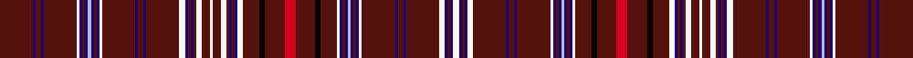

This is one **variant** — a specific cloth: this exact thread count and colourway, with its own
provenance below. It is one weaving of the [sett](/tartans/t/ta/takla-makan-2/) (the scale-free proportion — the
same cloth at any scale or shade), whose colour order is pattern [BBBBBWBBBWBBBWBBBBBWBBBBWBWBWBBBBWBKBRBKBWBBBWBBBWBBBBBWBBBW](/stripes/bbbbbwbbbwbbbwbbbbbwbbbbwbwbwbbbbwbkbrbkbwbbbwbbbwbbbbbwbbbw/).

Part of the [Takla Makan](/tartans/t/ta/takla-makan-2/) tartan — the named design grouping this sett with its other cloths.

Sourced from tartans-authority.  It is a [60 stripe tartan](/stripes/stripes60/).

Original link <code>http://www.tartansauthority.com/tartan-ferret/display/5156/</code> — retired · [Internet Archive copy](https://web.archive.org/web/*/http://www.tartansauthority.com/tartan-ferret/display/5156/*)

Dataset <small>— provenance for this record, inherited from the source manifest</small>

<dl class="dataset-prov">
<dt>source</dt><dd><a href="/sources/tartans-authority/">Scottish Tartans Authority</a></dd>
<dt>data captured from</dt><dd><a href="https://github.com/thetartan/tartan-database/blob/master/data/tartans-authority/data.csv">https://github.com/thetartan/tartan-database/blob/master/data/tartans-authority/data.csv</a></dd>
<dt>data date</dt><dd>1200 - 700BC <small>(this record)</small></dd>
<dt>licence</dt><dd><a href="https://creativecommons.org/licenses/by-nc-nd/4.0/">CC BY-NC-ND 4.0</a></dd>
</dl>

Capture chain <small>— the hands this data passed through, oldest first; each capture carries its own licence</small>

<ol class="capture-chain">
<li><a href="https://www.tartansauthority.com/">Scottish Tartans Authority</a> <small>the heritage body’s archive — its tartan-ferret record browser is retired; dead record links are shown unlinked, with an Internet Archive copy (ITI numbers are not SRT references)</small></li>
<li><a href="https://github.com/thetartan/tartan-database">thetartan/tartan-database</a> <small>2016-2017</small> · <a href="https://creativecommons.org/licenses/by-nc-nd/4.0/">CC BY-NC-ND 4.0</a> <small>Levko Kravets's frozen compilation — the capture we vendored, and where its CC licence text came from</small></li>
<li>this dictionary <small>captured 2026-06-10 · commit 5bf86c7566</small> <small>each re-capture is a git commit to data/sources</small></li>
</ol>

## Register references

External register numbers recorded for this tartan.

- Scottish Tartans Authority (ITI): 5156

## Thread count
DR/24 DB2 DR4 DB2 DR24 W2 DB2 DR2 DB2 LB2 DB2 DR2 DB2 W2 DR24 DB2 DR4 DB2 DR24 W4 DB2 DR2 DB2 DR2 W4 DR6 W2 DR6 W4 DR2 DB2 DR2 DB2 W4 DR12 K4 DR14 R8 DR14 K4 DR12 W2 DB2 DR2 DB2 LB2 DB2 DR2 DB2 W2 DR24 DB2 DR4 DB2 DR24 W4 DB2 DR2 DB2 W/4

One full sett is **636 threads**.

## Palette
<table><thead><tr><th>Colour</th><th>Shade</th><th>OKLCh</th></tr></thead><tbody><tr><td>DB</td><td><code style="background-color:#1C0070;">#1C0070</code> <small style="color:#888">#1C0070</small></td><td><small style="color:#888">oklch(26.3% 0.162 277.1)</small></td></tr><tr><td>LB</td><td><code style="background-color:#B5BBDE;">#B5BBDE</code> <small style="color:#888">#B5BBDE</small></td><td><small style="color:#888">oklch(79.9% 0.050 277.6)</small></td></tr><tr><td>K</td><td><code style="background-color:#000000;">#000000</code> <small style="color:#888">#000000</small></td><td><small style="color:#888">oklch(0.0% 0.000 0.0)</small></td></tr><tr><td>R</td><td><code style="background-color:#D60020;">#D60020</code> <small style="color:#888">#D60020</small></td><td><small style="color:#888">oklch(55.2% 0.224 25.5)</small></td></tr><tr><td>DR</td><td><code style="background-color:#680028;">#680028</code> <small style="color:#888">#680028</small></td><td><small style="color:#888">oklch(33.1% 0.133 8.3)</small></td></tr><tr><td>W</td><td><code style="background-color:#F7F7F7;">#F7F7F7</code> <small style="color:#888">#F7F7F7</small></td><td><small style="color:#888">oklch(97.6% 0.000 89.9)</small></td></tr><tr><td>DR</td><td><code style="background-color:#55120C;">#55120C</code> <small style="color:#888">#55120C</small></td><td><small style="color:#888">oklch(30.0% 0.099 29.3)</small></td></tr></tbody></table>

# Sample pattern

ID: /variants/s60/dr12db1dr2db1dr12w1db1dr1db1lb1db1dr1db1w1dr12db1dr2db1dr12w2db1dr1db1dr1w2dr3w1dr3w2dr1db1dr1db1w2dr6k2dr7r4dr7k2dr6w1db1dr1db1lb1db1dr1db1w1dr12db1dr2db1dr12w2db1dr1db1w2~x2~db2616276/
