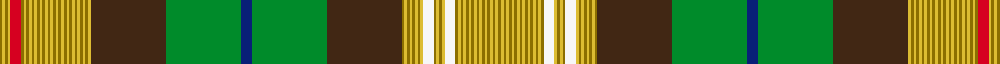

This page is one **sett** — a single exact thread-count. It belongs to the [tartan](/setts/y1ly1y1ly1r4y1ly1y1ly1y1ly1y1ly1y1ly1y1ly1y1ly1y1ly1y1ly1y1ly1y1ly1y1ly1y1ly1do28g28db4g28do28y1ly1y1ly1y1ly1y1ly1w4y1ly1y1ly1w4y1ly1y1ly1y1ly1y1ly1y1ly1y1ly1y1ly1y1ly1y1/)
(the same proportion at any scale), whose colour order is pattern [GYGYGYGYGYGYGYGYGWYGYGWYGYGYGYGBGBGBYGYGYGYGYGYGYGYGYGYGYGYGYGRYGYG](/stripes/gygygygygygygygygwygygwygygygygbgbgbygygygygygygygygygygygygygrygyg/).

Sourced from tartans-authority.  It is a [67 stripe tartan](/stripes/stripes67/).

Original link http://www.tartansauthority.com/tartan-ferret/display/7628/

2 attestations — the source records this cloth was collapsed from (oldest owns this page)

<ul>
<li>April 2008 — Hash House Harriers Trail (Corp) (tartans-authority, <a href="http://www.tartansauthority.com/tartan-ferret/display/7628/">record</a>)  <em>The design alludes to the regimental tartan of the Argyll & Suthgerland Highlanders in which the founder of the Hashers - A.S. Gilbert - had served. The colours represent various aspects of the running club - green for the foliage its members run through, blue for the water crossings, brown for the mud, red for the blood occasionally shed running through such terrain, white for the marking of the trails and gold for the beer with they refresh themselves when the trail is completed.</em></li>
<li>undated — Hash House Harriers Trail (register-of-tartans, <a href="https://www.tartanregister.gov.uk/tartanDetails.aspx?ref=5646">record</a>)  <em>The design alludes to the regimental tartan of the Argyll & Suthgerland Highlanders in which the founder of the Hashers - A.S. Gilbert - had served. The colours represent various aspects of the running club - green for the foliage its members run through, blue for the water crossings, brown for the mud, red for the blood occasionally shed running through such terrain, white for the marking of the trails and gold for the beer with they refresh themselves when the trail is completed.</em></li>
</ul>

## Register references

External register numbers recorded for this tartan.

- Scottish Register of Tartans: [5646](https://www.tartanregister.gov.uk/tartanDetails.aspx?ref=5646)
- Scottish Tartans Authority (ITI): 7628

## Thread count
Y/2 LY2 Y2 LY2 R8 Y2 LY2 Y2 LY2 Y2 LY2 Y2 LY2 Y2 LY2 Y2 LY2 Y2 LY2 Y2 LY2 Y2 LY2 Y2 LY2 Y2 LY2 Y2 LY2 Y2 LY2 DO56 G56 DB8 G56 DO56 Y2 LY2 Y2 LY2 Y2 LY2 Y2 LY2 W8 Y2 LY2 Y2 LY2 W8 Y2 LY2 Y2 LY2 Y2 LY2 Y2 LY2 Y2 LY2 Y2 LY2 Y2 LY2 Y2 LY2 Y/2

One full sett is **744 threads**.

## Palette
<table><thead><tr><th>Colour</th><th>Shade</th><th>OKLCh</th></tr></thead><tbody><tr><td>DB</td><td><code style="background-color:#082077;">#082077</code> <small style="color:#888">#082077</small></td><td><small style="color:#888">oklch(30.0% 0.149 265.1)</small></td></tr><tr><td>DO</td><td><code style="background-color:#412714;">#412714</code> <small style="color:#888">#412714</small></td><td><small style="color:#888">oklch(30.1% 0.050 55.7)</small></td></tr><tr><td>LY</td><td><code style="background-color:#DCBC32;">#DCBC32</code> <small style="color:#888">#DCBC32</small></td><td><small style="color:#888">oklch(80.0% 0.150 95.2)</small></td></tr><tr><td>G</td><td><code style="background-color:#008B2A;">#008B2A</code> <small style="color:#888">#008B2A</small></td><td><small style="color:#888">oklch(55.4% 0.170 145.9)</small></td></tr><tr><td>W</td><td><code style="background-color:#F7F7F7;">#F7F7F7</code> <small style="color:#888">#F7F7F7</small></td><td><small style="color:#888">oklch(97.6% 0.000 89.9)</small></td></tr><tr><td>R</td><td><code style="background-color:#D60020;">#D60020</code> <small style="color:#888">#D60020</small></td><td><small style="color:#888">oklch(55.2% 0.224 25.5)</small></td></tr><tr><td>Y</td><td><code style="background-color:#8B6E00;">#8B6E00</code> <small style="color:#888">#8B6E00</small></td><td><small style="color:#888">oklch(55.1% 0.113 90.4)</small></td></tr></tbody></table>

# Sample pattern

## Nearest tartan variants

The nearest existing variants by ΔTartan distance, with this cloth at the top so the swatches line up against it.

ΔTartan

Threads

Variant

Sett

—

744

<a href="/variants/s67/y1ly1y1ly1r4y1ly1y1ly1y1ly1y1ly1y1ly1y1ly1y1ly1y1ly1y1ly1y1ly1y1ly1y1ly1y1ly1do28g28db4g28do28y1ly1y1ly1y1ly1y1ly1w4y1ly1y1ly1w4y1ly1y1ly1y1ly1y1ly1y1ly1y1ly1y1ly1y1ly1y1~x2/">Hash House Harriers Trail (Corp)</a>

<a href="/ttd/edit/#slug=lb1ly1lb1dg1g2dg2g2dg2g2dg1lb1ly1lb1ly1lb1dg28r24ly1n2ly3lb4r10dy16r4ly2r15dy5r9dg28lb1ly1lb1ly1lb1dg1g2dg2g2dg2g2dg1lb1ly1lb1~x2~ly3307090-dg1806142-g2408144-dy1603076&amp;base=y1ly1y1ly1r4y1ly1y1ly1y1ly1y1ly1y1ly1y1ly1y1ly1y1ly1y1ly1y1ly1y1ly1y1ly1y1ly1do28g28db4g28do28y1ly1y1ly1y1ly1y1ly1w4y1ly1y1ly1w4y1ly1y1ly1y1ly1y1ly1y1ly1y1ly1y1ly1y1ly1y1~x2" title="compare in the TTD">3.74</a>

760

<a href="/variants/s44/lb1ly1lb1dg1g2dg2g2dg2g2dg1lb1ly1lb1ly1lb1dg28r24ly1n2ly3lb4r10dy16r4ly2r15dy5r9dg28lb1ly1lb1ly1lb1dg1g2dg2g2dg2g2dg1lb1ly1lb1~x2~ly3307090-dg1806142-g2408144-dy1603076/">New Brunswick</a>

## Neighbour map

Every grey dot is one of 13620 variants placed by the first two principal components of the ΔTartan feature space (42% of its variance). Red is this tartan; blue dots are its nearest — click one to open its page.

<svg viewBox="0 0 640 380" role="img" style="max-width:100%;height:auto;border:1px solid #e0e0e0;border-radius:4px;display:block" xmlns="http://www.w3.org/2000/svg"><image href="/nn/cloud.v1.png" width="640" height="380"/><a href="/variants/s44/lb1ly1lb1dg1g2dg2g2dg2g2dg1lb1ly1lb1ly1lb1dg28r24ly1n2ly3lb4r10dy16r4ly2r15dy5r9dg28lb1ly1lb1ly1lb1dg1g2dg2g2dg2g2dg1lb1ly1lb1~x2~ly3307090-dg1806142-g2408144-dy1603076/"><circle cx="187.9" cy="23.0" r="4" fill="#3465a4"><title>New Brunswick</title></circle></a><circle cx="151.2" cy="14.0" r="5" fill="#c00000"/><text x="320" y="376" text-anchor="middle" font-size="11" fill="#999">ground</text><text x="11" y="190" text-anchor="middle" font-size="11" fill="#999" transform="rotate(-90 11 190)">complexity</text></svg>

ID: /variants/s67/y1ly1y1ly1r4y1ly1y1ly1y1ly1y1ly1y1ly1y1ly1y1ly1y1ly1y1ly1y1ly1y1ly1y1ly1y1ly1do28g28db4g28do28y1ly1y1ly1y1ly1y1ly1w4y1ly1y1ly1w4y1ly1y1ly1y1ly1y1ly1y1ly1y1ly1y1ly1y1ly1y1~x2/
