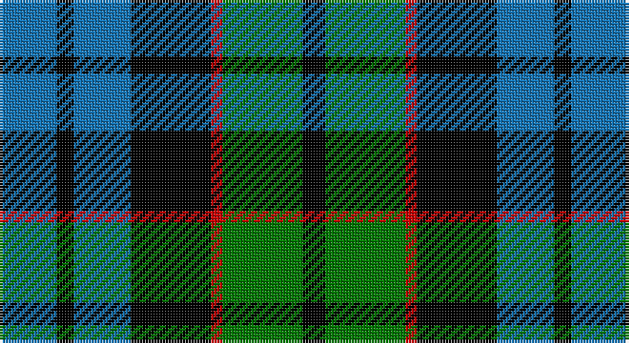

This page is one **sett** — a single exact thread-count. It belongs to the [tartan](/setts/b10k3b10k14r2g14k4/)
(the same proportion at any scale), whose colour order is pattern [BKBKRGK](/stripes/bkbkrgk/).

Part of the [Fletcher](/tartans/fletcher/) tartan — the named design grouping this sett with its other cloths.

Sourced from register-of-tartans.  It is a [7 stripe tartan](/stripes/stripes7/).

Original link https://www.tartanregister.gov.uk/tartanDetails.aspx?ref=1206

## Also known as

This cloth is also recorded under:

- Fletcher #2

2 attestations — the source records this cloth was collapsed from (oldest owns this page)

<ul>
<li>01/01/2002 — Fletcher #2 (register-of-tartans, <a href="https://www.tartanregister.gov.uk/tartanDetails.aspx?ref=1206">record</a>)</li>
<li>pre 2002 — Fletcher (Clan) (tartans-authority, <a href="http://www.tartansauthority.com/tartan-ferret/display/257/">record</a>)</li>
</ul>

## Register references

External register numbers recorded for this tartan.

- Scottish Register of Tartans: [1206](https://www.tartanregister.gov.uk/tartanDetails.aspx?ref=1206)
- Scottish Tartans Authority (ITI): 257
- Scottish Tartans World Register: 257

## Thread count
B/20 K6 B20 K28 R4 G28 K/8

One full sett is **200 threads**.

## Palette

Palette: <strong>Tartan Register</strong>
<table><thead><tr><th>Colour</th><th>Threads</th><th>Shade</th><th>Base</th><th>OKLCh</th></tr></thead><tbody><tr><td>B/</td><td style="text-align:right;font-variant-numeric:tabular-nums">20</td><td><code style="background-color:#1474B4;">#1474B4</code> <small style="color:#888">#1474B4</small></td><td>B <code style="background-color:#2A418A;">#2A418A</code></td><td><small style="color:#888">oklch(54.0% 0.129 245.1)</small></td></tr><tr><td>K</td><td style="text-align:right;font-variant-numeric:tabular-nums">6</td><td><code style="background-color:#000000;">#000000</code> <small style="color:#888">#000000</small></td><td>K <code style="background-color:#000000;">#000000</code></td><td><small style="color:#888">oklch(0.0% 0.000 0.0)</small></td></tr><tr><td>B</td><td style="text-align:right;font-variant-numeric:tabular-nums">20</td><td><code style="background-color:#1474B4;">#1474B4</code> <small style="color:#888">#1474B4</small></td><td>B <code style="background-color:#2A418A;">#2A418A</code></td><td><small style="color:#888">oklch(54.0% 0.129 245.1)</small></td></tr><tr><td>K</td><td style="text-align:right;font-variant-numeric:tabular-nums">28</td><td><code style="background-color:#000000;">#000000</code> <small style="color:#888">#000000</small></td><td>K <code style="background-color:#000000;">#000000</code></td><td><small style="color:#888">oklch(0.0% 0.000 0.0)</small></td></tr><tr><td>R</td><td style="text-align:right;font-variant-numeric:tabular-nums">4</td><td><code style="background-color:#C80000;">#C80000</code> <small style="color:#888">#C80000</small></td><td>R <code style="background-color:#CC0000;">#CC0000</code></td><td><small style="color:#888">oklch(52.3% 0.215 29.2)</small></td></tr><tr><td>G</td><td style="text-align:right;font-variant-numeric:tabular-nums">28</td><td><code style="background-color:#007800;">#007800</code> <small style="color:#888">#007800</small></td><td>G <code style="background-color:#006100;">#006100</code></td><td><small style="color:#888">oklch(49.6% 0.169 142.5)</small></td></tr><tr><td>K/</td><td style="text-align:right;font-variant-numeric:tabular-nums">8</td><td><code style="background-color:#000000;">#000000</code> <small style="color:#888">#000000</small></td><td>K <code style="background-color:#000000;">#000000</code></td><td><small style="color:#888">oklch(0.0% 0.000 0.0)</small></td></tr></tbody></table>

# Sample pattern

## Nearest tartans

The nearest existing variants by ΔTartan distance, with this tartan at the top so the swatches line up against it.

ΔTartan

Tartan

Sett

—

<a href="/ttd/edit/#slug=b10k3b10k14r2g14k4~x2">Fletcher #2</a> <a class="nn-out" href="/variants/s7/b10k3b10k14r2g14k4~x2/" title="open its dictionary page">↗</a>

0.65

<a href="/ttd/edit/#slug=db6k1db6k8r1g8k2~x2&amp;base=b10k3b10k14r2g14k4~x2">Fletcher</a> <a class="nn-out" href="/variants/s7/db6k1db6k8r1g8k2~x2/" title="open its dictionary page">↗</a>

0.73

<a href="/ttd/edit/#slug=db2k2db12k11g12w2~x2&amp;base=b10k3b10k14r2g14k4~x2">Campbell, The White Stripe</a> <a class="nn-out" href="/variants/s6/db2k2db12k11g12w2~x2/" title="open its dictionary page">↗</a>

0.78

<a href="/ttd/edit/#slug=t3g6k6t4r1t1~x2&amp;base=b10k3b10k14r2g14k4~x2">Wellington, or Waterloo</a> <a class="nn-out" href="/variants/s6/t3g6k6t4r1t1~x2/" title="open its dictionary page">↗</a>

0.82

<a href="/ttd/edit/#slug=db6k1db6k8r1g8r2~x2&amp;base=b10k3b10k14r2g14k4~x2">Fletcher of Dunans</a> <a class="nn-out" href="/variants/s7/db6k1db6k8r1g8r2~x2/" title="open its dictionary page">↗</a>

0.83

<a href="/variants/s8/db10k6t1g6k1~x2/">Unnamed, No 115</a>

0.83

<a href="/ttd/edit/#slug=db2k2db12k8g11r2~x2&amp;base=b10k3b10k14r2g14k4~x2">Murray</a> <a class="nn-out" href="/variants/s6/db2k2db12k8g11r2~x2/" title="open its dictionary page">↗</a>

0.84

<a href="/ttd/edit/#slug=k3g14k14g2db14r3~x2&amp;base=b10k3b10k14r2g14k4~x2">Morrison</a> <a class="nn-out" href="/variants/s6/k3g14k14g2db14r3~x2/" title="open its dictionary page">↗</a>

0.87

<a href="/ttd/edit/#slug=w4db4g22k20db20w3&amp;base=b10k3b10k14r2g14k4~x2">Unnamed, No 26</a> <a class="nn-out" href="/variants/s6/w4db4g22k20db20w3/" title="open its dictionary page">↗</a>

0.88

<a href="/ttd/edit/#slug=db4g6w1g6k6db6k2~x4&amp;base=b10k3b10k14r2g14k4~x2">MacNeil of Colonsay</a> <a class="nn-out" href="/variants/s7/db4g6w1g6k6db6k2~x4/" title="open its dictionary page">↗</a>

0.90

<a href="/ttd/edit/#slug=k8dg8k1dg8k8b8w2~x2&amp;base=b10k3b10k14r2g14k4~x2">Unidentified No 31</a> <a class="nn-out" href="/variants/s7/k8dg8k1dg8k8b8w2~x2/" title="open its dictionary page">↗</a>

## Neighbour map

Every grey dot is one of 14360 variants placed by the first two principal components of the ΔTartan feature space (44% of its variance). Red is this tartan; blue dots are its nearest — click one to open its page.

<svg viewBox="0 0 640 380" role="img" style="max-width:100%;height:auto;border:1px solid #e0e0e0;border-radius:4px;display:block" xmlns="http://www.w3.org/2000/svg"><image href="/nn/cloud.v1.png" width="640" height="380"/><a href="/variants/s7/db6k1db6k8r1g8k2~x2/"><circle cx="158.2" cy="233.5" r="4" fill="#3465a4"><title>Fletcher</title></circle></a><a href="/variants/s6/db2k2db12k11g12w2~x2/"><circle cx="129.6" cy="237.4" r="4" fill="#3465a4"><title>Campbell, The White Stripe</title></circle></a><a href="/variants/s6/t3g6k6t4r1t1~x2/"><circle cx="128.4" cy="245.2" r="4" fill="#3465a4"><title>Wellington, or Waterloo</title></circle></a><a href="/variants/s7/db6k1db6k8r1g8r2~x2/"><circle cx="147.1" cy="229.0" r="4" fill="#3465a4"><title>Fletcher of Dunans</title></circle></a><a href="/variants/s8/db10k6t1g6k1~x2/"><circle cx="146.4" cy="216.1" r="4" fill="#3465a4"><title>Unnamed, No 115</title></circle></a><a href="/variants/s6/db2k2db12k8g11r2~x2/"><circle cx="152.3" cy="241.4" r="4" fill="#3465a4"><title>Murray</title></circle></a><a href="/variants/s6/k3g14k14g2db14r3~x2/"><circle cx="137.1" cy="236.8" r="4" fill="#3465a4"><title>Morrison</title></circle></a><a href="/variants/s6/w4db4g22k20db20w3/"><circle cx="118.1" cy="225.8" r="4" fill="#3465a4"><title>Unnamed, No 26</title></circle></a><a href="/variants/s7/db4g6w1g6k6db6k2~x4/"><circle cx="119.8" cy="262.7" r="4" fill="#3465a4"><title>MacNeil of Colonsay</title></circle></a><a href="/variants/s7/k8dg8k1dg8k8b8w2~x2/"><circle cx="152.2" cy="253.5" r="4" fill="#3465a4"><title>Unidentified No 31</title></circle></a><circle cx="131.7" cy="239.8" r="5" fill="#c00000"/></svg>

ID: /variants/s7/b10k3b10k14r2g14k4~x2/
