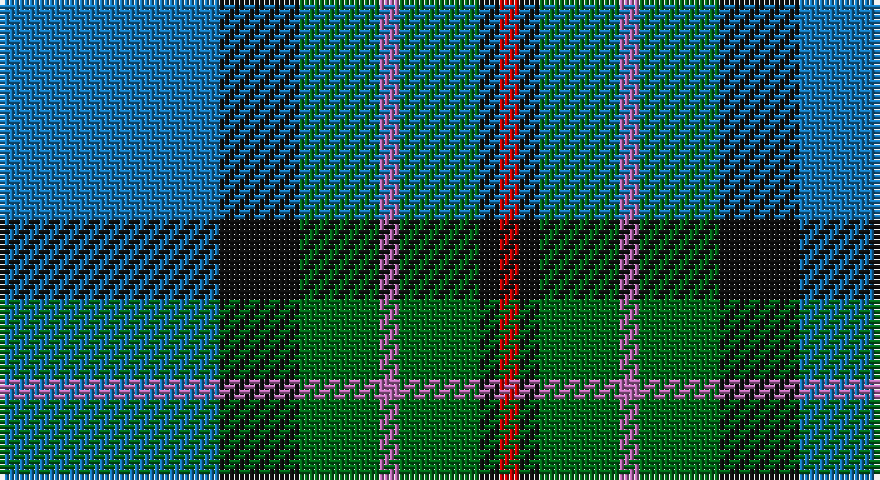

This page is one **sett** — a single exact thread-count. It belongs to the [tartan](/setts/b11k4g4m1g4k1r1/)
(the same proportion at any scale), whose colour order is pattern [BKGRGKR](/stripes/bkgrgkr/).

Sourced from tartans-authority.  It is a [7 stripe tartan](/stripes/stripes7/).

Original link http://www.tartansauthority.com/tartan-ferret/display/8511/

## Register references

External register numbers recorded for this tartan.

- Scottish Register of Tartans: [8511](https://www.tartanregister.gov.uk/tartanDetails?ref=8511)
- Scottish Tartans Authority (ITI): 8511

## Thread count
B/44 K16 G16 P4 G16 K4 R/4

One full sett is **160 threads**.

## Palette

Palette: <strong>Tartan Register</strong> <small style="color:#888">(4 of 5 colours)</small>
<table><thead><tr><th>Colour</th><th>Threads</th><th>Shade</th><th>Base</th><th>OKLCh</th></tr></thead><tbody><tr><td>B/</td><td style="text-align:right;font-variant-numeric:tabular-nums">44</td><td><code style="background-color:#1474B4;">#1474B4</code> <small style="color:#888">#1474B4</small></td><td>B <code style="background-color:#2A418A;">#2A418A</code></td><td><small style="color:#888">oklch(54.0% 0.129 245.1)</small></td></tr><tr><td>K</td><td style="text-align:right;font-variant-numeric:tabular-nums">16</td><td><code style="background-color:#101010;">#101010</code> <small style="color:#888">#101010</small></td><td>K <code style="background-color:#000000;">#000000</code></td><td><small style="color:#888">oklch(17.3% 0.000 89.9)</small></td></tr><tr><td>G</td><td style="text-align:right;font-variant-numeric:tabular-nums">16</td><td><code style="background-color:#006818;">#006818</code> <small style="color:#888">#006818</small></td><td>G <code style="background-color:#006100;">#006100</code></td><td><small style="color:#888">oklch(45.0% 0.142 145.0)</small></td></tr><tr><td>P</td><td style="text-align:right;font-variant-numeric:tabular-nums">4</td><td><code style="background-color:#B468AC;">#B468AC</code> <small style="color:#888">#B468AC</small></td><td>R <code style="background-color:#CC0000;">#CC0000</code></td><td><small style="color:#888">oklch(62.5% 0.131 330.9)</small></td></tr><tr><td>G</td><td style="text-align:right;font-variant-numeric:tabular-nums">16</td><td><code style="background-color:#006818;">#006818</code> <small style="color:#888">#006818</small></td><td>G <code style="background-color:#006100;">#006100</code></td><td><small style="color:#888">oklch(45.0% 0.142 145.0)</small></td></tr><tr><td>K</td><td style="text-align:right;font-variant-numeric:tabular-nums">4</td><td><code style="background-color:#101010;">#101010</code> <small style="color:#888">#101010</small></td><td>K <code style="background-color:#000000;">#000000</code></td><td><small style="color:#888">oklch(17.3% 0.000 89.9)</small></td></tr><tr><td>R/</td><td style="text-align:right;font-variant-numeric:tabular-nums">4</td><td><code style="background-color:#C80000;">#C80000</code> <small style="color:#888">#C80000</small></td><td>R <code style="background-color:#CC0000;">#CC0000</code></td><td><small style="color:#888">oklch(52.3% 0.215 29.2)</small></td></tr></tbody></table>

# Sample pattern

## Nearest tartans

The nearest existing variants by ΔTartan distance, with this tartan at the top so the swatches line up against it.

ΔTartan

Tartan

Sett

—

<a href="/ttd/edit/#slug=b11k4g4m1g4k1r1~x4">Ednie (Personal)</a> <a class="nn-out" href="/variants/s7/b11k4g4m1g4k1r1~x4/" title="open its dictionary page">↗</a>

0.52

<a href="/ttd/edit/#slug=db20k6lo4db3g20w2~x2&amp;base=b11k4g4m1g4k1r1~x4">DeLoughery (Personal)</a> <a class="nn-out" href="/variants/s6/db20k6lo4db3g20w2~x2/" title="open its dictionary page">↗</a>

0.68

<a href="/ttd/edit/#slug=dg5lp3dg32k16b32m3b5~x2&amp;base=b11k4g4m1g4k1r1~x4">MacThomas (Clan)</a> <a class="nn-out" href="/variants/s7/dg5lp3dg32k16b32m3b5~x2/" title="open its dictionary page">↗</a>

0.68

<a href="/ttd/edit/#slug=g5mi3g32k16b32m3b5~x2&amp;base=b11k4g4m1g4k1r1~x4">MacThomas</a> <a class="nn-out" href="/variants/s7/g5mi3g32k16b32m3b5~x2/" title="open its dictionary page">↗</a>

0.74

<a href="/ttd/edit/#slug=db3g13t1r3t1db10ly1~x2&amp;base=b11k4g4m1g4k1r1~x4">Heckenberg Htg (Personal)</a> <a class="nn-out" href="/variants/s7/db3g13t1r3t1db10ly1~x2/" title="open its dictionary page">↗</a>

0.78

<a href="/ttd/edit/#slug=db3m2db22k11g24lp2g3~x2&amp;base=b11k4g4m1g4k1r1~x4">MacThomas Clan Tartan</a> <a class="nn-out" href="/variants/s7/db3m2db22k11g24lp2g3~x2/" title="open its dictionary page">↗</a>

0.83

<a href="/ttd/edit/#slug=b5dy28lb5k20lo5b47lo4~x2&amp;base=b11k4g4m1g4k1r1~x4">State Seal of Washington (Fashion)</a> <a class="nn-out" href="/variants/s7/b5dy28lb5k20lo5b47lo4~x2/" title="open its dictionary page">↗</a>

0.87

<a href="/ttd/edit/#slug=g35k3dbi26k4db4w3~x2&amp;base=b11k4g4m1g4k1r1~x4">Pride of Yorkland (Fashion)</a> <a class="nn-out" href="/variants/s6/g35k3dbi26k4db4w3~x2/" title="open its dictionary page">↗</a>

0.90

<a href="/ttd/edit/#slug=r3k2g20k10b20ly2~x2&amp;base=b11k4g4m1g4k1r1~x4">MacLeod of Assynt</a> <a class="nn-out" href="/variants/s6/r3k2g20k10b20ly2~x2/" title="open its dictionary page">↗</a>

0.91

<a href="/ttd/edit/#slug=n6db8n8g12dt29w3dt4~x2&amp;base=b11k4g4m1g4k1r1~x4">Dickson (Kirkcudbrightshire) (Name)</a> <a class="nn-out" href="/variants/s7/n6db8n8g12dt29w3dt4~x2/" title="open its dictionary page">↗</a>

0.92

<a href="/ttd/edit/#slug=k6g15w2db22r2k4~x2&amp;base=b11k4g4m1g4k1r1~x4">Leslie, Hebridean</a> <a class="nn-out" href="/variants/s6/k6g15w2db22r2k4~x2/" title="open its dictionary page">↗</a>

## Neighbour map

Every grey dot is one of 14360 variants placed by the first two principal components of the ΔTartan feature space (44% of its variance). Red is this tartan; blue dots are its nearest — click one to open its page.

<svg viewBox="0 0 640 380" role="img" style="max-width:100%;height:auto;border:1px solid #e0e0e0;border-radius:4px;display:block" xmlns="http://www.w3.org/2000/svg"><image href="/nn/cloud.v1.png" width="640" height="380"/><a href="/variants/s6/db20k6lo4db3g20w2~x2/"><circle cx="206.5" cy="204.1" r="4" fill="#3465a4"><title>DeLoughery (Personal)</title></circle></a><a href="/variants/s7/dg5lp3dg32k16b32m3b5~x2/"><circle cx="213.8" cy="201.7" r="4" fill="#3465a4"><title>MacThomas (Clan)</title></circle></a><a href="/variants/s7/g5mi3g32k16b32m3b5~x2/"><circle cx="212.0" cy="199.5" r="4" fill="#3465a4"><title>MacThomas</title></circle></a><a href="/variants/s7/db3g13t1r3t1db10ly1~x2/"><circle cx="236.2" cy="179.4" r="4" fill="#3465a4"><title>Heckenberg Htg (Personal)</title></circle></a><a href="/variants/s7/db3m2db22k11g24lp2g3~x2/"><circle cx="233.7" cy="195.6" r="4" fill="#3465a4"><title>MacThomas Clan Tartan</title></circle></a><a href="/variants/s7/b5dy28lb5k20lo5b47lo4~x2/"><circle cx="218.6" cy="177.7" r="4" fill="#3465a4"><title>State Seal of Washington (Fashion)</title></circle></a><a href="/variants/s6/g35k3dbi26k4db4w3~x2/"><circle cx="252.4" cy="188.9" r="4" fill="#3465a4"><title>Pride of Yorkland (Fashion)</title></circle></a><a href="/variants/s6/r3k2g20k10b20ly2~x2/"><circle cx="169.4" cy="203.8" r="4" fill="#3465a4"><title>MacLeod of Assynt</title></circle></a><a href="/variants/s7/n6db8n8g12dt29w3dt4~x2/"><circle cx="212.6" cy="203.7" r="4" fill="#3465a4"><title>Dickson (Kirkcudbrightshire) (Name)</title></circle></a><a href="/variants/s6/k6g15w2db22r2k4~x2/"><circle cx="214.4" cy="198.6" r="4" fill="#3465a4"><title>Leslie, Hebridean</title></circle></a><circle cx="212.9" cy="195.3" r="5" fill="#c00000"/></svg>

ID: /variants/s7/b11k4g4m1g4k1r1~x4/
