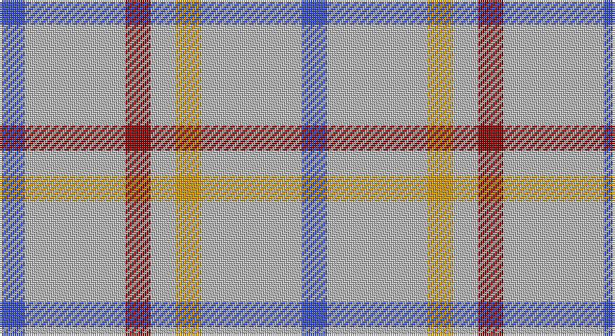

This page is one **sett** — a single exact thread-count. It belongs to the [tartan](/setts/b1lr4r1lr1lo1lr4b1/)
(the same proportion at any scale), whose colour order is pattern [BYRYYYB](/stripes/byryyyb/).

Sourced from tartans-authority.  It is a [7 stripe tartan](/stripes/stripes7/).

Original link http://www.tartansauthority.com/tartan-ferret/display/2500/

## Provenance

Earliest known date: 1986 One of 7 tartans created by Christopher Carlisle Justus in Hendersonville NC - 1986. Status not known and no evidence of actual commercial weaving although it is said to have been adopted by the Justus Family Society.

## Also known as

This cloth is also recorded under:

- Justus Dress Personal
- Justus dress

3 attestations — the source records this cloth was collapsed from (oldest owns this page)

<ul>
<li>1986 — Justus Dress (Personal) (tartans-authority, <a href="http://www.tartansauthority.com/tartan-ferret/display/2500/">record</a>)</li>
<li>01/01/1990 — Justus Dress (Personal) (register-of-tartans, <a href="https://www.tartanregister.gov.uk/tartanDetails.aspx?ref=1920">record</a>)</li>
<li>undated — Justus Dress Personal Tartan (house-of-tartan, <a href="http://www.house-of-tartan.scotland.net/house/TartanViewjs.asp?colr=Def&tnam=2500">record</a>)</li>
</ul>

## Register references

External register numbers recorded for this tartan.

- Scottish Register of Tartans: [1920](https://www.tartanregister.gov.uk/tartanDetails.aspx?ref=1920)
- Scottish Tartans Authority (ITI): 2500
- Scottish Tartans World Register: 2500

## Thread count
B/12 N48 DR12 N12 DY12 N48 B/12

One full sett is **288 threads**.

## Palette

Palette: <strong>Tartan Register</strong> <small style="color:#888">(2 of 4 colours)</small>
<table><thead><tr><th>Colour</th><th>Threads</th><th>Shade</th><th>Base</th><th>OKLCh</th></tr></thead><tbody><tr><td>B/</td><td style="text-align:right;font-variant-numeric:tabular-nums">12</td><td><code style="background-color:#3850C8;">#3850C8</code> <small style="color:#888">#3850C8</small></td><td>B <code style="background-color:#2A418A;">#2A418A</code></td><td><small style="color:#888">oklch(48.8% 0.188 269.4)</small></td></tr><tr><td>N</td><td style="text-align:right;font-variant-numeric:tabular-nums">48</td><td><code style="background-color:#B8B8B8;">#B8B8B8</code> <small style="color:#888">#B8B8B8</small></td><td>Y <code style="background-color:#F2BF00;">#F2BF00</code></td><td><small style="color:#888">oklch(78.3% 0.000 89.9)</small></td></tr><tr><td>DR</td><td style="text-align:right;font-variant-numeric:tabular-nums">12</td><td><code style="background-color:#880000;">#880000</code> <small style="color:#888">#880000</small></td><td>R <code style="background-color:#CC0000;">#CC0000</code></td><td><small style="color:#888">oklch(39.4% 0.162 29.2)</small></td></tr><tr><td>N</td><td style="text-align:right;font-variant-numeric:tabular-nums">12</td><td><code style="background-color:#B8B8B8;">#B8B8B8</code> <small style="color:#888">#B8B8B8</small></td><td>Y <code style="background-color:#F2BF00;">#F2BF00</code></td><td><small style="color:#888">oklch(78.3% 0.000 89.9)</small></td></tr><tr><td>DY</td><td style="text-align:right;font-variant-numeric:tabular-nums">12</td><td><code style="background-color:#D09800;">#D09800</code> <small style="color:#888">#D09800</small></td><td>Y <code style="background-color:#F2BF00;">#F2BF00</code></td><td><small style="color:#888">oklch(71.4% 0.147 82.1)</small></td></tr><tr><td>N</td><td style="text-align:right;font-variant-numeric:tabular-nums">48</td><td><code style="background-color:#B8B8B8;">#B8B8B8</code> <small style="color:#888">#B8B8B8</small></td><td>Y <code style="background-color:#F2BF00;">#F2BF00</code></td><td><small style="color:#888">oklch(78.3% 0.000 89.9)</small></td></tr><tr><td>B/</td><td style="text-align:right;font-variant-numeric:tabular-nums">12</td><td><code style="background-color:#3850C8;">#3850C8</code> <small style="color:#888">#3850C8</small></td><td>B <code style="background-color:#2A418A;">#2A418A</code></td><td><small style="color:#888">oklch(48.8% 0.188 269.4)</small></td></tr></tbody></table>

# Sample pattern

## Nearest tartans

The nearest existing variants by ΔTartan distance, with this tartan at the top so the swatches line up against it.

ΔTartan

Tartan

Sett

—

<a href="/ttd/edit/#slug=b1lr4r1lr1lo1lr4b1~x12">Justus Dress (Personal)</a> <a class="nn-out" href="/variants/s7/b1lr4r1lr1lo1lr4b1~x12/" title="open its dictionary page">↗</a>

1.34

<a href="/ttd/edit/#slug=db1w4r1w1ly1w4db1~x12&amp;base=b1lr4r1lr1lo1lr4b1~x12">Justus dress</a> <a class="nn-out" href="/variants/s7/db1w4r1w1ly1w4db1~x12/" title="open its dictionary page">↗</a>

1.54

<a href="/ttd/edit/#slug=db1lo5db1lo5db2w1~x4&amp;base=b1lr4r1lr1lo1lr4b1~x12">Tokharion</a> <a class="nn-out" href="/variants/s6/db1lo5db1lo5db2w1~x4/" title="open its dictionary page">↗</a>

1.55

<a href="/ttd/edit/#slug=w11t20ly3t8ly3t10~x2&amp;base=b1lr4r1lr1lo1lr4b1~x12">Lucard, Stphane (Personal))</a> <a class="nn-out" href="/variants/s6/w11t20ly3t8ly3t10~x2/" title="open its dictionary page">↗</a>

1.84

<a href="/ttd/edit/#slug=w11t20lo3t8~x2&amp;base=b1lr4r1lr1lo1lr4b1~x12">Lucard, Stéphane (Personal)</a> <a class="nn-out" href="/variants/s4/w11t20lo3t8~x2/" title="open its dictionary page">↗</a>

1.85

<a href="/ttd/edit/#slug=b6k3b10o5b2o2b2o2b7w2~x2&amp;base=b1lr4r1lr1lo1lr4b1~x12">Digital</a> <a class="nn-out" href="/variants/s10/b6k3b10o5b2o2b2o2b7w2~x2/" title="open its dictionary page">↗</a>

1.93

<a href="/ttd/edit/#slug=r1o6k1o1k2o1k1o6lo1~x8&amp;base=b1lr4r1lr1lo1lr4b1~x12">Mowdowny (Fashion)</a> <a class="nn-out" href="/variants/s9/r1o6k1o1k2o1k1o6lo1~x8/" title="open its dictionary page">↗</a>

1.95

<a href="/ttd/edit/#slug=t11ly5k1ly2r1ly2t11~x12&amp;base=b1lr4r1lr1lo1lr4b1~x12">Carlisle</a> <a class="nn-out" href="/variants/s7/t11ly5k1ly2r1ly2t11~x12/" title="open its dictionary page">↗</a>

1.98

<a href="/ttd/edit/#slug=lr3lb2lr18t9lr18lb2lr18k9lr18lb2&amp;base=b1lr4r1lr1lo1lr4b1~x12">London Fog Camel 2 (Fashion)</a> <a class="nn-out" href="/variants/s10/lr3lb2lr18t9lr18lb2lr18k9lr18lb2/" title="open its dictionary page">↗</a>

1.99

<a href="/ttd/edit/#slug=t6k3t10lo5t2lo2t2lo2t7w2~x2&amp;base=b1lr4r1lr1lo1lr4b1~x12">Digital Corporate Tartan</a> <a class="nn-out" href="/variants/s10/t6k3t10lo5t2lo2t2lo2t7w2~x2/" title="open its dictionary page">↗</a>

2.10

<a href="/ttd/edit/#slug=w24n5w24db36w28n6w12r6&amp;base=b1lr4r1lr1lo1lr4b1~x12">Milne Royal Blue Dress Fashion Tartan</a> <a class="nn-out" href="/variants/s8/w24n5w24db36w28n6w12r6/" title="open its dictionary page">↗</a>

## Neighbour map

Every grey dot is one of 14360 variants placed by the first two principal components of the ΔTartan feature space (44% of its variance). Red is this tartan; blue dots are its nearest — click one to open its page.

<svg viewBox="0 0 640 380" role="img" style="max-width:100%;height:auto;border:1px solid #e0e0e0;border-radius:4px;display:block" xmlns="http://www.w3.org/2000/svg"><image href="/nn/cloud.v1.png" width="640" height="380"/><a href="/variants/s7/db1w4r1w1ly1w4db1~x12/"><circle cx="307.9" cy="221.1" r="4" fill="#3465a4"><title>Justus dress</title></circle></a><a href="/variants/s6/db1lo5db1lo5db2w1~x4/"><circle cx="359.6" cy="260.5" r="4" fill="#3465a4"><title>Tokharion</title></circle></a><a href="/variants/s6/w11t20ly3t8ly3t10~x2/"><circle cx="363.9" cy="258.2" r="4" fill="#3465a4"><title>Lucard, Stphane (Personal))</title></circle></a><a href="/variants/s4/w11t20lo3t8~x2/"><circle cx="363.0" cy="277.7" r="4" fill="#3465a4"><title>Lucard, Stéphane (Personal)</title></circle></a><a href="/variants/s10/b6k3b10o5b2o2b2o2b7w2~x2/"><circle cx="302.6" cy="227.1" r="4" fill="#3465a4"><title>Digital</title></circle></a><a href="/variants/s9/r1o6k1o1k2o1k1o6lo1~x8/"><circle cx="368.9" cy="204.9" r="4" fill="#3465a4"><title>Mowdowny (Fashion)</title></circle></a><a href="/variants/s7/t11ly5k1ly2r1ly2t11~x12/"><circle cx="365.9" cy="191.7" r="4" fill="#3465a4"><title>Carlisle</title></circle></a><a href="/variants/s10/lr3lb2lr18t9lr18lb2lr18k9lr18lb2/"><circle cx="392.7" cy="193.9" r="4" fill="#3465a4"><title>London Fog Camel 2 (Fashion)</title></circle></a><a href="/variants/s10/t6k3t10lo5t2lo2t2lo2t7w2~x2/"><circle cx="322.9" cy="248.6" r="4" fill="#3465a4"><title>Digital Corporate Tartan</title></circle></a><a href="/variants/s8/w24n5w24db36w28n6w12r6/"><circle cx="261.3" cy="202.6" r="4" fill="#3465a4"><title>Milne Royal Blue Dress Fashion Tartan</title></circle></a><circle cx="342.3" cy="243.1" r="5" fill="#c00000"/></svg>

ID: /variants/s7/b1lr4r1lr1lo1lr4b1~x12/
