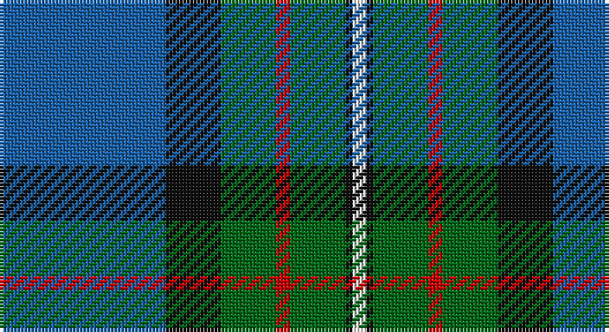

This page is one **sett** — a single exact thread-count. It belongs to the [tartan](/setts/b24k8g8r2g8k1w2/)
(the same proportion at any scale), whose colour order is pattern [BKGRGKW](/stripes/bkgrgkw/).

Sourced from register-of-tartans.  It is a [7 stripe tartan](/stripes/stripes7/).

Original link https://www.tartanregister.gov.uk/tartanDetails.aspx?ref=1165

## Also known as

This cloth is also recorded under:

- Ferguson of Atholl Clan

## Register references

External register numbers recorded for this tartan.

- Scottish Register of Tartans: [1165](https://www.tartanregister.gov.uk/tartanDetails.aspx?ref=1165)
- Scottish Tartans Authority (ITI): 337
- Scottish Tartans World Register: 337

## Thread count
B/48 K16 G16 R4 G16 K2 W/4

One full sett is **160 threads**.

## Palette

Palette: <strong>Tartan Register</strong> <small style="color:#888">(4 of 5 colours)</small>
<table><thead><tr><th>Colour</th><th>Threads</th><th>Shade</th><th>Base</th><th>OKLCh</th></tr></thead><tbody><tr><td>B/</td><td style="text-align:right;font-variant-numeric:tabular-nums">48</td><td><code style="background-color:#1860A8;">#1860A8</code> <small style="color:#888">#1860A8</small></td><td>B <code style="background-color:#2A418A;">#2A418A</code></td><td><small style="color:#888">oklch(48.6% 0.134 252.8)</small></td></tr><tr><td>K</td><td style="text-align:right;font-variant-numeric:tabular-nums">16</td><td><code style="background-color:#101010;">#101010</code> <small style="color:#888">#101010</small></td><td>K <code style="background-color:#000000;">#000000</code></td><td><small style="color:#888">oklch(17.3% 0.000 89.9)</small></td></tr><tr><td>G</td><td style="text-align:right;font-variant-numeric:tabular-nums">16</td><td><code style="background-color:#006818;">#006818</code> <small style="color:#888">#006818</small></td><td>G <code style="background-color:#006100;">#006100</code></td><td><small style="color:#888">oklch(45.0% 0.142 145.0)</small></td></tr><tr><td>R</td><td style="text-align:right;font-variant-numeric:tabular-nums">4</td><td><code style="background-color:#C80000;">#C80000</code> <small style="color:#888">#C80000</small></td><td>R <code style="background-color:#CC0000;">#CC0000</code></td><td><small style="color:#888">oklch(52.3% 0.215 29.2)</small></td></tr><tr><td>G</td><td style="text-align:right;font-variant-numeric:tabular-nums">16</td><td><code style="background-color:#006818;">#006818</code> <small style="color:#888">#006818</small></td><td>G <code style="background-color:#006100;">#006100</code></td><td><small style="color:#888">oklch(45.0% 0.142 145.0)</small></td></tr><tr><td>K</td><td style="text-align:right;font-variant-numeric:tabular-nums">2</td><td><code style="background-color:#101010;">#101010</code> <small style="color:#888">#101010</small></td><td>K <code style="background-color:#000000;">#000000</code></td><td><small style="color:#888">oklch(17.3% 0.000 89.9)</small></td></tr><tr><td>W/</td><td style="text-align:right;font-variant-numeric:tabular-nums">4</td><td><code style="background-color:#FCFCFC;">#FCFCFC</code> <small style="color:#888">#FCFCFC</small></td><td>W <code style="background-color:#F7F7F7;">#F7F7F7</code></td><td><small style="color:#888">oklch(99.1% 0.000 89.9)</small></td></tr></tbody></table>

# Sample pattern

## Nearest tartans

The nearest existing variants by ΔTartan distance, with this tartan at the top so the swatches line up against it.

ΔTartan

Tartan

Sett

—

<a href="/ttd/edit/#slug=b24k8g8r2g8k1w2~x2">Ferguson of Atholl Clan</a> <a class="nn-out" href="/variants/s7/b24k8g8r2g8k1w2~x2/" title="open its dictionary page">↗</a>

0.75

<a href="/ttd/edit/#slug=dg6r2db1r3db16g20w2~x2&amp;base=b24k8g8r2g8k1w2~x2">MacCord / McCord (Personal)</a> <a class="nn-out" href="/variants/s7/dg6r2db1r3db16g20w2~x2/" title="open its dictionary page">↗</a>

0.96

<a href="/ttd/edit/#slug=r6db27t2g2t2g30w4~x2&amp;base=b24k8g8r2g8k1w2~x2">MX-5 Owners' Club</a> <a class="nn-out" href="/variants/s7/r6db27t2g2t2g30w4~x2/" title="open its dictionary page">↗</a>

0.97

<a href="/ttd/edit/#slug=db18dp2db16k13g3k2g42lo3~x2&amp;base=b24k8g8r2g8k1w2~x2">McFadden (Personal)</a> <a class="nn-out" href="/variants/s8/db18dp2db16k13g3k2g42lo3~x2/" title="open its dictionary page">↗</a>

0.98

<a href="/ttd/edit/#slug=w2dbi19k4dbi4k4g9db2k1~x4&amp;base=b24k8g8r2g8k1w2~x2">Dollar Academy (1999) (Corporate)</a> <a class="nn-out" href="/variants/s8/w2dbi19k4dbi4k4g9db2k1~x4/" title="open its dictionary page">↗</a>

1.01

<a href="/ttd/edit/#slug=db24k8g8r2g8k1w2~x2&amp;base=b24k8g8r2g8k1w2~x2">Ferguson of Athol</a> <a class="nn-out" href="/variants/s7/db24k8g8r2g8k1w2~x2/" title="open its dictionary page">↗</a>

1.04

<a href="/ttd/edit/#slug=db24k8g8r2g8k1ly2~x2&amp;base=b24k8g8r2g8k1w2~x2">MacLaren</a> <a class="nn-out" href="/variants/s7/db24k8g8r2g8k1ly2~x2/" title="open its dictionary page">↗</a>

1.04

<a href="/ttd/edit/#slug=b24k8g8r2g4k1w2k1g4~x2&amp;base=b24k8g8r2g8k1w2~x2">Ferguson (Tarlogie)</a> <a class="nn-out" href="/variants/s9/b24k8g8r2g4k1w2k1g4~x2/" title="open its dictionary page">↗</a>

1.07

<a href="/ttd/edit/#slug=m4g9w2g24db37r3~x2&amp;base=b24k8g8r2g8k1w2~x2">Hardie Clan Tartan</a> <a class="nn-out" href="/variants/s6/m4g9w2g24db37r3~x2/" title="open its dictionary page">↗</a>

1.08

<a href="/ttd/edit/#slug=db10k3t65dg56ly6&amp;base=b24k8g8r2g8k1w2~x2">Phoenix Police Honor Guard</a> <a class="nn-out" href="/variants/s5/db10k3t65dg56ly6/" title="open its dictionary page">↗</a>

1.08

<a href="/ttd/edit/#slug=k6dbi3g28w1db28dbi2w3~x2&amp;base=b24k8g8r2g8k1w2~x2">Weisfeld (Name)</a> <a class="nn-out" href="/variants/s7/k6dbi3g28w1db28dbi2w3~x2/" title="open its dictionary page">↗</a>

## Neighbour map

Every grey dot is one of 14360 variants placed by the first two principal components of the ΔTartan feature space (44% of its variance). Red is this tartan; blue dots are its nearest — click one to open its page.

<svg viewBox="0 0 640 380" role="img" style="max-width:100%;height:auto;border:1px solid #e0e0e0;border-radius:4px;display:block" xmlns="http://www.w3.org/2000/svg"><image href="/nn/cloud.v1.png" width="640" height="380"/><a href="/variants/s7/dg6r2db1r3db16g20w2~x2/"><circle cx="226.2" cy="158.2" r="4" fill="#3465a4"><title>MacCord / McCord (Personal)</title></circle></a><a href="/variants/s7/r6db27t2g2t2g30w4~x2/"><circle cx="242.4" cy="159.2" r="4" fill="#3465a4"><title>MX-5 Owners' Club</title></circle></a><a href="/variants/s8/db18dp2db16k13g3k2g42lo3~x2/"><circle cx="270.3" cy="160.7" r="4" fill="#3465a4"><title>McFadden (Personal)</title></circle></a><a href="/variants/s8/w2dbi19k4dbi4k4g9db2k1~x4/"><circle cx="284.1" cy="170.4" r="4" fill="#3465a4"><title>Dollar Academy (1999) (Corporate)</title></circle></a><a href="/variants/s7/db24k8g8r2g8k1w2~x2/"><circle cx="234.4" cy="147.2" r="4" fill="#3465a4"><title>Ferguson of Athol</title></circle></a><a href="/variants/s7/db24k8g8r2g8k1ly2~x2/"><circle cx="236.1" cy="147.8" r="4" fill="#3465a4"><title>MacLaren</title></circle></a><a href="/variants/s9/b24k8g8r2g4k1w2k1g4~x2/"><circle cx="244.7" cy="127.6" r="4" fill="#3465a4"><title>Ferguson (Tarlogie)</title></circle></a><a href="/variants/s6/m4g9w2g24db37r3~x2/"><circle cx="299.0" cy="181.1" r="4" fill="#3465a4"><title>Hardie Clan Tartan</title></circle></a><a href="/variants/s5/db10k3t65dg56ly6/"><circle cx="284.8" cy="181.9" r="4" fill="#3465a4"><title>Phoenix Police Honor Guard</title></circle></a><a href="/variants/s7/k6dbi3g28w1db28dbi2w3~x2/"><circle cx="268.6" cy="152.5" r="4" fill="#3465a4"><title>Weisfeld (Name)</title></circle></a><circle cx="253.3" cy="157.6" r="5" fill="#c00000"/></svg>

ID: /variants/s7/b24k8g8r2g8k1w2~x2/
