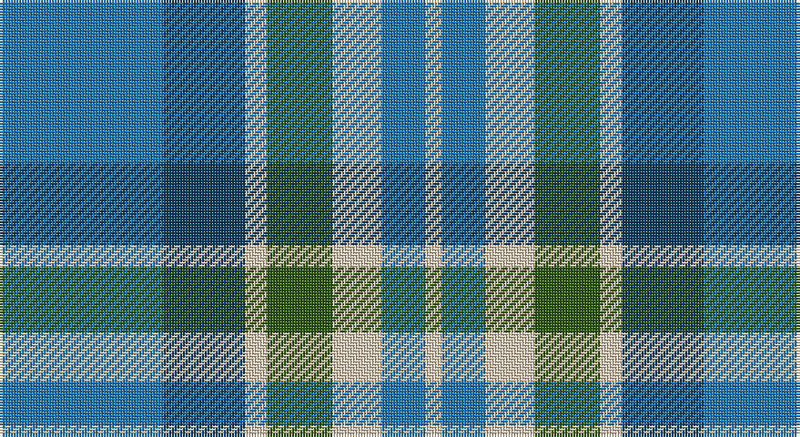

This page is one **sett** — a single exact thread-count. It belongs to the [tartan](/setts/b30dt15lb4dg12lb9b8lb3/)
(the same proportion at any scale), whose colour order is pattern [BBWGWBW](/stripes/bbwgwbw/).

Part of the [Newall](/tartans/newall/) tartan — the named design grouping this sett with its other cloths.

Sourced from tartans-authority.  It is a [7 stripe tartan](/stripes/stripes7/).

Original link http://www.tartansauthority.com/tartan-ferret/display/10830/

## Register references

External register numbers recorded for this tartan.

- Scottish Register of Tartans: [10830](https://www.tartanregister.gov.uk/tartanDetails?ref=10830)
- Scottish Tartans Authority (ITI): 10830

## Thread count
B/60 DB30 LR8 G24 LR18 B16 LR/6

One full sett is **258 threads**.

## Palette

Palette: <strong>Tartan Register</strong>
<table><thead><tr><th>Colour</th><th>Threads</th><th>Shade</th><th>Base</th><th>OKLCh</th></tr></thead><tbody><tr><td>B/</td><td style="text-align:right;font-variant-numeric:tabular-nums">60</td><td><code style="background-color:#1474B4;">#1474B4</code> <small style="color:#888">#1474B4</small></td><td>B <code style="background-color:#2A418A;">#2A418A</code></td><td><small style="color:#888">oklch(54.0% 0.129 245.1)</small></td></tr><tr><td>DB</td><td style="text-align:right;font-variant-numeric:tabular-nums">30</td><td><code style="background-color:#003C64;">#003C64</code> <small style="color:#888">#003C64</small></td><td>B <code style="background-color:#2A418A;">#2A418A</code></td><td><small style="color:#888">oklch(34.5% 0.089 246.0)</small></td></tr><tr><td>LR</td><td style="text-align:right;font-variant-numeric:tabular-nums">8</td><td><code style="background-color:#E8CCB8;">#E8CCB8</code> <small style="color:#888">#E8CCB8</small></td><td>W <code style="background-color:#F7F7F7;">#F7F7F7</code></td><td><small style="color:#888">oklch(86.3% 0.042 57.7)</small></td></tr><tr><td>G</td><td style="text-align:right;font-variant-numeric:tabular-nums">24</td><td><code style="background-color:#285800;">#285800</code> <small style="color:#888">#285800</small></td><td>G <code style="background-color:#006100;">#006100</code></td><td><small style="color:#888">oklch(41.0% 0.122 135.8)</small></td></tr><tr><td>LR</td><td style="text-align:right;font-variant-numeric:tabular-nums">18</td><td><code style="background-color:#E8CCB8;">#E8CCB8</code> <small style="color:#888">#E8CCB8</small></td><td>W <code style="background-color:#F7F7F7;">#F7F7F7</code></td><td><small style="color:#888">oklch(86.3% 0.042 57.7)</small></td></tr><tr><td>B</td><td style="text-align:right;font-variant-numeric:tabular-nums">16</td><td><code style="background-color:#1474B4;">#1474B4</code> <small style="color:#888">#1474B4</small></td><td>B <code style="background-color:#2A418A;">#2A418A</code></td><td><small style="color:#888">oklch(54.0% 0.129 245.1)</small></td></tr><tr><td>LR/</td><td style="text-align:right;font-variant-numeric:tabular-nums">6</td><td><code style="background-color:#E8CCB8;">#E8CCB8</code> <small style="color:#888">#E8CCB8</small></td><td>W <code style="background-color:#F7F7F7;">#F7F7F7</code></td><td><small style="color:#888">oklch(86.3% 0.042 57.7)</small></td></tr></tbody></table>

# Sample pattern

## Compared to the master

This cloth is one sett of its design; the master sett (the exemplar the design is anchored on) is below for comparison.

<figure style="margin:0"><figcaption style="color:#888;font-size:smaller">this sett</figcaption></figure>
<figure style="margin:0"><figcaption style="color:#888;font-size:smaller"><a href="/setts/t30dp15w4dg12w9t8w3/">master sett →</a></figcaption></figure>

## Nearest tartans

The nearest existing variants by ΔTartan distance, with this tartan at the top so the swatches line up against it.

ΔTartan

Tartan

Sett

—

<a href="/ttd/edit/#slug=b30dt15lb4dg12lb9b8lb3~x2">Newall (Personal)</a> <a class="nn-out" href="/variants/s7/b30dt15lb4dg12lb9b8lb3~x2/" title="open its dictionary page">↗</a>

0.91

<a href="/ttd/edit/#slug=t30dp15w4dg12w9t8w3~x2&amp;base=b30dt15lb4dg12lb9b8lb3~x2">Newall (Dumbarton) (Personal)</a> <a class="nn-out" href="/variants/s7/t30dp15w4dg12w9t8w3~x2/" title="open its dictionary page">↗</a>

1.02

<a href="/ttd/edit/#slug=r3b25k16b3g25b3~x2&amp;base=b30dt15lb4dg12lb9b8lb3~x2">Flower of Scotland</a> <a class="nn-out" href="/variants/s6/r3b25k16b3g25b3~x2/" title="open its dictionary page">↗</a>

1.16

<a href="/ttd/edit/#slug=dt7w3dt2w6dt16t26r4~x2&amp;base=b30dt15lb4dg12lb9b8lb3~x2">Keela (Corporate)</a> <a class="nn-out" href="/variants/s7/dt7w3dt2w6dt16t26r4~x2/" title="open its dictionary page">↗</a>

1.17

<a href="/ttd/edit/#slug=r15t98dt72ly25dt8w15&amp;base=b30dt15lb4dg12lb9b8lb3~x2">Afternoon Tea / Earl Grey</a> <a class="nn-out" href="/variants/s6/r15t98dt72ly25dt8w15/" title="open its dictionary page">↗</a>

1.25

<a href="/ttd/edit/#slug=w15lg98dt72b25dt8ly15&amp;base=b30dt15lb4dg12lb9b8lb3~x2">Afternoon Tea / Mint Tea</a> <a class="nn-out" href="/variants/s6/w15lg98dt72b25dt8ly15/" title="open its dictionary page">↗</a>

1.27

<a href="/ttd/edit/#slug=k3lb10db2g6db18g2~x2&amp;base=b30dt15lb4dg12lb9b8lb3~x2">Crombie House Check</a> <a class="nn-out" href="/variants/s6/k3lb10db2g6db18g2~x2/" title="open its dictionary page">↗</a>

1.28

<a href="/ttd/edit/#slug=g11lo10dt11b33w3~x2&amp;base=b30dt15lb4dg12lb9b8lb3~x2">Sterling (Name)</a> <a class="nn-out" href="/variants/s5/g11lo10dt11b33w3~x2/" title="open its dictionary page">↗</a>

1.31

<a href="/ttd/edit/#slug=k11t38r11g11k5~x2&amp;base=b30dt15lb4dg12lb9b8lb3~x2">All as One (Corporate)</a> <a class="nn-out" href="/variants/s5/k11t38r11g11k5~x2/" title="open its dictionary page">↗</a>

1.39

<a href="/ttd/edit/#slug=g11lo10dp11b33w3~x2&amp;base=b30dt15lb4dg12lb9b8lb3~x2">Sterling, Rob (Florida) (Personal)</a> <a class="nn-out" href="/variants/s5/g11lo10dp11b33w3~x2/" title="open its dictionary page">↗</a>

1.39

<a href="/ttd/edit/#slug=db9ly9db9t23r3~x2&amp;base=b30dt15lb4dg12lb9b8lb3~x2">Tilburg (District)</a> <a class="nn-out" href="/variants/s5/db9ly9db9t23r3~x2/" title="open its dictionary page">↗</a>

## Neighbour map

Every grey dot is one of 14360 variants placed by the first two principal components of the ΔTartan feature space (44% of its variance). Red is this tartan; blue dots are its nearest — click one to open its page.

<svg viewBox="0 0 640 380" role="img" style="max-width:100%;height:auto;border:1px solid #e0e0e0;border-radius:4px;display:block" xmlns="http://www.w3.org/2000/svg"><image href="/nn/cloud.v1.png" width="640" height="380"/><a href="/variants/s7/t30dp15w4dg12w9t8w3~x2/"><circle cx="213.7" cy="207.4" r="4" fill="#3465a4"><title>Newall (Dumbarton) (Personal)</title></circle></a><a href="/variants/s6/r3b25k16b3g25b3~x2/"><circle cx="210.3" cy="231.2" r="4" fill="#3465a4"><title>Flower of Scotland</title></circle></a><a href="/variants/s7/dt7w3dt2w6dt16t26r4~x2/"><circle cx="213.0" cy="182.8" r="4" fill="#3465a4"><title>Keela (Corporate)</title></circle></a><a href="/variants/s6/r15t98dt72ly25dt8w15/"><circle cx="207.9" cy="186.9" r="4" fill="#3465a4"><title>Afternoon Tea / Earl Grey</title></circle></a><a href="/variants/s6/w15lg98dt72b25dt8ly15/"><circle cx="192.8" cy="182.3" r="4" fill="#3465a4"><title>Afternoon Tea / Mint Tea</title></circle></a><a href="/variants/s6/k3lb10db2g6db18g2~x2/"><circle cx="226.8" cy="209.5" r="4" fill="#3465a4"><title>Crombie House Check</title></circle></a><a href="/variants/s5/g11lo10dt11b33w3~x2/"><circle cx="228.7" cy="219.6" r="4" fill="#3465a4"><title>Sterling (Name)</title></circle></a><a href="/variants/s5/k11t38r11g11k5~x2/"><circle cx="228.1" cy="232.4" r="4" fill="#3465a4"><title>All as One (Corporate)</title></circle></a><a href="/variants/s5/g11lo10dp11b33w3~x2/"><circle cx="229.1" cy="214.4" r="4" fill="#3465a4"><title>Sterling, Rob (Florida) (Personal)</title></circle></a><a href="/variants/s5/db9ly9db9t23r3~x2/"><circle cx="194.3" cy="246.6" r="4" fill="#3465a4"><title>Tilburg (District)</title></circle></a><circle cx="215.4" cy="216.3" r="5" fill="#c00000"/></svg>

ID: /variants/s7/b30dt15lb4dg12lb9b8lb3~x2/
