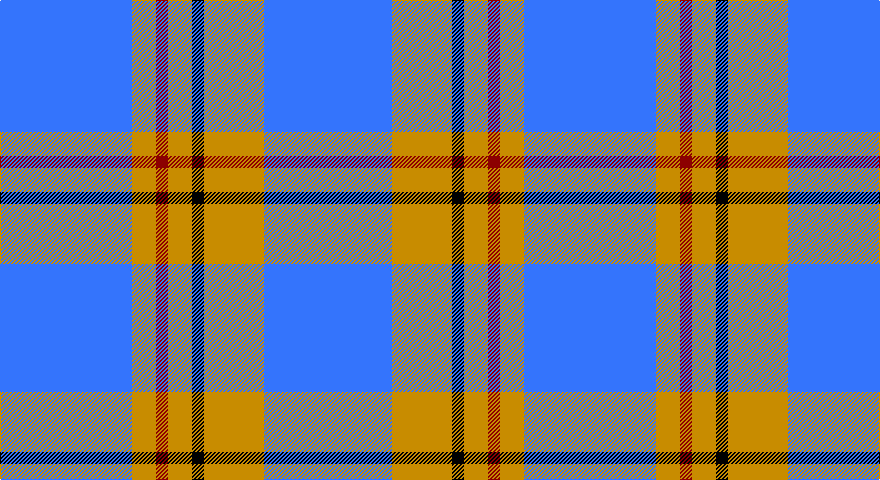

This page is one **sett** — a single exact thread-count. It belongs to the [tartan](/setts/b33lo6r3lo6k3lo15b32/)
(the same proportion at any scale), whose colour order is pattern [BYKYRYB](/stripes/bykyryb/).

Part of the [Carlisle](/tartans/carlisle/) tartan — the named design grouping this sett with its other cloths.

Sourced from tartans-authority.  It is a [7 stripe tartan](/stripes/stripes7/).

Original link http://www.tartansauthority.com/tartan-ferret/display/674/

## Also known as

This cloth is also recorded under:

- Carlisle Ancient
- Carlisle Family
- Carlisle, Ancient

## Register references

External register numbers recorded for this tartan.

- Scottish Tartans Authority (ITI): 674

## Thread count
B/132 DY24 DR12 DY24 K12 DY60 B/128

One full sett is **524 threads**.

## Palette

Palette: <strong>Tartan Register</strong> <small style="color:#888">(2 of 4 colours)</small>
<table><thead><tr><th>Colour</th><th>Threads</th><th>Shade</th><th>Base</th><th>OKLCh</th></tr></thead><tbody><tr><td>B/</td><td style="text-align:right;font-variant-numeric:tabular-nums">132</td><td><code style="background-color:#3474FC;">#3474FC</code> <small style="color:#888">#3474FC</small></td><td>B <code style="background-color:#2A418A;">#2A418A</code></td><td><small style="color:#888">oklch(59.7% 0.214 262.7)</small></td></tr><tr><td>DY</td><td style="text-align:right;font-variant-numeric:tabular-nums">24</td><td><code style="background-color:#C88C00;">#C88C00</code> <small style="color:#888">#C88C00</small></td><td>Y <code style="background-color:#F2BF00;">#F2BF00</code></td><td><small style="color:#888">oklch(68.2% 0.142 78.2)</small></td></tr><tr><td>DR</td><td style="text-align:right;font-variant-numeric:tabular-nums">12</td><td><code style="background-color:#8C0000;">#8C0000</code> <small style="color:#888">#8C0000</small></td><td>R <code style="background-color:#CC0000;">#CC0000</code></td><td><small style="color:#888">oklch(40.2% 0.165 29.2)</small></td></tr><tr><td>DY</td><td style="text-align:right;font-variant-numeric:tabular-nums">24</td><td><code style="background-color:#C88C00;">#C88C00</code> <small style="color:#888">#C88C00</small></td><td>Y <code style="background-color:#F2BF00;">#F2BF00</code></td><td><small style="color:#888">oklch(68.2% 0.142 78.2)</small></td></tr><tr><td>K</td><td style="text-align:right;font-variant-numeric:tabular-nums">12</td><td><code style="background-color:#000000;">#000000</code> <small style="color:#888">#000000</small></td><td>K <code style="background-color:#000000;">#000000</code></td><td><small style="color:#888">oklch(0.0% 0.000 0.0)</small></td></tr><tr><td>DY</td><td style="text-align:right;font-variant-numeric:tabular-nums">60</td><td><code style="background-color:#C88C00;">#C88C00</code> <small style="color:#888">#C88C00</small></td><td>Y <code style="background-color:#F2BF00;">#F2BF00</code></td><td><small style="color:#888">oklch(68.2% 0.142 78.2)</small></td></tr><tr><td>B/</td><td style="text-align:right;font-variant-numeric:tabular-nums">128</td><td><code style="background-color:#3474FC;">#3474FC</code> <small style="color:#888">#3474FC</small></td><td>B <code style="background-color:#2A418A;">#2A418A</code></td><td><small style="color:#888">oklch(59.7% 0.214 262.7)</small></td></tr></tbody></table>

# Sample pattern

## Compared to the master

This cloth is one sett of its design; the master sett (the exemplar the design is anchored on) is below for comparison.

<figure style="margin:0"><figcaption style="color:#888;font-size:smaller">this sett</figcaption></figure>
<figure style="margin:0"><figcaption style="color:#888;font-size:smaller"><a href="/setts/b11lo2r1lo2r1/">master sett →</a></figcaption></figure>

## Nearest tartans

The nearest existing variants by ΔTartan distance, with this tartan at the top so the swatches line up against it.

ΔTartan

Tartan

Sett

—

<a href="/ttd/edit/#slug=b33lo6r3lo6k3lo15b32~x4">Carlisle Family (Name)</a> <a class="nn-out" href="/variants/s7/b33lo6r3lo6k3lo15b32~x4/" title="open its dictionary page">↗</a>

1.33

<a href="/ttd/edit/#slug=b130k9b21ly8b21w8b35r70&amp;base=b33lo6r3lo6k3lo15b32~x4">Maud, Mary</a> <a class="nn-out" href="/variants/s8/b130k9b21ly8b21w8b35r70/" title="open its dictionary page">↗</a>

1.38

<a href="/ttd/edit/#slug=t37w9t3db9w3~x2&amp;base=b33lo6r3lo6k3lo15b32~x4">Loch Lomond</a> <a class="nn-out" href="/variants/s5/t37w9t3db9w3~x2/" title="open its dictionary page">↗</a>

1.39

<a href="/ttd/edit/#slug=b1w5b1w5b15ly1~x4&amp;base=b33lo6r3lo6k3lo15b32~x4">Whitley (Personal)</a> <a class="nn-out" href="/variants/s6/b1w5b1w5b15ly1~x4/" title="open its dictionary page">↗</a>

1.45

<a href="/ttd/edit/#slug=b11lo2r1lo2r1~x4&amp;base=b33lo6r3lo6k3lo15b32~x4">Carlisle Ancient</a> <a class="nn-out" href="/variants/s5/b11lo2r1lo2r1~x4/" title="open its dictionary page">↗</a>

1.50

<a href="/ttd/edit/#slug=db9lb27db2k4db2lb10db2w3~x2&amp;base=b33lo6r3lo6k3lo15b32~x4">Alaska Highlanders Pipes &amp; Drums Corporate Tartan</a> <a class="nn-out" href="/variants/s8/db9lb27db2k4db2lb10db2w3~x2/" title="open its dictionary page">↗</a>

1.51

<a href="/ttd/edit/#slug=b12ly1w16b1w1b14w3b14r2~x4&amp;base=b33lo6r3lo6k3lo15b32~x4">Orlando Dress, City of (District)</a> <a class="nn-out" href="/variants/s9/b12ly1w16b1w1b14w3b14r2~x4/" title="open its dictionary page">↗</a>

1.55

<a href="/ttd/edit/#slug=db40g7ly3g7db15r5~x2&amp;base=b33lo6r3lo6k3lo15b32~x4">Wheadon (Name)</a> <a class="nn-out" href="/variants/s6/db40g7ly3g7db15r5~x2/" title="open its dictionary page">↗</a>

1.56

<a href="/ttd/edit/#slug=db20b2w5r2db10b5db20b2w5r5~x2&amp;base=b33lo6r3lo6k3lo15b32~x4">Mortell (Personal)</a> <a class="nn-out" href="/variants/s10/db20b2w5r2db10b5db20b2w5r5~x2/" title="open its dictionary page">↗</a>

1.59

<a href="/ttd/edit/#slug=b13w3b1k3w1~x6&amp;base=b33lo6r3lo6k3lo15b32~x4">Loch Lomond #2</a> <a class="nn-out" href="/variants/s5/b13w3b1k3w1~x6/" title="open its dictionary page">↗</a>

1.59

<a href="/ttd/edit/#slug=db26lp11db3lp4k2~x4&amp;base=b33lo6r3lo6k3lo15b32~x4">Debbie Munro Memorial (Corporate)</a> <a class="nn-out" href="/variants/s5/db26lp11db3lp4k2~x4/" title="open its dictionary page">↗</a>

## Neighbour map

Every grey dot is one of 14360 variants placed by the first two principal components of the ΔTartan feature space (44% of its variance). Red is this tartan; blue dots are its nearest — click one to open its page.

<svg viewBox="0 0 640 380" role="img" style="max-width:100%;height:auto;border:1px solid #e0e0e0;border-radius:4px;display:block" xmlns="http://www.w3.org/2000/svg"><image href="/nn/cloud.v1.png" width="640" height="380"/><a href="/variants/s8/b130k9b21ly8b21w8b35r70/"><circle cx="386.2" cy="148.9" r="4" fill="#3465a4"><title>Maud, Mary</title></circle></a><a href="/variants/s5/t37w9t3db9w3~x2/"><circle cx="381.7" cy="206.8" r="4" fill="#3465a4"><title>Loch Lomond</title></circle></a><a href="/variants/s6/b1w5b1w5b15ly1~x4/"><circle cx="365.6" cy="182.6" r="4" fill="#3465a4"><title>Whitley (Personal)</title></circle></a><a href="/variants/s5/b11lo2r1lo2r1~x4/"><circle cx="395.7" cy="210.1" r="4" fill="#3465a4"><title>Carlisle Ancient</title></circle></a><a href="/variants/s8/db9lb27db2k4db2lb10db2w3~x2/"><circle cx="319.0" cy="150.7" r="4" fill="#3465a4"><title>Alaska Highlanders Pipes &amp; Drums Corporate Tartan</title></circle></a><a href="/variants/s9/b12ly1w16b1w1b14w3b14r2~x4/"><circle cx="339.5" cy="160.7" r="4" fill="#3465a4"><title>Orlando Dress, City of (District)</title></circle></a><a href="/variants/s6/db40g7ly3g7db15r5~x2/"><circle cx="427.3" cy="202.5" r="4" fill="#3465a4"><title>Wheadon (Name)</title></circle></a><a href="/variants/s10/db20b2w5r2db10b5db20b2w5r5~x2/"><circle cx="337.0" cy="187.4" r="4" fill="#3465a4"><title>Mortell (Personal)</title></circle></a><a href="/variants/s5/b13w3b1k3w1~x6/"><circle cx="374.5" cy="197.5" r="4" fill="#3465a4"><title>Loch Lomond #2</title></circle></a><a href="/variants/s5/db26lp11db3lp4k2~x4/"><circle cx="377.4" cy="207.0" r="4" fill="#3465a4"><title>Debbie Munro Memorial (Corporate)</title></circle></a><circle cx="359.9" cy="195.2" r="5" fill="#c00000"/></svg>

ID: /variants/s7/b33lo6r3lo6k3lo15b32~x4/
